# Day 70 -- Variables, Facts, Conditionals and Loops

> **Lab Setup:** Reused the Day 68 Terraform infrastructure and existing `ansible-practice` files.

## Task 1: Variables in Playbooks

Create `variables-demo.yml` using playbook variables to make the configuration reusable:

```yaml
---
- name: Variable demo
  hosts: all
  become: true

  vars:
    app_name: terraweek-app
    app_port: 8080
    app_dir: "/opt/{{ app_name }}"
    packages:
      - git
      #- curl
      - wget

  tasks:
    - name: Print app details
      debug:
        msg: "Deploying {{ app_name }} on port {{ app_port }} to {{ app_dir }}"

    - name: Create application directory
      file:
        path: "{{ app_dir }}"
        state: directory
        mode: '0755'

    - name: Install required packages
      yum:
        name: "{{ packages }}"
        state: present
```
### 1. Syntax Check

Validate the playbook before running it:

```bash
ansible-playbook variables-demo.yml --syntax-check
```
> **What this verifies:** Ansible can parse the YAML and playbook structure without syntax errors.

### 2. Run the playbook:

```bash
ansible-playbook variables-demo.yml
```
The variables are resolved and used to create the application directory and install the required packages.

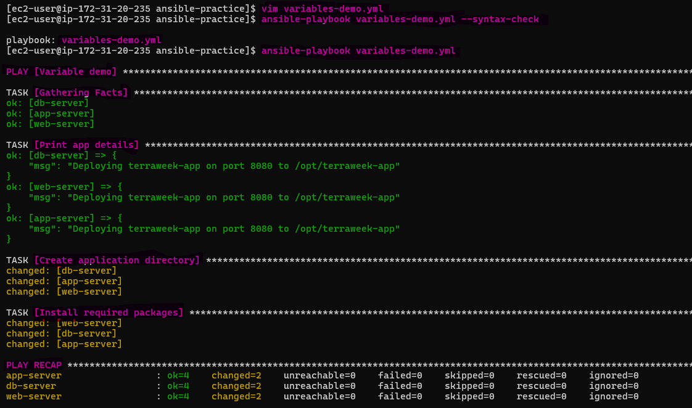 

> **What this verifies:** Playbook variables such as `app_name`, `app_port`, `app_dir`, and packages are working correctly across all hosts.

### 3. Verify Variable Values

Use `debug` to confirm the resolved variable values:

Shows `app_name`, `app_port`, and `app_dir` being substituted dynamically in the debug message.

```bash
ansible all -m debug -a "msg='Deploying {{ app_name }} on port {{ app_port }} to /opt/{{ app_name }}'" -e "app_name=terraweek-app app_port=8080"
```
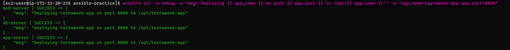 

> **What this verifies:** Ansible evaluates Jinja2 variables and produces the expected values.

### 4. Override Variables with -e

Override the playbook variables from the command line:

```bash
ansible-playbook variables-demo.yml -e "app_name=my-custom-app app_port=9090"
```
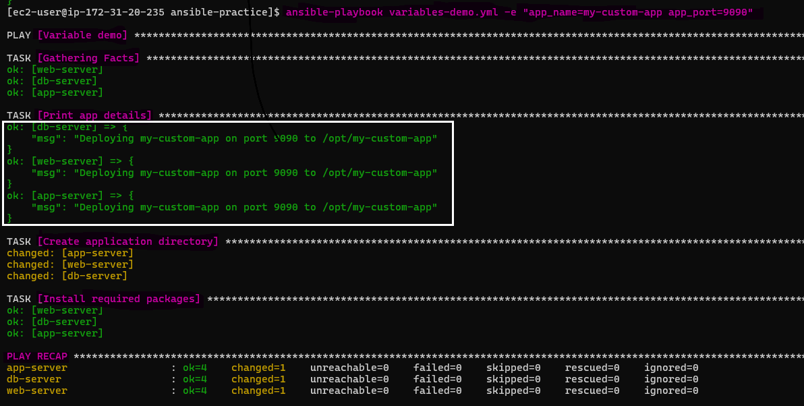

> **What this verifies:** Extra variables passed with -e override the variables defined inside the playbook.

**Verify:** Does the CLI variable override the playbook variable?

- yes
- `app_name` changed from `terraweek-app` → `my-custom-app`
- `app_port` changed from `8080` → `9090`
- `app_dir` was dynamically resolved to `/opt/my-custom-app`

---

## Task 2: group_vars and host_vars

Variables should not live inside playbooks. Move them to dedicated files.

Create the following structure:

```text
ansible-practice/
├── inventory.ini
├── ansible.cfg
├── group_vars/
│   ├── all.yml
│   ├── web.yml
│   └── db.yml
├── host_vars/
│   └── web-server.yml
└── playbooks/
    └── site.yml
```

**`group_vars/all.yml`** -- applies to every host:
```yaml
---
ntp_server: pool.ntp.org
app_env: development
common_packages:
  - vim
  - htop
  - tree
```

**`group_vars/web.yml`** -- applies only to the web group:
```yaml
---
http_port: 80
max_connections: 1000
web_packages:
  - nginx
```

**`group_vars/db.yml`** -- applies only to the db group:
```yaml
---
db_port: 3306
db_packages:
  - mariadb1011
```

**`host_vars/web-server.yml`** -- applies only to this specific host:
```yaml
---
max_connections: 2000
custom_message: "This is the primary web server"
```

Write a playbook `site.yml` that uses these variables:
```yaml
---
- name: Apply common config
  hosts: all
  become: true
  tasks:
    - name: Install common packages
      yum:
        name: "{{ common_packages }}"
        state: present
    - name: Show environment
      debug:
        msg: "Environment: {{ app_env }}"

- name: Configure web servers
  hosts: web
  become: true
  tasks:
    - name: Show web config
      debug:
        msg: "HTTP port: {{ http_port }}, Max connections: {{ max_connections }}"
    - name: Show host-specific message
      debug:
        msg: "{{ custom_message }}"
```

Run it and observe which variables apply to which hosts.

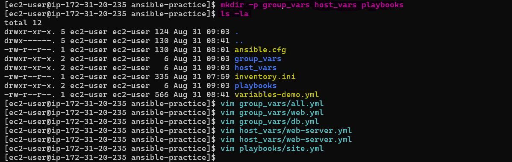 

> **What this verifies:** `group_vars/all.yml` applies to all hosts, while `group_vars/web.yml` and `host_vars/web-server.yml` apply according to the inventory group and host

### 1. Run the Playbook

```bash
ansible-playbook playbooks/site.yml
```
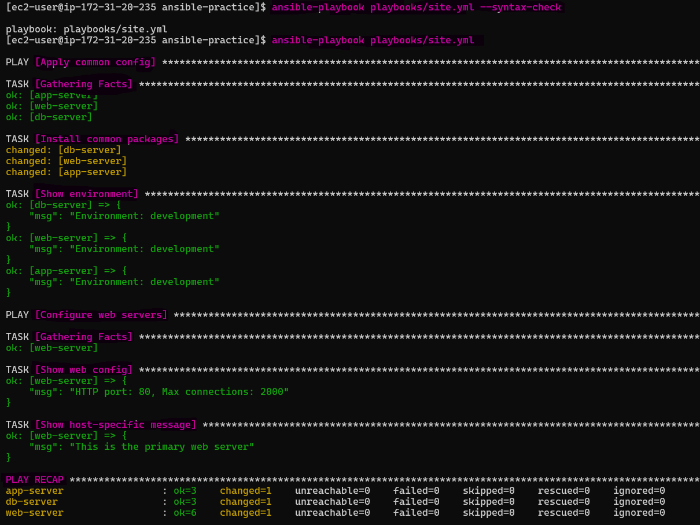 

> **What this verifies:** group_vars/all.yml applies to all hosts, while group_vars/web.yml and host_vars/web-server.yml apply according to the inventory group and host.


### 2. Override Variables with `-e`

Override the max_connections variable from the command line:

```bash
ansible-playbook playbooks/site.yml -e "max_connections=5000"
```
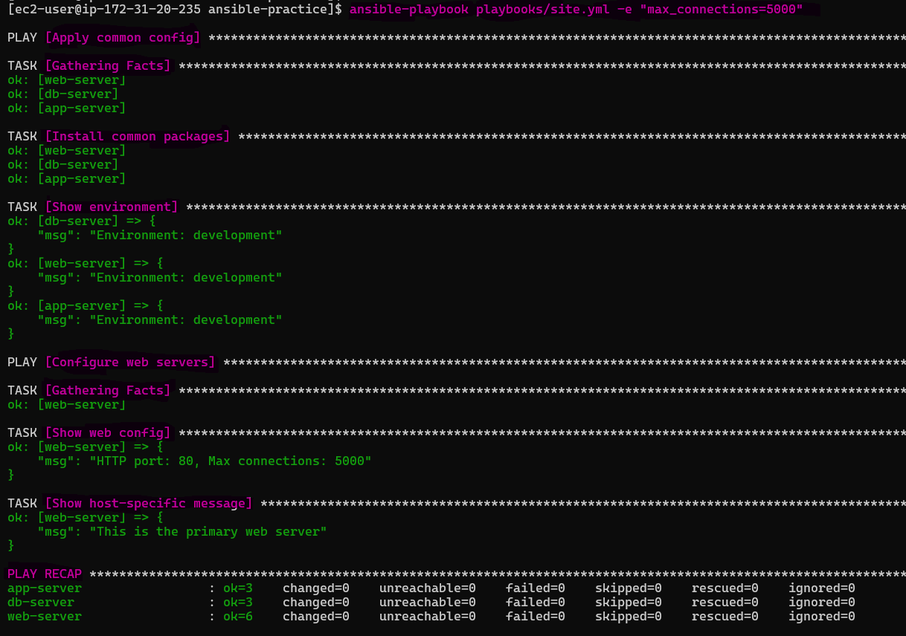

> **What this verifies:** `-e` has higher precedence than both `group_vars` and `host_vars`, so `web-server` receives `max_connections: 5000` instead of `2000`.

### Observations

- `app_env` applied to all hosts.
- `http_port` applied only to the `web` group.
- `db_port` is defined for the `db` group..
- `custom_message` applied only to `web-server`.
- `max_connections` came from `group_vars/web.yml` (`1000`).
- `host_vars/web-server.yml` overrode `max_connections` to `2000`.

**Document:** What is the variable precedence?

- `host_vars` have higher precedence than `group_vars`.
- Playbook variables override inventory variables.
- `-e` (extra vars) has the highest precedence.

---

## Task 3: Ansible Facts -- Gathering System Information

Ansible automatically collects "facts" about each managed node -- OS, IP, memory, CPU, disks, and hundreds more.

### 1. See All Facts for a Host

View all facts collected from a managed host:

```bash
ansible web-server -m setup
```
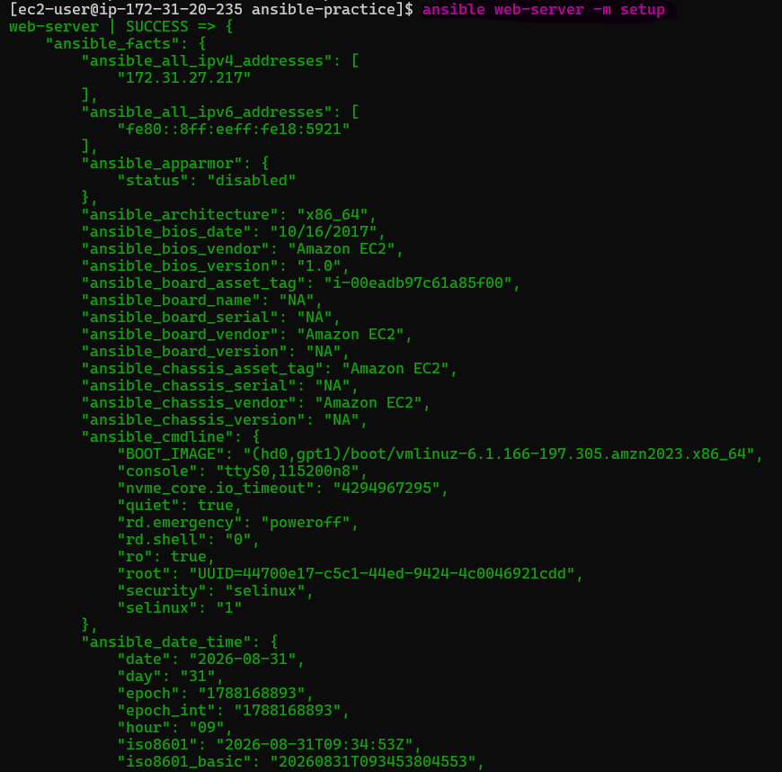 

> **What this verifies:** The `setup` module gathers detailed system information, including networking, OS, hardware, memory, and other host-level facts.

### 2. Filter Specific Facts

Instead of displaying hundreds of facts, filter for specific information:

```bash
ansible web-server -m setup -a "filter=ansible_os_family"
ansible web-server -m setup -a "filter=ansible_distribution*"
ansible web-server -m setup -a "filter=ansible_memtotal_mb"
ansible web-server -m setup -a "filter=ansible_default_ipv4"
```
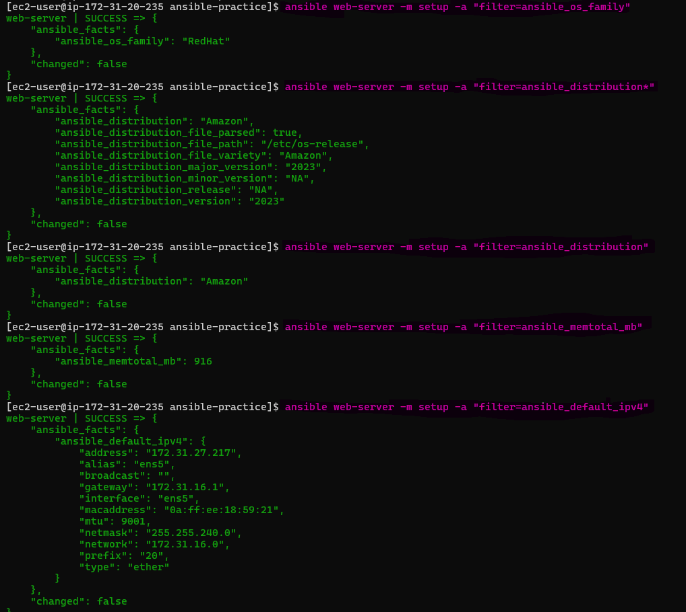 

> **What this verifies:** Fact filtering allows you to retrieve only the system information required for a particular task instead of processing the complete fact set.

### 3. Use Facts in a Playbook

Create `facts-demo.yml`:

```yaml
---
- name: Facts demo
  hosts: all
  tasks:
    - name: Show OS info
      debug:
        msg: >
          Hostname: {{ ansible_hostname }},
          OS: {{ ansible_distribution }} {{ ansible_distribution_version }},
          RAM: {{ ansible_memtotal_mb }}MB,
          IP: {{ ansible_default_ipv4.address }}

    - name: Show all network interfaces
      debug:
        var: ansible_interfaces
```
Run the playbook:

```bash
ansible-playbook playbooks/facts-demo.yml --syntax-check
ansible-playbook playbooks/facts-demo.yml
```
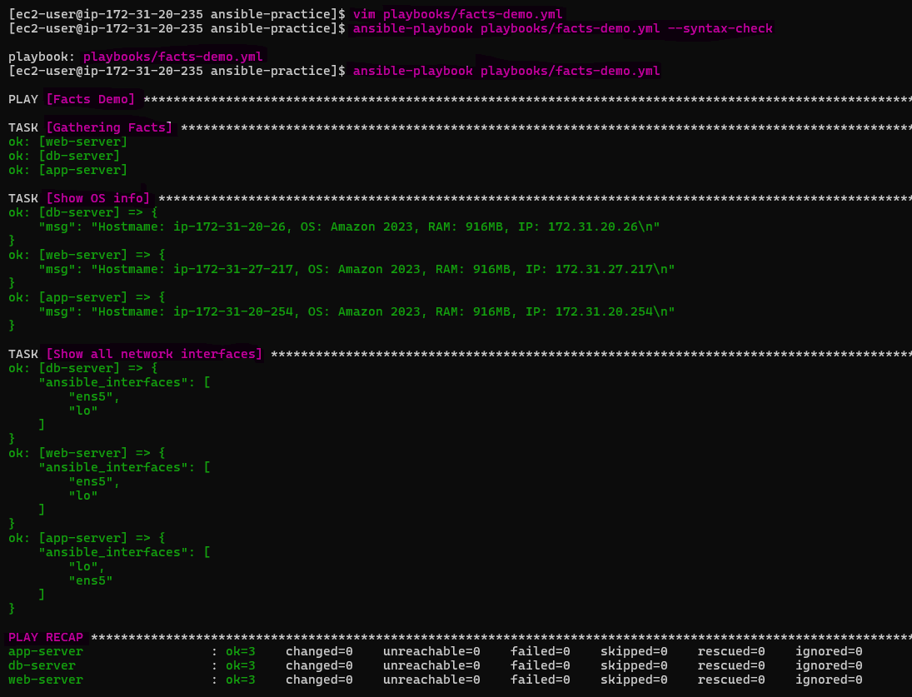

> **What this verifies:** Ansible facts can be referenced directly inside a playbook using Jinja2 expressions such as `{{ ansible_hostname }}`, `{{ ansible_distribution }}`, and `{{ ansible_default_ipv4.address }}`.

### Observations

- All three managed hosts returned their system facts successfully.
- All servers are running **Amazon Linux 2023**.
- Each server has approximately **916MB RAM**.
- The private IP address was retrieved dynamically from `ansible_default_ipv4.address`.
- Network interfaces were retrieved using `ansible_interfaces`.
- The facts differed where host-specific information differed, such as hostname and IP address.

**Document:** Name five facts you would use in real playbooks and why.

- `ansible_hostname` to identify the host and use it in configs/logs
- `ansible_default_ipv4.address` to get the primary IP for networking tasks
- `ansible_os_family` to apply OS-specific tasks (e.g., RedHat vs Debian)
- `ansible_distribution` to handle version-specific package installs
- `ansible_mounts` to determine available disk space dynamically

---

## Task 4: Conditionals with when

Tasks should not always run on every host. Use `when` to control execution.

Create `conditional-demo.yml`:

```yaml
---
- name: Conditional tasks demo
  hosts: all
  become: true

  tasks:
    - name: Install Nginx (only on web servers)
      yum:
        name: nginx
        state: present
      when: "'web' in group_names"

    - name: Install MySQL (only on db servers)
      yum:
        name: mariadb1011
        state: present
      when: "'db' in group_names"

    - name: Show warning on low memory hosts
      debug:
        msg: "WARNING: This host has less than 1GB RAM"
      when: ansible_memtotal_mb < 1024

    - name: Run only on Amazon Linux
      debug:
        msg: "This is an Amazon Linux machine"
      when: ansible_distribution == "Amazon"

    - name: Run only on Ubuntu
      debug:
        msg: "This is an Ubuntu machine"
      when: ansible_distribution == "Ubuntu"

    - name: Run only in production
      debug:
        msg: "Production settings applied"
      when: app_env == "production"

    - name: Multiple conditions (AND)
      debug:
        msg: "Web server with enough memory"
      when:
        - "'web' in group_names"
        - ansible_memtotal_mb >= 512

    - name: OR condition
      debug:
        msg: "Either web or app server"
      when: "'web' in group_names or 'app' in group_names"
```

Run it and observe which tasks are skipped on which hosts.

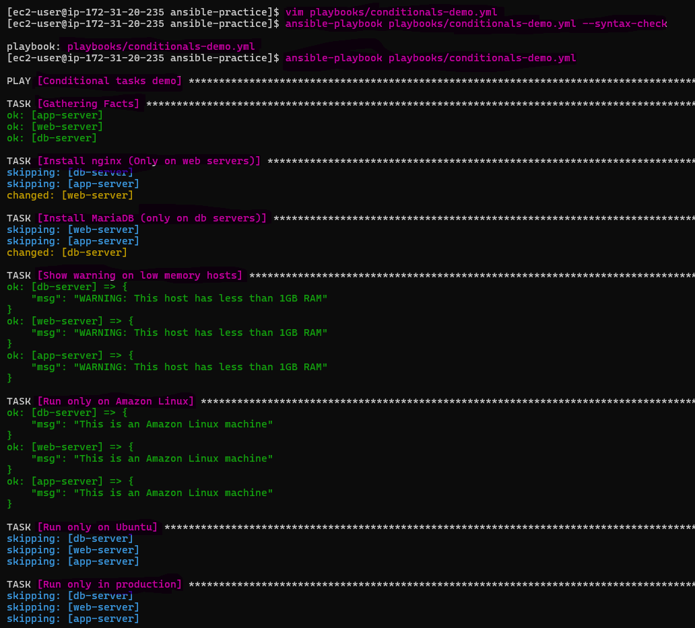 

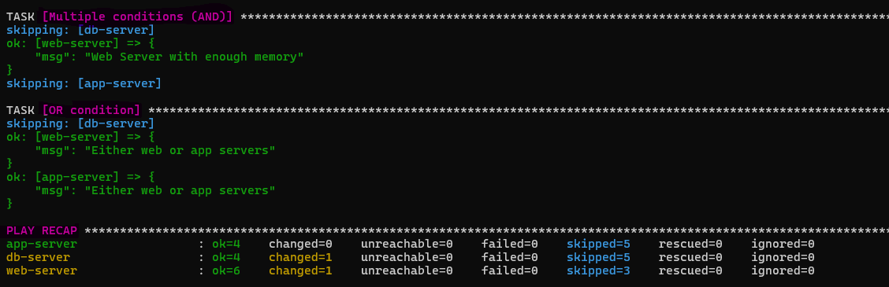

> **What this verifies:** when conditions correctly control task execution based on host groups, Ansible facts, variables, and multiple conditions.

### Observation:

- `Nginx installation` – skipped on `db-server` and `app-server`; runs on `web-server`.
- `MariaDB installation` – skipped on `web-server` and `app-server`; runs on `db-server`.
- `Low memory warning` – runs on all hosts because each has less than 1GB RAM.
- `Amazon Linux check` – runs on all hosts.
- `Ubuntu check` – skipped on all hosts.
- `Production check` – skipped on all hosts because `app_env` is `development`.
- `Multiple conditions (AND)` – runs only on `web-server`.
- `OR condition` – runs on `web-server` and `app-server`; skipped on `db-server`.

**Verify:** Are tasks correctly skipping on hosts that don't match the condition?

- yes

---

## Task 5: Loops

Create `loops-demo.yml`:

```yaml
---
- name: Loops demo
  hosts: all
  become: true

  vars:
    users:
      - name: deploy
        groups: wheel
      - name: monitor
        groups: wheel
      - name: appuser
        groups: users

    directories:
      - /opt/app/logs
      - /opt/app/config
      - /opt/app/data
      - /opt/app/tmp

  tasks:
    - name: Create multiple users
      user:
        name: "{{ item.name }}"
        groups: "{{ item.groups }}"
        state: present
      loop: "{{ users }}"

    - name: Create multiple directories
      file:
        path: "{{ item }}"
        state: directory
        mode: '0755'
      loop: "{{ directories }}"

    - name: Install multiple packages
      yum:
        name: "{{ item }}"
        state: present
      loop:
        - git
        #- curl
        - unzip
        - jq

    - name: Print each user created
      debug:
        msg: "Created user {{ item.name }} in group {{ item.groups }}"
      loop: "{{ users }}"
```

Run it and observe the loop output -- each iteration is shown separately.

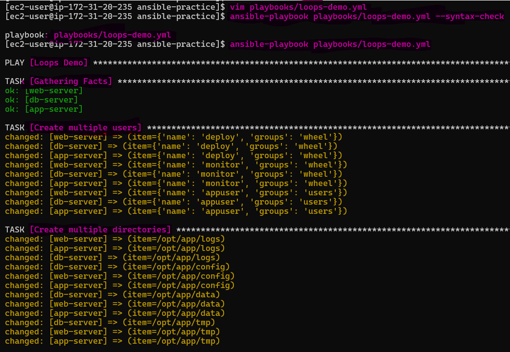 

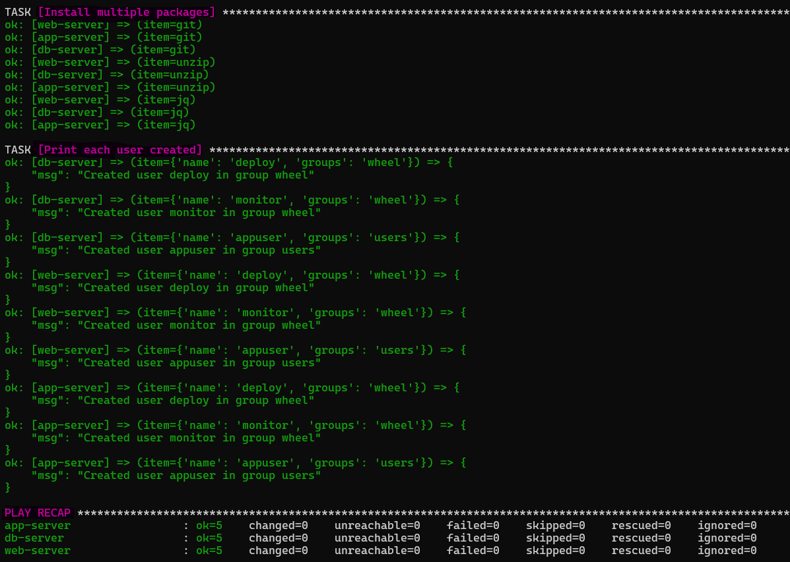

> **What this verifies:** loop iterates over lists and processes each item separately, allowing the same task to create multiple users, directories, and packages.

### **Observation:**

- `Create multiple users` – created `deploy`, `monitor`, and `appuser` on all hosts.
- `Create multiple directories` – created all four directories on all hosts.
- `Install multiple packages` – processed `git`, `unzip`, and `jq` on all hosts.
- `Print each user created` – displayed a separate message for each user.
- Each loop iteration was shown separately in the Ansible output.

**Document:** What is the difference between `loop` and the older `with_items`?

- `with_items` is the old looping syntax.

```yaml
- name: Install packages
  yum:
    name: "{{ item }}"
    state: present
  with_items:
    - nginx
    - git
```
- `loop` is the modern recommended syntax.

```yaml
- name: Install packages
  yum:
    name: "{{ item }}"
    state: present
  loop:
    - nginx
    - git
```
**Conclusion:** `loop` is preferred in modern Ansible playbooks, while `with_items` is the older syntax.

---

## Task 6: Register, Debug, and Combine 

Build a real-world playbook `server-report.yml` that combines variables, facts, conditionals, and register:

```yaml
---
- name: Server Health Report
  hosts: all

  tasks:
    - name: Check disk space
      command: df -h /
      register: disk_result

    - name: Check memory
      command: free -m
      register: memory_result

    - name: Check running services
      shell: systemctl list-units --type=service --state=running | head -20
      register: services_result

    - name: Generate report
      debug:
        msg:
          - "========== {{ inventory_hostname }} =========="
          - "OS: {{ ansible_distribution }} {{ ansible_distribution_version }}"
          - "IP: {{ ansible_default_ipv4.address }}"
          - "RAM: {{ ansible_memtotal_mb }}MB"
          - "Disk: {{ disk_result.stdout_lines[1] }}"
          - "Running services (first 20): {{ services_result.stdout_lines | length }}"

    - name: Flag if disk is critically low
      debug:
        msg: "ALERT: Check disk space on {{ inventory_hostname }}"
      when: "'9[0-9]%' in disk_result.stdout or '100%' in disk_result.stdout"

    - name: Save report to file
      copy:
        content: |
          Server: {{ inventory_hostname }}
          OS: {{ ansible_distribution }} {{ ansible_distribution_version }}
          IP: {{ ansible_default_ipv4.address }}
          RAM: {{ ansible_memtotal_mb }}MB
          Disk: {{ disk_result.stdout }}
          Checked at: {{ ansible_date_time.iso8601 }}
        dest: "/tmp/server-report-{{ inventory_hostname }}.txt"
      become: true
```

Run it and verify the report file is created on each server.

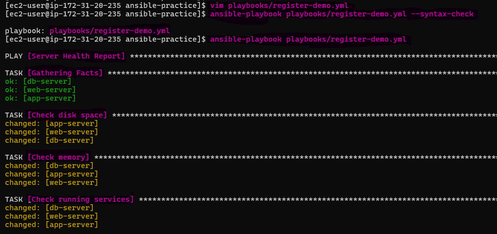

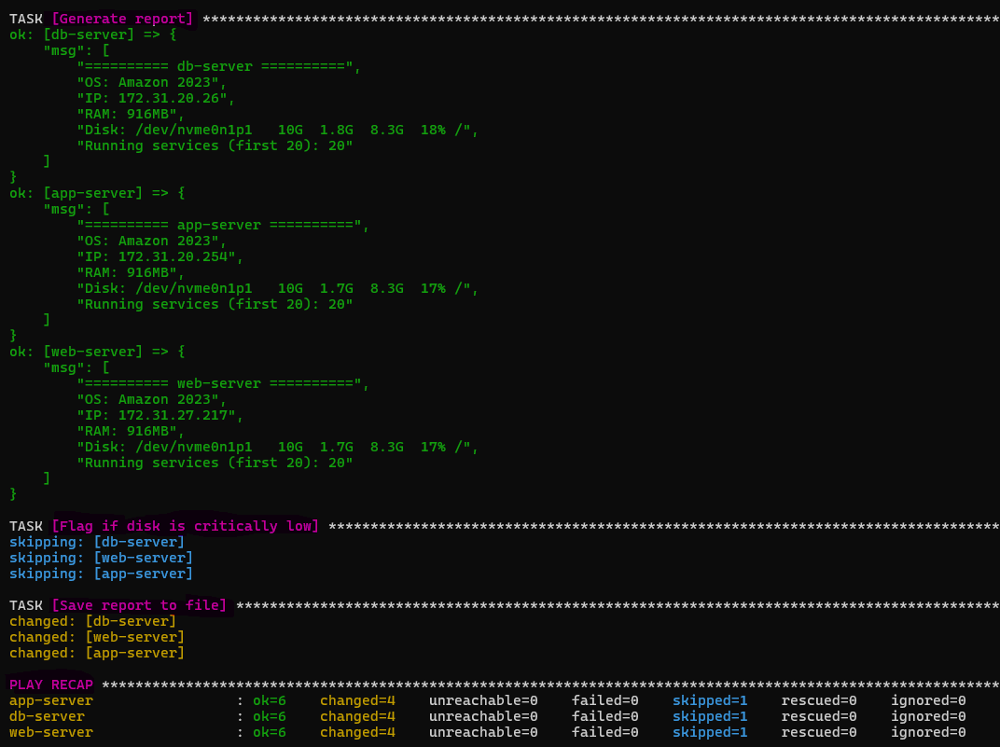 

**Verify:** SSH into a server and read `/tmp/server-report-*.txt`. Does it contain accurate information?

- **web-server**

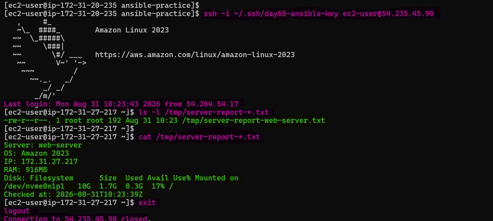 

- **app-server**

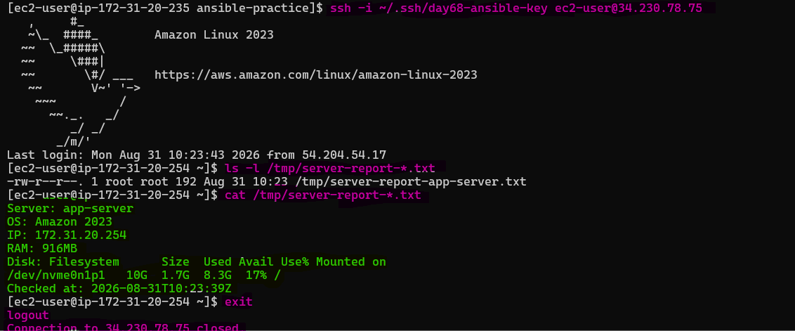 

- **db-server**

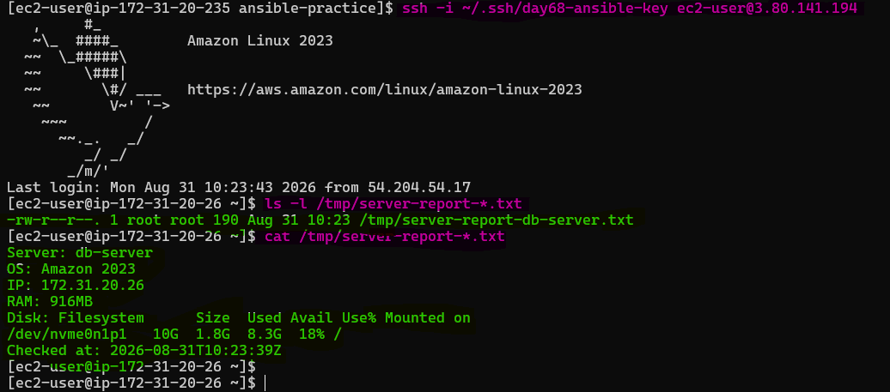 

---

- Variable precedence (simplified, low to high): role defaults -> `group_vars/all` -> `group_vars/` -> `host_vars/` -> playbook vars -> task vars -> extra vars (`-e`)

- `group_vars/` and `host_vars/` directory structure

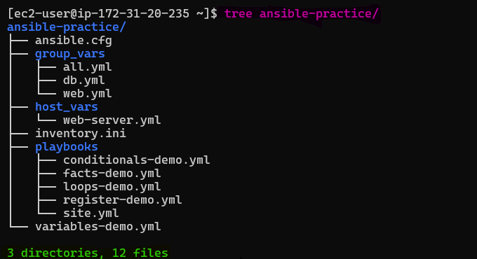


