# Day 71 -- Roles, Galaxy, Templates and Vault

> **Lab Setup:** Created a new Day 71 Terraform infrastructure using Ubuntu instead of Amazon Linux, then configured the Ansible control node and verified SSH connectivity.

```bash

# 1. Create New Ubuntu Infrastructure
cd ~/day-71-ansible-lab/terraform
export AWS_PROFILE=terraform
terraform fmt
terraform init
terraform validate
terraform apply

# 2. Get EC2 IPs
terraform output

# 3. Copy SSH Key to Ubuntu Control Node
scp -i ~/.ssh/day71-ansible-key ~/.ssh/day71-ansible-key ubuntu@<CONTROL_NODE_PUBLIC_IP>:/home/ubuntu/.ssh/

# 4. SSH into Control Node
ssh -i ~/.ssh/day71-ansible-key ubuntu@<CONTROL_NODE_PUBLIC_IP>
chmod 400 ~/.ssh/day71-ansible-key

# 5. Install & Verify Ansible
sudo apt update
sudo apt install ansible -y
ansible --version

# 6. Create Ansible Practice Directory
mkdir -p ~/ansible-practice
cd ~/ansible-practice

# 7. Create Ansible Configuration
vim ansible.cfg inventory.ini

# 8. Verify Inventory & Connectivity
ansible all_servers -m ping

Expected:
web-server | SUCCESS => {"changed": false, "ping": "pong"}
app-server | SUCCESS => {"changed": false, "ping": "pong"}
db-server  | SUCCESS => {"changed": false, "ping": "pong"}

> Once all three nodes return `pong`, the Day 71 lab environment is ready.
```

## Task 1: Jinja2 Templates

Jinja2 templates let Ansible generate dynamic configuration files using variables and system facts.

### 1. Create the Jinja2 template

Create `templates/nginx-vhost.conf.j2`:

```jinja2
# Managed by Ansible -- do not edit manually
server {
    listen {{ http_port | default(80) }};
    server_name {{ ansible_hostname }};

    root /var/www/{{ app_name }};
    index index.html;

    location / {
        try_files $uri $uri/ =404;
    }

    access_log /var/log/nginx/{{ app_name }}_access.log;
    error_log /var/log/nginx/{{ app_name }}_error.log;
}
```

### 2. Create a playbook `template-demo.yml`:

Create `template-demo.yml`

```yaml
---
- name: Deploy Nginx with template
  hosts: web
  become: true

  vars:
    app_name: terraweek-app
    http_port: 80

  tasks:
    - name: Install Nginx
      ansible.builtin.apt:
        name: nginx
        state: present
        update_cache: true

    - name: Create web root
      ansible.builtin.file:
        path: "/var/www/{{ app_name }}"
        state: directory
        mode: "0755"

    - name: Deploy vhost config from template
      ansible.builtin.template:
        src: templates/nginx-vhost.conf.j2
        dest: "/etc/nginx/conf.d/{{ app_name }}.conf"
        owner: root
        mode: "0644"
      notify: Restart Nginx

    - name: Deploy index page
      ansible.builtin.copy:
        content: "<h1>{{ app_name }}</h1><p>Host: {{ ansible_hostname }} | IP: {{ ansible_default_ipv4.address }}</p>"
        dest: "/var/www/{{ app_name }}/index.html"

  handlers:
    - name: Restart Nginx
      ansible.builtin.service:
        name: nginx
        state: restarted
```

### 3. Run the playbook with `--diff`

`--diff` shows the actual configuration changes Ansible is making after rendering the Jinja2 template.

```bash
ansible-playbook template-demo.yml --diff
```
The diff confirms that Jinja2 variables such as `app_name`, `http_port`, and `ansible_hostname` were replaced with real values.

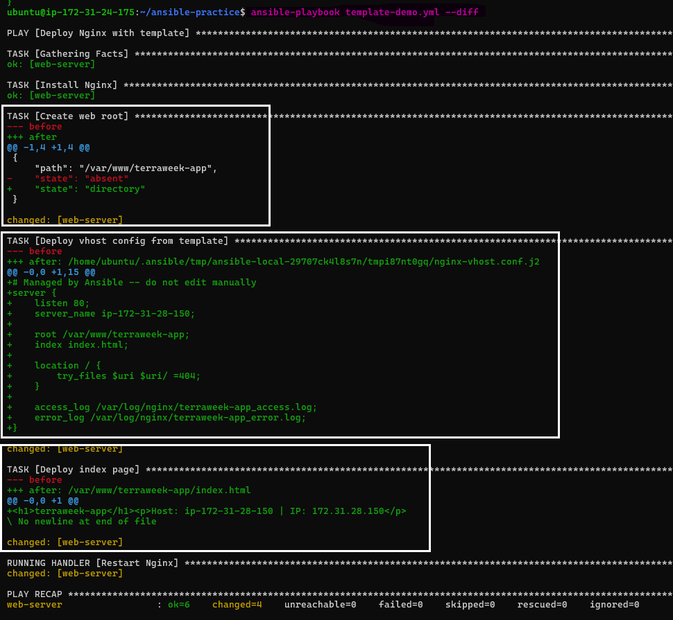 

### 4. Verify the rendered configuration

SSH into the web server and inspect the generated Nginx configuration:

```bash
ssh -i ~/.ssh/day71-ansible-key ubuntu@<WEB_SERVER_PUBLIC_IP>
cat /etc/nginx/conf.d/terraweek-app.conf
```
The generated configuration shows the Jinja2 variables rendered into actual values, including the hostname, port, application path, and log paths.

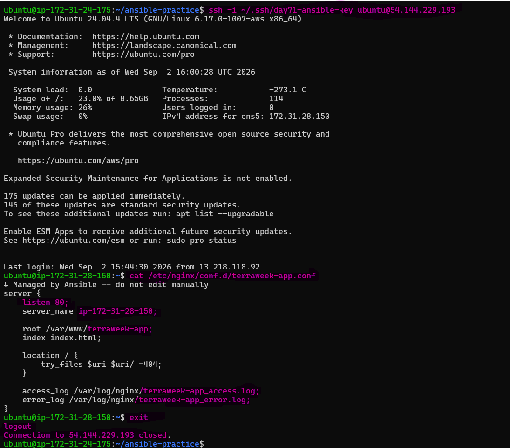

---

## Task 2: Understand the Role Structure

An Ansible role follows a standard directory structure. Each directory has a specific purpose:

```
```text
roles/
└── webserver/
    ├── tasks/
    │   └── main.yml        # Main task list
    ├── handlers/
    │   └── main.yml        # Handlers such as service restarts
    ├── templates/          # Jinja2 templates
    ├── files/              # Static files
    ├── vars/
    │   └── main.yml        # Role variables (high priority)
    ├── defaults/
    │   └── main.yml        # Default variables (low priority)
    ├── meta/
    │   └── main.yml        # Role metadata and dependencies
    ├── tests/
    │   ├── inventory       # Test inventory
    │   └── test.yml        # Test playbook
    └── README.md           # Role documentation
```
The main role directories such as `tasks`, `handlers`, `defaults`, `vars`, and `meta` use `main.yml` as their default entry point. Directories such as `templates`, `files`, and `tests` contain files used by the role and do not require `main.yml`.

### 1. Generate the role skeleton

```bash
mkdir -p roles
ansible-galaxy init roles/webserver
```
### 2. Explore the role structure

```bash
tree roles/webserver
```
The generated role skeleton shows the standard Ansible role directories, including `tasks`, `handlers`, `templates`, `vars`, `defaults`, `meta`, and `tests`.

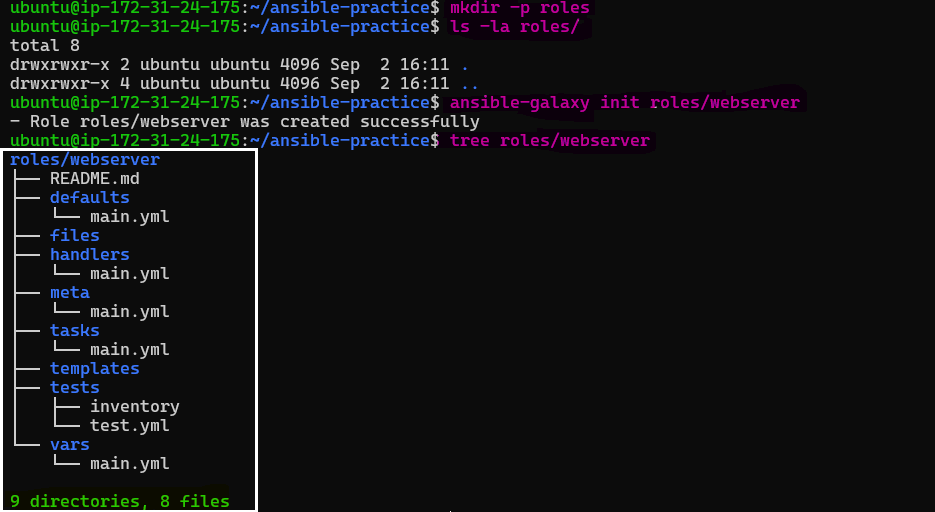

### 3. Read the generated documentation

```bash
cat roles/webserver/README.md
```
**Document:** What is the difference between `vars/main.yml` and `defaults/main.yml`?

- `defaults/main.yml` → Contains default variables with lower precedence, so they are easy to override.
- `vars/main.yml` → Contains role variables with higher precedence, so they are harder to override.

> **Key takeaway:**  Use `defaults/main.yml` for configurable role defaults and `vars/main.yml` for variables that should generally remain fixed within the role.

---

## Task 3: Build a Custom Webserver Role

Build and configure a reusable `webserver` role using defaults, tasks, handlers, and Jinja2 templates.

### 1. Configure Role Defaults

**`roles/webserver/defaults/main.yml`:**
```yaml
---
http_port: 80
app_name: myapp
max_connections: 512
```

### 2. Create Role Tasks

**`roles/webserver/tasks/main.yml`:**
```yaml
---
- name: Install Nginx
  ansible.builtin.apt:
    name: nginx
    state: present
    update_cache: true

- name: Deploy Nginx main configuration
  ansible.builtin.template:
    src: nginx.conf.j2
    dest: /etc/nginx/nginx.conf
    owner: root
    group: root
    mode: "0644"
  notify: Restart Nginx

- name: Deploy vhost configuration
  ansible.builtin.template:
    src: vhost.conf.j2
    dest: "/etc/nginx/conf.d/{{ app_name }}.conf"
    owner: root
    group: root
    mode: "0644"
  notify: Restart Nginx

- name: Create web root
  ansible.builtin.file:
    path: "/var/www/{{ app_name }}"
    state: directory
    owner: www-data
    group: www-data
    mode: "0755"

- name: Deploy index page
  ansible.builtin.template:
    src: index.html.j2
    dest: "/var/www/{{ app_name }}/index.html"
    owner: www-data
    group: www-data
    mode: "0644"

- name: Start and enable Nginx
  ansible.builtin.service:
    name: nginx
    state: started
    enabled: true
```

### 3. Create the Handler

**`roles/webserver/handlers/main.yml`:**
```yaml
---
- name: Restart Nginx
  ansible.builtin.service:
    name: nginx
    state: restarted
```

### 4. Create the Index Template

**`roles/webserver/templates/index.html.j2`:**
```html
<h1>{{ app_name }}</h1>
<p>Server: {{ ansible_hostname }}</p>
<p>IP: {{ ansible_default_ipv4.address }}</p>
<p>Environment: {{ app_env | default('development') }}</p>
<p>Managed by Ansible</p>
```

### 5. Create the Nginx Templates

Create `vhost.conf.j2` and `nginx.conf.j2` using the Jinja2 concepts from Task 1.

**`roles/webserver/templates/vhost.conf.j2`:**

```Nginx
# Managed by Ansible -- do not edit manually

server {
    listen {{ http_port | default(80) }} default_server;
    server_name {{ ansible_default_ipv4.address }} _;

    root /var/www/{{ app_name }};
    index index.html;

    location / {
        try_files $uri $uri/ =404;
    }

    access_log /var/log/nginx/{{ app_name }}_access.log;
    error_log /var/log/nginx/{{ app_name }}_error.log;
}
```
**`roles/webserver/templates/nginx.conf.j2`:**

```Nginx
# Managed by Ansible -- do not edit manually

# Nginx worker user
user www-data;

# Number of worker processes
worker_processes auto;

# Event settings
events {
    # Maximum simultaneous connections per worker
    worker_connections {{ max_connections | default(512) }};
}

# HTTP block for general settings
http {
    # Load MIME types
    include /etc/nginx/mime.types;

    # Default content type
    default_type application/octet-stream;

    # Enable efficient file sending
    sendfile on;

    # Keep connections alive for 65 seconds
    keepalive_timeout 65;

    # Global access and error logs
    access_log /var/log/nginx/access.log;
    error_log /var/log/nginx/error.log;

    # Include all virtual hosts
    include /etc/nginx/conf.d/*.conf;
}
```
### 6. Call the Role from site.yml

Now call the role from a playbook `site.yml`:

```yaml
---
- name: Configure web servers
  hosts: web
  become: true
  roles:
    - role: webserver
      vars:
        app_name: terraweek
        http_port: 80
```

### 7. Run the Role

Run the playbook to deploy the custom webserver role.

```bash
ansible-playbook site.yml
```
The playbook successfully executes the custom `webserver` role, deploying Nginx configuration, the web root, and the dynamic index page.

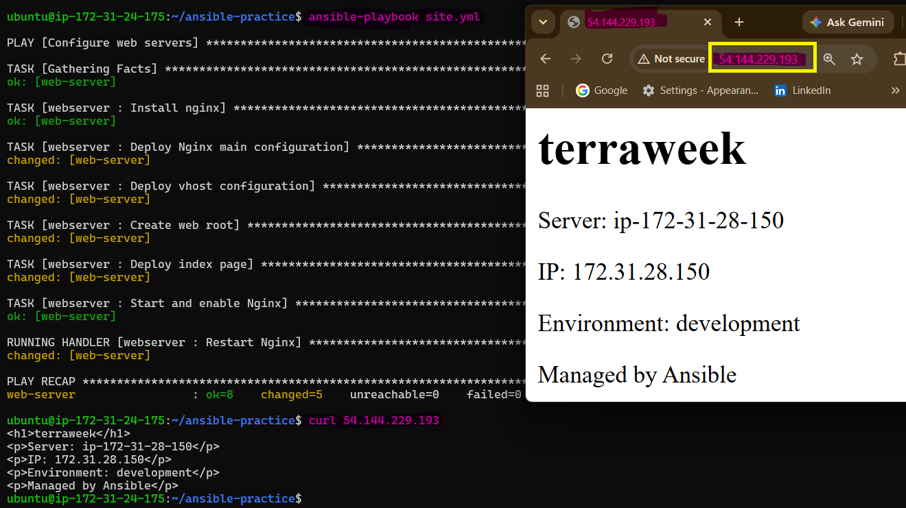

### 8. Verify the Web Server

Test the deployed application from the control node:

```bash
curl 54.144.229.193
```
The response should contain the dynamically rendered `application name`, `hostname`, `IP address`, `environment`, and `Managed by Ansible`.

> **Key takeaway:** The custom role packages Nginx installation, configuration, templates, handlers, and web content into a reusable component.

---

## Task 4: Ansible Galaxy -- Use Community Roles

Ansible Galaxy provides reusable community roles that can simplify common infrastructure tasks.

### 1. Search for Roles 

Search Galaxy for Nginx and MySQL roles:

```bash
ansible-galaxy search nginx --platforms EL
ansible-galaxy search mysql
```
Galaxy returns available community roles that can be evaluated and reused.

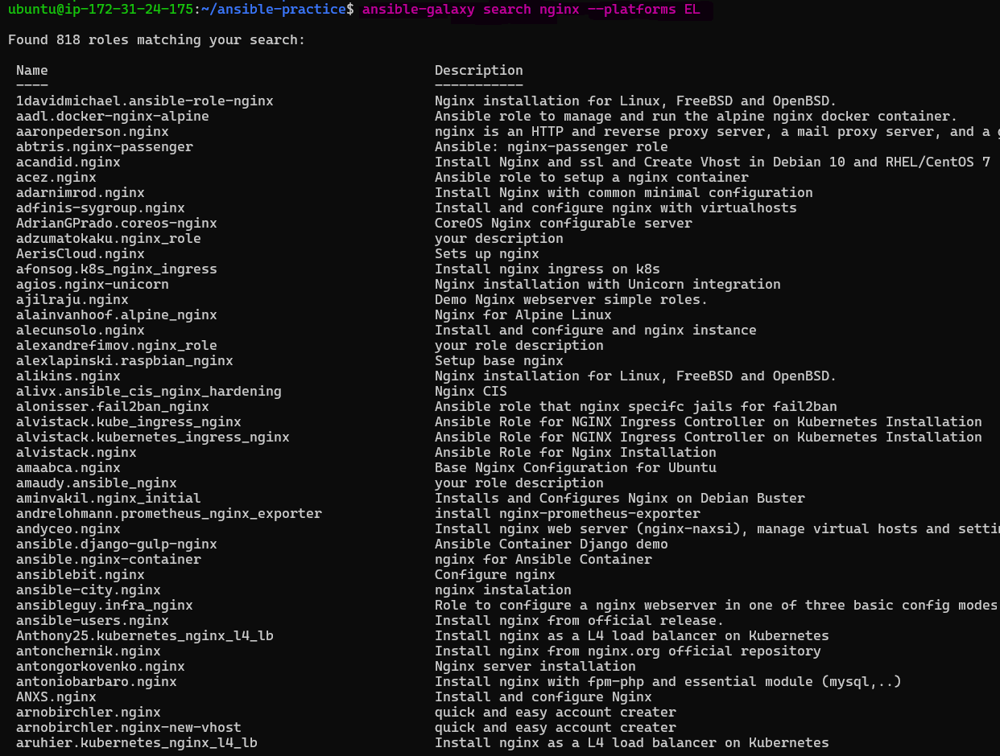 

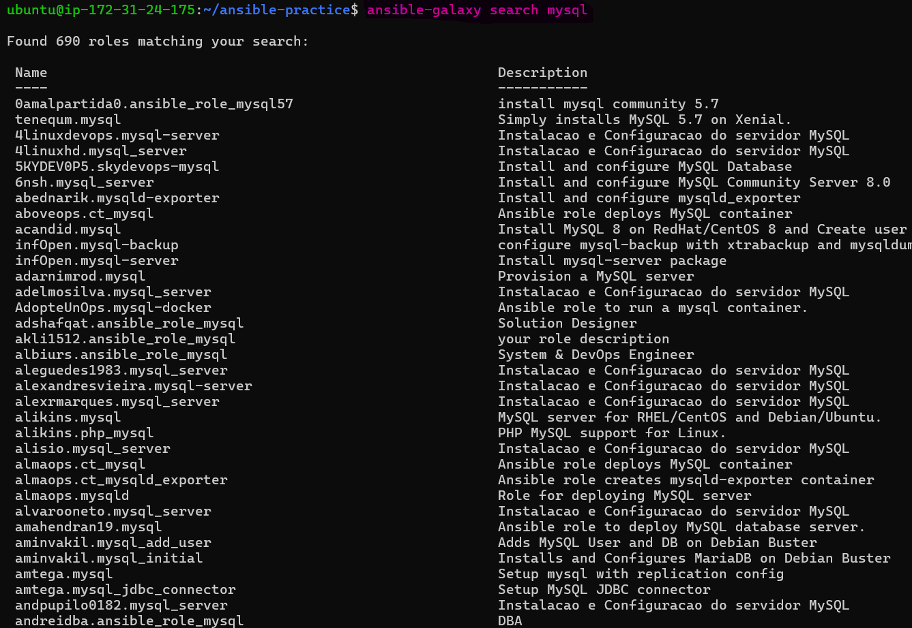 

### 2. Install a role from Galaxy:

Install the Docker role from Galaxy:

```bash
ansible-galaxy install geerlingguy.docker
```
The `geerlingguy.docker` role is downloaded and installed successfully.

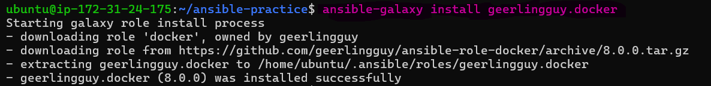 

### 3. Verify the Installed Role:

List the installed Galaxy roles:

```bash
ansible-galaxy list
```
The installed `geerlingguy.docker` role and its version are shown.

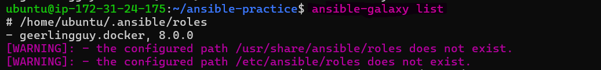

Explore the role structure:

```bash
tree ~/.ansible/roles/geerlingguy.docker
```
The community role contains standard Ansible role directories such as `defaults`, `handlers`, `meta`, `tasks`, and `vars`, along with Molecule testing files.

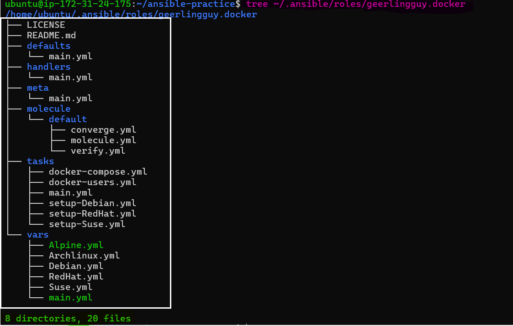 

### 4. Use the Installed Role

create `docker-setup.yml`:

```yaml
---
- name: Install Docker using Galaxy role
  hosts: app
  become: true
  roles:
    - geerlingguy.docker
```
Run the playbook:

```bash
ansible-playbook docker-setup.yml
```
The Galaxy role configures the app server and Docker installation completes successfully.

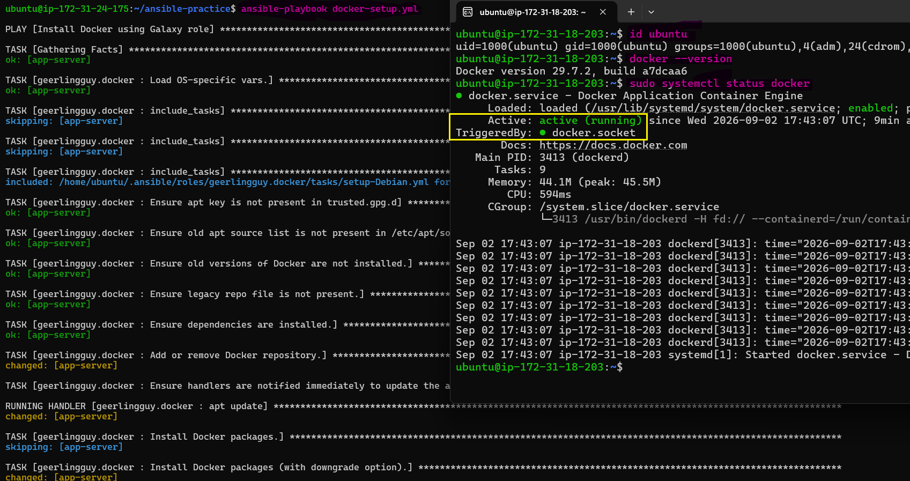 

Verify Docker:

```bash
ansible app -m shell -a 'docker --version'
ansible app -m shell -a 'docker compose version'
ansible app -m shell -a 'systemctl is-active docker'
```
Docker, Docker Compose, and the Docker service are successfully verified on the app server.

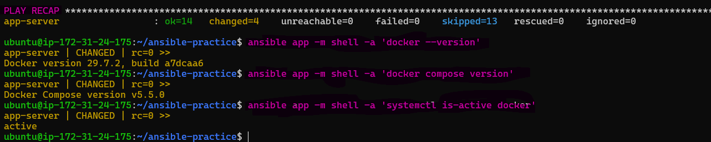 

### 5. Manage Roles with `requirements.yml`

Create `requirements.yml`:

```yaml
---
roles:
  - name: geerlingguy.docker
    version: "7.4.1"
  - name: geerlingguy.ntp
```
Install all role dependencies together:

```bash
ansible-galaxy install -r requirements.yml
```
Verify the installed roles:

```bash
ansible-galaxy list
```
Galaxy installs the role dependencies defined in `requirements.yml`. 

The existing `geerlingguy.docker` 8.0.0 installation was retained because Galaxy warned that `--force` would be required to change it to 7.4.1.

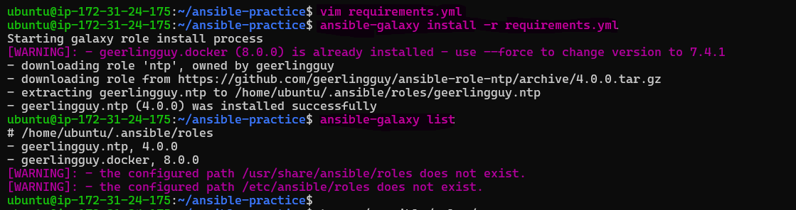 

### 6. Verify the Complete Roles Structure

Check all installed Galaxy roles:

```bash
tree ~/.ansible/roles/
```
The roles directory shows both community roles, `geerlingguy.docker` and `geerlingguy.ntp`, along with their standard role structures.

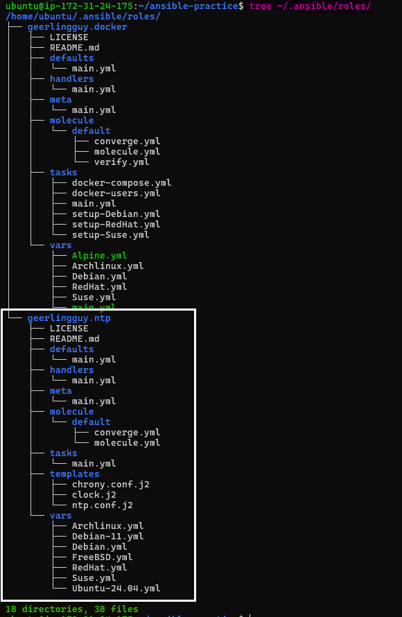

**Document:** Why use a `requirements.yml` instead of installing roles manually?

- `requirements.yml` defines external Ansible role dependencies and their versions in one place.
- This makes the project reproducible, easier to maintain, and consistent across control nodes and CI/CD environments.

> **Key takeaway:** Ansible Galaxy allows you to reuse community-maintained roles instead of building every component from scratch.

---

## Task 5: Ansible Vault -- Encrypt Secrets

Never store passwords, API keys, or tokens in plain text. Ansible Vault encrypts sensitive variables so they can be safely used in playbooks.

### 1. Create an Encrypted Vault File

Create the encrypted file:

```bash
ansible-vault create group_vars/db/vault.yml
```
Add the secret variables:

```yaml
vault_db_password: SuperSecretP@ssw0rd
vault_db_root_password: R00tP@ssw0rd123
vault_api_key: sk-abc123xyz789
```
Save and exit. The file is stored in encrypted form.

The Vault file is created successfully and `cat` shows encrypted content beginning with `$ANSIBLE_VAULT`.

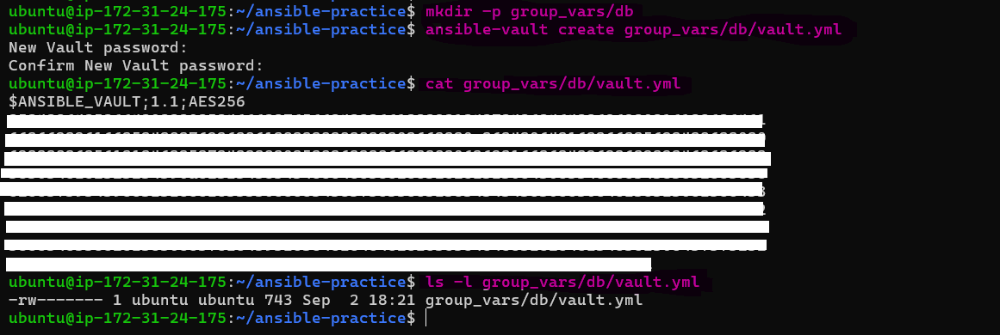

### 2. Edit the Encrypted File

Use `ansible-vault edit` to modify the encrypted variables:

```bash
ansible-vault edit group_vars/db/vault.yml
```

### 3. View the Decrypted Content

Use `ansible-vault view` to inspect the secrets without editing the file:

```bash
ansible-vault view group_vars/db/vault.yml
```
The Vault password is requested and the encrypted variables are displayed after successful authentication.

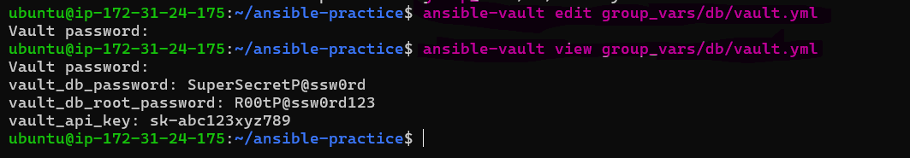

### 4. Encrypt an Existing Secrets File

Create a plain-text secrets file first:

```bash
vim group_vars/db/secrets.yml
```
Then encrypt it:

```bash
ansible-vault encrypt group_vars/db/secrets.yml
```
Verify that the file is now encrypted:

```bash
cat group_vars/db/secrets.yml
```
The existing `secrets.yml` file is successfully encrypted and its contents are no longer readable as plain YAML

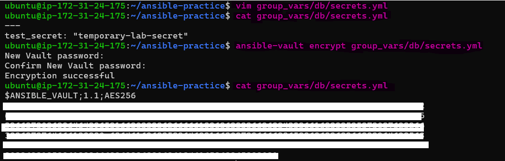

### 5. Use Vault Variables in a Playbook

Create `db-setup.yml`:

```YAML
---
- name: Configure database
  hosts: db
  become: true

  tasks:
    - name: Show DB password status
      ansible.builtin.debug:
        msg: "DB password is set: {{ vault_db_password | length > 0 }}"
```
Check the playbook syntax:

```bash
ansible-playbook db-setup.yml --syntax-check
```
Run it with the Vault password:

```bash
ansible-playbook db-setup.yml --ask-vault-pass
```
Ansible successfully decrypts the Vault variables and confirms that the DB password is set without printing the actual secret.

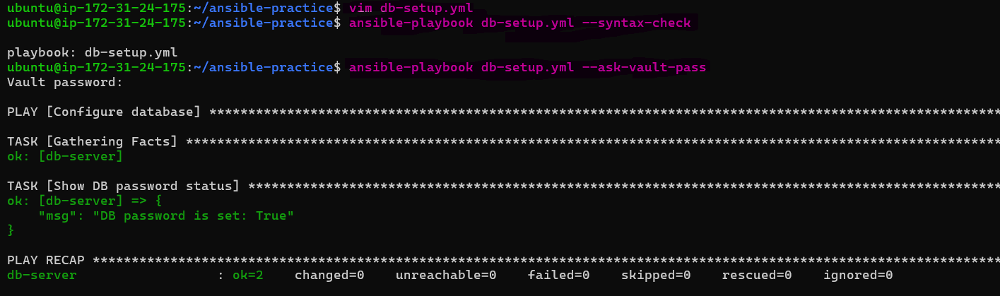

### 6. Use a Vault Password File

For automated execution, store the Vault password in a protected password file:

```bash
echo "<YOUR_VAULT_PASSWORD>" > .vault_pass
chmod 600 .vault_pass
echo ".vault_pass" >> .gitignore
```
Run the playbook without interactive password input:

```bash
ansible-playbook db-setup.yml --vault-password-file .vault_pass
```
Ansible uses the password file to decrypt the Vault automatically and the playbook completes successfully.

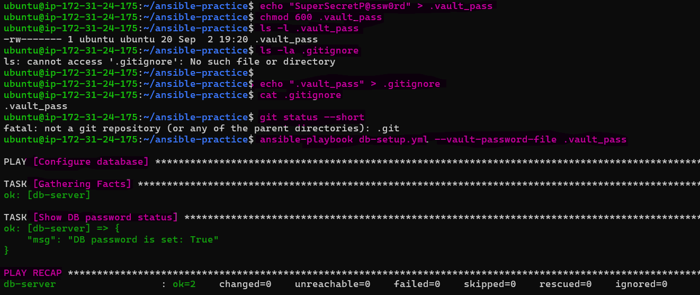

### 7. Configure the Password File in `ansible.cfg`

Add

```ini
[defaults]
vault_password_file = .vault_pass
```
Now the playbook can be run directly:

```bash
ansible-playbook db-setup.yml
```
**Document:** Why is `--vault-password-file` better than `--ask-vault-pass` for automated pipelines?

- `--vault-password-file` supplies the Vault password non-interactively, making it suitable for automated CI/CD pipelines.
- `--ask-vault-pass` requires manual input and therefore cannot be used reliably in unattended automation.

> **Key takeaway:** Ansible Vault protects sensitive variables while allowing them to be securely consumed by automated playbooks.

---

## Task 6: Combine Roles, Templates, and Vault

Combine the custom role, Galaxy role, Jinja2 templates, and Ansible Vault into one complete deployment.

### 1. Configure the Complete `site.yml`

Create `site.yml`:

```yaml
---
- name: Configure web servers
  hosts: web
  become: true

  roles:
    - role: webserver
      vars:
        app_name: terraweek
        http_port: 80


- name: Configure app servers with Docker
  hosts: app
  become: true

  roles:
    - geerlingguy.docker


- name: Configure database servers
  hosts: db
  become: true

  tasks:
    - name: Create DB config with secrets
      ansible.builtin.template:
        src: templates/db-config.j2
        dest: /etc/db-config.env
        owner: root
        group: root
        mode: "0600"
```

### 2. Create the Database Template

Create `templates/db-config.j2`:

```jinja2
# Database Configuration -- Managed by Ansible
DB_HOST={{ ansible_default_ipv4.address }}
DB_PORT={{ db_port | default(3306) }}
DB_PASSWORD={{ vault_db_password }}
DB_ROOT_PASSWORD={{ vault_db_root_password }}
```

### 3. Run the Complete Playbook

Run the complete infrastructure configuration:

```bash
ansible-playbook site.yml
```
The playbook successfully runs across the web, app, and database servers, combining the custom `webserver` role, Galaxy Docker role, and Vault-backed database configuration.

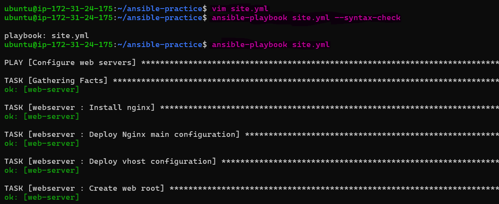

### 4. Verify the Playbook Recap

Check the final playbook recap for all three server groups.

The recap shows successful execution with no unreachable or failed hosts.

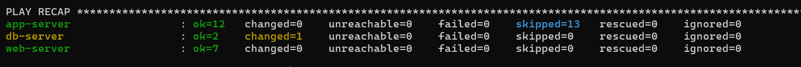 

### 5. Verify the Database Configuration

SSH into the DB server:

```bash
ssh -i ~/.ssh/day71-ansible-key ubuntu@<DB_SERVER_PUBLIC_IP>
```
Check the generated configuration:

```bash
sudo cat /etc/db-config.env
```
Check the file permissions:

```bash
ls -l /etc/db-config.env
```
The database configuration contains the rendered DB host, port, and Vault-backed secrets. The file is owned by `root:root` with `600` permissions (`-rw-------`).

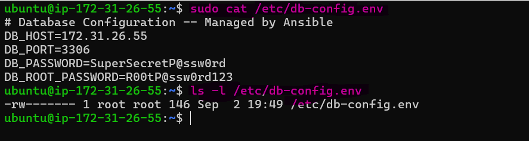

> **Key takeaway**  Task 6 brings together the main Ansible concepts from Day 71:

> `Custom Role` → `Galaxy Role` → `Jinja2 Templates` → `Ansible Vault` → `Complete Playbook`

> The result is a reusable and automated multi-tier infrastructure configuration.

---

## How You Installed and Used a Galaxy Role

- Installed the Docker role using:
  `ansible-galaxy install geerlingguy.docker`
- The role was installed in `~/.ansible/roles`
- Used the Galaxy role directly in a playbook:

```yaml
- name: Using role docker created by ansible-galaxy
  hosts: app
  become: true
  roles:
    - geerlingguy.docker
```
---

## Vault Workflow: Create, Edit, View, Encrypt, Decrypt

- `create` - Creates a new file and encrypts it immediately.
  - `ansible-vault create secrets.yml`
- `edit` - Opens the encrypted file in an editor and automatically re-encrypts it when saved. You cannot edit the encrypted file directly with `vim` or `nano`.
  - `ansible-vault edit secrets.yml`
- `view` - Displays the decrypted content. `cat` only shows the encrypted data.
  - `ansible-vault view secrets.yml`
- `encrypt` - Encrypts an existing plaintext file.
  - `ansible-vault encrypt secrets.yml`
- `decrypt` - Permanently decrypts a Vault file.
  - `ansible-vault decrypt secrets.yml`

--- 

## When to Use Roles vs Playbooks vs Ad-hoc Commands

| **Roles** | **Playbooks** | **Ad-hoc Commands** |
| --- | --- | --- |
| Complex automation | Simple automation (2–3 steps) | Quick, one-off tasks |
| Reusable, shareable (Galaxy), organized | Multiple-server automation | Quick debugging |
| Used by multiple playbooks | Orchestration | Fast, not reusable |

---