# Day 72 -- Ansible Project: Automate Docker and Nginx Deployment

> **Goal:** Build an end-to-end Ansible automation project using roles, variables, templates, Vault, Docker, and Nginx reverse proxy.

## Task 1: Plan the Project Structure

Create a clean Ansible project structure and separate responsibilities into reusable roles.

### Project Structure

```text
ansible-docker-project/
├── ansible.cfg
├── inventory.ini
├── site.yml
├── group_vars/
│   ├── all.yml
│   └── web/
│       └── vault.yml
├── roles/
│   ├── common/
│   │   ├── tasks/main.yml
│   │   └── ...
│   ├── docker/
│   │   ├── defaults/main.yml
│   │   ├── tasks/main.yml
│   │   ├── handlers/main.yml
│   │   └── ...
│   └── nginx/
│       ├── defaults/main.yml
│       ├── tasks/main.yml
│       ├── handlers/main.yml
│       ├── templates/
│       │   ├── nginx.conf.j2
│       │   └── app-proxy.conf.j2
│       └── ...
├── test-common.yml
├── test-docker.yml
└── test-nginx.yml
```

### Generate the role skeletons:
```bash
mkdir -p ansible-docker-project/roles
cd ansible-docker-project
ansible-galaxy init roles/common
ansible-galaxy init roles/docker
ansible-galaxy init roles/nginx
```
Set up your `ansible.cfg` and `inventory.ini` using what you built on Day 68.

### Verify Structure

```bash
tree -L 3
```
> **Why this structure?** Roles keep common configuration, Docker management, and Nginx configuration isolated and reusable. This makes the project easier to maintain and scale.

The project structure was successfully created with:

- `common` role → Shared server configuration
- `docker` role → Docker and application container management
- `nginx` role → Reverse proxy configuration
- `group_vars` → Group-level variables
- `site.yml` → Master playbook
- `ansible.cfg` → Ansible configuration
- `inventory.ini` → Managed hosts

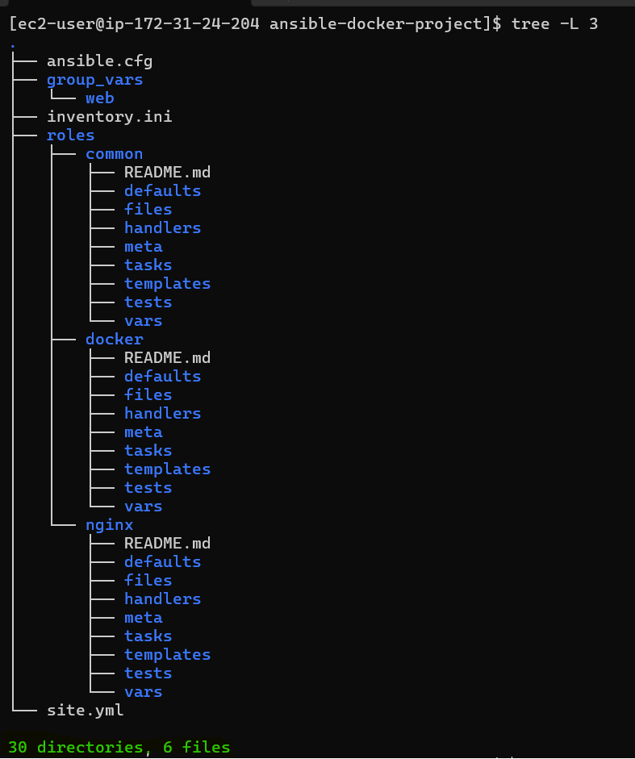

---

## Task 2: Build the Common Role

The `common` role runs on every server and provides the baseline configuration, packages, timezone, hostname, and deploy user.

### `roles/common/tasks/main.yml`

```yaml
---
- name: Update package cache
  ansible.builtin.dnf:
    update_cache: true
  tags:
    - common

- name: Install common packages
  ansible.builtin.dnf:
    name: "{{ common_packages }}"
    state: present
  tags:
    - common

- name: Set hostname
  hostname:
    name: "{{ inventory_hostname }}"
  tags: common

- name: Set timezone
  timezone:
    name: "{{ timezone }}"
  tags: common

- name: Create deploy user
  user:
    name: deploy
    groups: wheel
    shell: /bin/bash
    state: present
  tags: common
```
> **Note:** This project runs on Amazon Linux 2023, so the `dnf` package manager is used. For Ubuntu-based instances, use `apt` instead.

**`group_vars/all.yml`:**
```yaml
---
timezone: Asia/Kolkata
project_name: devops-app
app_env: development
common_packages:
  - vim
  #- curl
  - wget
  - git
  - htop
  - tree
  - jq
  - unzip
```
### Test the Common Role

Create `test-common.yml`:

```yaml
---
- name: Test common role
  hosts: all_servers
  become: true

  roles:
    - common
```
Run:

```bash
ansible-playbook test-common.yml --check
ansible-playbook test-common.yml
```
### Verify

```bash
ansible all_servers -m ansible.builtin.command -a 'hostname'
ansible all_servers -m ansible.builtin.command -a 'id deploy'
ansible all_servers -m ansible.builtin.command -a 'git --version'
```
### Idempotency Check

Run the role again:

```bash
ansible-playbook test-common.yml
```
Expected:

```INI
changed=0
failed=0
```
> **Why?** The common role creates a consistent baseline across all servers and demonstrates reusable, idempotent Ansible automation.

---

## Task 3: Build the Docker Role

The `docker` role installs Docker, manages the Docker service, installs Docker Compose, authenticates with Docker Hub, pulls the application image, runs the container, and performs a health check.

### Install Required Collection

(needed for `community.docker` modules):

```bash
ansible-galaxy collection install community.docker
```
**`roles/docker/defaults/main.yml`:**
```yaml
---
docker_app_image: nginx
docker_app_tag: latest
docker_app_name: myapp
docker_app_port: 8080
docker_container_port: 80
```

**`roles/docker/tasks/main.yml`:**

> **Note:** These tasks are adapted for Amazon Linux 2023, which uses `dnf` and the `docker` package instead of the older CentOS/RHEL Docker CE repository setup.

Write tasks that:

1. Install Docker dependencies required by Amazon Linux 2023:
```yaml
- name: Install Docker dependencies
  ansible.builtin.dnf:
    name:
      - dnf-plugins-core
      - device-mapper-persistent-data
      - lvm2
      - python3-docker
    state: present
  tags:
    - docker
```
2. Install Docker from the Amazon Linux 2023 package repository
```yaml
- name: Install Docker
  ansible.builtin.dnf:
    name: docker
    state: present
  notify:
    - Restart Docker
  tags:
    - docker
```
3. Start and enable the Docker service
```yaml
- name: Start and enable Docker
  ansible.builtin.service:
    name: docker
    state: started
    enabled: true
  when: not ansible_check_mode
  tags:
    - docker
```
4. Add the `deploy` user to the `docker` group
```yaml
- name: Add deploy user to docker group
  ansible.builtin.user:
    name: deploy
    groups: docker
    append: true
  when: not ansible_check_mode
  tags:
    - docker
```
5. Install Docker Compose (via pip or direct download)
```yaml
- name: Download Docker Compose
  ansible.builtin.get_url:
    url: https://github.com/docker/compose/releases/download/v5.1.2/docker-compose-linux-x86_64
    dest: /usr/local/bin/docker-compose
    mode: "0755"
  tags:
    - docker
```
6. Log in to Docker Hub using vault-encrypted credentials:
```yaml
- name: Log in to Docker Hub
  community.docker.docker_login:
    username: "{{ vault_docker_username }}"
    password: "{{ vault_docker_password }}"
  become_user: deploy
  when: vault_docker_username is defined
  tags:
    - docker
```
7. Pull the application image:
```yaml
- name: Pull application image
  community.docker.docker_image:
    name: "{{ docker_app_image }}"
    tag: "{{ docker_app_tag }}"
    source: pull
  tags:
    - docker
```
8. Remove previous application container when switching apps
```yaml
- name: Remove previous application container
  community.docker.docker_container:
    name: myapp
    state: absent
  when: docker_app_name != 'myapp'
  tags:
    - docker
```
9. Run the application container:
```yaml
- name: Run application container
  community.docker.docker_container:
    name: "{{ docker_app_name }}"
    image: "{{ docker_app_image }}:{{ docker_app_tag }}"
    state: started
    restart_policy: always
    ports:
      - "{{ docker_app_port }}:{{ docker_container_port }}"
  tags:
    - docker
```
10. Verify the container is healthy:
```yaml
- name: Wait for container to be healthy
  ansible.builtin.uri:
    url: "http://localhost:{{ docker_app_port }}"
    status_code: 200
  retries: 5
  delay: 3
  register: health_check
  until: health_check.status == 200
  when: not ansible_check_mode
  tags:
    - docker
```

Tag all tasks with `docker`.

**`roles/docker/handlers/main.yml`:**
```yaml
---
- name: Restart Docker
  service:
    name: docker
    state: restarted
```
### Test the Docker Role

Create `test-docker.yml`:

```yaml
---
- name: Test Docker role
  hosts: web
  become: true

  roles:
    - docker
```
Run:

```bash
ansible-playbook test-docker.yml --check
ansible-playbook test-docker.yml
```
### Verify Docker

```bash
ansible web -m ansible.builtin.command -a 'docker --version' -b
ansible web -m ansible.builtin.command -a 'systemctl is-active docker' -b
ansible web -m ansible.builtin.command -a 'docker ps' -b
```
Expected container:

```ini
myapp   nginx:latest   0.0.0.0:8080->80/tcp
```

### Verify Health

```bash
ansible web -m ansible.builtin.uri \
  -a 'url=http://localhost:8080 status_code=200' \
  -b
```

### Idempotency Check

Run the role again:

```bash
ansible-playbook test-docker.yml
```
Expected:

```ini
changed=0
failed=0
```
> **Why?** The Docker role provides reusable container automation: install Docker → configure the service → authenticate → pull the image → run the container → verify application health.

---

## Task 4: Build the Nginx Role

The `nginx` role installs Nginx and configures it as a reverse proxy for the Docker application running on port `8080`.

### `roles/nginx/defaults/main.yml`

```yaml
---
nginx_http_port: 80
nginx_upstream_port: 8080
nginx_server_name: "_"
```

### `roles/nginx/tasks/main.yml`:

Write tasks that:

1. Install Nginx
```yaml
- name: Install Nginx
  ansible.builtin.dnf:
    name: nginx
    state: present
  notify:
    - Restart Nginx
  tags:
    - nginx
```
2. Remove the default Nginx site config
```yaml
- name: Remove default Nginx site configuration
  ansible.builtin.file:
    path: /etc/nginx/conf.d/default.conf
    state: absent
  notify:
    - Reload Nginx
  tags:
    - nginx
```
3. Deploy the main Nginx config from a template
```yaml
- name: Deploy main Nginx configuration
  ansible.builtin.template:
    src: nginx.conf.j2
    dest: /etc/nginx/nginx.conf
    owner: root
    group: root
    mode: "0644"
  notify:
    - Reload Nginx
  tags:
    - nginx
```
4. Deploy the reverse proxy config from a template
```yaml
- name: Deploy reverse proxy configuration
  ansible.builtin.template:
    src: app-proxy.conf.j2
    dest: /etc/nginx/conf.d/app-proxy.conf
    owner: root
    group: root
    mode: "0644"
  notify:
    - Reload Nginx
  tags:
    - nginx
```
5. Test Nginx config before reloading:
```yaml
- name: Test Nginx configuration
  ansible.builtin.command: nginx -t
  changed_when: false
  tags:
    - nginx
```
6. Start and enable Nginx
```yaml
- name: Start and enable Nginx
  ansible.builtin.service:
    name: nginx
    state: started
    enabled: true
  when: not ansible_check_mode
  tags:
    - nginx
```
7. Use handlers to reload or restart Nginx when required.

Tag all tasks with `nginx`.

### `roles/nginx/templates/app-proxy.conf.j2`:

```nginx
# Reverse Proxy to Docker Container -- Managed by Ansible
upstream docker_app {
    server 127.0.0.1:{{ nginx_upstream_port }};
}

server {
    listen {{ nginx_http_port }};
    server_name {{ nginx_server_name }};

    location / {
        proxy_pass http://docker_app;
        proxy_set_header Host $host;
        proxy_set_header X-Real-IP $remote_addr;
        proxy_set_header X-Forwarded-For $proxy_add_x_forwarded_for;
        proxy_set_header X-Forwarded-Proto $scheme;
    }

    location /health {
        access_log off;
        return 200 'OK';
        add_header Content-Type text/plain;
    }


    access_log /var/log/nginx/{{ project_name }}_access.log;
    error_log /var/log/nginx/{{ project_name }}_error.log;

    access_log /var/log/nginx/{{ project_name }}_access.log;
    error_log /var/log/nginx/{{ project_name }}_error.log debug;

}
```
### `roles/nginx/templates/nginx.conf.j2`:

```yaml
user nginx;
worker_processes auto;

error_log /var/log/nginx/error.log notice;
pid /run/nginx.pid;

events {
    worker_connections 1024;
}

http {
    include /etc/nginx/mime.types;
    default_type application/octet-stream;

    log_format main '$remote_addr - $remote_user [$time_local] "$request" '
                    '$status $body_bytes_sent "$http_referer" '
                    '"$http_user_agent" "$http_x_forwarded_for"';

    access_log /var/log/nginx/access.log main;

    sendfile on;
    keepalive_timeout 65;

    include /etc/nginx/conf.d/*.conf;
}
```
### `roles/nginx/handlers/main.yml`:

```yaml
---
- name: Reload Nginx
  ansible.builtin.service:
    name: nginx
    state: reloaded
  when: not ansible_check_mode

- name: Restart Nginx
  ansible.builtin.service:
    name: nginx
    state: restarted
  when: not ansible_check_mode
```
### Test the Nginx Role

Create test-nginx.yml:

```yaml
---
- name: Test Nginx role
  hosts: web
  become: true

  roles:
    - nginx
```
Run:

```bash
ansible-playbook test-nginx.yml --check --diff
ansible-playbook test-nginx.yml
```
### Verify Nginx

```bash
ansible web -m ansible.builtin.command -a 'nginx -t' -b
ansible web -m ansible.builtin.command -a 'systemctl is-active nginx' -b
```
Expected:

```ini
syntax is ok
test is successful
active
```
### Verify Reverse Proxy

```bash
ansible web -m ansible.builtin.uri \
  -a 'url=http://localhost status_code=200' \
  -b
```
Expected: `status: 200`

### Verify Health Endpoint

```bash
ansible web -m ansible.builtin.uri \
  -a 'url=http://localhost/health status_code=200' \
  -b
```
Expected: `status: 200`

### Idempotency Check

Run again:

```bash
ansible-playbook test-nginx.yml
```

Expected:

```ini
changed=0
failed=0
```
> **Why?** Nginx acts as the public-facing reverse proxy, forwarding HTTP traffic from port `80` to the Docker application on port `8080`. Jinja2 templates make the configuration reusable and variable-driven.

---

## Task 5: Encrypt Docker Hub Credentials with Vault

Use **Ansible Vault** to securely store Docker Hub credentials instead of keeping secrets in plain text.

1. Create the vault file:
```bash
ansible-vault create group_vars/web/vault.yml
```
Add:
```yaml
vault_docker_username: your-dockerhub-username
vault_docker_password: your-dockerhub-token
```
> **Why?** Vault encrypts sensitive credentials so they can safely remain in the Ansible project without exposing the actual secret.

2. Create a vault password file for convenience:
```bash
echo "YourVaultPassword" > .vault_pass
chmod 600 .vault_pass
echo ".vault_pass" >> .gitignore
```
Verify permissions:

```bash
ls -l .vault_pass
```
Expected:

```ini
-rw-------  .vault_pass
```
> **Important:** Never commit `.vault_pass`, Docker Hub tokens, or plaintext credentials to Git.

3. Reference it in `ansible.cfg`:

Add the Vault password file under [defaults]:
```ini
[defaults]
inventory = inventory.ini
host_key_checking = False
remote_user = ec2-user
private_key_file = ~/.ssh/day68-ansible-key
vault_password_file = .vault_pass
```
4. Verify the Encrypted File

```bash
head -n 1 group_vars/web/vault.yml
```
Expected:

```ini
$ANSIBLE_VAULT;1.1;AES256
```
View the decrypted contents when required:

```bash
ansible-vault view group_vars/web/vault.yml
```
5. Test Vault Integration

Run the Docker role:

```bash
ansible-playbook test-docker.yml
```
The Docker login task should use:

```yaml
- name: Log in to Docker Hub
  community.docker.docker_login:
    username: "{{ vault_docker_username }}"
    password: "{{ vault_docker_password }}"
  become_user: deploy
  when: vault_docker_username is defined
```
6. Verify Idempotency

Run again:

```bash
ansible-playbook test-docker.yml
```
Expected:

```ini
changed=0
failed=0
```
> **Why?** Ansible Vault separates secret management from automation logic, allowing credentials to be encrypted while still being available to Ansible during deployment.

---

## Task 6: Write the Master Playbook and Deploy

The master playbook combines all three roles into one end-to-end deployment. Use **check mode first**, then perform the full deployment and validate the application.

### `site.yml`:

```yaml
---
- name: Apply common configuration
  hosts: all
  become: true
  roles:
    - common
  tags: common

- name: Install Docker and run containers
  hosts: web
  become: true
  roles:
    - docker
  tags: docker

- name: Configure Nginx reverse proxy
  hosts: web
  become: true
  roles:
    - nginx
  tags: nginx
```
### Syntax Check

```bash
ansible-playbook site.yml --syntax-check
```

### Dry Run

Always test changes before deployment:

```bash
ansible-playbook site.yml --check --diff
```
> **Why?** Check mode previews changes without modifying the managed servers and helps catch configuration issues before deployment.

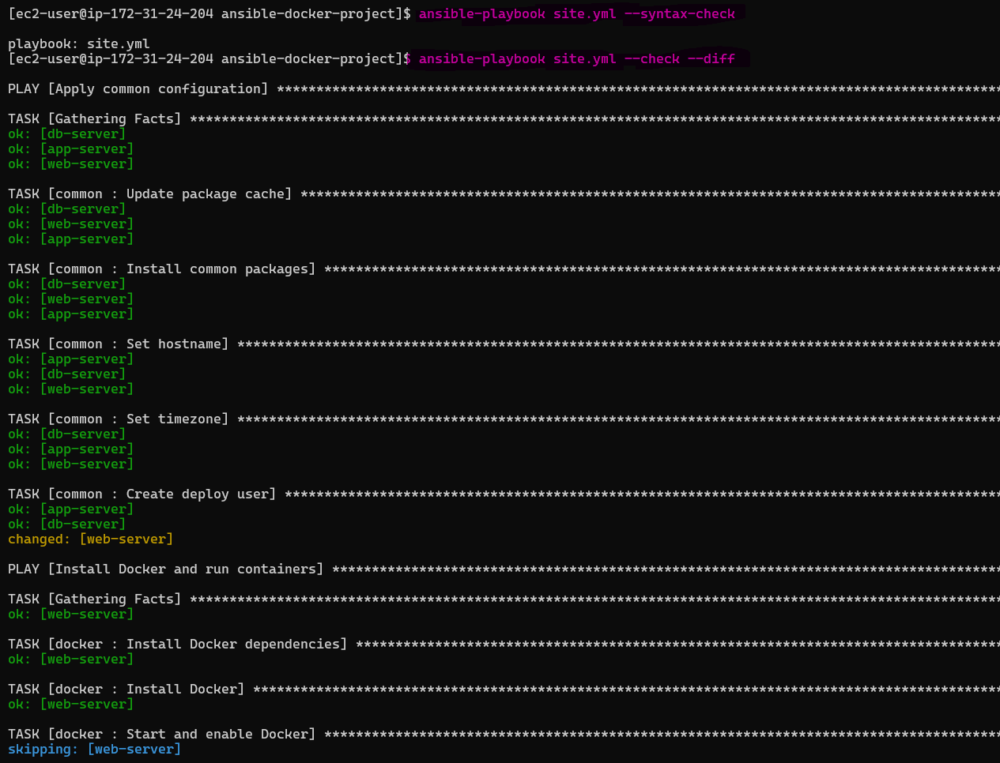
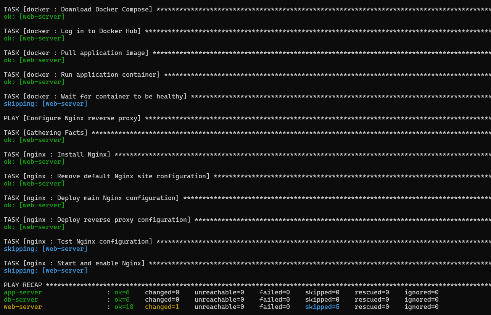 

###  Full deploy

```bash
ansible-playbook site.yml
```
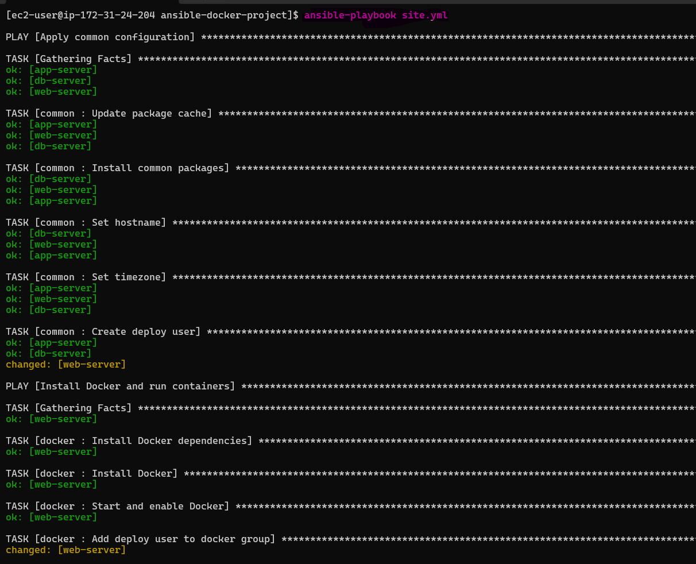
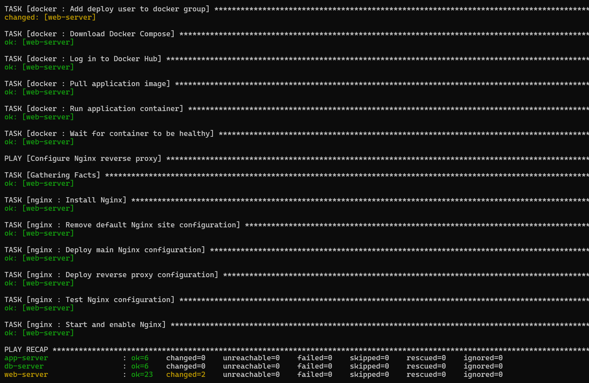 

### Use tags for selective execution:

Run only Docker tasks:

```bash
ansible-playbook site.yml --tags docker
```
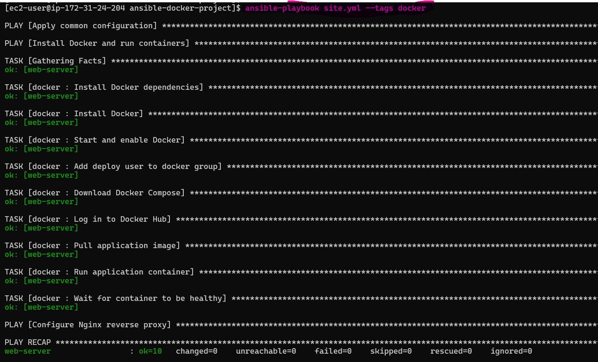 

Run only Nginx tasks:

```bash
ansible-playbook site.yml --tags nginx
```
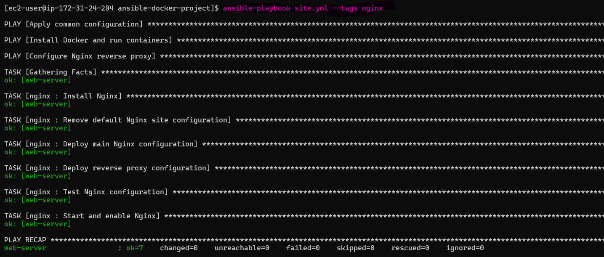 

Skip common setup

```bash
ansible-playbook site.yml --skip-tags common
```
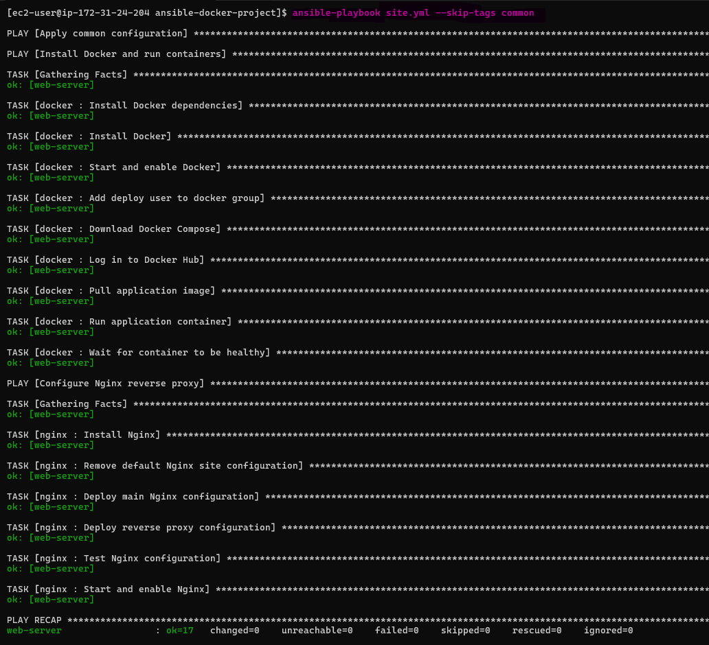 

### Configure EC2 Security Group

To access the application using the web server's public IP, allow the required inbound ports in the **EC2 Security Group**.

| Protocol | Port | Purpose |
|----------|------|---------|
| TCP | 80 | Nginx reverse proxy |
| TCP | 8080 | Direct Docker application access |

For a lab environment, you can temporarily allow:

```text
HTTP        → TCP 80   → 0.0.0.0/0
Custom TCP  → TCP 8080 → 0.0.0.0/0
```
> **Security note:** In production, restrict inbound access to trusted IPs and avoid exposing the Docker application port publicly when Nginx is the intended entry point.

### Verify Docker Application

Curl port `8080` to verify the Docker container directly:

```bash
curl http://WEB_PUBLIC_IP:8080
```
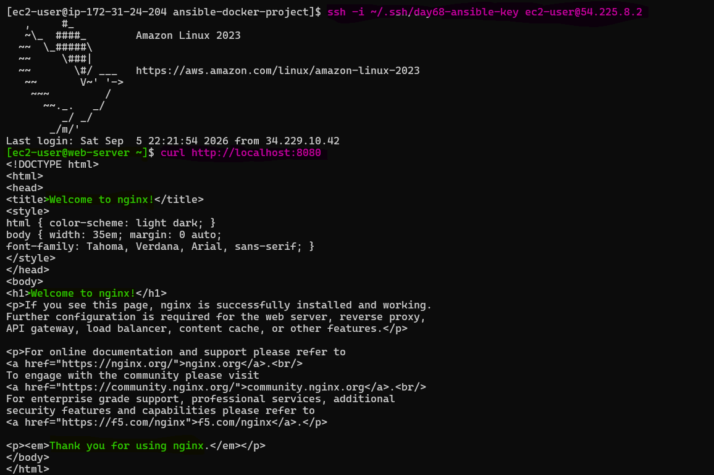 

### Verify Nginx Reverse Proxy

Curl port `80` to verify that Nginx forwards the request to the Docker container:

```bash
curl http://WEB_PUBLIC_IP
```
The response should come from the Docker application through Nginx: `Client → Nginx :80 → Docker :8080 → Container :80`

### Verify Health Endpoint

```bash
curl http://WEB_PUBLIC_IP/health
```
### Verify Container

Check that the Docker container is running with the correct port mapping:

```bash
ansible web -m ansible.builtin.command -a 'docker ps' -b
```
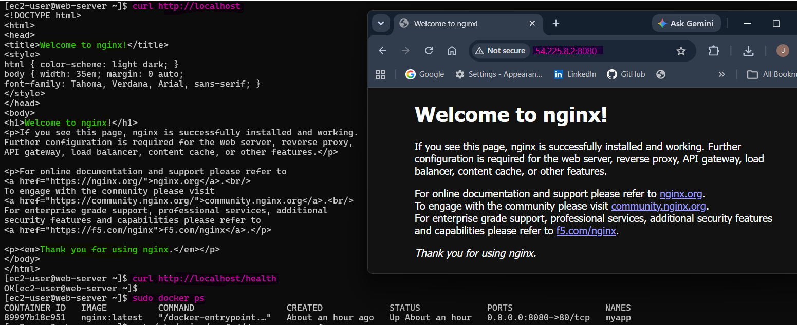

> **Why?** `site.yml` provides a single entry point for the complete infrastructure. Roles handle individual responsibilities, while tags allow selective execution and easier troubleshooting.

---

## Task 7: Bonus -- Deploy a Different App and Re-Run

Change the Docker application from Nginx to Apache without changing the Nginx reverse proxy configuration.

### Deploy a Different Application

Pass the new image and container name using extra variables:

```bash
ansible-playbook site.yml --tags docker \
  -e "docker_app_image=httpd docker_app_tag=latest docker_app_name=apache-app"
```
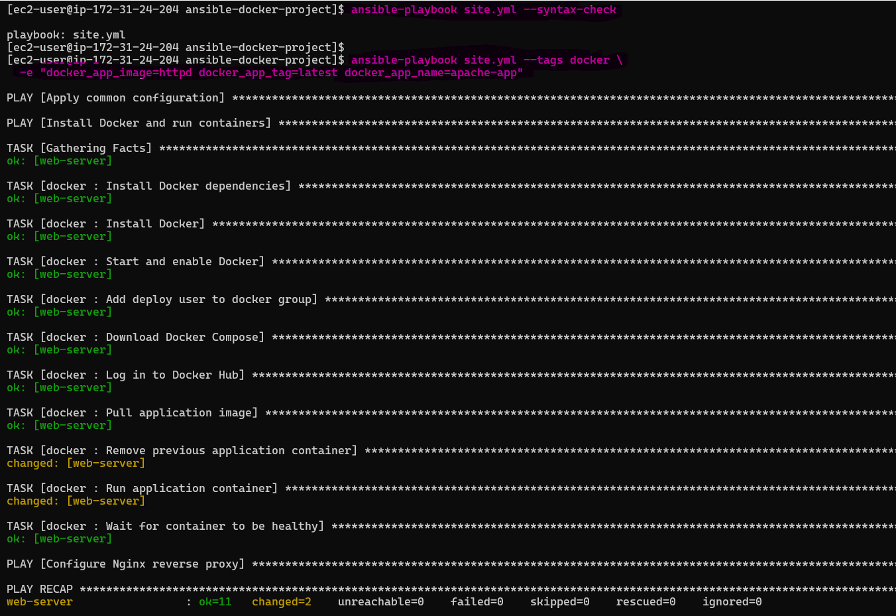

The Docker role removes the previous `myapp` container, starts `apache-app`, and keeps the same `8080:80` port mapping

> **Why?** This demonstrates how Ansible variables can change the deployed application without changing the role logic or Nginx configuration.

### Persist the New Application

To keep Apache as the desired state for subsequent full playbook runs, define the variables in `group_vars/all.yml`:

```yaml
docker_app_image: httpd
docker_app_tag: latest
docker_app_name: apache-app
```
### Run the Full Playbook

```bash
ansible-playbook site.yml
```
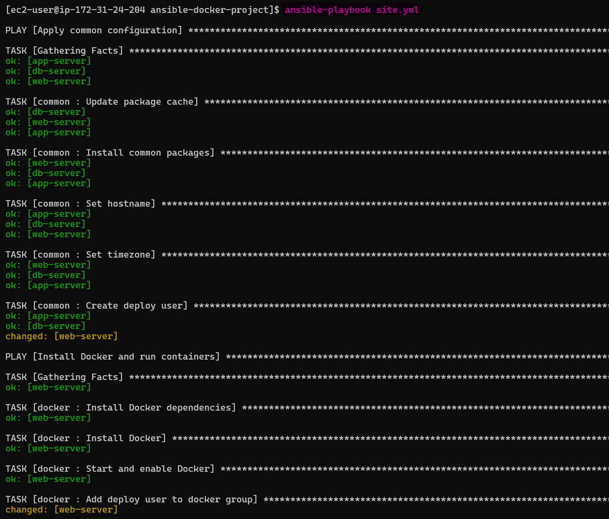 
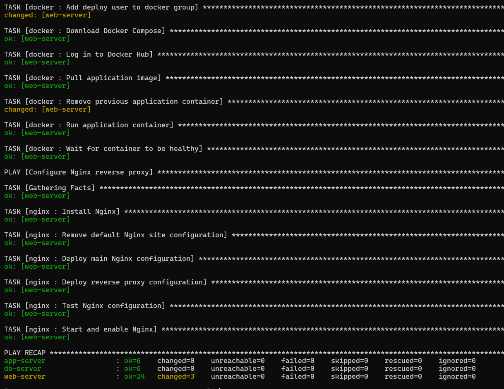 

The full playbook should converge the environment to the desired Apache state. After the initial convergence, a subsequent identical run should show mostly `ok` with `changed=0`.

> **Why?** Idempotent automation can be executed repeatedly while converging the system toward the same desired state without unnecessary changes.

### Verify Apache Application

Test the Docker application directly:

```bash
curl http://WEB_PUBLIC_IP:8080
```
Expected: `It works! Apache httpd`

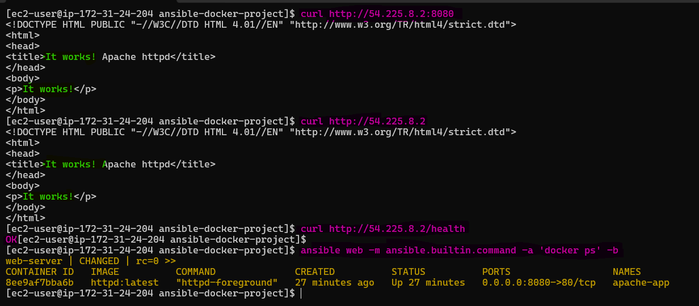 

### Verify Nginx Reverse Proxy

Nginx should continue forwarding port 80 traffic to the new Apache container:

```bash
curl http://WEB_PUBLIC_IP
```
Expected: `It works! Apache httpd`

The traffic flow remains:

```text
Client → Nginx :80 → Apache Container :8080 → Container :80
```

### Verify Container

```bash
ansible web -m ansible.builtin.command -a 'docker ps' -b
```
Expected:

```test
httpd:latest
0.0.0.0:8080->80/tcp
apache-app
```

### Task Execution Summary

The project contains:

| Component | Tasks |
|-----------|------:|
| Common role | 5 |
| Docker role | 10 |
| Nginx role | 6 |
| **Total role tasks** | **21** |

A complete playbook run executes 36 task executions across the three hosts, including fact gathering.

### Ansible Concept Mapping

| Day | Concept Used |
|-----|--------------|
| **68** | Inventory, ad-hoc commands, SSH setup |
| **69** | Playbooks, modules, handlers |
| **70** | Variables, facts, conditionals, loops |
| **71** | Roles, templates, Galaxy, Vault |
| **72** | Everything combined into one project |

### Production Improvements

For a production deployment, add:

- SSL/TLS with Certbot
- Monitoring and alerting
- Centralized logging
- Log rotation
- Multi-container Docker Compose
- CI/CD pipeline
- Secrets management
- Security hardening
- Application-specific health checks

### Clean Up EC2 Resources

If the infrastructure was created with Terraform:

```bash
terraform destroy
```
If the instances were created manually, terminate them from the AWS EC2 console.

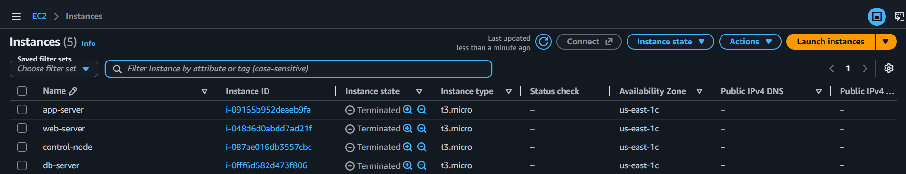

### Final Project Structure

Verify the completed Ansible project:

```bash
tree -L 3
``` 
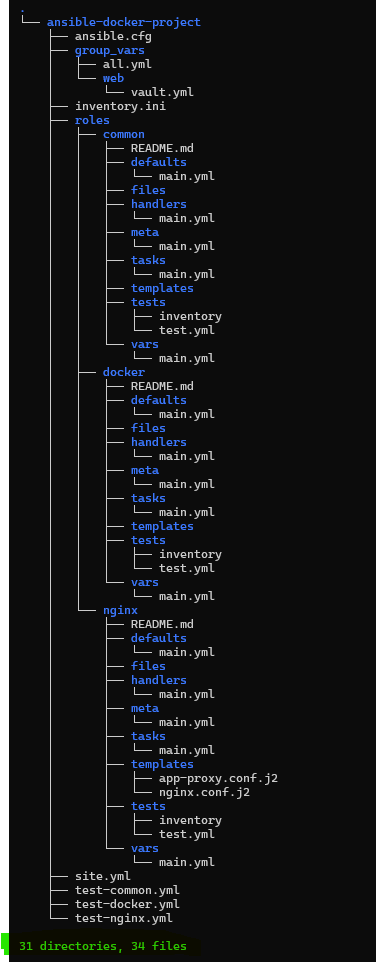

---

## Task 7 Result

- Deployed Apache instead of Nginx
- Replaced the previous Docker container
- Nginx continued proxying without configuration changes
- Apache verified on port `8080`
- Nginx reverse proxy verified on port `80`
- Container health verified
- Full playbook re-run successfully
- Idempotent roles implemented and verified through repeated execution
- EC2 resources cleaned up
- Final Ansible project structure verified

> **Final takeaway:** The project combines inventory, playbooks, modules, variables, conditionals, handlers, roles, templates, Galaxy, Vault, Docker, and Nginx into one reusable and idempotent automation workflow.

---

## Key Concepts Demonstrated

### How You Used Tags for Selective Deployment

- I used Ansible tags such as `common`, `docker`, and `nginx` to run specific parts of the playbook.
- For example, I can run only Docker-related tasks using `--tags docker` instead of executing the entire playbook.
- This makes deployments faster and provides better control during updates and troubleshooting.

```bash
ansible-playbook site.yml --tags docker
ansible-playbook site.yml --tags nginx
ansible-playbook site.yml --skip-tags common
```
---

## How Vault Protected Docker Hub Credentials

- I used **Ansible Vault** to encrypt Docker Hub credentials.
- The encrypted credentials are stored in `group_vars/web/vault.yml`.
- Ansible decrypts them at runtime when the Docker role performs authentication.
- The Vault password file is protected with restricted permissions and excluded from Git using `.gitignore`.

```text
Ansible Vault
      ↓
Encrypted Credentials
      ↓
Docker Login at Runtime
```
---

### Final Architecture

```text
                 Ansible Control Node
                         │
                    SSH / Automation
                         │
                         ▼
                    Web Server
                         │
                    Nginx :80
                         │
                  Reverse Proxy
                         │
                         ▼
              Apache Docker Container
                    Host :8080
                    Container :80
```
> **Key takeaway:** Ansible automates the complete deployment, tags provide selective execution, Vault protects secrets, and Nginx exposes the Dockerized application through a controlled reverse-proxy layer.