# Day 73 -- Introduction to Observability and Prometheus

## Task 1: Understand Observability

### 1. Observability vs Monitoring

- **Monitoring** tells you **when** something is wrong using alerts, thresholds, and predefined checks.
- **Observability** helps you understand **why** something is wrong by exploring and correlating telemetry data.

| Monitoring | Observability |
|---|---|
| Detects problems | Investigates problems |
| Focuses on known failure conditions | Helps discover unknown failure conditions |
| Uses predefined alerts and thresholds | Uses metrics, logs, and traces |
| Answers **"Is something wrong?"** | Answers **"Why is it wrong?"** |

**Example:**

```text
Monitoring     → Alert: API response time is high
Observability  → Database query caused the high response time
```

### 2. Three Pillars of Observability

| Pillar | What It Provides | Examples |
|---|---|---|
| **Metrics** | Numerical measurements over time | Prometheus, CloudWatch |
| **Logs** | Detailed records of application events | Loki, ELK, Fluentd |
| **Traces** | End-to-end request journey | OpenTelemetry, Jaeger |

- **Metrics** → CPU usage, memory usage, request count, error rate
- **Logs** → Application events, warnings, errors, stack traces
- **Traces** → Request flow across APIs, services, databases, and dependencies

### 3. Why DevOps Engineers Need All Three

Each telemetry signal answers a different question:

```text
Metrics  → WHAT is happening?
Logs     → WHY did it happen?
Traces   → WHERE did it happen?
```
**Example:**

Metrics → /api/users has a high error rate
   ↓
Logs → Database connection timeout
   ↓
Traces → Slow database call caused the request failure

> **Together, metrics, logs, and traces provide a complete view of system behavior and make troubleshooting faster.**

### 4. Observability Architecture

This architecture provides **end-to-end visibility** across the application, host, and Docker environment by collecting **metrics, logs, and traces** into dedicated observability components.

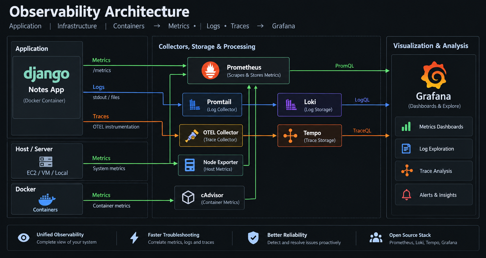

- **Application → Prometheus** — Collects application metrics exposed through `/metrics`.
- **Application → Promtail → Loki** — Collects and stores application logs.
- **Application → OTEL Collector → Tempo** — Processes and stores distributed traces.
- **Host → Node Exporter → Prometheus** — Collects host-level metrics.
- **Docker → cAdvisor → Prometheus** — Collects container-level metrics.
- **Grafana → Unified Analysis** — Visualizes metrics, logs, and traces from a single interface.

> **In short:** Metrics show what is happening, logs explain why, and traces reveal where a problem occurs.

---

## Task 2: Set Up Prometheus with Docker

Create a dedicated project directory for the observability stack. This directory will be extended throughout the next five days.

```bash
mkdir observability-stack && cd observability-stack
```

### 1. Create Prometheus Configuration

Create `prometheus.yml`:
```yaml
global:
  scrape_interval: 15s
  evaluation_interval: 15s

scrape_configs:
  - job_name: "prometheus"
    static_configs:
      - targets: ["localhost:9090"]
```
This configuration tells Prometheus to scrape its own `/metrics` endpoint every 15 seconds.

### 2. Create Docker Compose Configuration

Create `docker-compose.yml`:
```yaml
services:
  prometheus:
    image: prom/prometheus:latest
    container_name: prometheus
    ports:
      - "9090:9090"
    volumes:
      - ./prometheus.yml:/etc/prometheus/prometheus.yml
      - prometheus_data:/prometheus
    command:
      - '--config.file=/etc/prometheus/prometheus.yml'
    restart: unless-stopped

volumes:
  prometheus_data:
```

The Compose configuration:

- Runs Prometheus as a Docker container
- Exposes the Prometheus UI on port `9090`
- Mounts the configuration file into the container
- Persists Prometheus TSDB data using a named volume
- Automatically restarts the container unless explicitly stopped

### 3. Start Prometheus

```bash
docker compose config
docker compose up -d
```
**Prometheus Container Running**

This confirms that Docker Compose successfully created and started the Prometheus container.

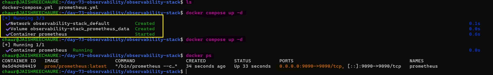 

### 4. Verify Prometheus Logs and Configuration

```bash
docker logs prometheus
```
The logs confirm that Prometheus loaded the configuration, initialized its TSDB, and started the web server on port `9090`.

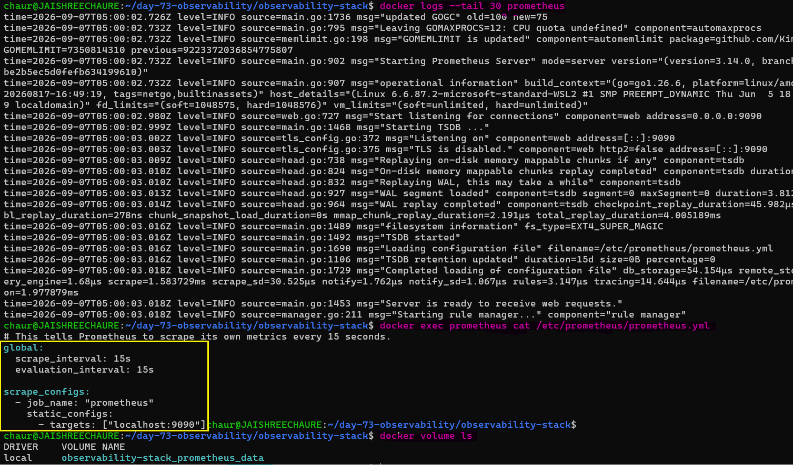

### 5. Open Prometheus Web UI

Open the following in your browser:

```bash
http://localhost:9090
```
The Prometheus web UI provides access to querying, targets, alerts, and server status.

### 6. Verify the Prometheus Target

Navigate to:

**Status → Target Health**

The `prometheus` target should show:

```bash
http://localhost:9090/metrics
```
with state: `Up`

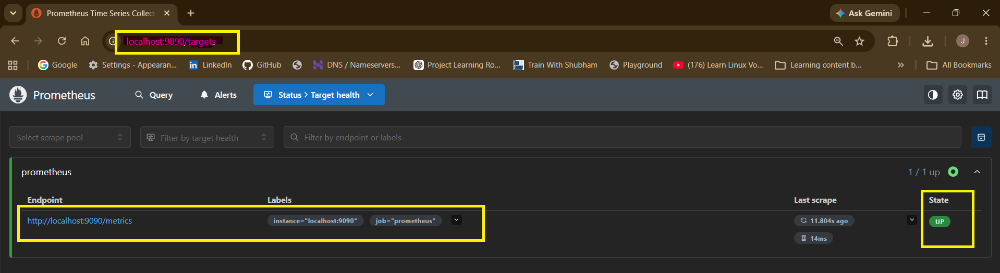

This confirms that Prometheus is successfully scraping its own metrics endpoint.

---

## Task 3: Understand Prometheus Concepts

Explore the Prometheus UI and understand the core concepts used to collect and organize time-series data.

### 1. Scrape Targets

**Scrape targets** are endpoints from which Prometheus periodically pulls metrics.

Prometheus follows a **pull-based model**:

```text
Prometheus → /metrics → Target
```
### 2. Prometheus Metric Types

- **Counter** — A value that only increases, except when reset.
  - Example: total HTTP requests, total errors
- **Gauge** — A value that can increase or decrease.
  - Example: CPU usage, memory usage, active connections
- **Histogram** — Measures the distribution of observations across configurable buckets.
  - Example: request duration
- **Summary** — Calculates quantiles/percentiles over observations on the client side.
  - Example: request latency percentiles

### 3. Labels

**Labels** are key-value pairs that add dimensions to a metric.

Example:

```text
http_requests_total{method="GET",status="200"}
```
Labels allow the same metric to be filtered and analyzed by attributes such as: `HTTP method`, `Status code`, `Handler`, `Instance`, `Job`.

### 4. Time Series

A time series is uniquely identified by a metric name together with its complete set of labels.

Example:

```text
http_requests_total{method="GET",status="200"}
```
Changing any label value creates a different time series.

### 5. Prometheus Query Examples

Open:

```text
http://localhost:9090/graph
```

### Query 1 — Count Active Time Series

**How many metrics is Prometheus collecting about itself?**

```text
count({__name__=~".+"})
```
This counts the active time series currently stored by Prometheus that have a metric name.

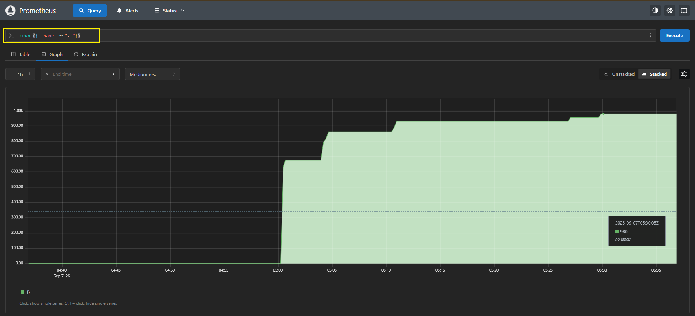 

### Query 2 — Prometheus Memory Usage

**How much memory is Prometheus using?**

```text
process_resident_memory_bytes
```
This shows the amount of physical memory currently used by the Prometheus process.

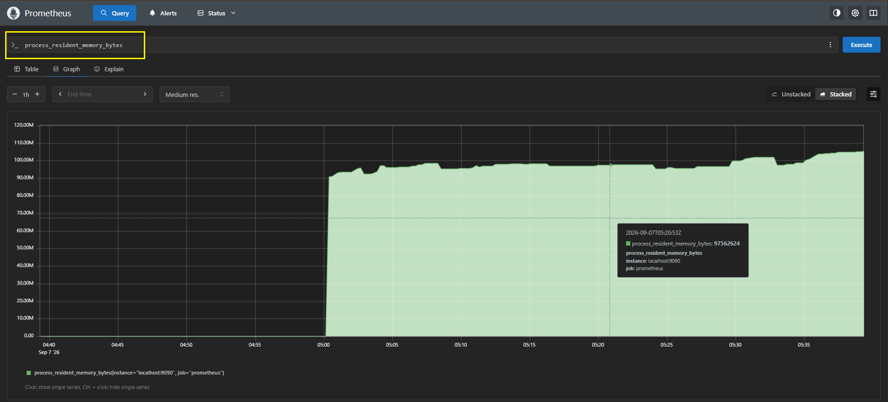 

### Query 3 — Total HTTP Requests

**Total HTTP requests to the Prometheus server**

```text
prometheus_http_requests_total
```
This counter tracks HTTP requests handled by the Prometheus server, with labels providing additional dimensions such as handler, status code, and instance.

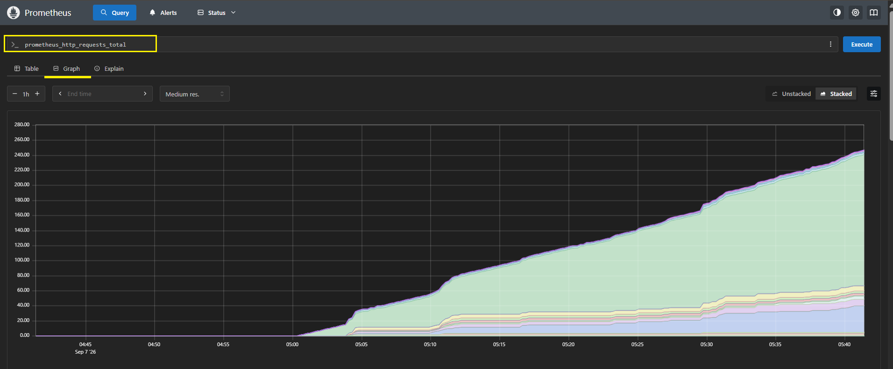 

### Query 4 — Filter Requests by Handler

**Break it down by handler**

```text
prometheus_http_requests_total{handler="/api/v1/query"}
```
This filters the HTTP request counter to show requests handled specifically by Prometheus's `/api/v1/query` API endpoint.

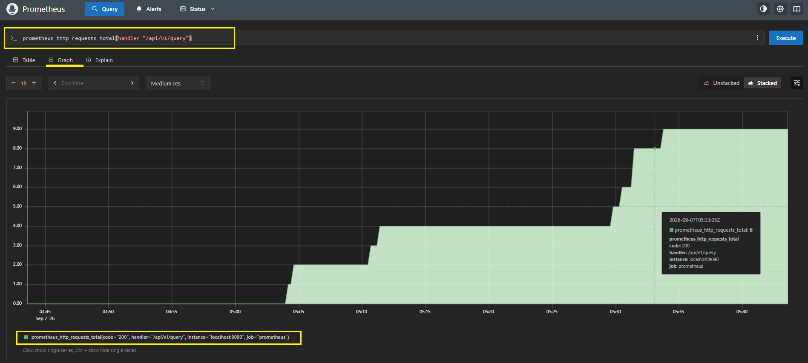

**Document:** What is the difference between a counter and a gauge? Give one real-world example of each.

- **Counter:** A metric that only increases over time, except when it is reset.
  - **Example:** `http_requests_total` — counts the total number of HTTP requests handled by a server since it started.

- **Gauge:** A metric that can increase or decrease, representing a current value.
  - **Example:** `memory_usage_bytes` — shows the current memory usage of a container, VM, or application.

---

## Task 4: Learn PromQL Basics

PromQL (Prometheus Query Language) is used to query, filter, calculate, and analyze metrics stored in Prometheus.

### 1. Instant Vector

An **instant vector** returns the current value of a metric.

```promql
up
```
Returns `1` when the target was successfully scraped and `0` when the scrape failed.

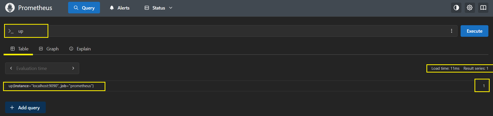 

### 2. Range Vector

A range vector returns metric samples collected over a specific time window.

```promql
prometheus_http_requests_total[5m]
```
Returns the HTTP request counter samples collected during the last 5 minutes.

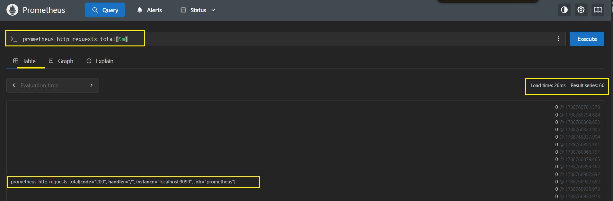 

### 3. Rate

`rate()` calculates the average per-second increase of a counter over a time window.

```promql
rate(prometheus_http_requests_total[5m])
```
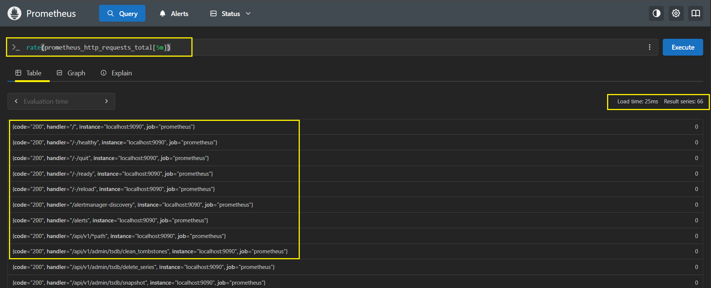 

### 4. Aggregation

`sum()` combines multiple time series into a single value.

```promql
sum(rate(prometheus_http_requests_total[5m]))
```
Shows the overall HTTP request rate across all label combinations.

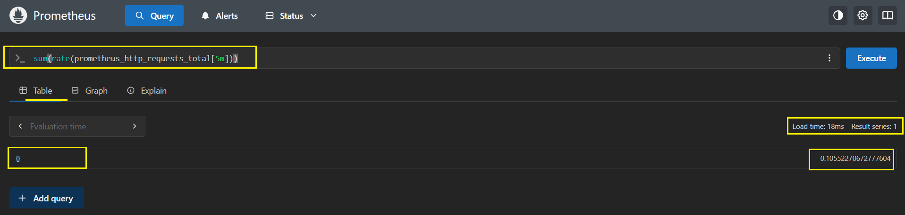 

### 5. Filter by Label

PromQL can filter time series using label matchers.

```promql
prometheus_http_requests_total{code="200"}
```
Shows HTTP requests that returned a successful `200` status code.

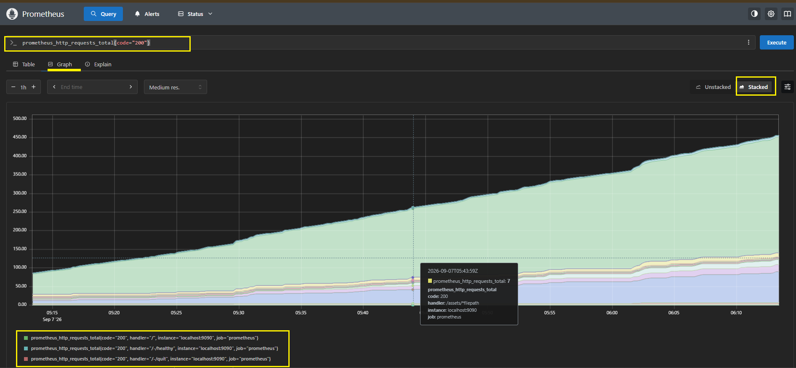 

```promql
prometheus_http_requests_total{code!="200"}
```
Shows HTTP requests that returned a status code other than `200`.

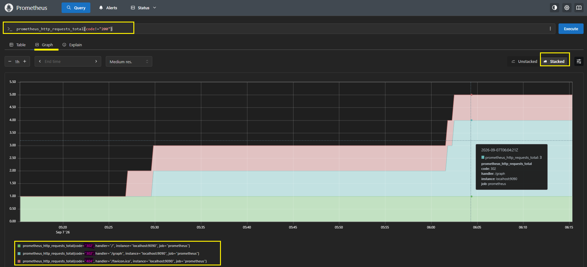 

### 6. Arithmetic

PromQL supports arithmetic operations directly on metric values.

```promql
process_resident_memory_bytes / 1024 / 1024
```
Converts Prometheus process memory usage from bytes to megabytes.

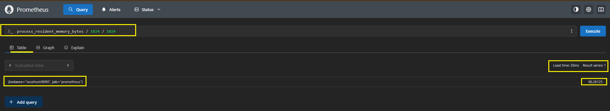 

### 7. Top-K

`topk()` returns the highest-valued time series from a metric.

```promql
topk(5, prometheus_http_requests_total)
```
Shows the five HTTP request series with the highest counter values.

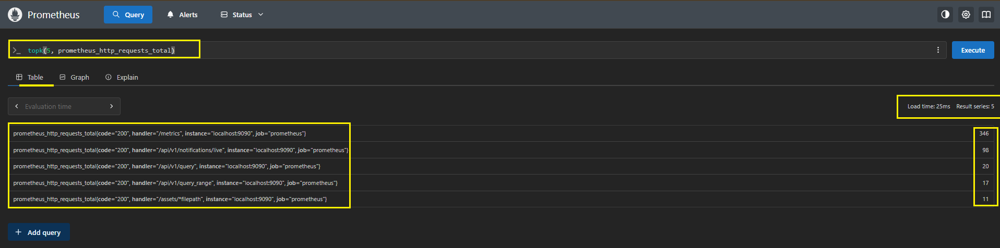 

### Exercise: Non-200 Request Rate

Use `rate()` with a label filter to calculate the per-second rate of non-200 HTTP requests.

```promql
rate(prometheus_http_requests_total{code!="200"}[5m])
```
This helps identify the current rate of unsuccessful HTTP responses.

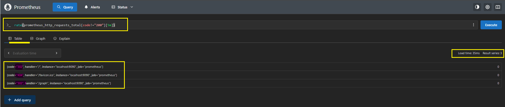

> **Note:** A result of `0` means no non-200 requests were recorded during the effective 5-minute window.

### Key Takeaway

PromQL allows you to move from raw metrics to useful operational insights by combining:

`selectors` → `range vectors` → `functions` → `filters` → `aggregations`

---

## Task 5: Add a Sample Application as a Scrape Target

Prometheus becomes more useful when it monitors an actual application. In this task, the Django Notes App is added as a Prometheus scrape target.

### 1. Use the Django Notes App

The sample application is based on the
[notes-apponly](https://github.com/LondheShubham153/observability-for-devops/tree/master/notes-apponly)
project from the observability-for-devops repository.

The application was configured to expose Prometheus-compatible metrics through the `/metrics` endpoint.

Because the original application did not expose `/metrics` by default, the required Django Prometheus integration changes were made and documented separately in:

**[Django + Prometheus Fix Guide](./observability-stack/DJANGO_PROMETHEUS_FIX.md)**

The changes include:

- Added `django-prometheus`
- Configured Prometheus middleware
- Added the `/metrics` endpoint
- Rebuilt the application image

### 2. Configure Docker Compose

Update `docker-compose.yml` to run both Prometheus and the Django Notes App:
```yaml
services:
  prometheus:
    image: prom/prometheus:latest
    container_name: prometheus
    ports:
      - "9090:9090"
    volumes:
      - ./prometheus.yml:/etc/prometheus/prometheus.yml
      - prometheus_data:/prometheus
    command:
      - "--config.file=/etc/prometheus/prometheus.yml"
    restart: unless-stopped
    networks:
      - monitoring

  notes-app:
    build:
      context: ./notes-app
      dockerfile: Dockerfile
    container_name: notes-app
    ports:
      - "8000:8000"
    restart: unless-stopped
    networks:
      - monitoring

volumes:
  prometheus_data:

networks:
  monitoring:
```
### 3. Configure Prometheus to Scrape the App

Add the Notes App as a scrape target in `prometheus.yml`:
```yaml
global:
  scrape_interval: 15s
  evaluation_interval: 15s

scrape_configs:
  - job_name: "prometheus"
    static_configs:
      - targets: ["localhost:9090"]

  - job_name: "notes-app"
    static_configs:
      - targets: ["notes-app:8000"]
```
Prometheus automatically requests:

```text
http://notes-app:8000/metrics
```
The Docker service name `notes-app` is used because both containers share the `monitoring` network.

### 4. Build and Start the Stack

Rebuild the application and start all services:

```bash
docker compose up -d --build
```
Verify the running containers:

```bash
docker ps
```
**Prometheus and Notes App Running**

This confirms that Docker Compose successfully built the Notes App image and started both the application and Prometheus containers.

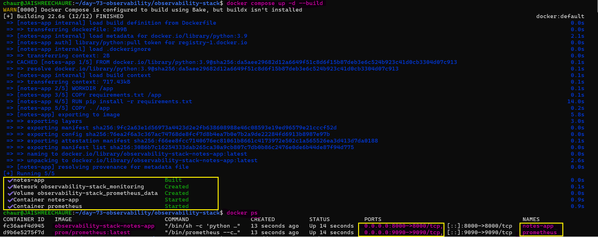 

### 5. Verify Prometheus Targets

Open:

```text
http://localhost:9090/targets
```
The Prometheus Targets page should show both scrape targets as `UP`:

```text
notes-app    UP
prometheus   UP
```
The Notes App endpoint should be:

```text
http://notes-app:8000/metrics
```
This confirms that Prometheus can reach the Django application and successfully scrape its `/metrics` endpoint.

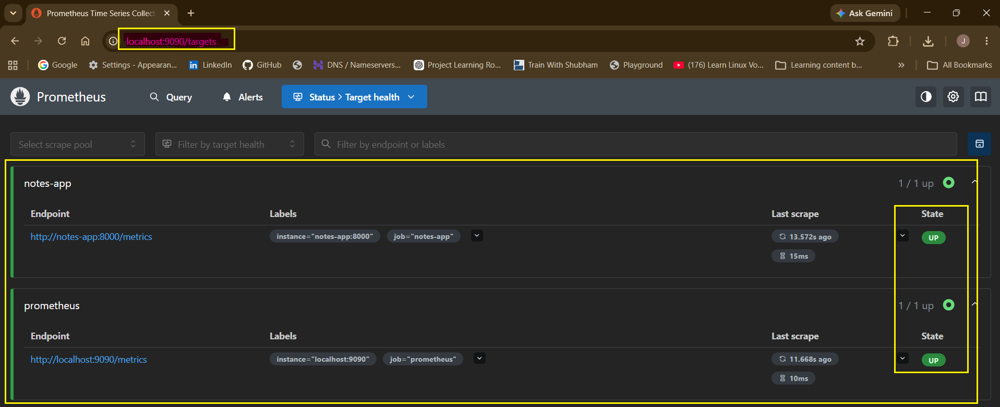

### 6. Generate Application Traffic

Generate a few requests to the Notes App:

```bash
curl http://localhost:8000
curl http://localhost:8000
curl http://localhost:8000
```
This creates application traffic that can later be reflected in the collected metrics.

### Key Takeaway

A running application is not automatically observable by Prometheus.

The application must expose metrics through `/metrics`, or an exporter/collector must translate its telemetry into Prometheus-compatible metrics.

> **The DJANGO_PROMETHEUS_FIX.md document records the application-level changes required to make the Notes App scrapeable by Prometheus.**

---

## Task 6: Explore Data Retention and Storage

Prometheus stores collected metrics in its local **Time Series Database (TSDB)**. Understanding retention and persistent storage is important because monitoring data must survive container restarts and be automatically cleaned up when retention limits are reached.

**### 1. Check Prometheus Storage Usage**

Check how much disk space Prometheus is currently using:

```bash
docker exec prometheus du -sh /prometheus
```
This shows the amount of disk space currently used by Prometheus TSDB data.

### 2. Configure Data Retention

Prometheus uses a local TSDB and, by default, retains data for 15 days. Retention can be controlled by time and storage size.   

Update the Prometheus command in `docker-compose.yml`:
```yaml
command:
  - '--config.file=/etc/prometheus/prometheus.yml'
  - '--storage.tsdb.retention.time=30d'
  - '--storage.tsdb.retention.size=1GB'
```
`retention.time` limits how long samples are kept, while `retention.size` limits the amount of disk space used by the TSDB. Prometheus removes old data when the configured retention limit is reached.

After changing the configuration, recreate the stack:

```bash
docker compose up -d --build
```

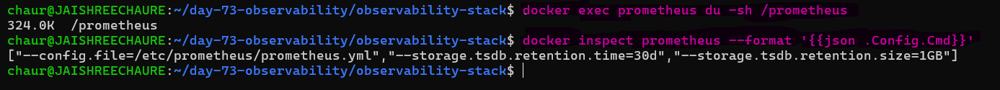 

### 3. Inspect TSDB Status

Open `Status > TSDB Status` in the Prometheus UI.

This page provides an overview of the data currently stored in the TSDB, including the number of series, chunks, label pairs, and the time range of stored samples.

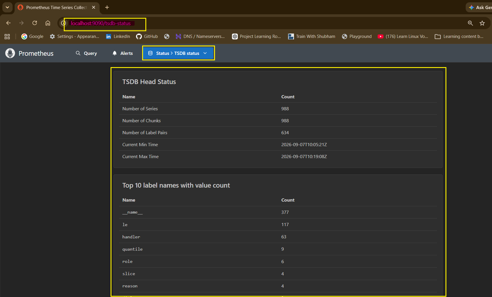 

### 4. Verify Persistent Volume and Cleanup

Prometheus stores its TSDB under `/prometheus`, which is backed by the Docker named volume.

The following commands demonstrate the difference between removing the containers and removing the persistent volume:

```bash
docker compose down
docker volume ls | grep observability
docker compose down -v
docker volume ls | grep observability
```
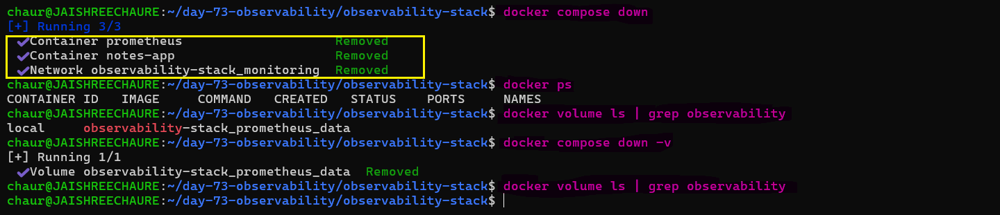

> **Important:** `docker compose down` removes containers and networks but preserves named volumes. `docker compose down -v` also removes the named volumes and permanently deletes the stored Prometheus data.

**Document:** What happens when retention is exceeded? Why is a volume mount important for Prometheus data?

**Retention exceeded**

- Old metrics are automatically deleted, keeping only recent data within the configured retention limit.

**Why volume mount matters**

- It ensures Prometheus data is **persisted**. Without it, all stored metrics are lost when the container is removed.

---