# Day 74 -- Node Exporter, cAdvisor, and Grafana Dashboards

## Task 1: Add Node Exporter for Host Metrics

Node Exporter exposes Linux host metrics such as CPU, memory, disk, filesystem, and network statistics in Prometheus format.

### 1. Add Node Exporter

Update your `docker-compose.yml` from Day 73 -- add the Node Exporter service:
```yaml
  node-exporter:
    image: prom/node-exporter:latest
    container_name: node-exporter
    ports:
      - "9100:9100"
    volumes:
      - /proc:/host/proc:ro
      - /sys:/host/sys:ro
      - /:/rootfs:ro
    command:
      - '--path.procfs=/host/proc'
      - '--path.sysfs=/host/sys'
      - '--path.rootfs=/rootfs'
      - '--collector.filesystem.mount-points-exclude=^/(sys|proc|dev|host|etc)($$|/)'
    restart: unless-stopped
```

**Why these volume mounts?**
- `/proc` → kernel and process information such as CPU and memory stats
- `/sys` → hardware, device, and kernel information
- `/` → host filesystem and disk usage
- `:ro` → read-only access; Node Exporter only reads host information

### 2. Add Node Exporter to Prometheus

Update `prometheus.yml`:
```yaml
scrape_configs:
  - job_name: "prometheus"
    static_configs:
      - targets: ["localhost:9090"]

  - job_name: "node-exporter"
    static_configs:
      - targets: ["node-exporter:9100"]
```
Prometheus uses the Docker service name `node-exporter` to reach the exporter over the Docker network.

### 3. Validate the Compose Configuration

Before starting the stack, validate the final Compose configuration:

```bash
docker compose config
```
This checks that the YAML is valid and Docker Compose can resolve the configuration correctly.

### 4. Start the Stack:

```bash
docker compose up -d
docker compose ps
```
This starts the services and confirms that Node Exporter is running.

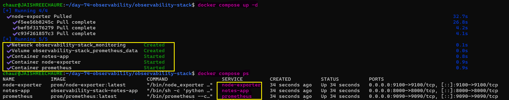 

### 5. Verify Node Exporter Metrics

Node Exporter exposes metrics through its `/metrics` endpoint on port 9100.

```bash
curl http://localhost:9100/metrics | head -20
```
The response contains Prometheus-formatted metrics exported from the Linux host.

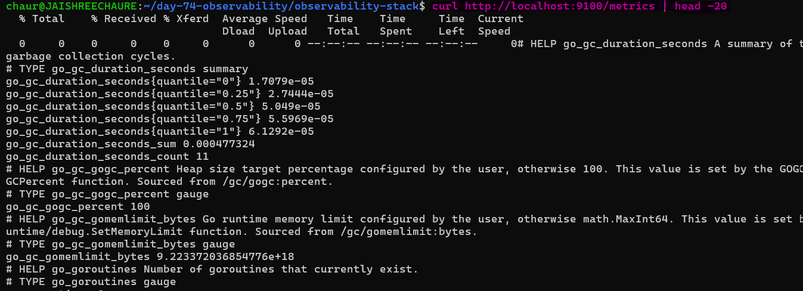 

### 6. Verify CPU Metrics

Check that Node Exporter is exposing per-CPU statistics:

```bash
curl -s http://localhost:9100/metrics | grep '^node_cpu_seconds_total' | head
```
`node_cpu_seconds_total` is a counter representing cumulative CPU time for each CPU and mode.

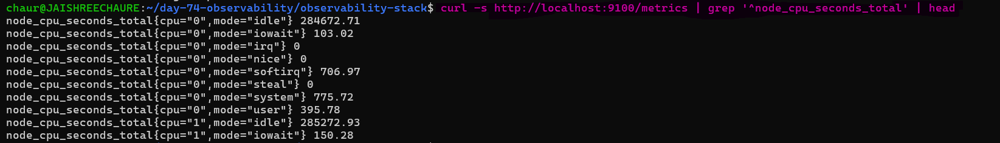 

### 7. Verify Prometheus Scraping

Open the Prometheus Targets page:

```text
http://localhost:9090/targets
```
The node-exporter target should show: `State: UP`

This confirms that Prometheus can successfully scrape Node Exporter.

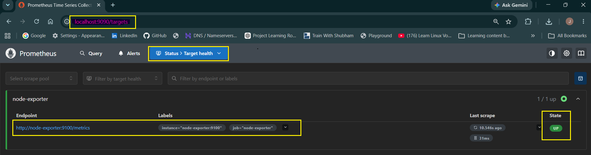 

### 8. Query Host Metrics in Prometheus

**CPU Idle Time**

```promql
node_cpu_seconds_total{mode="idle"}
```
This returns cumulative idle CPU time for each CPU core.

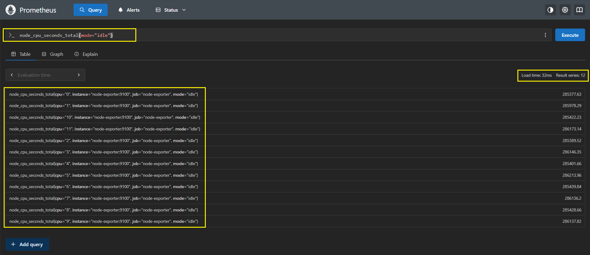

**Memory Total**

```promql
node_memory_MemTotal_bytes
```
This shows the total memory available on the host.

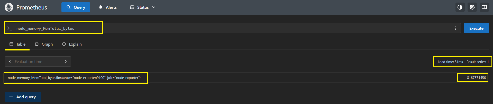

**Memory Available**

```promql
node_memory_MemAvailable_bytes
```
This shows the memory currently available to the system.

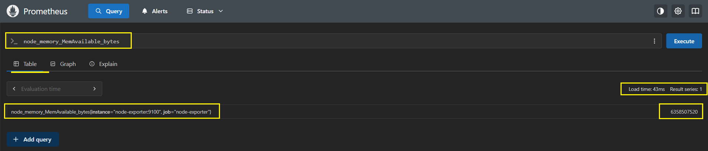 

**Memory Usage Percentage**

```promql
(1 - node_memory_MemAvailable_bytes / node_memory_MemTotal_bytes) * 100
```
This calculates approximate host memory utilization as a percentage.

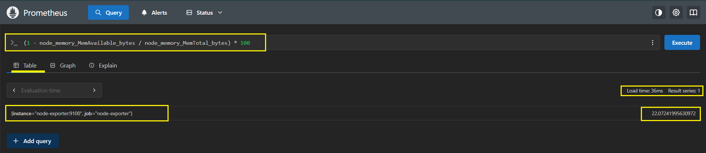 

**Disk Usage Percentage**

```promql
(1 - node_filesystem_avail_bytes / node_filesystem_size_bytes) * 100
```
This calculates filesystem usage percentage.

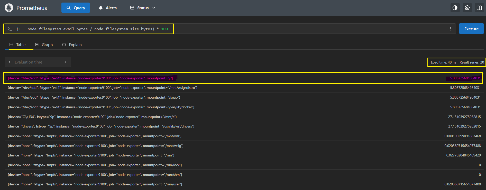 

**Network Receive Rate**

```promql
rate(node_network_receive_bytes_total[5m])
```
`rate()` converts the cumulative network-receive counter into bytes received per second over the last 5 minutes.

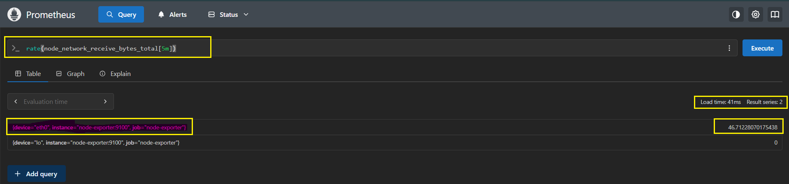

---

## Task 2: Add cAdvisor for Container Metrics

cAdvisor (Container Advisor) monitors resource usage and performance of running Docker containers.

### 1. Add cAdvisor

Update `docker-compose.yml`:
```yaml
  cadvisor:
    image: gcr.io/cadvisor/cadvisor:latest
    container_name: cadvisor
    ports:
      - "8080:8080"
    volumes:
      - /var/run/docker.sock:/var/run/docker.sock:ro
      - /sys:/sys:ro
      - /var/lib/docker/:/var/lib/docker:ro
    restart: unless-stopped
```

**Why these volume mounts?**
- `/var/run/docker.sock` → lets cAdvisor discover and query running containers
- `/sys` → provides kernel-level container statistics through cgroups
- `/var/lib/docker/` → provides container filesystem information
- `:ro` → mounts are read-only where possible; cAdvisor reads container information

### 2. Add cAdvisor to Prometheus

Update `prometheus.yml`:
```yaml
  - job_name: "cadvisor"
    static_configs:
      - targets: ["cadvisor:8080"]
```
Prometheus now knows to scrape cAdvisor on port `8080`.
### 3. Validate the Configuration

Before starting the stack, check that the Compose configuration is valid:

```bash
docker compose config
```
This renders the final Compose configuration and helps catch YAML or configuration errors before deployment.

### 4. Start the Stack

```bash
docker compose up -d
docker compose ps
```
This starts cAdvisor along with the existing monitoring services and verifies their status.

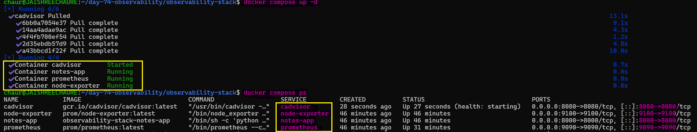 

### 5. Restart Prometheus

After adding the cAdvisor scrape target, restart Prometheus and verify it is running:

```bash
docker compose restart prometheus
docker compose ps prometheus
```
Continue by verifying the cAdvisor target in Prometheus.

### 6. Verify the cAdvisor Web UI

Open:

```text
http://localhost:8080
```
cAdvisor provides a web interface for inspecting Docker containers and their resource usage.

Click `Docker Containers` to view per-container statistics.

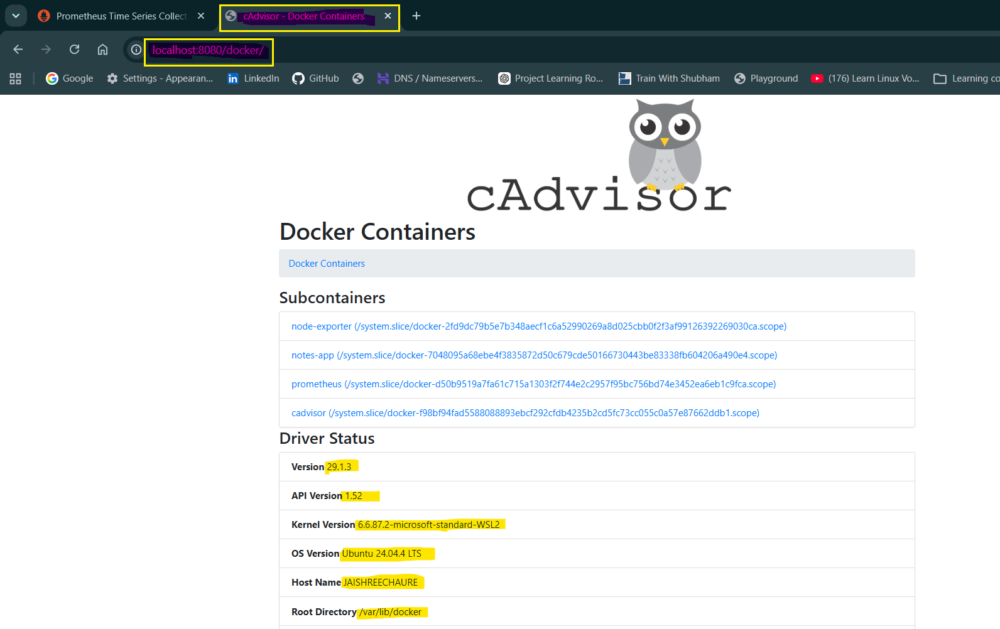 

### 7. Query Container Metrics in Prometheus

**CPU usage per container (in seconds)**

```promql
rate(container_cpu_usage_seconds_total{name!=""}[5m])
```
`container_cpu_usage_seconds_total` is a cumulative CPU-time counter. `rate()` converts it into CPU usage per second over the last 5 minutes.

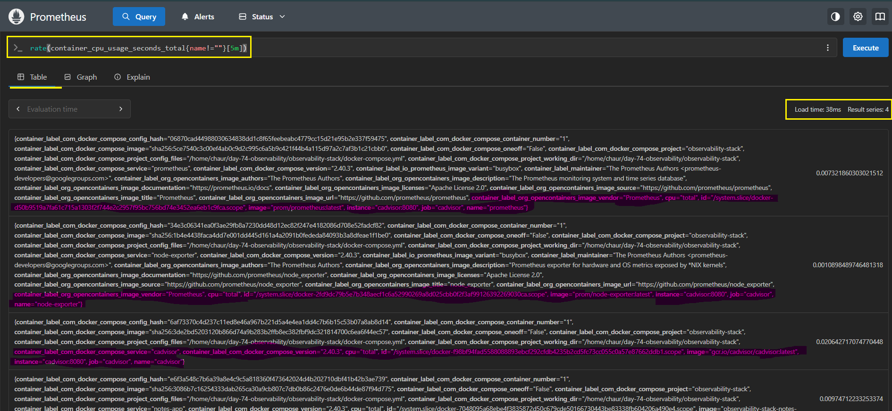 

**Memory usage per container**

```promql
container_memory_usage_bytes{name!=""}
```
This returns the current memory usage of each named container.

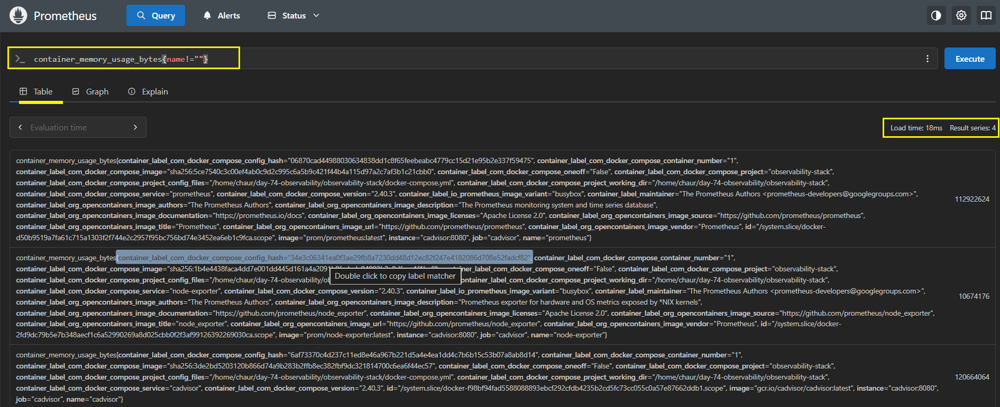 

**Container Network Receive Rate**

```promql
rate(container_network_receive_bytes_total{name!=""}[5m])
```
This calculates the rate at which each container is receiving network data.

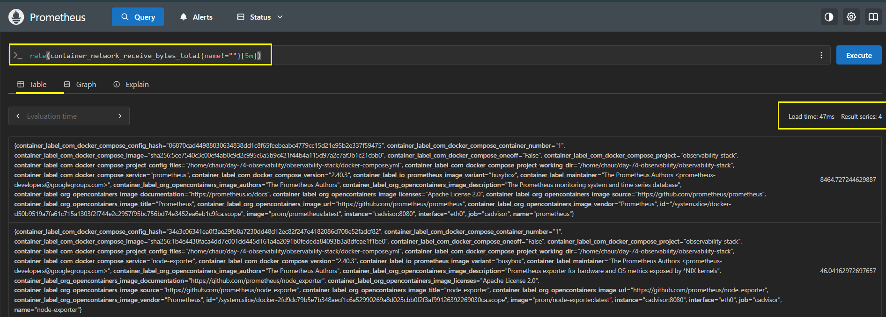

**Top 3 Containers by Memory Usage**

```promql
topk(3, container_memory_usage_bytes{name!=""})
```
`topk(3, ...)` returns the three containers currently using the most memory.

The `{name!=""}` filter removes aggregated/system-level entries and shows only named containers.

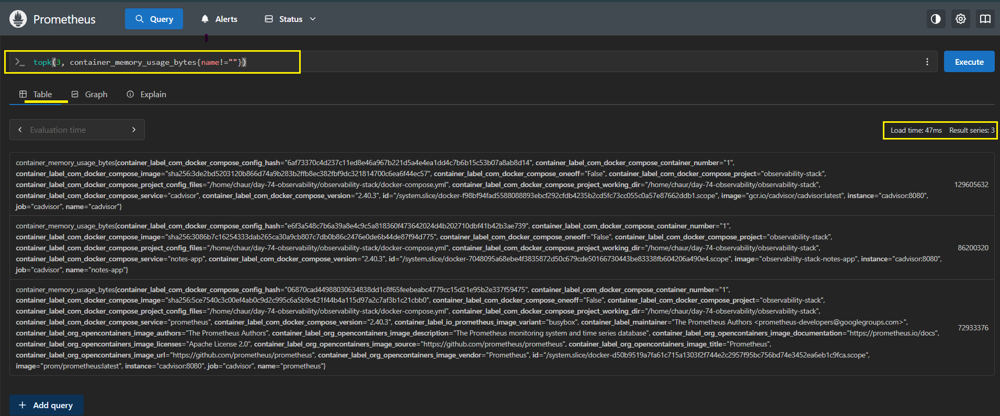

### 8. Node Exporter vs cAdvisor

**Document:** What is the difference between Node Exporter and cAdvisor? When would you use each?

- `Node Exporter` → monitors **host/system-level metrics** such as CPU, memory, disk, and network of the machine.
- `cAdvisor` → monitors **container-level metrics** such as CPU, memory, and network usage per container.
- Use `Node Exporter` for **server/host monitoring** and `cAdvisor` for **container monitoring**.

---

## Task 3: Set Up Grafana

Grafana is the visualization layer. It connects to Prometheus and lets you build dashboards, visualize metrics, and create alerts.

### 1. Add Grafana

Update `docker-compose.yml`:
```yaml
  grafana:
    image: grafana/grafana-enterprise:latest
    container_name: grafana
    ports:
      - "3000:3000"
    volumes:
      - grafana_data:/var/lib/grafana
    environment:
      - GF_SECURITY_ADMIN_USER=admin
      - GF_SECURITY_ADMIN_PASSWORD=admin123
    restart: unless-stopped
```

Add the volume at the bottom of your compose file:
```yaml
volumes:
  prometheus_data:
  grafana_data:
```
### 2. Validate the Configuration

Check the final Compose configuration:

```bash
docker compose config
```
This validates the YAML and shows the resolved Docker Compose configuration.

### 3. Start and Verify Grafana

```bash
docker compose up -d
docker compose ps
```
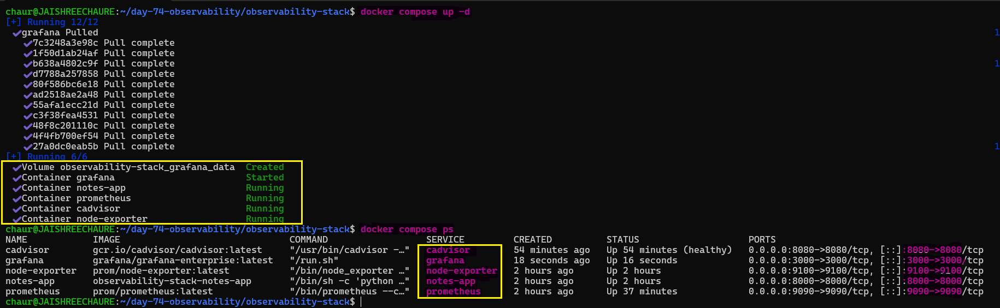 

This starts Grafana with the existing monitoring stack and verifies that the containers are running.

### 4. Open Grafana

Open:

```text
http://localhost:3000
```
Log in with:

```text
Username: admin
Password: admin123
```
### 5. Add Prometheus as a Data Source

1. `Go to Connections > Data Sources > Add data source`
2. Select `Prometheus`
3. Set URL to `http://prometheus:9090` (Use the Docker service name `prometheus` instead of localhost because Grafana and Prometheus communicate through the Docker monitoring network.)
4. Click Save & Test -- you should see "Successfully queried the Prometheus API"

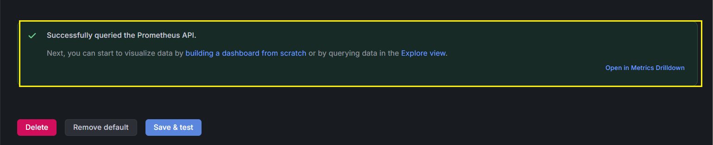

---

## Task 4: Build Your First Dashboard

Create a dashboard that shows the health of your system at a glance.

### 1. Create the Dashboard

Go to : **`Dashboards → New Dashboard → Add Visualization`**

Select : **`Prometheus`** as the datasource.

### 2. Add Dashboard Panels

**Panel 1 -- CPU Usage (Gauge):**
```promql
100 - (avg(rate(node_cpu_seconds_total{mode="idle"}[5m])) * 100)
```
- Visualization: `Gauge`
- Title: `CPU Usage %`
- Set thresholds: green `< 60`, yellow `< 80`, red `>=80`

**Panel 2 -- Memory Usage (Gauge):**
```promql
(1 - node_memory_MemAvailable_bytes / node_memory_MemTotal_bytes) * 100
```
- Visualization: `Gauge`
- Title: `Memory Usage %`

**Panel 3 -- Container CPU Usage (Time Series):**
```promql
rate(container_cpu_usage_seconds_total{name!=""}[5m]) * 100
```
- Visualization: `Time series`
- Title: `Container CPU Usage`
- Legend: `{{name}}`

**Panel 4 -- Container Memory Usage (Bar Chart):**
```promql
container_memory_usage_bytes{name!=""} / 1024 / 1024
```
- Visualization: `Bar chart`
- Title: `Container Memory (MB)`
- Legend: `{{name}}`

**Panel 5 -- Disk Usage (Stat):**
```promql
(1 - node_filesystem_avail_bytes{mountpoint="/"} / node_filesystem_size_bytes{mountpoint="/"}) * 100
```
- Visualization: `Stat`
- Title: `Disk Usage %`

### 3. Save the Dashboard

Save the complete dashboard as: **`DevOps Observability Overview`**

After saving, `exit Edit` mode and return to the normal dashboard view. This confirms that the complete dashboard is `saved` and all panels are displayed together.

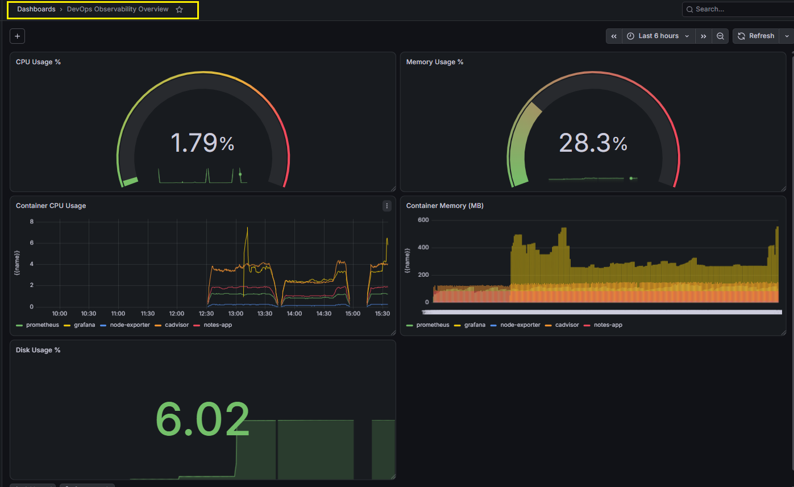

---

## Task 5: Auto-Provision Datasources with YAML

In production, datasources should be provisioned through configuration files instead of being added manually through the Grafana UI. This makes the setup repeatable and easier to manage.

### 1. Create the Provisioning Directories

```bash
mkdir -p grafana/provisioning/datasources
mkdir -p grafana/provisioning/dashboards
```
If the `grafana` directory is owned by `root`, fix the ownership so the current user can manage the files:

```bash
sudo chown -R $USER:$USER grafana
```
### 2. Create the Datasource Configuration

Create `grafana/provisioning/datasources/datasources.yml`:

Add:
```yaml
apiVersion: 1

datasources:
  - name: Prometheus
    type: prometheus
    access: proxy
    url: http://prometheus:9090
    isDefault: true
    editable: false
```
- `url` → Grafana connects to Prometheus through the Docker network.
- `isDefault: true` → makes Prometheus the default datasource.
- `editable: false` → prevents manual changes through the Grafana UI.

### 3. Mount Provisioning into Grafana

Update the Grafana service in `docker-compose.yml` to mount the provisioning directory:
```yaml
  grafana:
    image: grafana/grafana-enterprise:latest
    container_name: grafana
    ports:
      - "3000:3000"
    volumes:
      - grafana_data:/var/lib/grafana
      - ./grafana/provisioning:/etc/grafana/provisioning
    environment:
      - GF_SECURITY_ADMIN_USER=admin
      - GF_SECURITY_ADMIN_PASSWORD=admin123
    restart: unless-stopped
```
The bind mount makes the local provisioning files available inside Grafana.

### 4. Validate the Compose Configuration

```bash
docker compose config
```
This renders the final Compose configuration and helps catch YAML or configuration errors.

Verify the Grafana provisioning mount:

```bash
docker compose config | grep -A8 -B2 "grafana:"
```

### 5. Restart Grafana

Apply the provisioning configuration:
```bash
docker compose restart grafana
```
If Grafana needs to be recreated, use:
```bash
docker compose up -d grafana
```
Verify Grafana:
```bash
docker compose ps grafana
```

### 6. Verify the Datasource

Open:

```text
http://localhost:3000
```

Go to: 
**`Connections → Data Sources → Prometheus`**

Prometheus should already be configured without manually adding it through the UI.

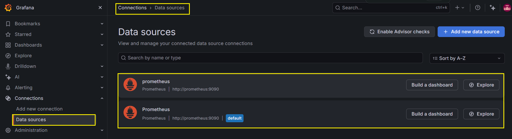

**Document:** Why is provisioning datasources via YAML better than configuring them manually through the UI?

YAML provisioning is better because:

- same setup across all environments
- changes tracked in Git
- works with CI/CD pipelines
- avoids UI configuration drift
- easy to replicate across systems
- configs can be rebuilt quickly

**UI is fine for quick testing, but YAML provisioning is better for production.**

---

## Task 6: Import a Community Dashboard

Grafana provides thousands of pre-built community dashboards. Import existing dashboards to quickly visualize the metrics collected by Node Exporter and cAdvisor.

### 1. Import Node Exporter Dashboard

Go to : **`Dashboards → New → Import`**

Enter dashboard ID: **1860** (Node Exporter Full)

Select your `Prometheus datasource` and click `Import`.


Explore the imported dashboard. It has dozens of panels covering CPU, memory, disk, network, and more -- all built on the same Node Exporter metrics you queried manually.

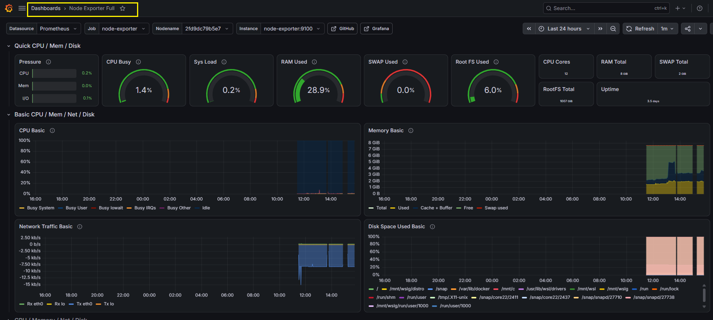 


### 2. Import cAdvisor Dashboard

Import another community dashboard: `193`

Select `Prometheus default` as the datasource and click `Import`.

The dashboard imported successfully, but the panels initially showed `N/A / No data`.

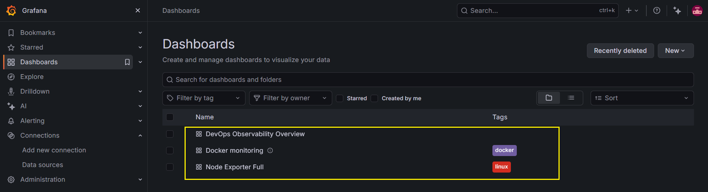

### 3. Troubleshoot the Missing Data

The dashboard imported correctly, but its queries did not match the labels/metrics exposed by our cAdvisor setup.

Verify cAdvisor data directly in Prometheus:

**Container CPU:**
```bash
rate(container_cpu_usage_seconds_total{name!=""}[5m])
```
**Container Memory:**
```bash
container_memory_usage_bytes{name!=""}
```
**Container Network:**
```bash
rate(container_network_receive_bytes_total{name!=""}[5m])
```
These queries returned container data, confirming that **cAdvisor was working and Prometheus was successfully scraping it.**

> **Key takeaway:** A dashboard can import successfully but still show `N/A` when its queries or label expectations do not match the metrics available in your environment.

### 4. Verify the Complete Observability Stack

**Your full `docker-compose.yml` should now have these services:**
- `prometheus`
- `node-exporter`
- `cadvisor`
- `grafana`
- `notes-app` (from Day 73)

Verify all are running:
```bash
docker compose ps
```
All services should show as `Up`.

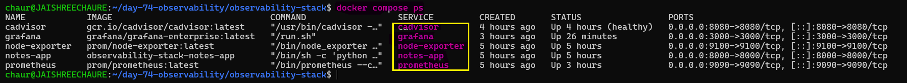

### 5. Stop the Stack

After completing the lab, stop and remove the containers and network:

```bash
docker compose down
```
This removes the containers and Compose network while keeping named volumes unless `-v` is explicitly used.

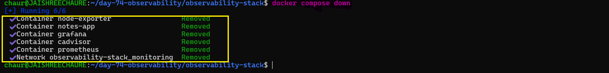 

---

## How Datasource Provisioning Works via YAML

Instead of configuring Grafana datasources manually through the UI, we define them as code and let Grafana load them automatically.

### 1. Create the Provisioning Directory Structure

```bash
mkdir -p grafana/provisioning/datasources
mkdir -p grafana/provisioning/dashboards
```
During the setup, the `grafana` directory was owned by `root`, so we fixed the permissions:

```bash
sudo chown -R $USER:$USER grafana
```
This allows the current user to create and manage the provisioning files.

### 2. Create the Datasource Configuration

Create:

```bash
grafana/provisioning/datasources/datasources.yml
```
Add:

```yaml
apiVersion: 1

datasources:
  - name: Prometheus
    type: prometheus
    access: proxy
    url: http://prometheus:9090
    isDefault: true
    editable: false
```
This tells Grafana to automatically create the Prometheus datasource when it starts.

- `url` → Prometheus service inside the Docker network
- `isDefault: true` → makes Prometheus the default datasource
- `editable: false` → prevents manual changes through the UI

### 3. Mount the Provisioning Directory

Update the Grafana service in `docker-compose.yml`:

```yaml
  grafana:
    image: grafana/grafana-enterprise:latest
    container_name: grafana
    ports:
      - "3000:3000"
    volumes:
      - grafana_data:/var/lib/grafana
      - ./grafana/provisioning:/etc/grafana/provisioning
    environment:
      - GF_SECURITY_ADMIN_USER=admin
      - GF_SECURITY_ADMIN_PASSWORD=admin123
    restart: unless-stopped
```
The bind mount makes the local provisioning files available inside Grafana at `/etc/grafana/provisioning`.

### How it works:

**`datasources.yml → mounted into Grafana → Grafana reads it → Prometheus datasource is created automatically`**.