# Day 76 -- OpenTelemetry and Alerting

## Task 1: Understand OpenTelemetry

### 1. What is OpenTelemetry (OTEL)?
- Vendor-neutral, open-source framework for generating, collecting, and exporting telemetry data: **metrics, logs, and traces**.
- Not a backend; it sends telemetry to backends such as Prometheus, Jaeger, Loki, and Datadog.

### 2. What is the OTEL Collector?
- Standalone service that **`receives, processes, and exports`** telemetry.
- **`Receivers`** -- accept telemetry (OTLP, Prometheus, Jaeger).
- **`Processors`** -- transform telemetry (batching, filtering, sampling).
- **`Exporters`** -- send telemetry to backends (Prometheus, debug, Jaeger).

### 3. What is OTLP?
- **`OpenTelemetry Protocol`** for transmitting telemetry data.
- Supports **`gRPC (4317)`** and **`HTTP (4318)`**.

### 4. What are Distributed Traces?
- A trace follows a request across multiple services.
- Each step is a **`span`**.
- Spans contain trace ID, span ID, parent span ID, timestamps, duration, and attributes.
- Example: `User Request -> API Gateway -> Auth Service -> Database`

---

## Task 2: Add the OpenTelemetry Collector

### Create the collector configuration directory:

```bash
mkdir -p otel-collector
```

### Create **`otel-collector/otel-collector-config.yml`**:

```yaml
receivers:
  otlp:
    protocols:
      grpc:
        endpoint: 0.0.0.0:4317
      http:
        endpoint: 0.0.0.0:4318

processors:
  batch:

exporters:
  prometheus:
    endpoint: "0.0.0.0:8889"
  debug:
    verbosity: detailed

service:
  pipelines:
    metrics:
      receivers: [otlp]
      processors: [batch]
      exporters: [prometheus]
    traces:
      receivers: [otlp]
      processors: [batch]
      exporters: [debug]
    logs:
      receivers: [otlp]
      processors: [batch]
      exporters: [debug]
```

### What this config does:

- **Receivers:** Accepts OTLP data via gRPC `(4317)` and HTTP `(4318)`
- **Processors:** Batches and processes telemetry before export.
- **Exporters:**
  - `Prometheus exporter` exposes metrics on `8889` (Prometheus scrapes this)
  - `Debug exporter` outputs traces/logs to the collector console.

### Add the collector to your **`docker-compose.yml`**:

```yaml
  otel-collector:
    image: otel/opentelemetry-collector-contrib:latest
    container_name: otel-collector
    ports:
      - "4317:4317"   # OTLP gRPC
      - "4318:4318"   # OTLP HTTP
      - "8889:8889"   # Prometheus exporter
    volumes:
      - ./otel-collector/otel-collector-config.yml:/etc/otelcol-contrib/config.yaml
    restart: unless-stopped
```
### Add the OTEL Collector as a Prometheus scrape target in **`prometheus.yml`**:

```yaml
  - job_name: "otel-collector"
    static_configs:
      - targets: ["otel-collector:8889"]
```
### Restart the stack:

```bash
docker compose up -d
docker compose ps otel-collector
```
The OTEL Collector starts successfully along with the observability stack.

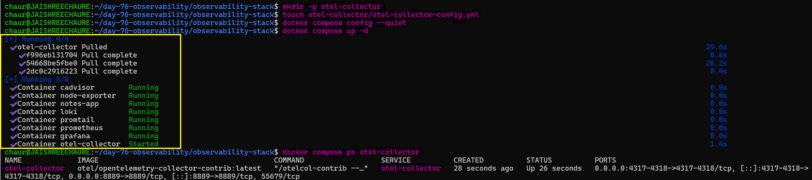 

### Verify the collector is running:

```bash
docker logs otel-collector 2>&1 | tail -5
```
The logs confirm that the OTLP gRPC/HTTP receivers and collector services are ready.

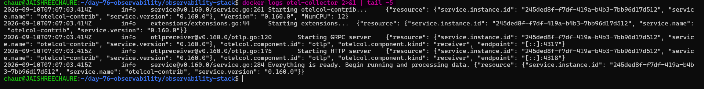

### Restart the otel-collector

```bash
docker compose restart otel-collector
docker compose ps otel-collector
```
The OTEL Collector restarts successfully and remains available for telemetry collection.

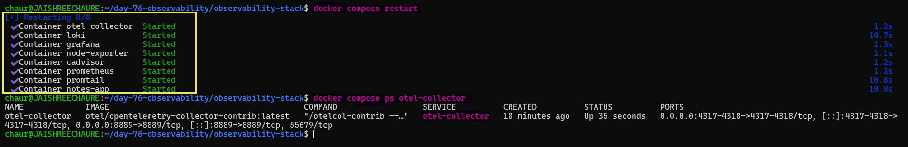 

### Verify the OTEL Collector in Prometheus:

Finally, verify the `OTEL Collector` is being scraped successfully by Prometheus.

Open: `http://localhost:9090`

**Status → Target Health → otel-collector should show `UP`**.

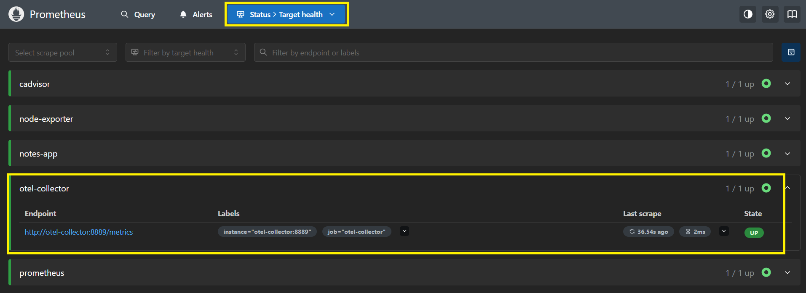

---

## Task 3: Send Test Traces to the Collector

### Send a sample OTLP trace using curl:

```bash
curl -X POST http://localhost:4318/v1/traces \
  -H "Content-Type: application/json" \
  -d '{
    "resourceSpans": [{
      "resource": {
        "attributes": [{
          "key": "service.name",
          "value": { "stringValue": "my-test-service" }
        }]
      },
      "scopeSpans": [{
        "spans": [{
          "traceId": "5b8efff798038103d269b633813fc60c",
          "spanId": "eee19b7ec3c1b174",
          "name": "test-span",
          "kind": 1,
          "startTimeUnixNano": "1544712660000000000",
          "endTimeUnixNano": "1544712661000000000",
          "attributes": [{
            "key": "http.method",
            "value": { "stringValue": "GET" }
          },
          {
            "key": "http.status_code",
            "value": { "intValue": "200" }
          }]
        }]
      }]
    }]
  }'
```
### Verify the trace in the collector logs:

```bash
docker logs otel-collector 2>&1 | grep -A 10 "test-span"
```
The collector debug exporter prints the received `test-span` details, confirming that the trace was successfully received.

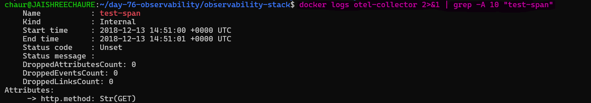

You should see the span details printed to the console. In a production setup, you would send these to a trace backend like Jaeger or Grafana Tempo for storage and visualization.

### Send an OTLP metric:

```bash
curl -X POST http://localhost:4318/v1/metrics \
  -H "Content-Type: application/json" \
  -d '{
    "resourceMetrics": [{
      "resource": {
        "attributes": [{
          "key": "service.name",
          "value": { "stringValue": "my-test-service" }
        }]
      },
      "scopeMetrics": [{
        "metrics": [{
          "name": "test_requests_total",
          "sum": {
            "dataPoints": [{
              "asInt": "42",
              "startTimeUnixNano": "1544712660000000000",
              "timeUnixNano": "1544712661000000000"
            }],
            "aggregationTemporality": 2,
            "isMonotonic": true
          }
        }]
      }]
    }]
  }'
```

### Verify the metric in Prometheus:

Open: `http://localhost:9090` and query:

```promql
test_requests_total
```
The metric should appear with the `my-test-service data` and a value of `42`.

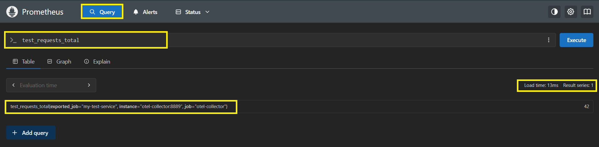

### The telemetry flow is: 

**your curl command -> OTEL Collector (OTLP receiver) -> Prometheus exporter -> Prometheus scraped**

This demonstrates how OpenTelemetry can receive telemetry through OTLP and forward it to different observability backends.

---

## Task 4: Set Up Prometheus Alerting Rules

Alerts notify you when something is wrong. Prometheus evaluates alerting rules and fires alerts when conditions are met.

### Create an alerting rules file **`alert-rules.yml`**:

```yaml
groups:
  - name: system-alerts
    rules:
      - alert: HighCPUUsage
        expr: 100 - (avg(rate(node_cpu_seconds_total{mode="idle"}[5m])) * 100) > 80
        for: 2m
        labels:
          severity: warning
        annotations:
          summary: "High CPU usage detected"
          description: "CPU usage has been above 80% for more than 2 minutes. Current value: {{ $value }}%"

      - alert: HighMemoryUsage
        expr: (1 - node_memory_MemAvailable_bytes / node_memory_MemTotal_bytes) * 100 > 85
        for: 2m
        labels:
          severity: warning
        annotations:
          summary: "High memory usage detected"
          description: "Memory usage is above 85%. Current value: {{ $value }}%"

      - alert: ContainerDown
        expr: absent(container_last_seen{name="notes-app"})
        for: 1m
        labels:
          severity: critical
        annotations:
          summary: "Container is down"
          description: "The notes-app container has not been seen for over 1 minute"

      - alert: TargetDown
        expr: up == 0
        for: 1m
        labels:
          severity: critical
        annotations:
          summary: "Scrape target is down"
          description: "{{ $labels.job }} target {{ $labels.instance }} is unreachable"

      - alert: HighDiskUsage
        expr: (1 - node_filesystem_avail_bytes{mountpoint="/"} / node_filesystem_size_bytes{mountpoint="/"}) * 100 > 90
        for: 5m
        labels:
          severity: critical
        annotations:
          summary: "Disk space running low"
          description: "Root filesystem usage is above 90%. Current value: {{ $value }}%"
```

### What each alert does:

- `expr` -- the PromQL condition that triggers the alert
- `for` -- how long the condition must be true before firing (avoids flapping)
- `labels` -- metadata for routing (severity: warning vs critical)
- `annotations` -- human-readable description

### Update **`prometheus.yml`** to load the rules:

```yaml
global:
  scrape_interval: 15s
  evaluation_interval: 15s

rule_files:
  - /etc/prometheus/alert-rules.yml

scrape_configs:
  - job_name: "prometheus"
    static_configs:
      - targets: ["localhost:9090"]

  - job_name: "node-exporter"
    static_configs:
      - targets: ["node-exporter:9100"]

  - job_name: "cadvisor"
    static_configs:
      - targets: ["cadvisor:8080"]

  - job_name: "otel-collector"
    static_configs:
      - targets: ["otel-collector:8889"]
```

### Mount the rules file in `docker-compose.yml` under the Prometheus service:

```yaml
  prometheus:
    image: prom/prometheus:latest
    container_name: prometheus
    ports:
      - "9090:9090"
    volumes:
      - ./prometheus.yml:/etc/prometheus/prometheus.yml
      - ./alert-rules.yml:/etc/prometheus/alert-rules.yml
      - prometheus_data:/prometheus
    command:
      - '--config.file=/etc/prometheus/prometheus.yml'
    restart: unless-stopped
```
### Restart Prometheus:

```bash
docker compose up -d prometheus
```
### Verify the alert rules:

Open `http://localhost:9090` → Status → Rule health.

All five alert rules should be loaded and show an `OK` rule health status.

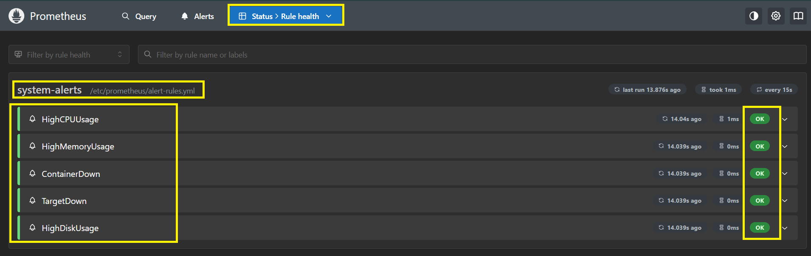

### Check the alert states:

Open `http://localhost:9090` → Alerts.

Initially, the configured alerts should be `INACTIVE` when their conditions are not met.

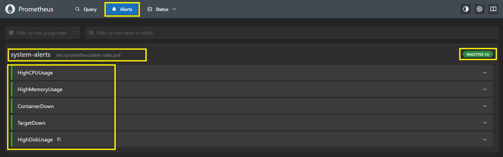 

### Test the alert lifecycle:

Stop the `notes-app` container and watch the `TargetDown` alert fire:
```bash
docker compose stop notes-app
```
The `TargetDown` condition becomes true and enters the `PENDING` state during its configured `1m` waiting period.

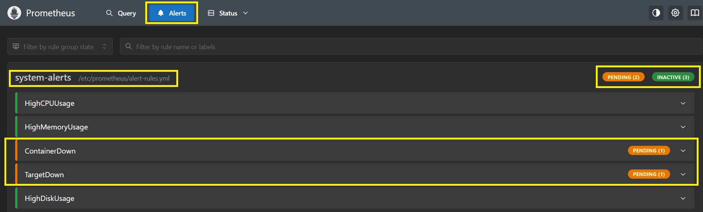 

After the for: `1m` duration is reached, the alert transitions to FIRING.

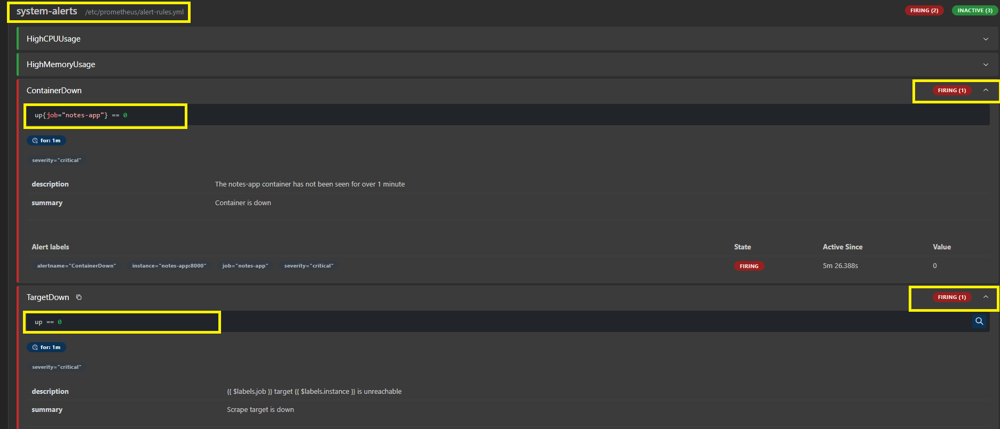

### Restore the application:

Start the `notes-app` container again:

```bash
docker compose start notes-app
docker compose ps notes-app
```
The container starts successfully and Prometheus can resume scraping the target.

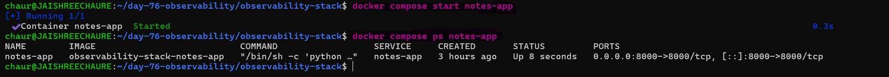

---

## Task 5: Set Up Grafana Alerts

Grafana can also evaluate alerts and send notifications to Slack, email, PagerDuty, and more.

Open: `http://localhost:3000`

1. **Create a contact point:**

   - Go to `Alerting > Contact points > Add contact point`
   - Name: "DevOps Team"
   - Integration: Choose email (or Slack webhook if you have one)
   - For email: just enter your email address
   - Save

2. **Create an alert rule in Grafana:**

   - Go to `Alerting > Alert rules > New alert rule`
   - Enter the alert name: `High Container Memory`.
   - Select **Prometheus** as the data source.
   - Add the query: `container_memory_usage_bytes{name="notes-app"} / 1024 / 1024`
   - Set the condition to **IS ABOVE `100`**. (fire if container uses more than 100MB)
   - Create/select the folder: `DevOps Alerts`.
   - Add label: `severity=warning`.
   - Create/select the evaluation group: `DevOps Evaluation`.
   - Set evaluation interval to **1m**.
   - Set pending period to **2m**.
   - Set the contact point to `DevOps Team`.
   - Add a summary describing the high container memory condition.
   - Save the alert rule.

3. **Create a notification policy:**

   - Go to `Alerting > Notification configuration > Notification policies`.
   - Edit the **Default policy**.
   - Set the **Default contact point** to `DevOps Team`.
   - Save the default policy.
   - Click **Add route** to create a nested notification policy.
   - Set the matcher: `severity=critical`.
   - Set the **Contact point / Route to**: `DevOps Team` (or a separate critical-alert contact point).
   - Save the nested policy.
   - Save/Update the notification policy tree.

4. **View alert state:**

   - Go to `Alerting > Alert rules`
   - Open the `High Container Memory` alert rule.
   - Verify the current alert state:
     - `Normal` — condition is not met.
     - `Pending` — condition is met but the 2-minute pending period has not completed.
     - `Firing` — condition has remained above 100 MB for 2 minutes.
   - Confirm the evaluation interval is `1m`, pending period is `2m`, severity is `warning`, and contact point is `DevOps Team`.

The Grafana alert rule is successfully created and its state can be monitored from the Alert rules page.

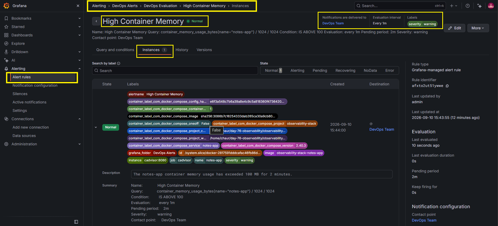

**Document:** What is the difference between Prometheus alerts and Grafana alerts? When would you use each?

**Prometheus Alerts vs Grafana Alerts**

**Prometheus Alerts**
- Defined in **`YAML rule files`** and evaluated using **`PromQL`**.
- Primarily designed for **`Prometheus metrics`**.
- Typically uses **`Alertmanager`** for notification routing.
- Ideal for **`system and infrastructure monitoring`** such as CPU, memory, latency, and error rates.
- Strong choice for **`scalable, production-grade metric alerting`**.

**Grafana Alerts**
- Created and managed through the **`Grafana UI/API`**.
- Can query **`multiple data sources`** such as Prometheus, Loki, and SQL databases.
- Provides built-in **`contact points and notification policies`**.
- Ideal for **`centralized, dashboard-driven, and cross-data-source alerting`**.
- Easier for **`visual configuration and quick alert setup`**.

**When to use each:**
- Use **`Prometheus Alerts`** for infrastructure and metric-based alerting close to the Prometheus monitoring stack.
- Use **`Grafana Alerts`** when you need centralized alerting across multiple data sources with flexible notification routing.

---

## Task 6: Review the Full Stack Architecture

Your observability stack now covers all three pillars. Map out what you have built:

### Full observability architecture:

```text
                    METRICS PIPELINE

[Node Exporter] -----> [Prometheus] -----> [Grafana]
                         ▲                    │
[cAdvisor] -------------┤                    └──> Dashboards
                         │
[OTEL Collector:8889] ---┘
                         │
                         └──> Alert Rules → Notifications


                    LOGS PIPELINE

[Docker Containers] -> [Promtail] -> [Loki] -> [Grafana]


                    TRACES PIPELINE

[curl / Application] -> [OTLP :4317/:4318]
                              │
                              ▼
                       [OTEL Collector]
                              │
                              └──> Debug Output
                                   Future: Jaeger / Tempo
```

### Services in the stack

| Service         | Port(s)        | Purpose                              |
|-----------------|----------------|--------------------------------------|
| Prometheus      | 9090           | Metrics storage and querying         |
| Node Exporter   | 9100           | Host system metrics                  |
| cAdvisor        | 8080           | Container metrics                    |
| Grafana         | 3000           | Visualization and alerting           |
| Loki            | 3100           | Log storage                          |
| Promtail       | 9080 (internal) | Log collection agent |
| OTEL Collector  | 4317/4318/8889 | Telemetry collection and export      |
| Notes App       | 8000           | Sample application                   |

### Verify all services are running:

```bash
docker compose ps
```
The output confirms that all 8 services are running as part of the observability stack.

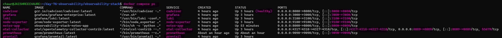 

### Stop and remove the stack:

```bash
docker compose down
```
This stops and removes the containers and the Compose network while keeping persistent volumes intact.

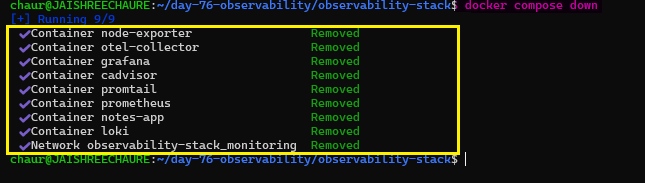

---

## OpenTelemetry Architecture

This architecture shows how the observability stack collects, stores, and visualizes **metrics, logs, and traces** across the system.

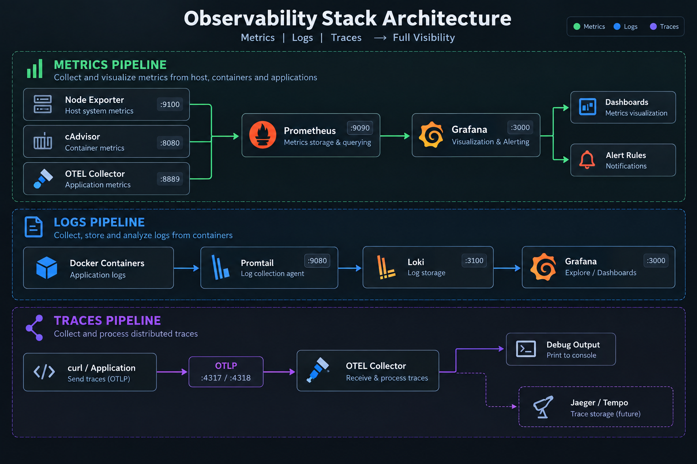