# Day 77 -- Observability Project: Full Stack with Docker Compose

## Setup -- EC2 + Docker Environment

Created an Ubuntu EC2 instance for the observability lab.

- **OS:** Ubuntu
- **Instance Type:** `m7i-flex.large`
- **Access:** SSH
- **HTTP:** Enabled in Security Group
- **Purpose:** Run the complete Docker-based observability stack

1. Update and Upgrade Ubuntu
```bash
sudo apt update
sudo apt upgrade -y
```
This ensures the server packages are up to date before installing Docker.

2. Install Docker & Docker Compose V2
```bash
sudo apt install docker.io docker-compose-v2 -y
```
Verify Docker & Compose V2:
```bash
docker --version
docker compose version
```
3. Add Current User to Docker Group
```bash
sudo usermod -aG docker $USER
```
Apply the group change: `newgrp docker`

Verify Docker works without `sudo`: `docker ps`

---

## Task 1: Clone and Launch the Reference Stack

Clone the reference repository and use it as the baseline for the observability stack. The required configurations were customized based on my work from Days 73–76, and the `notes-app` image built during Day 76 was reused for this lab.

```bash
git clone https://github.com/LondheShubham153/observability-for-devops.git
cd observability-for-devops
```
### 1 - Check the Project Structure:

Inspect the repository to understand the main application and observability components:

```bash
tree -I 'node_modules|build|staticfiles|__pycache__'
```
```text
observability-for-devops/
  docker-compose.yml                    # 8 services orchestrated together
  prometheus.yml                        # Prometheus scrape configuration
  alert-rules.yml                       # (you will add this)
  grafana/
    provisioning/
      datasources/datasources.yml       # Auto-provisioned: Prometheus + Loki
      dashboards/dashboards.yml         # Dashboard provisioning config
  loki/
    loki-config.yml                     # Loki storage and schema config
  promtail/
    promtail-config.yml                 # Docker log collection config
  otel-collector/
    otel-collector-config.yml           # OTLP receivers, processors, exporters
  notes-app/                            # Sample Django + React application
```
The repository contains the Docker Compose configuration, Prometheus, Grafana, Loki, Promtail, OpenTelemetry Collector, and the sample Notes application.

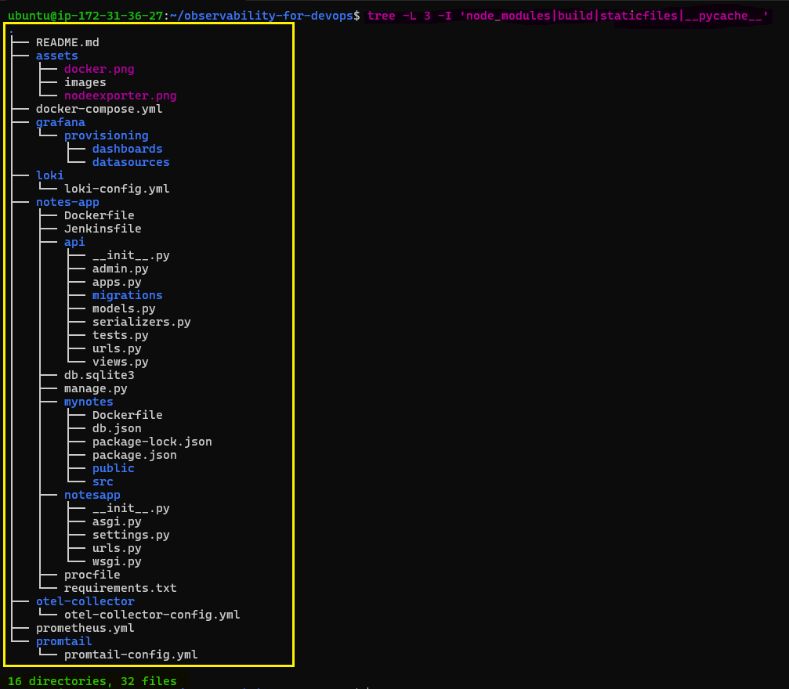 

> **Note:** The reference repository was cloned as the baseline. I applied the required configuration changes from Days 73–76 and reused the `notes-app` image built during Day 76.

### 2 - Validate and Launch the Stack

Pull the previously built `notes-app` image and validate the final Compose configuration:

```bash
docker compose pull notes-app  # pulled notes-app image from docker-hub
docker compose config --quiet
docker compose up -d
```
The reference stack was customized with the required changes from Days 73–76 before launching the complete observability environment.

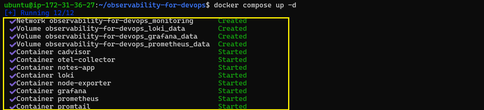

### 3 - Verify Running Containers

Check the status of all services:
```bash
docker compose ps
```
All 8 services should show as running:

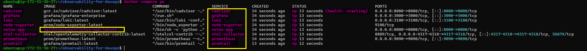

### 4 - Service Endpoints

| Service | Port | Purpose | Check |
|---------|------|---------|-------|
| Prometheus | `9090` | Metrics collection and storage | `http://localhost:9090` |
| Node Exporter | `9100` | Host/system metrics | `curl http://localhost:9100/metrics \| head -5` |
| cAdvisor | `8080` | Container metrics | `http://localhost:8080` |
| Grafana | `3000` | Metrics and logs visualization | `http://localhost:3000` |
| Loki | `3100` | Log storage | `curl http://localhost:3100/ready` |
| Promtail | `9080` | Docker log collection | Internal only |
| OTEL Collector | `4317/4318` | Telemetry ingestion | `docker logs otel-collector` |
| Notes App | `8000` | Sample application | `http://localhost:8000` |

### 5 - Access from Browser

Use the EC2 public IP from your local browser:

```text
http://<EC2-PUBLIC-IP>:9090   # Prometheus
http://<EC2-PUBLIC-IP>:3000   # Grafana
http://<EC2-PUBLIC-IP>:8080   # cAdvisor
http://<EC2-PUBLIC-IP>:8000   # Notes App
```

> **Note**: 

> Commands executed inside the EC2 instance can use `localhost`

> Browser access from your computer uses the `EC2 public IP`.

---

## Task 2: Validate the Metrics Pipeline

Verify that Prometheus is successfully scraping all observability targets.

### 1 - Check Prometheus Targets

To access Prometheus from my local browser, I allowed **TCP port `9090`** in the EC2 Security Group.

Open the Prometheus targets page:

```text
http://<EC2-PUBLIC-IP>:9090/targets
```
Verify all 4 scrape jobs are `UP`:

   - `prometheus` (self-monitoring)
   - `node-exporter` (host metrics)
   - `docker` / `cadvisor` (container metrics)
   - `otel-collector` (OTLP metrics)

The target health page confirms that all four metric sources are being scraped successfully.

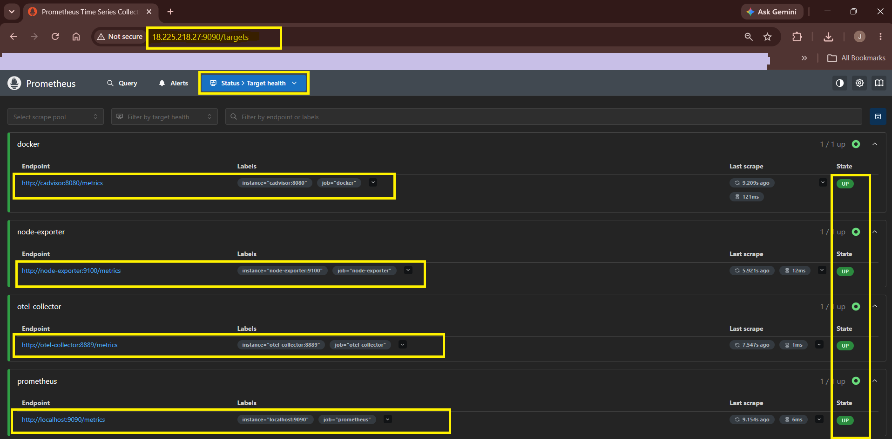 

### 2 - Run these validation queries:

**1. All targets are healthy**

Run the `up` query to confirm the health of every Prometheus target:

```promql
up
```
The query returns `1` for each healthy target.

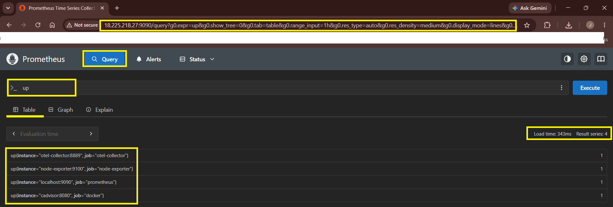

**2. Check Host CPU Usage**

Calculate the current host CPU utilization from Node Exporter metrics:

```promql
100 - (avg(rate(node_cpu_seconds_total{mode="idle"}[5m])) * 100)
```
The result represents the percentage of CPU currently being used.

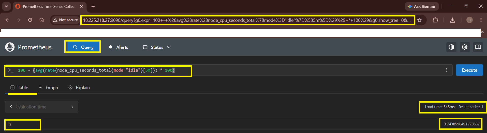

**3. Check Memory Usage**

Calculate host memory utilization:

```promql
(1 - node_memory_MemAvailable_bytes / node_memory_MemTotal_bytes) * 100
```
This shows the percentage of system memory currently in use.

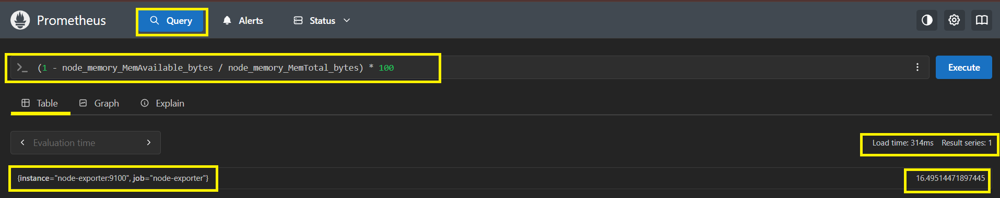

**4. Check Container CPU Usage**

Query CPU usage for each container reported by cAdvisor:

```promql
rate(container_cpu_usage_seconds_total{name!=""}[5m]) * 100
```
The result provides CPU usage for individual containers.

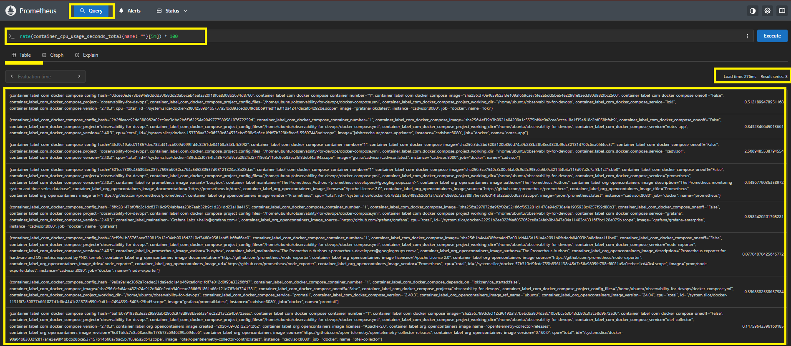

**5. Find the Top 3 Memory-Hungry Containers**

Identify the three containers currently using the most memory:

```promql
topk(3, container_memory_usage_bytes{name!=""})
```
This helps identify containers with the highest memory consumption.

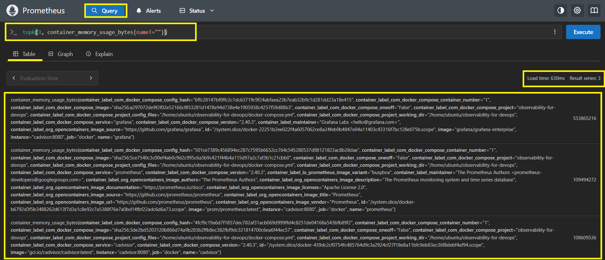

### 3 - Review the Prometheus Configuration

Compare the `prometheus.yml` from the reference repo with the one you built over days 73-76. Note the scrape jobs and intervals.

- **Both the reference repo and my configuration are the same:**
   - **Global settings:** `scrape_interval` and `evaluation_interval` are set to `15s` in both.
   - **Scrape jobs:** Both include the same jobs — `prometheus`, `docker` (cAdvisor), `node-exporter`, and `otel-collector`.

---

## Task 3: Validate the Logs Pipeline

Generate application traffic so that Docker produces logs for Promtail and Loki to collect:

```bash
for i in $(seq 1 50); do
  curl -s http://localhost:8000 > /dev/null
  curl -s http://localhost:8000/api/ > /dev/null
done
```
The requests generate application logs that can be collected and queried through the logging pipeline.

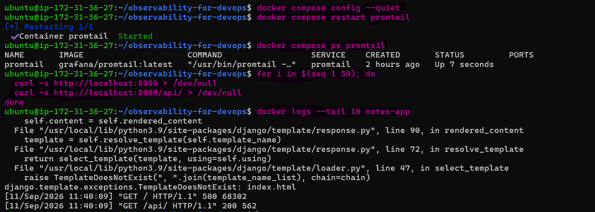

### 1 - Configure Grafana Access

To access Grafana from my local browser, I allowed TCP port `3000` in the EC2 Security Group.

Open Grafana 
    
```text
http://<EC2-PUBLIC-IP>:3000
```
Credentials:
 - **Username**: `admin`
 - **Password**: `admin`

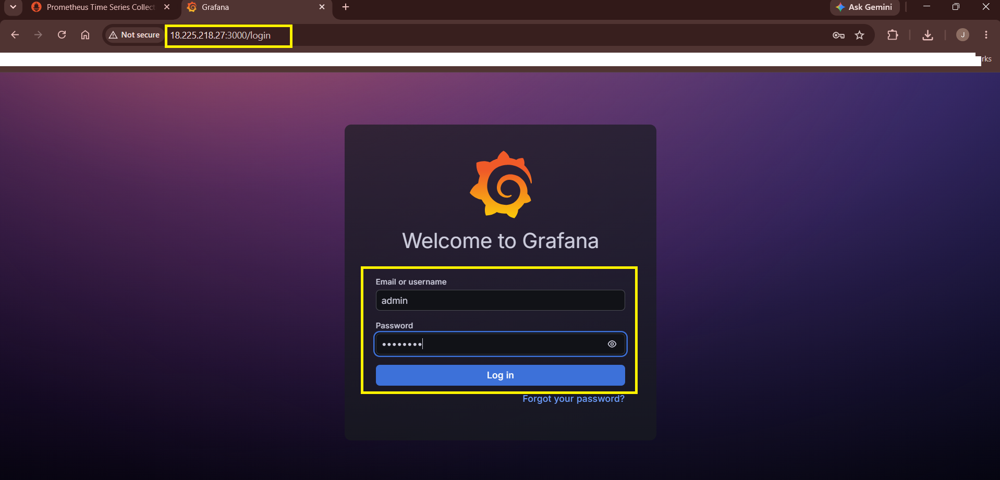

Go to **`Explore`** and select **`Loki`** as the datasource.

### 2 - Query All Container Logs

Run the following LogQL query to view logs from all Docker containers:

**1. Query All Container Logs**

```logql
{job="docker"}
```
This confirms that Loki is receiving logs collected by Promtail.

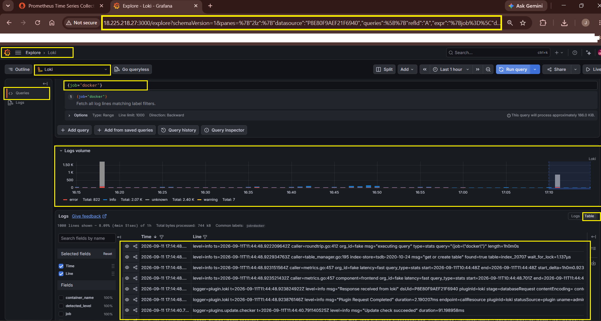 

**2. Query Only notes-app logs**

Filter the logs to only the `notes-app` container:

```logql
{container_name="notes-app"}
```
This confirms that container-specific labels are available in Loki.

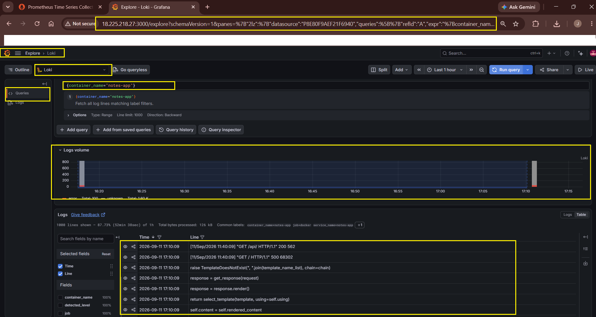 

**3. Find Errors Across All Containers**

Search all Docker logs for entries containing `error`:

```logql
{job="docker"} |= "error"
```
This helps identify application or container errors.

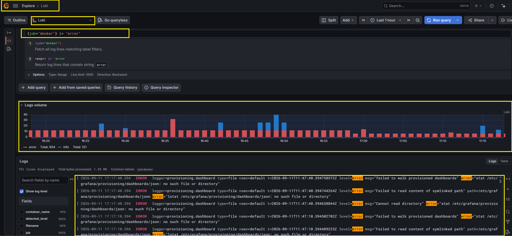 

**4. Filter HTTP Request Logs**

Search for `GET` requests from the Notes application:

```logql
{container_name="notes-app"} |= "GET"
```
This shows HTTP request activity generated by the application.

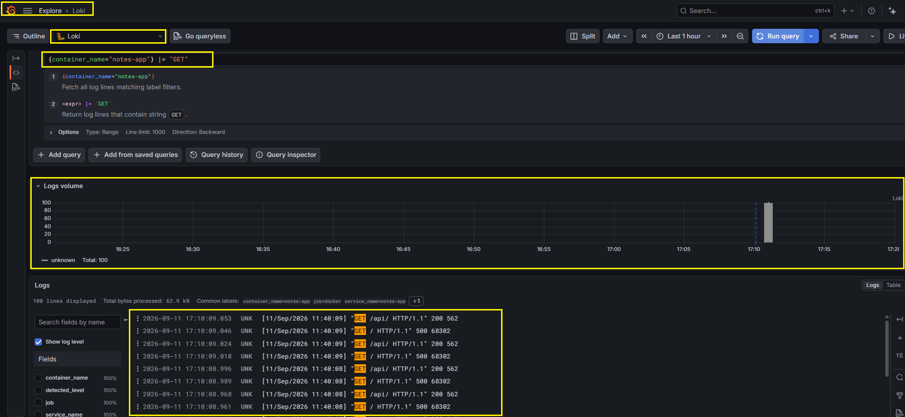 

**5. Check Log Rate per Container**

Calculate the rate of log lines generated by each container:

```logql
sum by (container_name) (rate({job="docker"}[5m]))
```
This shows the log volume generated by individual containers over the last 5 minutes.

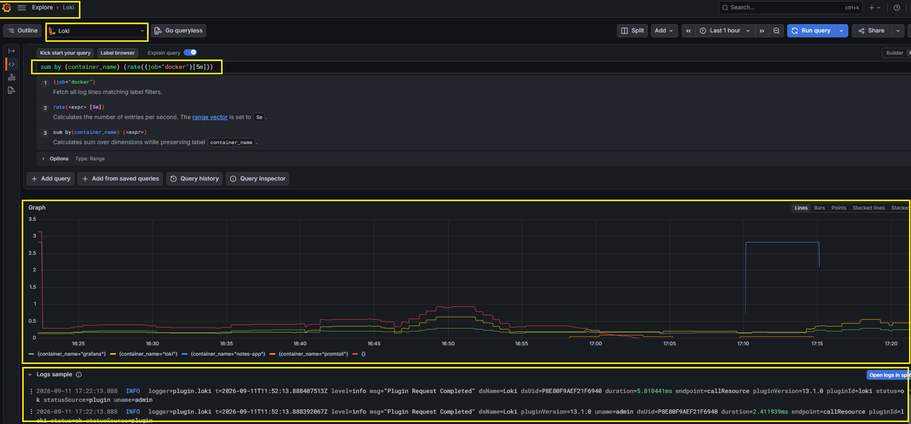

**6. Check Promtail Targets**

Check which Docker log files Promtail is discovering and monitoring:

```bash
curl -s http://localhost:9080/targets | head -30
```
The Promtail targets confirm that Docker containers are being discovered successfully.

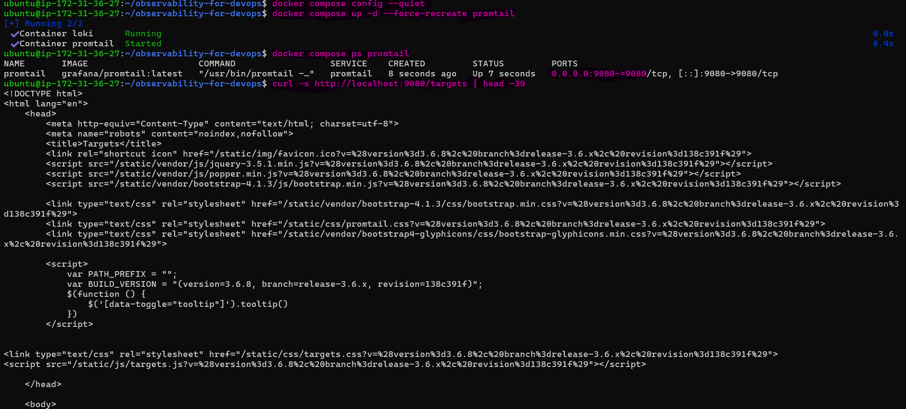

### 3 - Compare Promtail Configuration

Compare `promtail/promtail-config.yml` from the reference repository with the configuration built during Day 75.

- **Key differences in my configuration:**
  - Replaced `static_configs` with `docker_sd_configs` to automatically discover Docker containers and collect container-specific labels.
  - Added Docker container relabeling for `container_name`.
  - Added the Docker log path as `__path__` for log collection.

---

## Task 4: Validate the Traces Pipeline

Send a sample OTLP trace containing an HTTP request and database query to the OpenTelemetry Collector:

```bash
curl -X POST http://localhost:4318/v1/traces \
  -H "Content-Type: application/json" \
  -d '{
    "resourceSpans": [{
      "resource": {
        "attributes": [{
          "key": "service.name",
          "value": { "stringValue": "notes-app" }
        }]
      },
      "scopeSpans": [{
        "spans": [{
          "traceId": "aaaabbbbccccdddd1111222233334444",
          "spanId": "1111222233334444",
          "name": "GET /api/notes",
          "kind": 2,
          "startTimeUnixNano": "1700000000000000000",
          "endTimeUnixNano": "1700000000150000000",
          "attributes": [{
            "key": "http.method",
            "value": { "stringValue": "GET" }
          },
          {
            "key": "http.route",
            "value": { "stringValue": "/api/notes" }
          },
          {
            "key": "http.status_code",
            "value": { "intValue": "200" }
          }],
          "status": { "code": 1 }
        },
        {
          "traceId": "aaaabbbbccccdddd1111222233334444",
          "spanId": "5555666677778888",
          "parentSpanId": "1111222233334444",
          "name": "SELECT notes FROM database",
          "kind": 3,
          "startTimeUnixNano": "1700000000020000000",
          "endTimeUnixNano": "1700000000120000000",
          "attributes": [{
            "key": "db.system",
            "value": { "stringValue": "sqlite" }
          },
          {
            "key": "db.statement",
            "value": { "stringValue": "SELECT * FROM notes" }
          }]
        }]
      }]
    }]
  }'
```
The request returns successfully and the OTEL Collector receives the two-span trace.

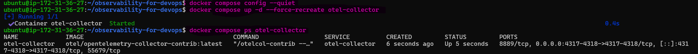 

### 1 - Check OTEL Trace Output

Search the collector logs for the HTTP span:

```bash
docker logs otel-collector 2>&1 | grep -A 20 "GET /api/notes"
```
The output shows the HTTP span and its attributes, followed by the database span with the parent-child relationship and timing information.

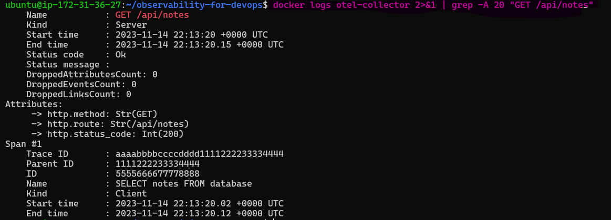

### 2 - Compare OTEL Collector Configuration

Compare `otel-collector/otel-collector-config.yml` from the reference repository with the configuration built during Day 76

- **Key difference:** 
  - The reference configuration used `verbosity: basic`, while my Day 76 configuration already used `verbosity: detailed`.
  - `verbosity: detailed` provides the detailed span information required for validation.

---

## Task 5: Build a Unified "Production Overview" Dashboard

Create a single Grafana dashboard to monitor system health, containers, application logs, and service telemetry.

### 1 - Create Dashboard

Go to **`Dashboards > New Dashboard. Add these panels`**:

**Row 1 -- System Health (Node Exporter + Prometheus):**

| Panel | Type | Query |
|-------|------|-------|
| CPU Usage | Gauge | `100 - (avg(rate(node_cpu_seconds_total{mode="idle"}[5m])) * 100)` |
| Memory Usage | Gauge | `(1 - node_memory_MemAvailable_bytes / node_memory_MemTotal_bytes) * 100` |
| Disk Usage | Gauge | `(1 - node_filesystem_avail_bytes{mountpoint="/"} / node_filesystem_size_bytes{mountpoint="/"}) * 100` |
| Targets Up | Stat | `sum(up)` / `count(up)` |

**Row 2 -- Container Metrics (cAdvisor):**

| Panel | Type | Query |
|-------|------|-------|
| Container CPU | Time series | `rate(container_cpu_usage_seconds_total{name!=""}[5m]) * 100` (legend: `{{name}}`) |
| Container Memory | Bar chart | `container_memory_usage_bytes{name!=""} / 1024 / 1024` (legend: `{{name}}`) |
| Container Count | Stat | `count(container_last_seen{name!=""})` |

**Row 3 -- Application Logs (Loki):**

| Panel | Type | Query (Loki datasource) |
|-------|------|-------|
| App Logs | Logs | `{container_name="notes-app"}` |
| Error Rate | Time series | `sum(rate({job="docker"} \|= "error" [5m]))` |
| Log Volume | Time series | `sum by (container_name) (rate({job="docker"}[5m]))` |

**Row 4 -- Service Overview:**

| Panel | Type | Query |
|-------|------|-------|
| Prometheus Scrape Duration | Time series | `prometheus_target_interval_length_seconds{quantile="0.99"}` |
| OTEL Metrics Received | Stat | `otelcol_receiver_accepted_metric_points` (if available) |

### 2 - Configure Dashboard

Set the dashboard name:

```text
Production Overview -- Observability Stack
```
Set the dashboard time range to "Last 30 minutes" and enable auto-refresh (every 10s).

The completed dashboard provides a unified view of system health, container metrics, application logs, and service-level telemetry.

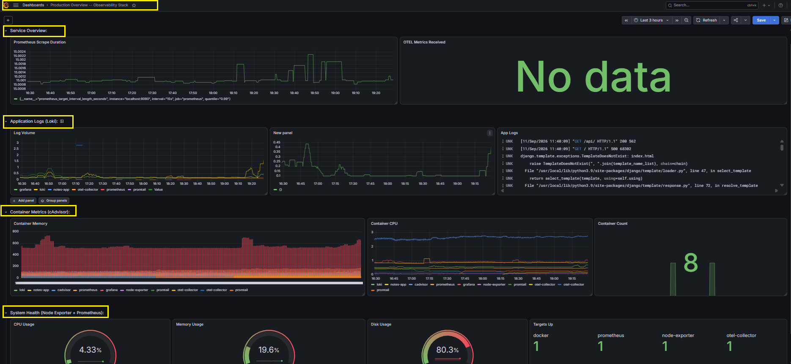 

---

## Task 6: Compare Your Stack with the Reference and Document

Compare the configurations built during Days 73–76 with the reference repository and document the key differences.

### 1 - Configuration Comparison

| Component | Your Version | Reference Repo | Focus |
|-----------|---------------|----------------|-------|
| `prometheus.yml` | Day 73–74 | Root directory | Scrape jobs and intervals |
| `loki-config.yml` | Day 75 | `loki/` directory | Storage configuration |
| `promtail-config.yml` | Day 75 | `promtail/` directory | Docker discovery and scrape configuration |
| `otel-collector-config.yml` | Day 76 | `otel-collector/` directory | Receivers, processors and pipelines |
| `datasources.yml` | Day 74 | `grafana/provisioning/` | Prometheus and Loki datasources |
| `docker-compose.yml` | Days 73–76 | Root directory | 8-service observability stack |

### 2 - Learning Progression

Map each observability concept to the day it was implemented:

| Day | What You Built |
|-----|----------------|
| 73 | Prometheus, PromQL and metrics fundamentals |
| 74 | Node Exporter, cAdvisor and Grafana dashboards |
| 75 | Loki, Promtail, LogQL and log-metric correlation |
| 76 | OTEL Collector, traces and alerting |
| 77 | Full-stack integration and unified dashboard |

### 3 - Production Improvements

For a production deployment, the following could be added:

- Alertmanager for Slack/PagerDuty alert routing
- Grafana Tempo for trace storage
- HTTPS/TLS for exposed endpoints
- Authentication and access control
- Log retention and storage limits
- High availability for Prometheus and Loki

### 4 - Self-Managed vs Managed Observability

| Self-Managed Stack | Managed Solutions |
|--------------------|-------------------|
| More complex setup | Easier setup |
| Lower infrastructure cost at scale | Higher service cost |
| Full control | Less infrastructure control |
| Self-managed operations | Fully managed |
| Highly customizable | All-in-one platform |

### 5 - Clean Up the Stack

After completing the lab, remove the containers, network and persistent volumes:

```bash
docker compose down -v
```
Verify that no Compose containers remain:

```bash
docker compose ps
```
The empty output confirms that the stack has been successfully cleaned up.

> **Note:** The -v flag removes the Prometheus, Grafana and Loki volumes, so use it only after completing the lab.

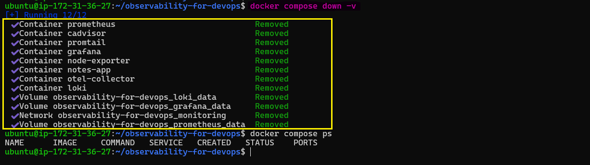

### 6 - EC2 Security Group

For browser-based validation, I configured the required inbound ports in the EC2 Security Group:

- `9090` — Prometheus
- `3000` — Grafana
- `9080` — Promtail target validation
- `80` — HTTP
- `22` — SSH

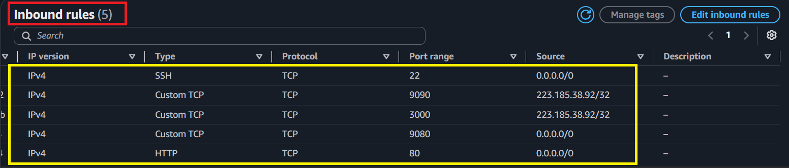

---

## Architecture Overview

The final architecture shows how all 8 services work together across the metrics, logs, and traces pipelines.

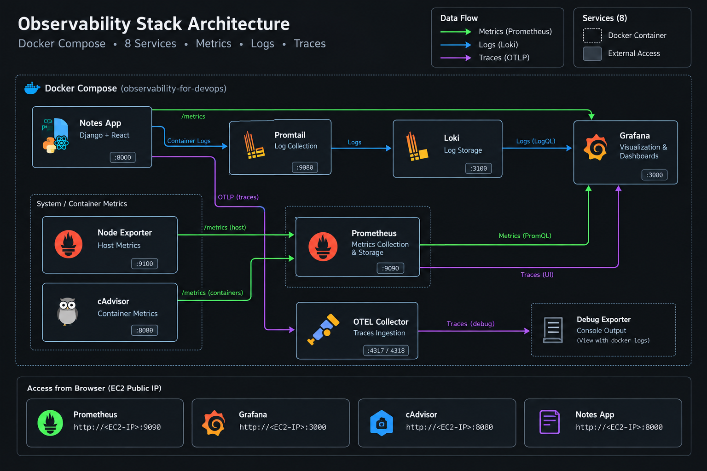