# Day 78 -- Introduction to Helm and Chart Basics

## Task 1: Understand Helm Concepts

Research and write notes on:

1. **What is Helm?**
   - A package manager for Kubernetes (like apt for Ubuntu or yum for RHEL)
   - Packages Kubernetes manifests into reusable, versioned units called **charts**
   - Supports templating -- one chart, many environments

2. **Core concepts:**
   - **Chart** -- a collection of files that describe a set of Kubernetes resources (Deployment + Service + ConfigMap + Secret = one chart)
   - **Release** -- a running instance of a chart in a cluster. You can install the same chart multiple times with different release names
   - **Repository** -- a place where charts are stored and shared (like DockerHub for images)
   - **Values** -- configuration that customizes a chart for each deployment (replicas, image tag, resource limits)

3. **Why Helm over raw manifests?**
   - Look at the AI-BankApp's `k8s/` directory -- 12 separate YAML files. To change the image tag, you edit `bankapp-deployment.yml`. To switch environments, you manually update ConfigMaps and Secrets. Helm solves this:
   - Templating: one chart serves dev, staging, and prod with different values
   - Versioning: charts have version numbers, you can rollback to previous versions
   - Dependencies: a chart can depend on other charts (your app chart depends on a MySQL chart)
   - Community: thousands of pre-built charts for common software (MySQL, Redis, Prometheus, ArgoCD)

---

## Task 2: Install Helm and Explore the AI-BankApp

You need a running Kubernetes cluster. For this lab, **Kind** is recommended.

- **Kind** (recommended for this block): Use the AI-BankApp's Kind config
- **Minikube**: `minikube start`
- **Docker Desktop Kubernetes**: enable in settings

**1. Set up a Kind cluster using the AI-BankApp's config:**
```bash
git clone -b feat/gitops https://github.com/TrainWithShubham/AI-BankApp-DevOps.git
cd AI-BankApp-DevOps
```
The AI-BankApp repository is cloned and ready for the Kind cluster setup.

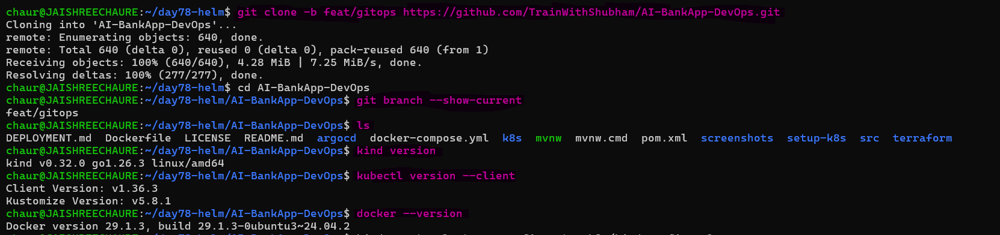 

**2. Create the Kind Cluster**
```bash
kind create cluster --config setup-k8s/kind-config.yml
```
The Kind cluster is ready with 1 control-plane and 2 worker nodes.

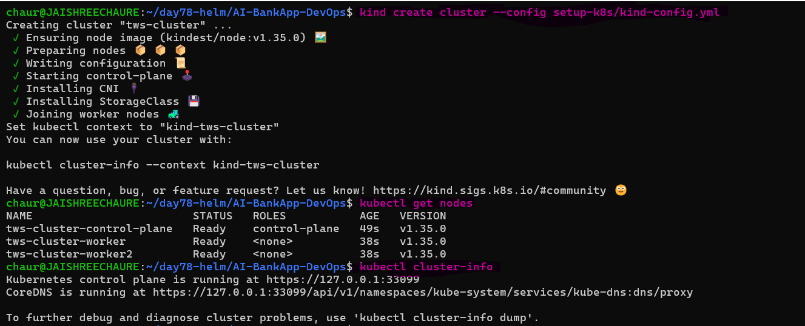 

**3. Install Helm:**

Install Helm using the appropriate method for your system:

```bash
# macOS
brew install helm

# Linux (script)
curl https://raw.githubusercontent.com/helm/helm/main/scripts/get-helm-3 | bash

# Verify the installation
helm version
```
Helm is installed successfully and the client version is verified.

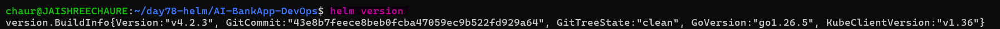

**4. Verify Helm and Kubernetes**

Confirm that `kubectl` can access the cluster and Helm can list releases:

```bash
kubectl cluster-info
helm list
```
The Kubernetes cluster is reachable and Helm is ready to manage releases.

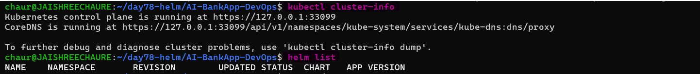 

**5. Explore the raw manifests you will eventually replace with Helm:**

These raw manifests are the resources that will later be managed with Helm:

```bash
ls k8s/
```
```
bankapp-deployment.yml   configmap.yml   gateway.yml   mysql-deployment.yml
namespace.yml   ollama-deployment.yml   pv.yml   pvc.yml   secrets.yml
service.yml   hpa.yml   cert-manager.yml
```
The AI-BankApp contains 12 raw Kubernetes manifests covering its application and supporting resources.

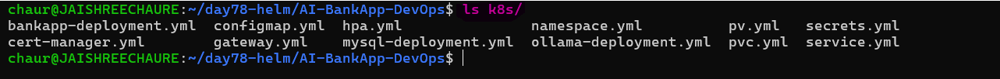

12 files -- Deployments, Services, ConfigMaps, Secrets, PVCs, HPA, and more. All hardcoded values. On Day 79, you will convert these into a Helm chart.

---

## Task 3: Deploy MySQL Using a Helm Chart

The AI-BankApp needs MySQL. Instead of applying raw YAML like `k8s/mysql-deployment.yml`, deploy MySQL using a Helm chart.

> **For this lab:** We use `stable/mysql` from the legacy Helm stable repository. It is deprecated and suitable only for learning Helm concepts, not production workloads.

**1. Add the Helm chart repository:**

```bash
helm repo add stable https://charts.helm.sh/stable
helm repo update
```
The legacy `stable` repository is added and updated successfully.

**2. Search and inspect the MySQL chart:**

```bash
helm search repo stable/mysql
helm show chart stable/mysql
```
The available MySQL chart is `stable/mysql` version `1.6.9`, using MySQL `5.7.30`.

**We use the legacy chart here because it is freely accessible and lets us practice Helm installation, configuration, upgrades, and rollbacks.**

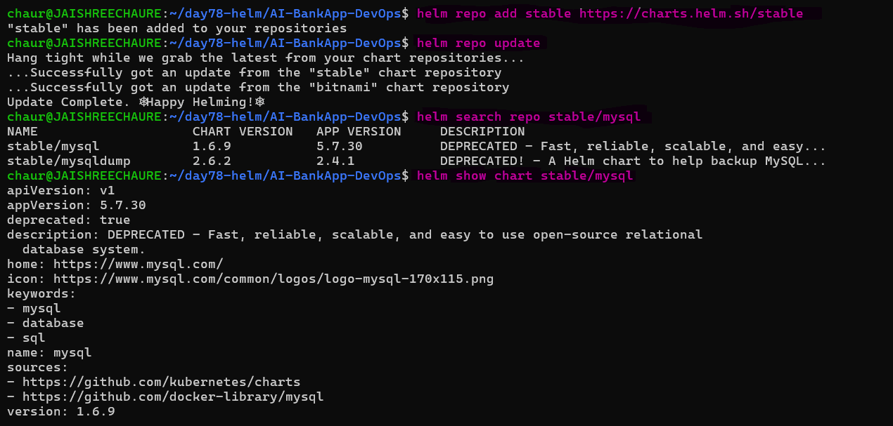

**3. Deploy MySQL with the required configuration:**

We use `--set` to configure the MySQL password, database, resources, and persistent storage directly during installation.

```bash
helm install bankapp-mysql stable/mysql \
  --set mysqlRootPassword=Test@123 \
  --set mysqlDatabase=bankappdb \
  --set resources.requests.memory=256Mi \
  --set resources.requests.cpu=250m \
  --set resources.limits.memory=512Mi \
  --set resources.limits.cpu=500m \
  --set persistence.size=5Gi
```
Helm creates the MySQL release and its Kubernetes resources from the chart configuration.

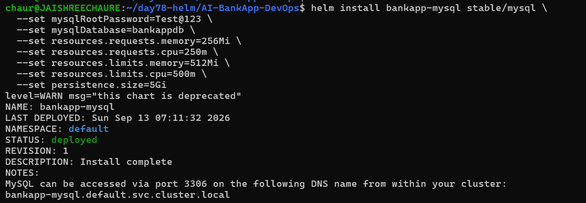

Compared with the raw-manifest approach, where MySQL configuration is spread across `mysql-deployment.yml`, `secrets.yml`, `pvc.yml`, `pv.yml`, and `service.yml`, Helm manages these resources through a single chart and its values.

**4. Verify the Helm release and Kubernetes resources:**

```bash
helm list
kubectl get all -l app=bankapp-mysql
kubectl get pvc -l app=bankapp-mysql
kubectl get secret -l app=bankapp-mysql
```
The Helm release is deployed, the MySQL pod is running, the PVC is bound with 5Gi storage, and the required Secret is created.

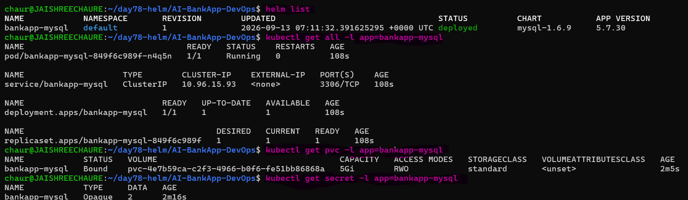 

**5. Verify the MySQL database:**

Use the running MySQL pod to connect as root and list the databases:

```bash
kubectl exec -it pod/bankapp-mysql-849f6c989f-n4q5n -- mysql -uroot -pTest@123 -e "SHOW DATABASES;"
```
The MySQL server is running successfully and `bankappdb` was created as expected.

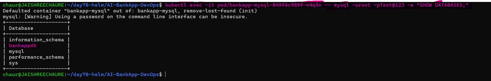

> **What we used:** `stable/mysql` chart + `--set` overrides for database configuration, resource requests/limits, and 5Gi persistent storage.

Helm replaced multiple manually managed Kubernetes manifests with a reusable chart-based deployment and gave us a Helm release that can be upgraded, rolled back, and uninstalled.

---

## Task 4: Customize a Deployment with Values Files

`--set` works for quick overrides, but real projects use values files.

Create `mysql-values.yaml`:
```yaml
mysqlRootPassword: Test@123
mysqlDatabase: bankappdb
resources:
  limits:
    cpu: 500m
    memory: 512Mi
  requests:
    cpu: 250m
    memory: 256Mi
persistence:
  size: 5Gi
  storageClass: ""
metrics:
  enabled: true
  serviceMonitor:
    enabled: false
```
Deploy with the values file:
```bash
helm install bankapp-mysql-v2 stable/mysql -f mysql-values.yaml
```
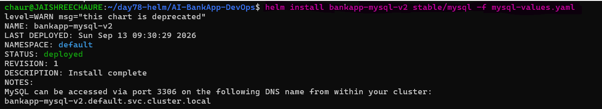

**To see all configurable values for a chart:**
```bash
helm show values stable/mysql | head -80
```
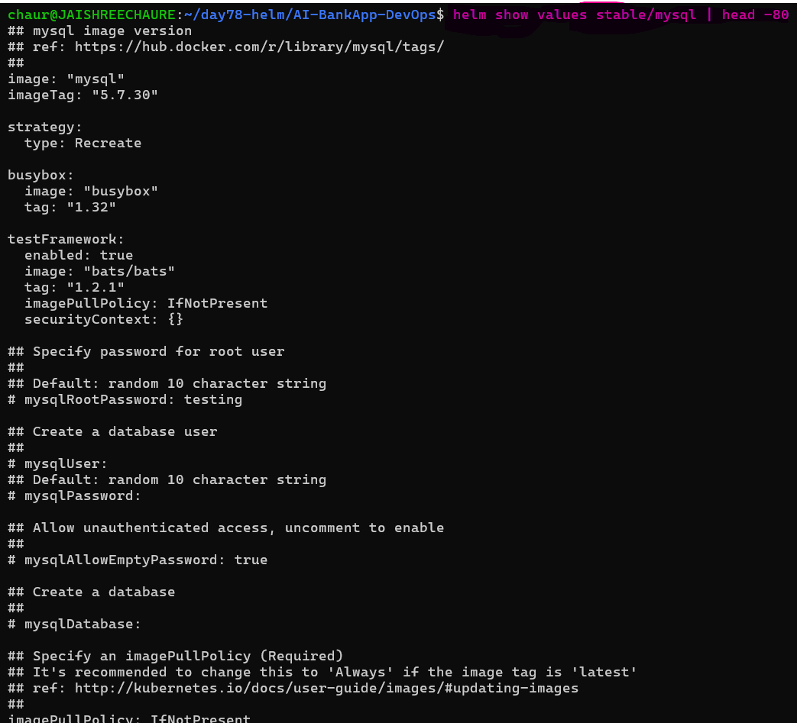 

This is your reference for every knob you can turn. Notice how the chart supports metrics, replication, custom init scripts, and dozens more options -- all through values.

**Clean up the second release:**
```bash
helm uninstall bankapp-mysql-v2
```
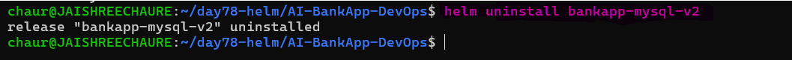

---

## Task 5: Manage Releases -- Upgrade and Rollback

Helm tracks every change to a release as a **revision**, making upgrades and rollbacks easier to manage.

**1. Upgrade MySQL to enable metrics:**

Enable MySQL metrics while reusing the existing release values:

```bash
helm upgrade bankapp-mysql stable/mysql \
  --set mysqlRootPassword=Test@123 \
  --set mysqlDatabase=bankappdb \
  --set metrics.enabled=true \
  --reuse-values
```
The release is upgraded successfully from revision 1 to revision 2 with metrics enabled.

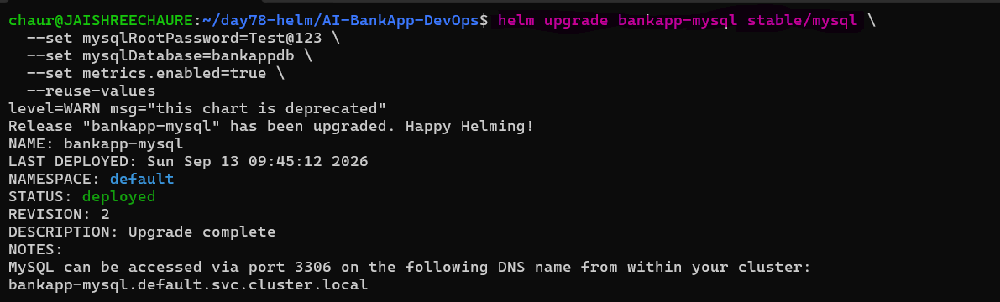 

**2. Check the revision history:**

```bash
helm history bankapp-mysql
```
Revision 1 is now superseded, while revision 2 is the currently deployed release.

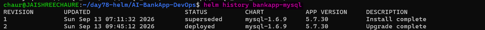

**3. Rollback to the previous version:**
```bash
helm rollback bankapp-mysql 1
```
Helm restores the configuration from revision 1 and creates a new revision instead of deleting the release history.

Check history again:
```bash
helm history bankapp-mysql
```
Revision 3 is created and deployed as the rollback to revision 1.

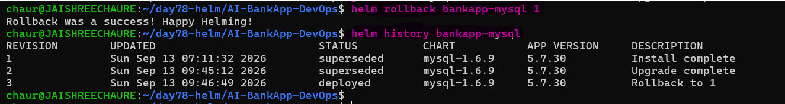

Revision 3 appears -- a rollback to revision 1.

> **Helm advantage:** With `kubectl apply`, there is no built-in release rollback. You would typically revert the manifest in Git or re-apply an older version. Helm provides `helm rollback` as part of its release management.

---

## Task 6: Explore a Chart's Structure

Before building the AI-BankApp Helm chart on Day 79, explore the structure of a real Helm chart.

**1. Pull the MySQL chart locally:**

We pull the same `stable/mysql` chart used in the previous tasks:

```bash
helm pull stable/mysql --untar
ls mysql/
```
This downloads the `stable/mysql` chart into a local `mysql/` directory.

**2. Explore the chart structure**

Run:

```bash
find mysql -maxdepth 2 -type f | sort
```
This lets us see the chart's metadata, default values, templates, and supporting files.

The exact files may vary because `stable/mysql` is a legacy chart, but the key Helm chart structure is:

```text
mysql/
├── Chart.yaml
├── values.yaml
└── templates/
```
- `Chart.yaml` → Chart metadata
- `values.yaml` → Default configuration values
- `templates/` → Kubernetes manifest templates

**3. Inspect Chart.yaml**

```bash
cat mysql/Chart.yaml
```
For the `stable/mysql` chart used in this lab:

```text
Chart version → 1.6.9
App version   → 5.7.30
```
**4. Inspect `values.yaml`**

Instead of printing the entire file, inspect the beginning:

```bash
head -100 mysql/values.yaml
```
You can also focus on the values used in this lab:

```bash
grep -nE "mysqlRootPassword|mysqlDatabase|resources:|persistence:|metrics:" mysql/values.yaml
```
These values allow the chart to be configured without editing the Kubernetes templates directly.

**5. Explore the templates**

First list the available template files:

```bash
find mysql/templates -type f | sort
```
Then inspect the relevant template files shown by the command above.

For example:

```bash
cat mysql/templates/deployment.yaml
cat mysql/templates/service.yaml
cat mysql/templates/secrets.yaml
```
> If a particular filename does not exist in your extracted chart, use the actual filename returned by `find mysql/templates -type f | sort.`

Look for Helm expressions such as:
```yaml
{{ .Values.someValue }}
```
These expressions allow values from `values.yaml`, `-f`, or `--set` to be inserted into Kubernetes manifests.

**6. Prove it with `helm template`**

Run:

```bash
helm template bankapp-mysql stable/mysql
```
Then render it using the custom values created in Task 4:

```bash
helm template bankapp-mysql stable/mysql -f mysql-values.yaml
```
Helm converts the chart templates and values into standard Kubernetes manifests.

This demonstrates the core Helm flow:

```text
values.yaml / -f / --set
          ↓
      .Values.*
          ↓
   Helm templates
          ↓
Rendered Kubernetes YAML
```

**7. Now compare the Helm chart approach to the AI-BankApp's raw manifests:**

| Aspect         | AI-BankApp Raw YAML       | Helm Chart               |
| -------------- | ------------------------- | ------------------------- |
| Configuration  | Hardcoded across files    | Managed through values    |
| Secrets        | Manually defined          | Chart-managed             |
| Storage        | Manually configured       | Configurable through values |
| Replicas       | Hardcoded                 | Configurable              |
| Metrics        | Manual configuration      | `metrics.enabled`         |
| Rollback       | Manual/Git revert         | `helm rollback`           |
| Reusability    | Limited                   | Reusable across environments |

Helm separates configuration from templates, making Kubernetes deployments easier to customize, reuse, upgrade, and roll back.

**Document:** What is the difference between `version` and `appVersion` in Chart.yaml?

- **`version` (Chart Version)**
  - Version of the Helm chart itself.
  - Changes when chart templates, configuration, or packaging changes.

- **`appVersion` (Application Version)**
  - Version of the application deployed by the chart.
  - Usually corresponds to the application/container image version

**8. Clean up:**

Remove the Helm release and local chart:

```bash
helm uninstall bankapp-mysql
rm -rf mysql/
```
The MySQL release and locally extracted chart are removed after completing the exploration.

---

## Why AI-BankApp's Raw YAML Files Are Better as a Helm Chart

### Problem with Raw YAML

- Configuration is hardcoded across multiple files.
- Environment-specific changes require manual edits.
- Password and resource changes require YAML modifications.
- No built-in release rollback.
- Multiple manifests must be managed separately.
- Reusing the same configuration across environments is difficult.

### Why Helm Helps

- One chart can manage the complete application.
- Configuration is separated into values.
- Different environments can use different values files.
- Releases can be upgraded and rolled back.
- Charts are reusable and shareable.
- Templates eliminate repeated Kubernetes YAML.

**This is the foundation for Day 79, where the AI-BankApp's raw Kubernetes manifests will be converted into a reusable Helm chart.**