# Day 79 -- Creating a Custom Helm Chart for AI-BankApp

## Task 1: Scaffold the Chart and Study the Raw Manifests

Understand the existing Kubernetes architecture first, then create a clean Helm chart that will replace the hardcoded manifests.

**Make sure you have the AI-BankApp repo cloned:**

```bash
cd AI-BankApp-DevOps
```
**Step 1. - Study the raw manifests you are converting:**

Before creating the Helm chart, inspect the original Kubernetes resources:

```bash
ls k8s/
```
The existing `k8s/` directory contains the application's Deployments, Services, storage, configuration, HPA, Gateway, and TLS resources.

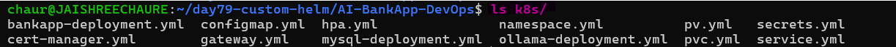 

Map each file to what it does:

| File | Purpose |
|------|---------|
| `namespace.yml` | Creates `bankapp` namespace |
| `configmap.yml` | MySQL host, port, database, Ollama URL |
| `secrets.yml` | MySQL credentials (base64 encoded) |
| `pv.yml` | StorageClass (gp3 via EBS CSI) |
| `pvc.yml` | PVCs for MySQL (5Gi) and Ollama (10Gi) |
| `bankapp-deployment.yml` | BankApp with init containers, probes, envFrom |
| `mysql-deployment.yml` | MySQL with EBS volume mount, probes |
| `ollama-deployment.yml` | Ollama with postStart model pull, probes |
| `service.yml` | ClusterIP services for all 3 components |
| `hpa.yml` | HPA for BankApp (2-4 replicas, 70% CPU) |
| `gateway.yml` | Envoy Gateway + HTTPRoute + TLS |
| `cert-manager.yml` | Let's Encrypt ClusterIssuer |

**Step 2 - Create the Helm chart**

Create a dedicated directory for the Helm chart:

```bash
mkdir helm-chart && cd helm-chart
```
Scaffold the chart:

```bash
helm create bankapp
```
Remove the default Kubernetes templates because we will build the chart from the application's existing manifests:

```bash
rm -rf bankapp/templates/*.yaml bankapp/templates/tests/
find bankapp -maxdepth 2 -type f | sort 
```
Keep `_helpers.tpl` and `NOTES.txt` -- you will customize them.

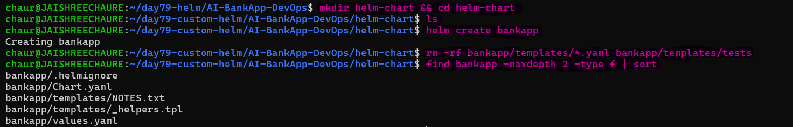

> `helm create` gives us the standard Helm structure. Removing the default templates avoids carrying unnecessary example resources and lets us convert the actual AI-BankApp architecture into our own templates.

---

## Task 2: Define Chart.yaml and values.yaml

Move chart metadata and environment-specific configuration into Helm.

**Step 1 - Define chart metadata**

Edit `bankapp/Chart.yaml`:
```yaml
apiVersion: v2
name: bankapp
description: AI-BankApp -- Spring Boot banking application with MySQL and Ollama AI chatbot
type: application
version: 0.1.0
appVersion: "1.0.0"
maintainers:
  - name: TrainWithShubham
    url: https://github.com/TrainWithShubham
keywords:
  - bankapp
  - spring-boot
  - mysql
  - ollama
  - ai
```
Validate the chart: `helm lint bankapp`

`Chart.yaml` defines the chart identity and versioning, while `helm lint` checks that the chart structure is valid.

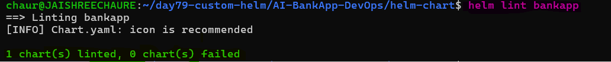 

**Step 2 - Create configurable values**

Create `bankapp/values.yaml` and move the hardcoded values from the raw manifests into configurable Helm values:
```yaml
# BankApp configuration
bankapp:
  replicaCount: 4
  image:
    repository: trainwithshubham/ai-bankapp-eks
    tag: "latest"
    pullPolicy: Always
  resources:
    requests:
      memory: "256Mi"
      cpu: "250m"
    limits:
      memory: "512Mi"
      cpu: "500m"
  service:
    type: ClusterIP
    port: 8080
  autoscaling:
    enabled: true
    minReplicas: 2
    maxReplicas: 4
    targetCPUUtilization: 70

# MySQL configuration
mysql:
  enabled: true
  image:
    repository: mysql
    tag: "8.0"
  resources:
    requests:
      memory: "256Mi"
      cpu: "250m"
    limits:
      memory: "512Mi"
      cpu: "500m"
  persistence:
    size: 5Gi
    storageClass: gp3

# Ollama AI configuration
ollama:
  enabled: true
  image:
    repository: ollama/ollama
    tag: "latest"
  model: tinyllama
  resources:
    requests:
      memory: "2Gi"
      cpu: "900m"
    limits:
      memory: "2.5Gi"
      cpu: "1500m"
  persistence:
    size: 10Gi
    storageClass: gp3

# Shared configuration
config:
  mysqlDatabase: bankappdb
  ollamaUrl: ""  # Auto-generated from service name if empty

# Secrets
secrets:
  mysqlRootPassword: Test@123
  mysqlUser: root
  mysqlPassword: Test@123

# Storage
storageClass:
  create: true
  name: gp3
  provisioner: ebs.csi.aws.com

# Gateway (optional -- for EKS with Envoy Gateway)
gateway:
  enabled: false
  hostname: ""
  tls:
    enabled: false
```
Clean up the default NOTES file and verify the chart structure:

```bash
rm bankapp/templates/NOTES.txt
find bankapp -maxdepth 2 -type f | sort
helm lint bankapp
```
`values.yaml` separates configuration from templates, allowing replicas, images, resources, storage, autoscaling, and optional components to be changed without editing the Kubernetes templates.

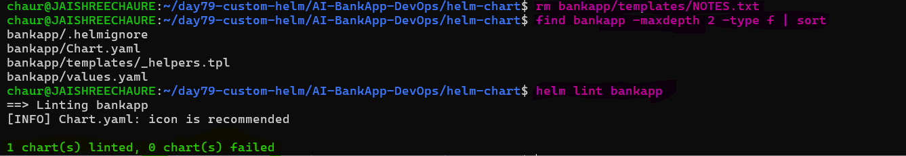

**Compare:** The raw `k8s/secrets.yml` has base64-encoded credentials hardcoded. The Helm chart uses `values.yaml` and templates the Secret, so each environment can override credentials without editing YAML.

---

## Task 3: Write the Core Templates

Convert the raw Kubernetes manifests into Helm templates using `{{ .Values }}` and Helm functions instead of hardcoded configuration.

**Step 1 - Create the ConfigMap**

Create `bankapp/templates/configmap.yaml` from `k8s/configmap.yml`:

```yaml
apiVersion: v1
kind: ConfigMap
metadata:
  name: {{ include "bankapp.fullname" . }}-config
  namespace: {{ .Release.Namespace }}
  labels:
    {{- include "bankapp.labels" . | nindent 4 }}
data:
  MYSQL_HOST: {{ include "bankapp.fullname" . }}-mysql
  MYSQL_PORT: "3306"
  MYSQL_DATABASE: {{ .Values.config.mysqlDatabase | quote }}
  OLLAMA_URL: {{ default (printf "http://%s-ollama:11434" (include "bankapp.fullname" .)) .Values.config.ollamaUrl | quote }}
  SERVER_FORWARD_HEADERS_STRATEGY: "native"
```
Render the template:

```bash
helm template bankapp ./bankapp --show-only templates/configmap.yaml
```
The `ConfigMap` replaces hardcoded application configuration with Helm-generated names and configurable values.

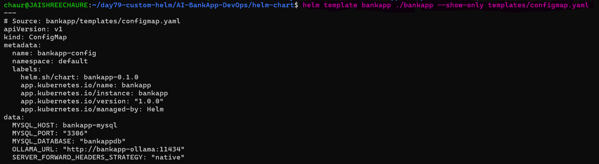

**Step 2 - Create the Secret**

Create `bankapp/templates/secrets.yaml` from `k8s/secrets.yml`:
```yaml
apiVersion: v1
kind: Secret
metadata:
  name: {{ include "bankapp.fullname" . }}-secret
  namespace: {{ .Release.Namespace }}
  labels:
    {{- include "bankapp.labels" . | nindent 4 }}
type: Opaque
data:
  MYSQL_ROOT_PASSWORD: {{ .Values.secrets.mysqlRootPassword | b64enc | quote }}
  MYSQL_USER: {{ .Values.secrets.mysqlUser | b64enc | quote }}
  MYSQL_PASSWORD: {{ .Values.secrets.mysqlPassword | b64enc | quote }}
```
Render the template:

```bash
helm template bankapp ./bankapp --show-only templates/secrets.yaml
```
Notice: `b64enc` automatically base64 encodes the values. No more manual encoding.

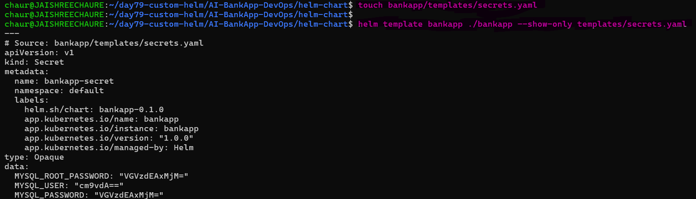 

**Step 3 - Create Storage and PVC Templates**

Create `bankapp/templates/storage.yaml` (from `k8s/pv.yml` + `k8s/pvc.yml`):
```yaml
{{- if .Values.storageClass.create }}
apiVersion: storage.k8s.io/v1
kind: StorageClass
metadata:
  name: {{ .Values.storageClass.name }}
provisioner: {{ .Values.storageClass.provisioner }}
parameters:
  type: gp3
  fsType: ext4
reclaimPolicy: Delete
volumeBindingMode: WaitForFirstConsumer
allowVolumeExpansion: true
{{- end }}
---
{{- if .Values.mysql.enabled }}
apiVersion: v1
kind: PersistentVolumeClaim
metadata:
  name: {{ include "bankapp.fullname" . }}-mysql-pvc
  namespace: {{ .Release.Namespace }}
  labels:
    {{- include "bankapp.labels" . | nindent 4 }}
spec:
  storageClassName: {{ .Values.mysql.persistence.storageClass }}
  accessModes:
    - ReadWriteOnce
  resources:
    requests:
      storage: {{ .Values.mysql.persistence.size }}
{{- end }}
---
{{- if .Values.ollama.enabled }}
apiVersion: v1
kind: PersistentVolumeClaim
metadata:
  name: {{ include "bankapp.fullname" . }}-ollama-pvc
  namespace: {{ .Release.Namespace }}
  labels:
    {{- include "bankapp.labels" . | nindent 4 }}
spec:
  storageClassName: {{ .Values.ollama.persistence.storageClass }}
  accessModes:
    - ReadWriteOnce
  resources:
    requests:
      storage: {{ .Values.ollama.persistence.size }}
{{- end }}
```
Render the storage templates:

```bash
helm template bankapp ./bankapp --show-only templates/storage.yaml
```
Storage is parameterized and optional resources are controlled with `if` conditions, allowing the same chart to work across different environments.

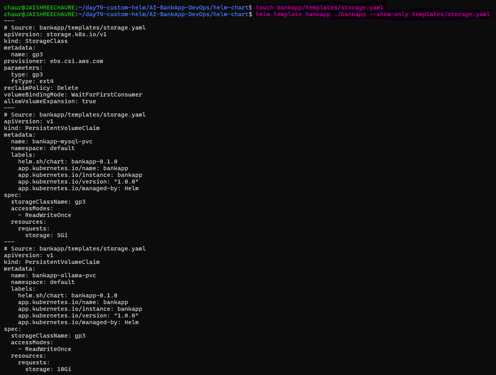 

Validate the complete chart: `helm lint bankapp`

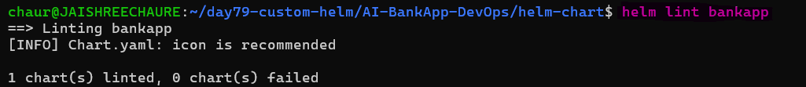

`helm template` verifies the rendered Kubernetes YAML, while `helm lint` validates the chart before deployment.

---

## Task 4: Write the Deployment Templates

Convert the raw Kubernetes Deployments into Helm templates using configurable values, conditional logic, and Helm functions.

**Step 1 - Create the BankApp Deployment**

Create `bankapp/templates/bankapp-deployment.yaml` from `k8s/bankapp-deployment.yml`:

```yaml
apiVersion: apps/v1
kind: Deployment
metadata:
  name: {{ include "bankapp.fullname" . }}
  namespace: {{ .Release.Namespace }}
  labels:
    {{- include "bankapp.labels" . | nindent 4 }}
spec:
  {{- if not .Values.bankapp.autoscaling.enabled }}
  replicas: {{ .Values.bankapp.replicaCount }}
  {{- end }}
  selector:
    matchLabels:
      app: {{ include "bankapp.fullname" . }}
  template:
    metadata:
      labels:
        app: {{ include "bankapp.fullname" . }}
    spec:
      initContainers:
        - name: wait-for-mysql
          image: busybox:1.36
          command: ["/bin/sh", "-c", "until nc -z {{ include "bankapp.fullname" . }}-mysql 3306; do sleep 2; done"]
          resources:
            requests: { memory: "32Mi", cpu: "50m" }
            limits: { memory: "64Mi", cpu: "100m" }
        {{- if .Values.ollama.enabled }}
        - name: wait-for-ollama
          image: busybox:1.36
          command: ["/bin/sh", "-c", "until nc -z {{ include "bankapp.fullname" . }}-ollama 11434; do sleep 2; done"]
          resources:
            requests: { memory: "32Mi", cpu: "50m" }
            limits: { memory: "64Mi", cpu: "100m" }
        {{- end }}
      containers:
        - name: bankapp
          image: "{{ .Values.bankapp.image.repository }}:{{ .Values.bankapp.image.tag }}"
          imagePullPolicy: {{ .Values.bankapp.image.pullPolicy }}
          ports:
            - containerPort: 8080
          envFrom:
            - configMapRef:
                name: {{ include "bankapp.fullname" . }}-config
            - secretRef:
                name: {{ include "bankapp.fullname" . }}-secret
          {{- with .Values.bankapp.resources }}
          resources:
            {{- toYaml . | nindent 12 }}
          {{- end }}
          readinessProbe:
            httpGet:
              path: /actuator/health
              port: 8080
            initialDelaySeconds: 30
            failureThreshold: 15
          livenessProbe:
            httpGet:
              path: /actuator/health
              port: 8080
            initialDelaySeconds: 60
            periodSeconds: 10
            failureThreshold: 5
```
Render the template:

```bash
helm template bankapp ./bankapp --show-only templates/bankapp-deployment.yaml
```
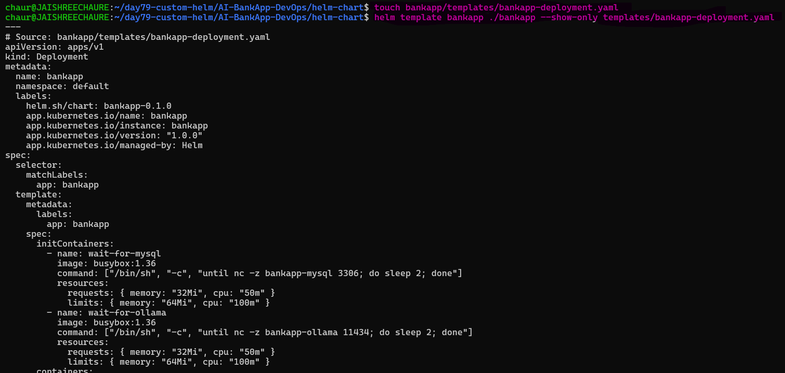

Validate: `helm lint bankapp`

**Key template decisions:**
- Init containers dynamically reference the MySQL and Ollama service names via `{{ include "bankapp.fullname" . }}`
- Ollama init container is conditional (`{{- if .Values.ollama.enabled }}`)
- Health probes use `/actuator/health` -- Spring Boot's built-in health endpoint
- `replicas` is omitted when HPA is enabled (HPA manages the count)

**Step 2 - Create the MySQL Deployment**

Create `bankapp/templates/mysql-deployment.yaml` (from `k8s/mysql-deployment.yml`):

```yaml
{{- if .Values.mysql.enabled }}
apiVersion: apps/v1
kind: Deployment
metadata:
  name: {{ include "bankapp.fullname" . }}-mysql
  namespace: {{ .Release.Namespace }}
  labels:
    {{- include "bankapp.labels" . | nindent 4 }}
spec:
  selector:
    matchLabels:
      app: {{ include "bankapp.fullname" . }}-mysql
  strategy:
    type: Recreate
  template:
    metadata:
      labels:
        app: {{ include "bankapp.fullname" . }}-mysql
    spec:
      containers:
        - name: mysql
          image: "{{ .Values.mysql.image.repository }}:{{ .Values.mysql.image.tag }}"
          ports:
            - containerPort: 3306
          env:
            - name: MYSQL_ROOT_PASSWORD
              valueFrom:
                secretKeyRef:
                  name: {{ include "bankapp.fullname" . }}-secret
                  key: MYSQL_ROOT_PASSWORD
            - name: MYSQL_DATABASE
              valueFrom:
                configMapKeyRef:
                  name: {{ include "bankapp.fullname" . }}-config
                  key: MYSQL_DATABASE
          {{- with .Values.mysql.resources }}
          resources:
            {{- toYaml . | nindent 12 }}
          {{- end }}
          volumeMounts:
            - name: mysql-storage
              mountPath: /var/lib/mysql
          readinessProbe:
            exec:
              command: ["mysqladmin", "ping", "-h", "localhost"]
            initialDelaySeconds: 15
            failureThreshold: 10
          livenessProbe:
            exec:
              command: ["mysqladmin", "ping", "-h", "localhost"]
            initialDelaySeconds: 30
            periodSeconds: 10
            failureThreshold: 5
      volumes:
        - name: mysql-storage
          persistentVolumeClaim:
            claimName: {{ include "bankapp.fullname" . }}-mysql-pvc
{{- end }}
```
Render the template:

```bash
helm template bankapp ./bankapp --show-only templates/mysql-deployment.yaml
```
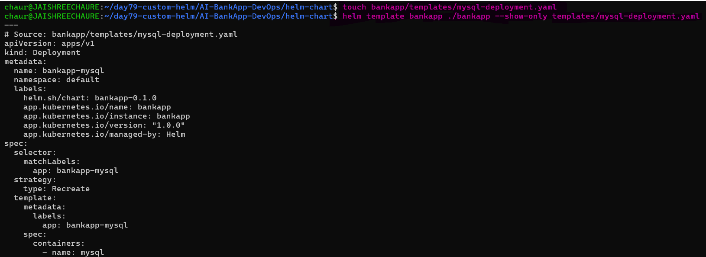

Validate: `helm lint bankapp`

**Step 3 - Create the Ollama Deployment**

Create `bankapp/templates/ollama-deployment.yaml` (from `k8s/ollama-deployment.yml`):

```yaml
{{- if .Values.ollama.enabled }}
apiVersion: apps/v1
kind: Deployment
metadata:
  name: {{ include "bankapp.fullname" . }}-ollama
  namespace: {{ .Release.Namespace }}
  labels:
    {{- include "bankapp.labels" . | nindent 4 }}
spec:
  selector:
    matchLabels:
      app: {{ include "bankapp.fullname" . }}-ollama
  strategy:
    type: Recreate
  template:
    metadata:
      labels:
        app: {{ include "bankapp.fullname" . }}-ollama
    spec:
      containers:
        - name: ollama
          image: "{{ .Values.ollama.image.repository }}:{{ .Values.ollama.image.tag }}"
          ports:
            - containerPort: 11434
          {{- with .Values.ollama.resources }}
          resources:
            {{- toYaml . | nindent 12 }}
          {{- end }}
          volumeMounts:
            - name: ollama-storage
              mountPath: /root/.ollama
          lifecycle:
            postStart:
              exec:
                command:
                  - /bin/sh
                  - -c
                  - |
                    until ollama list > /dev/null 2>&1; do sleep 2; done
                    ollama pull {{ .Values.ollama.model }}
          readinessProbe:
            exec:
              command: ["/bin/sh", "-c", "ollama list | grep -q {{ .Values.ollama.model }}"]
            initialDelaySeconds: 30
            failureThreshold: 30
          livenessProbe:
            httpGet:
              path: /
              port: 11434
            initialDelaySeconds: 60
            periodSeconds: 10
            failureThreshold: 5
      volumes:
        - name: ollama-storage
          persistentVolumeClaim:
            claimName: {{ include "bankapp.fullname" . }}-ollama-pvc
{{- end }}
```
Render the template:

```bash
helm template bankapp ./bankapp --show-only templates/ollama-deployment.yaml
```
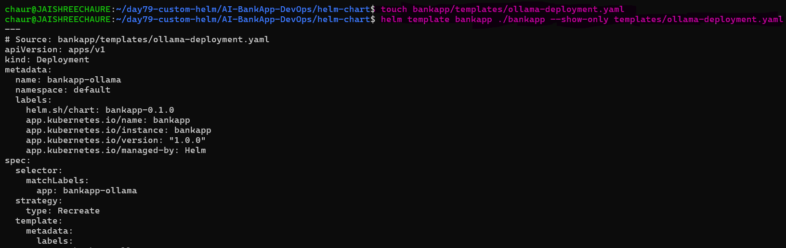

Validate: `helm lint bankapp`

> **Notice:** the Ollama model name (`tinyllama`) is now a value (`{{ .Values.ollama.model }}`). You can switch models without editing YAML.

---

## Task 5: Write the Services and HPA Templates

Convert the raw Service and HPA manifests into Helm templates using configurable values and conditional logic.

**Step 1 - Create the Services template**

Create `bankapp/templates/services.yaml` from `k8s/service.yml`:
```yaml
apiVersion: v1
kind: Service
metadata:
  name: {{ include "bankapp.fullname" . }}-mysql
  namespace: {{ .Release.Namespace }}
spec:
  selector:
    app: {{ include "bankapp.fullname" . }}-mysql
  ports:
    - port: 3306
---
{{- if .Values.ollama.enabled }}
apiVersion: v1
kind: Service
metadata:
  name: {{ include "bankapp.fullname" . }}-ollama
  namespace: {{ .Release.Namespace }}
spec:
  selector:
    app: {{ include "bankapp.fullname" . }}-ollama
  ports:
    - port: 11434
{{- end }}
---
apiVersion: v1
kind: Service
metadata:
  name: {{ include "bankapp.fullname" . }}-service
  namespace: {{ .Release.Namespace }}
spec:
  type: {{ .Values.bankapp.service.type }}
  sessionAffinity: ClientIP
  sessionAffinityConfig:
    clientIP:
      timeoutSeconds: 3600
  selector:
    app: {{ include "bankapp.fullname" . }}
  ports:
    - port: {{ .Values.bankapp.service.port }}
      targetPort: 8080
```
Render the template:

```bash
helm template bankapp ./bankapp --show-only templates/services.yaml
```
The Services provide stable internal endpoints for BankApp, MySQL, and the optional Ollama component.

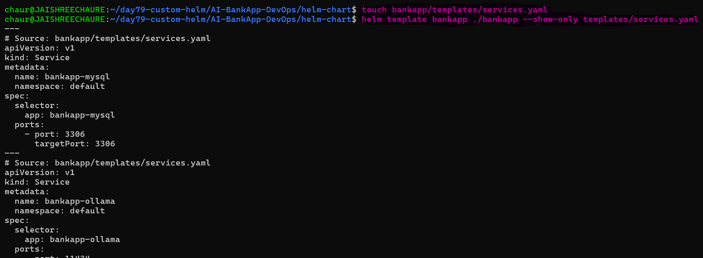 

Validate : `helm lint bankapp`

**Step 2 - Create the HPA template**

Create `bankapp/templates/hpa.yaml` (from `k8s/hpa.yml`):

```yaml
{{- if .Values.bankapp.autoscaling.enabled }}
apiVersion: autoscaling/v2
kind: HorizontalPodAutoscaler
metadata:
  name: {{ include "bankapp.fullname" . }}-hpa
  namespace: {{ .Release.Namespace }}
  labels:
    {{- include "bankapp.labels" . | nindent 4 }}
spec:
  scaleTargetRef:
    apiVersion: apps/v1
    kind: Deployment
    name: {{ include "bankapp.fullname" . }}
  minReplicas: {{ .Values.bankapp.autoscaling.minReplicas }}
  maxReplicas: {{ .Values.bankapp.autoscaling.maxReplicas }}
  metrics:
    - type: Resource
      resource:
        name: cpu
        target:
          type: Utilization
          averageUtilization: {{ .Values.bankapp.autoscaling.targetCPUUtilization }}
  behavior:
    scaleUp:
      stabilizationWindowSeconds: 30
      policies:
        - type: Pods
          value: 2
          periodSeconds: 60
    scaleDown:
      stabilizationWindowSeconds: 300
      policies:
        - type: Pods
          value: 1
          periodSeconds: 60
{{- end }}
```
Render the template:

```bash
helm template bankapp ./bankapp --show-only templates/hpa.yaml
```
The HPA uses Helm values for minimum replicas, maximum replicas, and CPU utilization, while the `enabled` condition makes autoscaling optional.

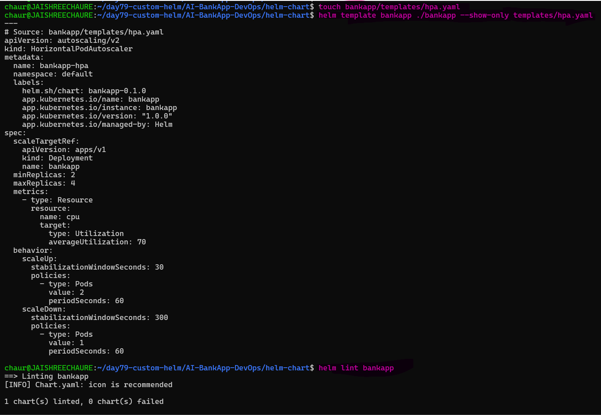

Validate: `helm lint bankapp`

> Services provide stable networking between components, while the HPA automatically adjusts BankApp replicas based on CPU utilization.

---

## Task 6: Validate and Deploy

Validate the completed Helm chart, create the Helm release notes, test configurable values and conditional resources, deploy the chart to Kind, verify the application end-to-end, perform a test operation with a new user, and clean up the release.

**Step 1 - Create Helm release notes**

Create `bankapp/templates/NOTES.txt` to provide useful instructions after installation:

```text
1. Get the application URL by running these commands:

{{- if contains "NodePort" .Values.bankapp.service.type }}

export NODE_PORT=$(kubectl get --namespace {{ .Release.Namespace }} \
  -o jsonpath="{.spec.ports[0].nodePort}" \
  services {{ include "bankapp.fullname" . }}-service)

export NODE_IP=$(kubectl get nodes \
  -o jsonpath="{.items[0].status.addresses[0].address}")

echo http://$NODE_IP:$NODE_PORT

{{- else if contains "LoadBalancer" .Values.bankapp.service.type }}

NOTE: It may take a few minutes for the LoadBalancer IP to become available.

kubectl get svc -n {{ .Release.Namespace }} -w {{ include "bankapp.fullname" . }}-service

{{- else }}

echo "Visit http://127.0.0.1:8080 to use your application"

kubectl --namespace {{ .Release.Namespace }} \
  port-forward svc/{{ include "bankapp.fullname" . }}-service 8080:{{ .Values.bankapp.service.port }}

{{- end }}
```
The `NOTES.txt` file gives users post-installation instructions automatically after `helm install` or `helm upgrade`.

**Step 2 - Lint the completed chart**

Run the final Helm validation:
```bash
helm lint bankapp/
```
The chart passes linting with `0 chart(s) failed`. The icon message is only an informational recommendation.

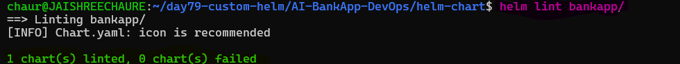 

**Step 3 - Render the complete chart**

Render all templates locally before deploying:
```bash
helm template my-bankapp bankapp/
```
This verifies that Helm resolves the template expressions into valid Kubernetes YAML.

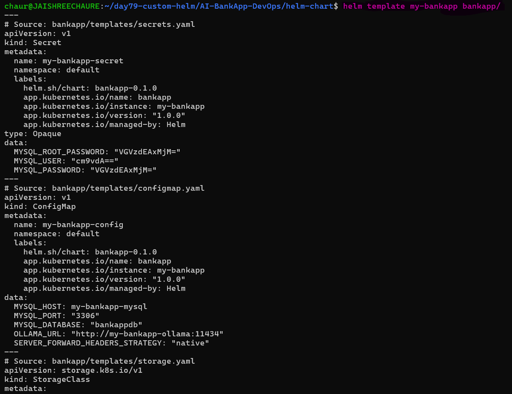

Review the output. Every `{{ }}` should be resolved to actual values.

**Step 4 - Test Helm value overrides**

Verify that chart configuration can be changed without editing the templates:

```bash
helm template my-bankapp bankapp/ \
  --set bankapp.image.tag=abc1234 \
  --set bankapp.replicaCount=2 \
  --set ollama.enabled=false
```
The rendered Deployment uses the overridden image tag.

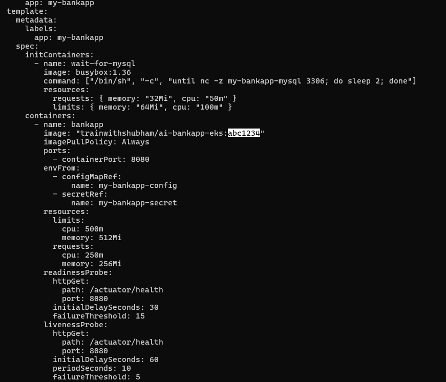

Verify the conditional Ollama resources:

```bash
helm template my-bankapp bankapp/ --set ollama.enabled=false > /tmp/bankapp-no-ollama.yaml
grep -E 'bankapp-ollama|wait-for-ollama|ollama-pvc|OLLAMA_URL' /tmp/bankapp-no-ollama.yaml
helm template my-bankapp bankapp/
```
The `ollama.enabled=false` condition removes the Ollama-related resources and init container from the rendered output.

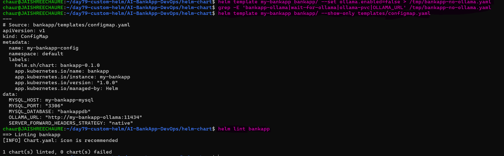 

> **This demonstrates Helm's main advantage: the same chart can be reused across environments by changing values instead of modifying Kubernetes YAML.**

**Step 5 - Perform a cluster dry run**

Test the release against the Kubernetes API without creating resources:

```bash
helm install my-bankapp bankapp/ --dry-run --debug -n bankapp --create-namespace
```
The dry run completes successfully and shows the computed Helm values and rendered resources.

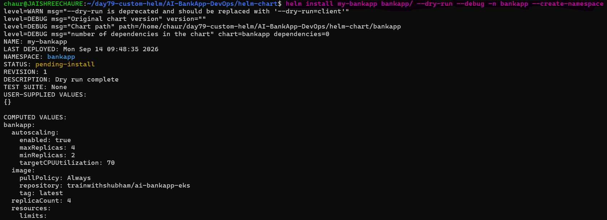 

**Step 6 - Deploy the Helm release**

Deploy the chart to the Kind cluster. Kind uses the `standard` StorageClass, so disable creation of the AWS-specific `gp3` StorageClass:

```bash
helm install my-bankapp bankapp/ \
  -n bankapp --create-namespace \
  --set storageClass.create=false \
  --set mysql.persistence.storageClass=standard \
  --set ollama.persistence.storageClass=standard
```
The Helm release is successfully installed with status `deployed`.

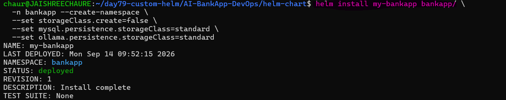

**Step 7 - Verify and upgrade the release**

Check the Helm release:

```bash
helm list -n bankapp
```
Upgrade the release while preserving the existing values:

```bash
helm upgrade my-bankapp bankapp/ \
  -n bankapp \
  --reuse-values
```
Helm creates a new release revision and displays the chart's `NOTES.txt` instructions.

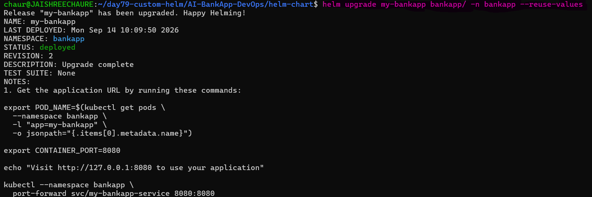 

**Step 8 - Verify Kubernetes resources**

Check the deployed Helm release and Kubernetes resources:

```bash
helm list -n bankapp
kubectl get all -n bankapp
kubectl get pvc -n bankapp
kubectl get configmap,secret -n bankapp
```
Watch the pods until all application components are ready:
```bash
kubectl get pods -n bankapp -w
```
BankApp, MySQL, and Ollama become Running, while the MySQL and Ollama PVCs become `Bound`.

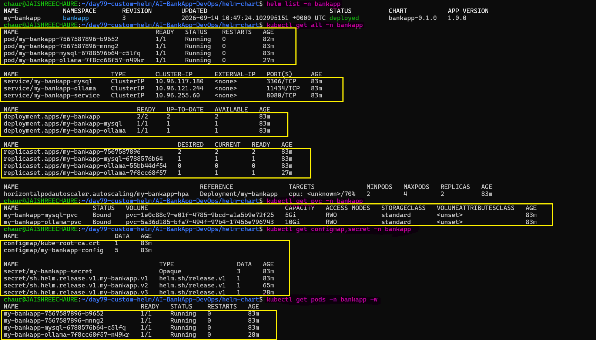 

**Step 9 - Access and test the application**

Expose the BankApp Service locally:

```bash
kubectl port-forward svc/my-bankapp-service -n bankapp 8080:8080
```
Open `http://localhost:8080` and verify that the login page is accessible.

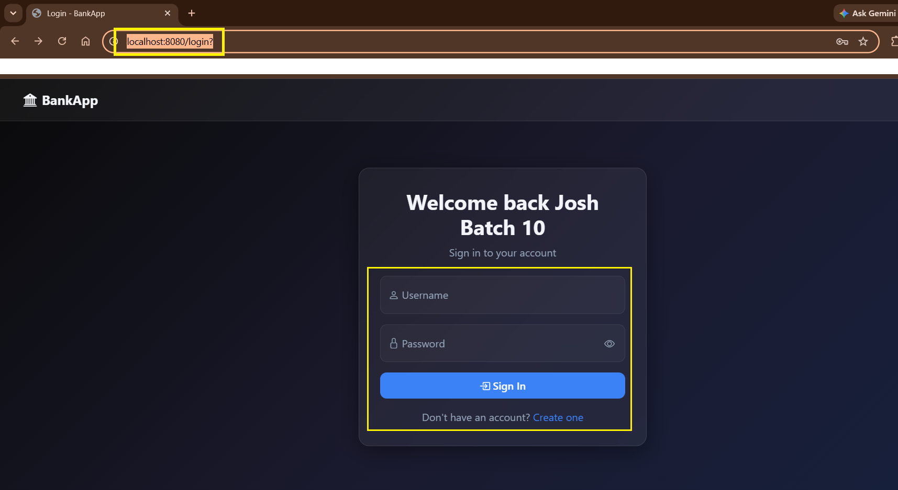

Create a new test account for **`Jaishree Chaure`** and sign in to verify the application authentication flow.

After signing in, verify the BankApp dashboard, account details, and balance.

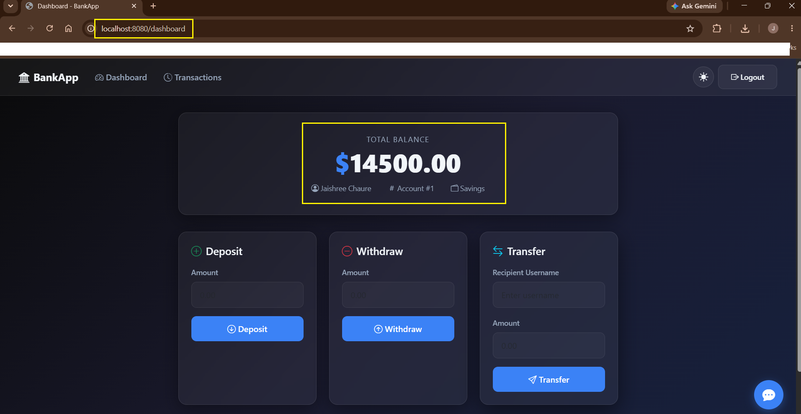

Perform a basic banking test operation, such as a deposit or withdrawal, and verify that the account balance and transaction history are updated correctly.

Test the AI Assistant from the dashboard to confirm that BankApp can communicate with the Ollama service and the TinyLlama model.

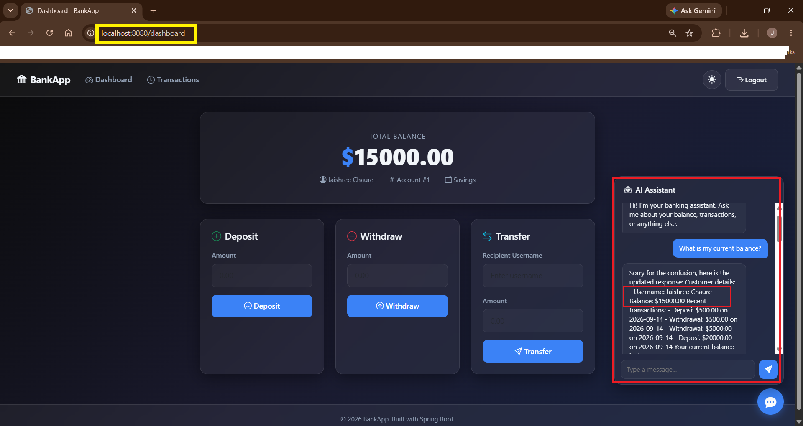

> **This validates the complete application path: `Browser → BankApp Service → BankApp → MySQL + Ollama`.**

**Compare: 12 raw YAML files vs 1 Helm command.** Same result, but now configurable, versionable, and easier to upgrade and manage.

- The application now has a reusable Helm-based deployment with configurable values, conditional components, versioned releases, upgrades, application testing, and clean removal.

**Step 10 - Clean up the Helm release**

Remove the deployed application:
```bash
helm uninstall my-bankapp -n bankapp
```
The Helm release is removed from the `bankapp` namespace.

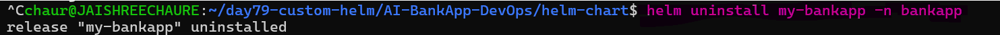

> **The original Kubernetes manifests were converted into a reusable Helm chart and validated through linting, rendering, value overrides, dry runs, deployment, upgrade, application testing, and cleanup.**

---

## Key Concepts and Comparisons

### Raw Kubernetes Manifests vs Helm Templates

The original AI-BankApp used multiple static Kubernetes YAML files with hardcoded names, namespaces, ports, images, replicas, and configuration.

Helm converts these static manifests into reusable templates that can be configured through `values.yaml`.

| Raw Kubernetes | Helm |
|---|---|
| Hardcoded resource names | `{{ include "bankapp.fullname" . }}` |
| Hardcoded namespace | `{{ .Release.Namespace }}` |
| Fixed configuration | `{{ .Values.* }}` |
| Fixed components | Conditional `{{ if }}` |
| Manual Base64 encoding | `{{ b64enc }}` |
| Separate YAML management | One reusable Helm chart |
| Manual changes per environment | `--set` / values files |
| `kubectl apply` workflow | Helm install / upgrade / uninstall |

### Example: Service

**Raw Kubernetes Manifest**

```yaml
apiVersion: v1
kind: Service
metadata:
  name: mysql-service
  namespace: bankapp
spec:
  selector:
    app: mysql
  ports:
    - port: 3306
---
apiVersion: v1
kind: Service
metadata:
  name: ollama-service
  namespace: bankapp
spec:
  selector:
    app: ollama
  ports:
    - port: 11434
---
apiVersion: v1
kind: Service
metadata:
  name: bankapp-service
  namespace: bankapp
spec:
  type: ClusterIP
  sessionAffinity: ClientIP
  sessionAffinityConfig:
    clientIP:
      timeoutSeconds: 3600
  selector:
    app: bankapp
  ports:
    - port: 8080
      targetPort: 8080
```
- Defines **fixed Services** for:
  - `mysql-service` — port `3306`
  - `ollama-service` — port `11434`
  - `bankapp-service` — port `8080`

- Everything is **hardcoded**:
  - Names
  - Namespace (`bankapp`)
  - Selectors (`app: mysql`, `app: ollama`, `app: bankapp`)

> **Key difference:** The Kubernetes manifest is `fixed`, while the Helm template generates the same resource dynamically from the release and `values.yaml`.

---

**Helm Template**

```yaml
apiVersion: v1
kind: Service
metadata:
  name: {{ include "bankapp.fullname" . }}-mysql
  namespace: {{ .Release.Namespace }}
spec:
  selector:
    app: {{ include "bankapp.fullname" . }}-mysql
  ports:
    - port: 3306
---
{{- if .Values.ollama.enabled }}
apiVersion: v1
kind: Service
metadata:
  name: {{ include "bankapp.fullname" . }}-ollama
  namespace: {{ .Release.Namespace }}
spec:
  selector:
    app: {{ include "bankapp.fullname" . }}-ollama
  ports:
    - port: 11434
{{- end }}
---
apiVersion: v1
kind: Service
metadata:
  name: {{ include "bankapp.fullname" . }}-service
  namespace: {{ .Release.Namespace }}
spec:
  type: {{ .Values.bankapp.service.type }}
  sessionAffinity: ClientIP
  sessionAffinityConfig:
    clientIP:
      timeoutSeconds: 3600
  selector:
    app: {{ include "bankapp.fullname" . }}
  ports:
    - port: {{ .Values.bankapp.service.port }}
      targetPort: 8080
```
Defines the **same Services**, but in a **parameterized and reusable** way.

- Uses Helm placeholders such as:
  - `{{ .Release.Namespace }}`
  - `{{ include "bankapp.fullname" . }}`
  - `{{ .Values.* }}`
- Ollama is conditionally created using `{{ if .Values.ollama.enabled }}`.
- Service configuration can be changed through `values.yaml`.
  - Service type (`ClusterIP`, etc.)
  - Port numbers
  - Naming conventions

---

### Helm Values Used in AI-BankApp

`values.yaml` centralizes the configuration used by the chart:

```yaml
# BankApp configuration
bankapp: # Root key for application settings
  replicaCount: 4  # Number of application pods
  image:
    repository: trainwithshubham/ai-bankapp-eks  # Docker image repository
    tag: "latest"  # Image tag/version
    pullPolicy: Always  # Always pull image on deploy
  resources:
    requests:
      memory: "256Mi"  # Minimum memory required
      cpu: "250m"      # Minimum CPU required
    limits:
      memory: "512Mi"  # Maximum memory allowed
      cpu: "500m"      # Maximum CPU allowed
  service:
    type: ClusterIP  # Internal Kubernetes service
    port: 8080       # Service port
  autoscaling:
    enabled: true  # Enable Horizontal Pod Autoscaler
    minReplicas: 2  # Minimum number of pods
    maxReplicas: 4  # Maximum number of pods
    targetCPUUtilization: 70  # CPU % threshold for scaling

# MySQL configuration
mysql:
  enabled: true  # Deploy MySQL or not
  image:
    repository: mysql  # MySQL image
    tag: "8.0"         # MySQL version
  resources:
    requests:
      memory: "256Mi"  # Minimum memory
      cpu: "250m"      # Minimum CPU
    limits:
      memory: "512Mi"  # Maximum memory
      cpu: "500m"      # Maximum CPU
  persistence:
    size: 5Gi  # Persistent volume size
    storageClass: gp3  # Storage class name

# Ollama AI configuration
ollama:
  enabled: true  # Enable Ollama deployment
  image:
    repository: ollama/ollama  # Ollama image
    tag: "latest"  # Image version
  model: tinyllama  # Ollama model used by the application
  resources:
    requests:
      memory: "2Gi"  # Minimum memory
      cpu: "900m"  # Minimum CPU
    limits:
      memory: "2.5Gi"  # Maximum memory
      cpu: "1500m"  # Maximum CPU
  persistence:
    size: 10Gi  # Storage for models/data
    storageClass: gp3  # Storage class
  autoPullModel: false  # Disable automatic model download
  requireModel: false  # Use Ollama HTTP health check

# Shared configuration
config:
  mysqlDatabase: bankappdb  # Database name used by app
  ollamaUrl: ""  # Auto-generated from service name if empty

# Secrets
secrets:
  mysqlRootPassword: Test@123  # Root password
  mysqlUser: root  # Application DB user
  mysqlPassword: Test@123  # Application DB password
  
# StorageClass configuration
storageClass:
  create: true  # Whether to create storage class
  name: gp3  # Storage class name
  provisioner: ebs.csi.aws.com  # AWS EBS CSI provisioner

# Gateway (optional -- for EKS with Envoy Gateway)
gateway:
  enabled: false  # Enable ingress/gateway
  hostname: ""  # DNS hostname (e.g bankapp.example.com)
  tls:
    enabled: false  # Enable/Disable HTTPS/TLS
```
> **Why:** Centralizing configuration makes the chart reusable across environments without changing the Kubernetes templates.

---

### Go Template Syntax Used

| Syntax | Purpose | Example |
|---|---|---|
| `.Values` | Reads values from `values.yaml` | `{{ .Values.ollama.model }}` |
| `if` | Conditionally renders resources | `{{ if .Values.ollama.enabled }}` |
| `with` | Works with a specific object | `{{ with .Values.bankapp.resources }}` |
| `include` | Reuses named helper templates | `{{ include "bankapp.fullname" . }}` |
| `toYaml` | Converts structured values to YAML | `{{ toYaml .Values.bankapp.resources }}` |
| `nindent` | Adds indentation to rendered YAML | `{{ toYaml .Values.bankapp.resources \| nindent 10 }}` |
| `b64enc` | Base64-encodes Secret values | `{{ .Values.secrets.mysqlPassword \| b64enc }}` |
| `default` | Provides a fallback value | `{{ default "value" .Values.config.ollamaUrl }}` |

> These functions were used throughout the chart to replace hardcoded configuration with reusable Helm logic.

---

### Conditional Components

Ollama was made optional using:

```yaml
{{- if .Values.ollama.enabled }}
```
With the default configuration:

```yaml
ollama:
  enabled: true
```
the chart renders the Ollama Deployment, Service, and PVC.

Disable it with:

```bash
helm template my-bankapp bankapp/ \
  --set ollama.enabled=false
```

The conditional blocks prevent Ollama-related resources from being rendered, including:

- Ollama Deployment
- Ollama Service
- Ollama PVC
- BankApp `wait-for-ollama` init container
- `OLLAMA_URL` configuration

> **Key takeaway:** One Helm value can control an entire optional component without modifying the templates.
