# Day 80 -- Helm Project: Multi-Environment Deployment and CI/CD

## Task 1: Create Environment-Specific Values

Helm lets us use **one reusable chart** with different values for each environment. This keeps the Kubernetes templates consistent while allowing dev, staging, and production to have different replicas, resources, storage, and features.

Create `bankapp/values-dev.yaml`:
```yaml
bankapp:
  replicaCount: 1
  image:
    repository: trainwithshubham/ai-bankapp-eks
    tag: "latest"
    pullPolicy: Always
  resources:
    requests:
      memory: "256Mi"
      cpu: "100m"
    limits:
      memory: "512Mi"
      cpu: "250m"
  autoscaling:
    enabled: false

mysql:
  enabled: true
  resources:
    requests:
      memory: "256Mi"
      cpu: "100m"
    limits:
      memory: "512Mi"
      cpu: "250m"
  persistence:
    size: 2Gi
    storageClass: standard

ollama:
  enabled: false
  model: tinyllama
  resources:
    requests:
      memory: "1Gi"
      cpu: "500m"
    limits:
      memory: "1.5Gi"
      cpu: "1000m"
  persistence:
    size: 5Gi
    storageClass: standard

storageClass:
  create: false
```

Create `bankapp/values-staging.yaml`:
```yaml
bankapp:
  replicaCount: 2
  image:
    repository: trainwithshubham/ai-bankapp-eks
    tag: "v1.2.0"
    pullPolicy: IfNotPresent
  resources:
    requests:
      memory: "256Mi"
      cpu: "250m"
    limits:
      memory: "512Mi"
      cpu: "500m"
  autoscaling:
    enabled: true
    minReplicas: 2
    maxReplicas: 3
    targetCPUUtilization: 75

mysql:
  enabled: true
  resources:
    requests:
      memory: "256Mi"
      cpu: "250m"
    limits:
      memory: "512Mi"
      cpu: "500m"
  persistence:
    size: 5Gi
    storageClass: gp3

ollama:
  enabled: true
  model: tinyllama
  persistence:
    size: 10Gi
    storageClass: gp3

secrets:
  mysqlRootPassword: StagingPass@456
  mysqlUser: root
  mysqlPassword: StagingPass@456

storageClass:
  create: true
```

Create `bankapp/values-prod.yaml`:
```yaml
bankapp:
  replicaCount: 4
  image:
    repository: trainwithshubham/ai-bankapp-eks
    tag: "v1.2.0"
    pullPolicy: IfNotPresent
  resources:
    requests:
      memory: "256Mi"
      cpu: "250m"
    limits:
      memory: "512Mi"
      cpu: "500m"
  autoscaling:
    enabled: true
    minReplicas: 2
    maxReplicas: 4
    targetCPUUtilization: 70

mysql:
  enabled: true
  resources:
    requests:
      memory: "512Mi"
      cpu: "500m"
    limits:
      memory: "1Gi"
      cpu: "1000m"
  persistence:
    size: 20Gi
    storageClass: gp3

ollama:
  enabled: true
  model: tinyllama
  resources:
    requests:
      memory: "2Gi"
      cpu: "900m"
    limits:
      memory: "2.5Gi"
      cpu: "1500m"
  persistence:
    size: 10Gi
    storageClass: gp3

secrets:
  mysqlRootPassword: ProdSecure@789
  mysqlUser: root
  mysqlPassword: ProdSecure@789

storageClass:
  create: true

gateway:
  enabled: true
```

**Compare the environments:**

| Setting | Dev | Staging | Prod |
|---------|-----|---------|------|
| BankApp replicas | 1 (fixed) | 2-3 (HPA) | 2-4 (HPA) |
| Image tag | latest | v1.2.0 | v1.2.0 |
| MySQL storage | 2Gi | 5Gi | 20Gi |
| MySQL resources | 256Mi/100m | 256Mi/250m | 512Mi/500m |
| Ollama | Disabled | 2Gi | 2.5Gi |
| Gateway | disabled | disabled | enabled |

**Deploy to different environments:**

### Dev (on Kind)
```bash
helm install bankapp-dev bankapp/ -f bankapp/values-dev.yaml -n dev --create-namespace
```
> **Why:** Installs the BankApp Helm chart using the development-specific values and creates the `dev` namespace if it does not exist.

The Helm release was installed successfully in the `dev` namespace

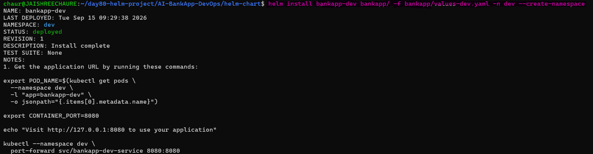 

### Verify Dev Resources

```bash
kubectl get all -n dev
kubectl get pods -n dev
```
> **Why:** Verifies the Kubernetes resources created by Helm and checks the current pod status.

`BankApp` and `MySQL` were deployed successfully, with the application becoming ready after startup.

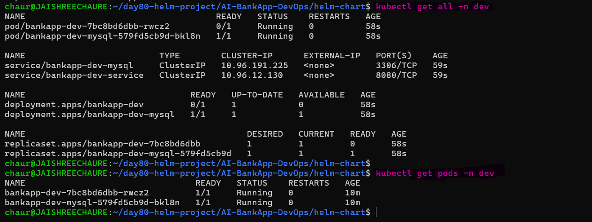 

### Staging (render to check)
```bash
helm template bankapp-staging bankapp/ -f bankapp/values-staging.yaml --set bankapp.autoscaling.enabled=false | grep "replicas:"
```
> **Why:** Renders the staging configuration locally without deploying it. Disabling HPA exposes the Deployment's configured replica count.

### Prod (render to check)
```bash
helm template bankapp-prod bankapp/ -f bankapp/values-prod.yaml --set bankapp.autoscaling.enabled=false | grep "replicas:"
```
**Why:** Renders the production configuration locally without deploying it and verifies the configured replica count.

Rendering the same chart with different values produces different deployment configurations: `2 replicas for staging` and `4 for production`.

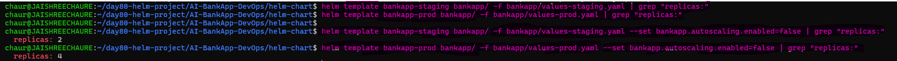

> **Key takeaway:** One Helm chart can support multiple environments simply by changing the values file.

---

## Task 2: Add Helm Hooks

Helm hooks let us run Kubernetes resources at specific points in the release lifecycle. For the AI-BankApp, a DB readiness Job helps ensure MySQL is reachable before the application proceeds.

### Create the DB Readiness Hook

Create `bankapp/templates/pre-install-job.yaml`:
```yaml
apiVersion: batch/v1
kind: Job
metadata:
  name: {{ include "bankapp.fullname" . }}-db-ready
  namespace: {{ .Release.Namespace }}
  labels:
    {{- include "bankapp.labels" . | nindent 4 }}
  annotations:
    "helm.sh/hook": post-install,pre-upgrade
    "helm.sh/hook-weight": "0"
    "helm.sh/hook-delete-policy": before-hook-creation
spec:
  template:
    spec:
      containers:
        - name: db-check
          image: busybox:1.36
          command:
            - /bin/sh
            - -c
            - |
              echo "Waiting for MySQL to be ready..."
              until nc -z {{ include "bankapp.fullname" . }}-mysql 3306; do
                echo "MySQL not ready, retrying in 3s..."
                sleep 3
              done
              echo "MySQL is ready!"
          resources:
            requests: { memory: "32Mi", cpu: "50m" }
            limits: { memory: "64Mi", cpu: "100m" }
      restartPolicy: Never
  backoffLimit: 10
```
> **Why:** The hook runs **after installation** and **before upgrades**, checking that the MySQL service is reachable before the application continues..

### Validate the Chart
```bash
helm lint bankapp/
```
> **Why:** Validates the Helm chart structure and templates before deploying changes.

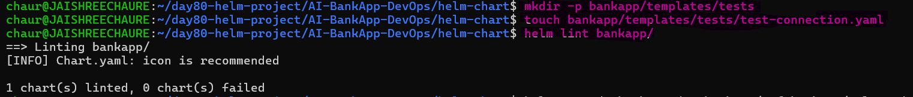

### Upgrade the Dev Release

```bash
helm upgrade bankapp-dev bankapp/ \
  -f bankapp/values-dev.yaml \
  -n dev
```
> **Why:** Applies the updated chart and exercises the `pre-upgrade` hook.

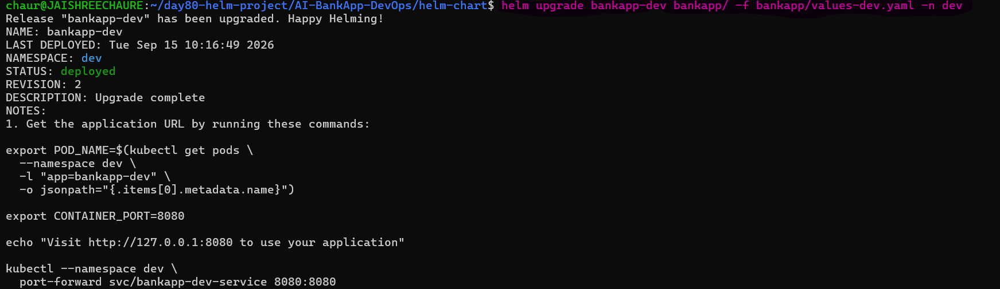

**How hooks work in the AI-BankApp context:**
- `post-install,pre-upgrade` — runs after installation and before upgrades
- `hook-weight: "0"` — controls execution order when multiple hooks exist
- `before-hook-creation` — removes the previous hook Job before creating a new one
- The DB readiness check complements the application's init-container logic

**Other useful hook types:**
- `post-install` -- run database migrations after deploy
- `pre-delete` -- backup database before teardown
- `test` -- runs when you execute `helm test`

**Add a Helm test:**

Create `bankapp/templates/tests/test-connection.yaml`:
```yaml
apiVersion: v1
kind: Pod
metadata:
  name: {{ include "bankapp.fullname" . }}-test
  namespace: {{ .Release.Namespace }}
  labels:
    {{- include "bankapp.labels" . | nindent 4 }}
  annotations:
    "helm.sh/hook": test
spec:
  containers:
    - name: test
      image: busybox:1.36
      command: ['sh', '-c', 'wget -qO- http://{{ include "bankapp.fullname" . }}-service:8080/actuator/health']
  restartPolicy: Never
```
> **Why:** The Helm test calls the Spring Boot health endpoint to verify that the deployed application is responding successfully.

### Run the Helm Test

```bash
helm test bankapp-dev -n dev
```
Executes the Pod annotated with `helm.sh/hook: test` and verifies the application's health endpoint.

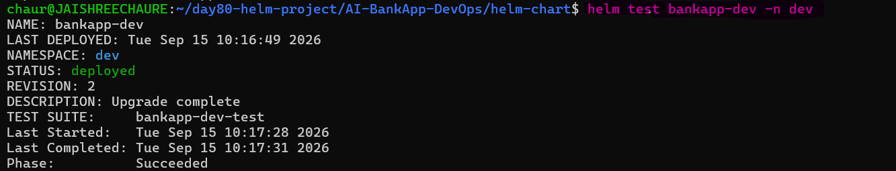

The Helm test completed successfully, confirming that the application health check passed.

### Verify the Application

```bash
kubectl port-forward svc/bankapp-dev-service 8080:8080 -n dev
```
> **Why:** Forwards the Kubernetes Service port to localhost so the application can be tested directly from the browser.

Open:

```text
http://localhost:8080/actuator/health
```

The Spring Boot Actuator endpoint returned `"status": "UP"`, confirming that the application was running and responding correctly.

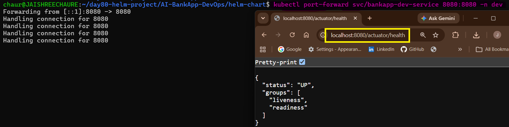

> > **Key takeaway:** Helm hooks extend the release lifecycle, while Helm tests provide a repeatable way to validate the deployed application.

---

## Task 3: Package and Version the Chart

Helm packages a chart into a portable `.tgz` archive, making it easy to distribute and install the same tested chart across environments.

### Lint and Package the Chart

```bash
# Validate the chart
helm lint bankapp/

# Package the chart
helm package bankapp/
```
> **Why:** `helm lint` validates the chart before packaging, while `helm package` creates a versioned `.tgz` artifact for distribution.

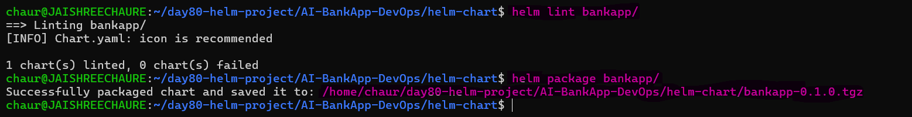

The chart was successfully packaged as `bankapp-0.1.0.tgz`.

### Bump the Chart Version

After adding hooks and other chart changes, update `bankapp/Chart.yaml`:
```yaml
version: 0.2.0        # Chart structure changed (added hooks)
appVersion: "1.1.0"    # App version updated
```
`version` tracks changes to the Helm chart itself, while `appVersion` identifies the application version being deployed.

Re-package the updated chart:
```bash
helm package bankapp/
```
Creates a new versioned package while preserving the previous chart artifact.

The chart now has both `bankapp-0.1.0.tgz` and `bankapp-0.2.0.tgz`.

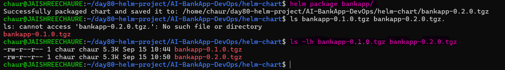 

### Install from a Packaged Chart
```bash
helm install my-bankapp bankapp-0.2.0.tgz -f bankapp/values-dev.yaml -n bankapp --create-namespace
```
Installs the packaged chart instead of the source directory, verifying that the distributable `.tgz` artifact works independently.

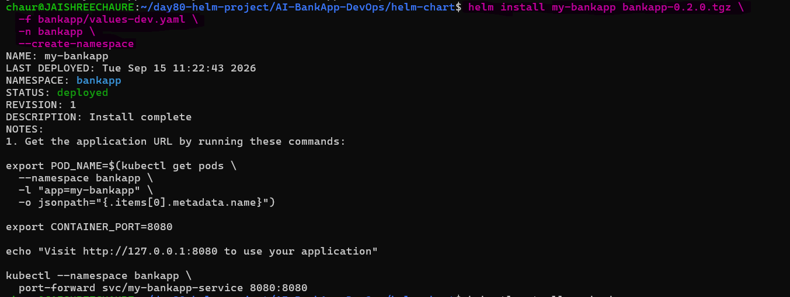 

### Verify the Packaged Deployment

```bash
kubectl get all -n bankapp
```
Confirms that the packaged Helm chart created the expected Kubernetes resources successfully.

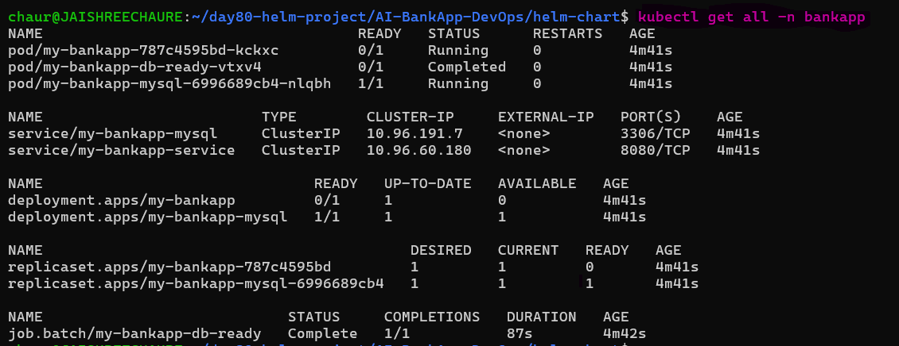 

### Create a Chart Repository Index (for sharing via GitHub Pages):
```bash
mkdir chart-repo
cp bankapp-*.tgz chart-repo/
helm repo index chart-repo/ --url https://jaishree97.github.io/helm-charts
cat chart-repo/index.yaml
```
Copies the packaged charts into a repository directory and generates `index.yaml`, allowing Helm to discover and download chart versions from GitHub Pages.

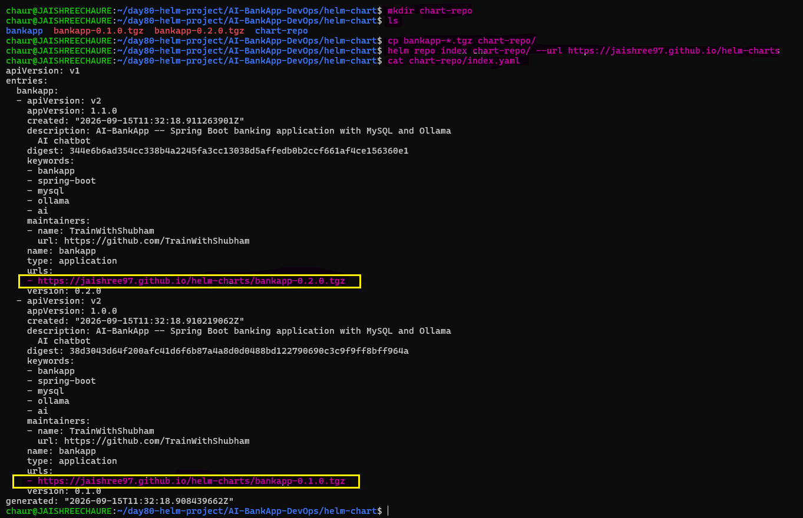

> **Key takeaway:** Helm packaging creates versioned, distributable chart artifacts that can be installed directly or published through a chart repository.

---

## Task 4: Understand Helm in the AI-BankApp GitOps Pipeline

Helm integrates with GitOps by replacing raw Kubernetes manifests with a reusable chart and environment-specific values.

### Current GitOps Pipeline (from `.github/workflows/gitops-ci.yml`):**
```
Developer pushes code
  -> GitHub Actions builds Docker image
  -> Tags with git commit SHA
  -> Updates image tag in k8s/bankapp-deployment.yml via sed
  -> Commits the change back to the repo
  -> ArgoCD detects the change and syncs to EKS
```

### GitOps Pipeline with Helm
```
Developer pushes code
  -> GitHub Actions builds Docker image
  -> Tags with git commit SHA
  -> Updates image.tag in helm-chart/values.yaml (or values-prod.yaml)
  -> Commits the change back to the repo
  -> ArgoCD detects the change and runs helm upgrade on EKS
```

### Update Helm Values in CI

```yaml
# In the GitHub Actions workflow
- name: Update Helm values with new image tag
  run: |
    TAG=${{ steps.tag.outputs.sha_short }}
    yq -i '.bankapp.image.tag = "'$TAG'"' helm-chart/bankapp/values-prod.yaml

- name: Commit updated Helm values
  run: |
    git config user.name "github-actions[bot]"
    git config user.email "github-actions[bot]@users.noreply.github.com"
    git add helm-chart/bankapp/values-prod.yaml
    git diff --staged --quiet || git commit -m "ci: update bankapp image to $TAG [skip ci]"
    git push
```
> **Why:** GitHub Actions updates the environment-specific Helm values with the exact image tag, then commits the change so Git remains the source of truth.

### Configure ArgoCD with Helm (the ArgoCD Application would change from):

Current ArgoCD source:
```yaml
# Current: raw manifests
source:
  path: k8s
```
With Helm:
```yaml
# Helm chart
source:
  path: helm-chart/bankapp
  helm:
    valueFiles:
      - values-prod.yaml
```
> **Why:** ArgoCD natively supports Helm, rendering the chart with the selected values file before applying the generated Kubernetes manifests.

**Document:** What are the advantages of ArgoCD syncing a Helm chart vs raw manifests?

**Advantages of using ArgoCD with Helm over raw manifests:**

- One Helm chart can serve multiple environments (dev/staging/prod).
- Separate `values.yaml` files replace manual YAML edits.
- Versioned releases with easy rollback support.
- Only values change, templates stay consistent.
- Clean separation of config (values) and templates (charts).
- Native Helm integration (no extra tools).
- Same structure across all environments reduces drift.
- Easier to manage as applications grow.

> **Key takeaway:** Helm provides reusable, environment-specific templates, while ArgoCD continuously syncs the desired state from Git to Kubernetes.

---

## Task 5: Helm Best Practices for Production

Production Helm deployments should focus on **repeatable upgrades, controlled changes, resource governance, and secure secret management**.

### 1. Use `helm upgrade --install`
```bash
helm upgrade --install bankapp bankapp/ \
  -f bankapp/values-prod.yaml \
  --set bankapp.image.tag=$GIT_SHA \
  -n bankapp --create-namespace \
  --wait --timeout 300s \
  --rollback-on-failure
```
> **Why:** Provides a single command for both initial installation and upgrades while waiting for resources to become ready and rolling back failed deployments.

- `--install` — creates the release if it does not exist; otherwise upgrades it
- `--set bankapp.image.tag=$GIT_SHA` — pins the deployment to the exact Git commit
- `--wait` — waits for resources to become ready
- `--rollback-on-failure` — automatically rolls back if the upgrade fails

> **Note:** Older Helm versions commonly used `--atomic` for automatic rollback. In the Helm version used for this lab, `--atomic` is deprecated and Helm recommends `--rollback-on-failure` instead.

### 2. Use **`helm diff`** Before Upgrading
```bash
helm plugin install https://github.com/databus23/helm-diff --verify=false

helm diff upgrade bankapp-dev bankapp/ \
  -f bankapp/values-dev.yaml \
  -n dev
```
> **Why:** Shows the changes that would be applied before performing the upgrade, making configuration changes easier to review.

> **Note:** `--verify=false` skips plugin provenance verification. Use it only when you understand the trust implications of installing the plugin without verification.

### 3. Add Resource Quotas per Namespace

Create `bankapp/templates/resourcequota.yaml`:
```yaml
# Add to templates/resourcequota.yaml
apiVersion: v1
kind: ResourceQuota
metadata:
  name: {{ include "bankapp.fullname" . }}-quota
  namespace: {{ .Release.Namespace }}
spec:
  hard:
    requests.cpu: "2"
    requests.memory: 4Gi
    limits.cpu: "4"
    limits.memory: 8Gi
```
> **Why:** Limits the total CPU and memory resources that workloads in a namespace can request or consume.

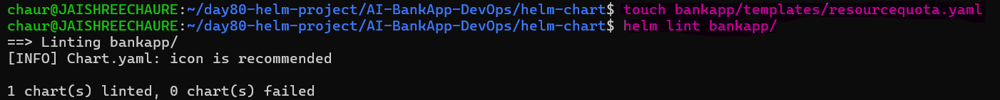

### Verify the Rendered Quota

```bash
helm template bankapp-dev bankapp/ \
  -f bankapp/values-dev.yaml \
  -n dev | grep -A12 "kind: ResourceQuota"
```
> **Why:** Confirms that Helm renders the ResourceQuota with the expected namespace and resource limits.

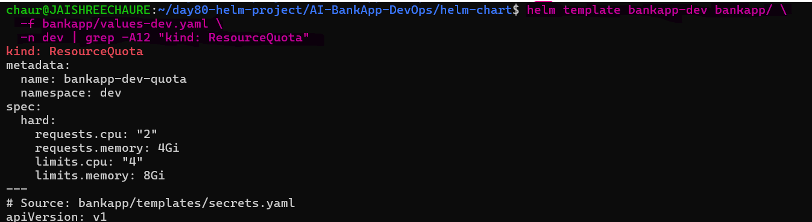

### Apply the Resource Quota

```bash
helm upgrade bankapp-dev bankapp/ \
  -f bankapp/values-dev.yaml \
  -n dev \
  --wait \
  --timeout 300s
```
> **Why:** Applies the updated chart and creates the ResourceQuota in the `dev` namespace.

```bash
kubectl get resourcequota -n dev
```
Verifies that Kubernetes is enforcing the configured namespace quota.

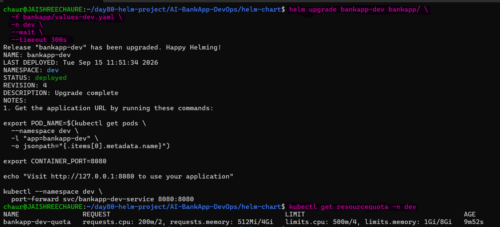

### 4. Manage Secrets Securely

Never store real production secrets in `values.yaml`.

Use dedicated secret-management solutions such as:

- External Secrets Operator with AWS Secrets Manager
- Sealed Secrets
- Vault by HashiCorp

> **Why:** Keeps sensitive credentials out of version-controlled Helm values and allows secrets to be managed securely through the deployment pipeline.

The `values.yaml` defaults are suitable for local development, while production credentials should be supplied securely through CI/CD or a dedicated secrets-management system.

---

## Task 6: Clean Up and Review

Review the Helm releases and summarize the key concepts learned across the 3-day Helm journey.

### Review Deployed Releases

```bash
helm list -A
```
Lists all Helm releases across namespaces and confirms their current status, chart version, and application version.

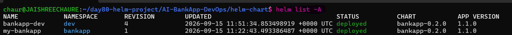

### 3-Day Helm Journey

| Day | Concept | AI-BankApp Connection |
|-----|---------|----------------------|
| 78 | Helm install, repos, values, upgrade, rollback | Deployed MySQL for the BankApp via Bitnami chart |
| 79 | Custom chart from scratch, Go templates | Converted 12 raw `k8s/` manifests into a Helm chart |
| 80 | Multi-env values, hooks, packaging, CI/CD | Production-ready chart with dev/staging/prod configs |

### Helm vs Raw Manifests vs Kustomize

| Approach | Best For | AI-BankApp Example |
|----------|---------|-------------------|
| Raw manifests | Simple, single-env deployments | The current `k8s/` directory |
| Helm | Multi-env, complex apps with dependencies | The chart you built (3 services, HPA, hooks) |
| Kustomize | Overlays on existing manifests, no templating | Good if you want to patch `k8s/` without rewriting |

### Clean Up
```bash
helm uninstall bankapp-dev -n dev
kubectl delete namespace dev
kind delete cluster --name tws-cluster
```
Removes the Dev Helm release, deletes its namespace, and removes the local Kind cluster after completing the hands-on lab.

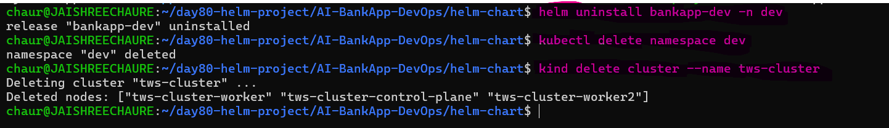

> **Key takeaway:**  Over three days, Helm transformed the AI-BankApp from raw Kubernetes manifests into a reusable, versioned, multi-environment deployment model integrated with GitOps practices.

---

All three environment values files with a comparison table

| **Setting**        | **Dev**      | **Staging**  | **Prod**     |
| ------------------ | ------------ | ------------ | ------------ |
| BankApp replicas   | 1 (fixed)    | 2-3 (HPA)    | 2-4 (HPA)    |
| Image tag          | latest       | v1.2.0       | v1.2.0       |
| MySQL storage      | 2Gi          | 5Gi          | 20Gi         |
| MySQL resources    | 128Mi/100m   | 256Mi/250m   | 512Mi/500m   |
| Ollama memory      | 1Gi          | 2Gi          | 2.5Gi        |
| Gateway            | disabled     | disabled     | enabled      |

- The Helm hook template with annotations explained
  - `helm.sh/hook: pre-install,pre-upgrade` -- runs before install and before upgrade
  - This ensures MySQL is up before the BankApp Deployment is created
  - `before-hook-creation` -- deletes the old job before creating a new one on re-runs
  - Combined with init containers in the Deployment, this provides defense-in-depth
  - `post-install` -- run database migrations after deploy
  - `pre-delete` -- backup database before teardown
  - `test` -- runs when you execute `helm test`

- How the GitOps CI/CD pipeline would integrate Helm
  - In a GitOps CI/CD pipeline, Helm is integrated by storing a Helm chart in Git instead of raw Kubernetes YAML.
  - Argo CD then renders the chart using specified values files and deploys it to the cluster, continuously syncing the desired state from Git to Kubernetes.

  ```yaml
  source:
    path: helm-chart/bankapp
    helm:
      valueFiles:
        - values-prod.yaml
    ```
- Comparison: Helm vs raw manifests vs Kustomize for the AI-BankApp

| **Approach**  | **Best For**                              | **AI-BankApp Example**                      |
| ------------- | ------------------------------------------ | ------------------------------------------- |
| Raw manifests | Simple, single-env deployments             | The current `k8s/` directory                |
| Helm          | Multi-env, complex apps with dependencies  | The chart you built (3 services, HPA, hooks) |
| Kustomize     | Overlays on existing manifests, no templating | Good if you want to patch `k8s/` without rewriting |

- What you would add for production secrets management
  - I would use:
    - External Secrets Operator with AWS Secrets Manager
    - Sealed Secrets
    - Vault by HashiCorp
