# Day 81 -- Introduction to Amazon EKS with Terraform

## Task 1: Understand EKS Architecture

Research and write notes on:

1. **What does "managed Kubernetes" mean?**
   - AWS manages the **control plane** (API server, etcd, scheduler, controller manager)
   - You manage the **data plane** (worker nodes where your pods run)
   - AWS handles control plane upgrades, patching, and high availability across multiple AZs

2. **EKS components:**
   - **EKS Control Plane** -- managed by AWS, runs in AWS-owned VPC, accessible via API endpoint
   - **Node Groups** -- EC2 instances that run your pods
     - **Managed Node Groups** -- AWS handles provisioning, scaling, and updates
     - **Self-Managed Nodes** -- you manage the EC2 instances yourself
     - **Fargate Profiles** -- serverless, no nodes to manage at all
   - **VPC and Networking** -- EKS runs inside your VPC with subnets across AZs
   - **IAM Integration** -- EKS uses IAM roles for cluster access and pod-level permissions (IRSA)

3. **EKS add-ons the AI-BankApp uses** (from `terraform/eks.tf`):
   - `coredns` -- DNS resolution inside the cluster
   - `kube-proxy` -- network routing for services
   - `vpc-cni` -- AWS VPC CNI plugin, assigns VPC IPs to pods
   - `eks-pod-identity-agent` -- enables pod-level IAM roles
   - `aws-ebs-csi-driver` -- allows pods to use EBS volumes (needed for MySQL and Ollama storage)
   - `metrics-server` -- enables `kubectl top` and HPA

---

## Task 2: Study the AI-BankApp Terraform Configuration

Clone the repo and examine the `terraform/` directory:

```bash
git clone -b feat/gitops https://github.com/TrainWithShubham/AI-BankApp-DevOps.git
cd AI-BankApp-DevOps/terraform
ls
```

```
argocd.tf           # ArgoCD Helm release
eks.tf              # EKS cluster + node group + IRSA
outputs.tf          # Cluster info and helper commands
provider.tf         # AWS + Helm providers, locals
terraform.tfvars    # Default variable values
variables.tf        # Input variables
vpc.tf              # VPC with public/private/intra subnets
```

**Study each file and understand what it provisions:**

**`variables.tf` and `terraform.tfvars`:**
```hcl
# The defaults:
aws_region         = "us-west-2"
cluster_name       = "bankapp-eks"
cluster_version    = "1.35"
node_instance_type = "t3.medium"
node_desired_count = 3
node_max_count     = 5
```

**`vpc.tf`** -- Networking foundation:
- Uses the `terraform-aws-modules/vpc/aws` module
- 3 Availability Zones with:
  - **Public subnets** (`10.0.1.0/24`, `10.0.2.0/24`, `10.0.3.0/24`) -- for load balancers
  - **Private subnets** (`10.0.4.0/24`, `10.0.5.0/24`, `10.0.6.0/24`) -- for worker nodes
  - **Intra subnets** (`10.0.7.0/24`, `10.0.8.0/24`, `10.0.9.0/24`) -- for EKS control plane ENIs

**`eks.tf`** -- The cluster itself:
- Uses the `terraform-aws-modules/eks/aws` module (version ~> 21.0)
- AL2023 AMI for nodes (Amazon Linux 2023)
- 3x `t3.medium` instances (min 3, max 5)
- All 6 EKS add-ons installed as cluster add-ons
- IRSA configured for the EBS CSI driver
- Public + private API endpoint access

**`argocd.tf`** -- ArgoCD via Helm:
- Installs ArgoCD using the `argo-cd` Helm chart
- Exposed as a LoadBalancer service
- Depends on the EKS module (created after the cluster is ready)

**`outputs.tf`** -- Helper commands:
- Outputs the `aws eks update-kubeconfig` command
- Outputs the ArgoCD initial password retrieval command

**Document:** Draw the architecture: VPC -> Subnets -> EKS Control Plane -> Node Group -> Pods

The architecture shows how the AI-BankApp is deployed on Amazon EKS, from the VPC and multi-AZ subnets to the EKS control plane, managed node groups, application pods, and persistent storage.

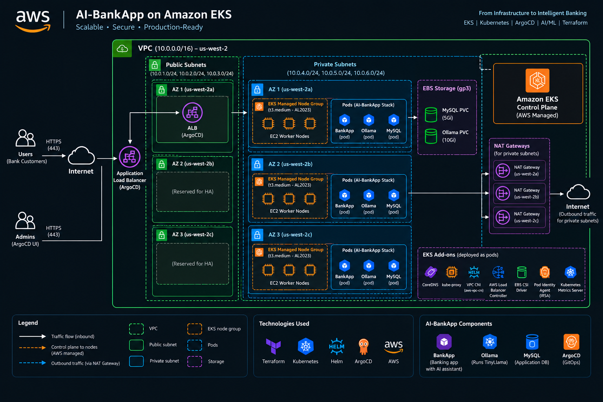

---

## Task 3: Provision the EKS Cluster

First, verify that all required DevOps tools are installed and available.

```bash
terraform --version    # >= 1.0
aws --version          # AWS CLI v2
kubectl version --client
helm version
```
The required tools are available, so the environment is ready to provision the EKS infrastructure.

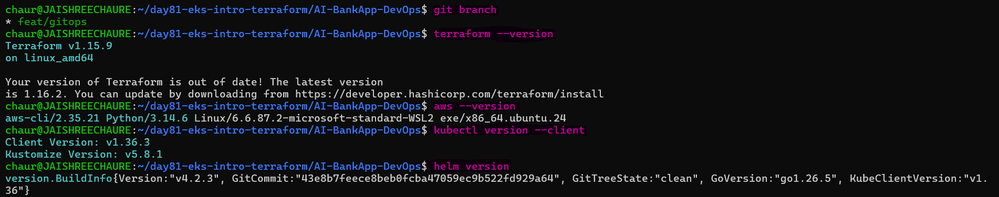 

Configure AWS credentials and verify that Terraform will use the expected AWS account.

```bash
aws configure
# Enter: Access Key ID, Secret Access Key, Region (us-west-2), Output (json)

# Verify
aws sts get-caller-identity
```
The AWS identity was successfully verified before creating any infrastructure.

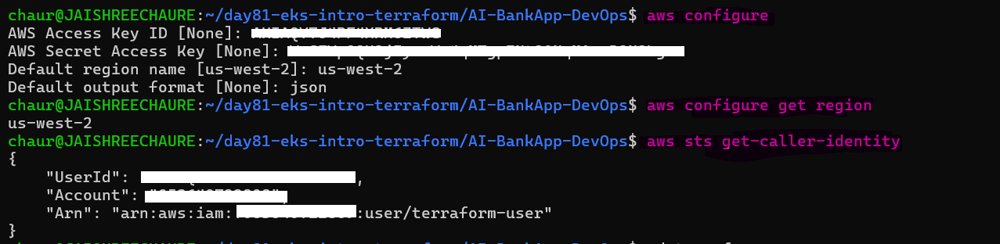 

Initialize Terraform and download the required modules and providers.

```bash
cd terraform
terraform init -upgrade
```
The `-upgrade` option was required to resolve the provider lock-file mismatch and install provider versions compatible with the EKS module.

Terraform initialized successfully with the required modules and providers.

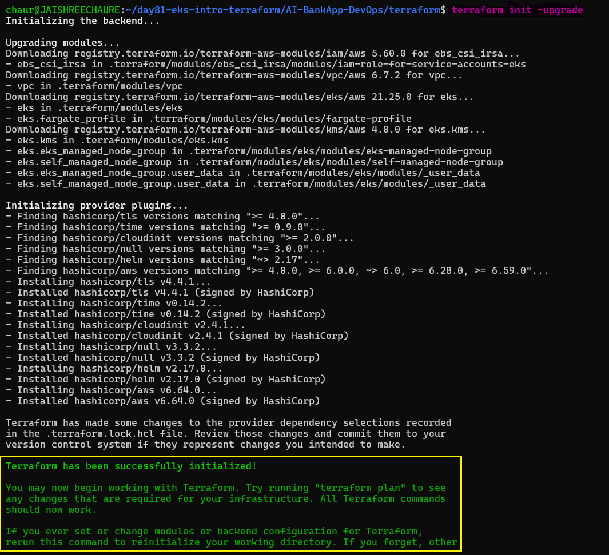 

Validate the configuration and review the infrastructure plan.

```bash
terraform providers
terraform validate
terraform plan
```
The configuration passed validation, and the Terraform plan showed the expected EKS infrastructure before deployment.

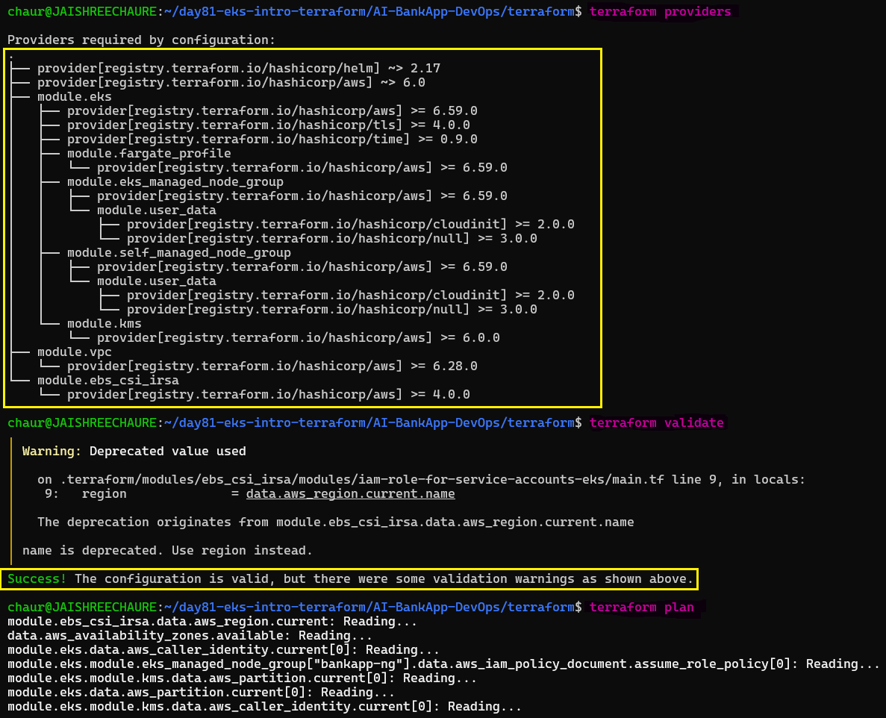 

The plan included:
- 1 VPC with 9 subnets, NAT gateway, internet gateway
- 1 EKS cluster with control plane
- 1 managed node group (3x t3.medium)
- 6 EKS add-ons
- IAM roles and policies for the cluster, nodes, and EBS CSI driver
- ArgoCD Helm release

Apply the reviewed Terraform plan to provision the complete EKS environment.

```bash
terraform apply
```
```text
Apply complete! Resources: 84 added, 0 changed, 0 destroyed.
```
Terraform successfully provisioned the infrastructure with:

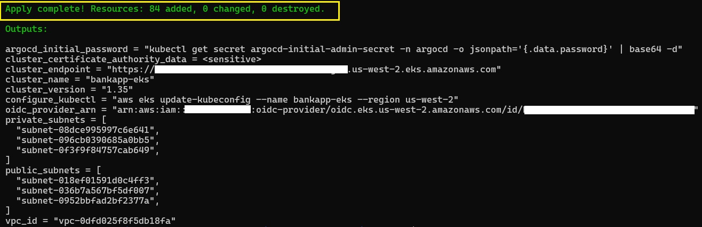 

**The EKS provisioning process can take 15-20 minutes because AWS must create the VPC, EKS control plane, managed node group, add-ons, IAM resources, and LoadBalancer.**

Finally, review the Terraform outputs to retrieve important cluster information.

```bash
terraform output
```
The outputs provide the EKS cluster name, Kubernetes version, cluster endpoint, VPC and subnet IDs, OIDC provider ARN, and the command required to configure `kubectl`.

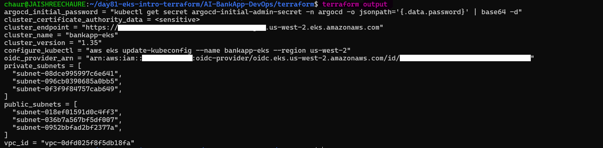

---

## Task 4: Connect to Your Cluster

Update `kubectl` configuration to connect to the newly created EKS cluster.

```bash
aws eks update-kubeconfig --name bankapp-eks --region us-west-2
```
Verify the cluster connection and confirm the worker nodes are ready.

```bash
# Check context
kubectl config current-context

# Cluster info
kubectl cluster-info

# List nodes
kubectl get nodes -o wide
```
The EKS cluster is reachable, with 3 worker nodes in `Ready` state.

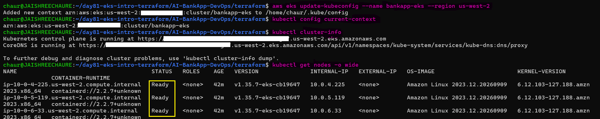

You should see 3 nodes with status `Ready`, instance type `t3.medium`, spread across 3 AZs.

Check the Kubernetes system components and verify monitoring and storage add-ons.

```bash
# System pods
kubectl get pods -n kube-system

# All the add-ons are running
kubectl get daemonsets -n kube-system

# EBS CSI driver
kubectl get pods -n kube-system -l app.kubernetes.io/name=aws-ebs-csi-driver

# Metrics server (enables kubectl top and HPA)
kubectl top nodes
```
The core EKS components, EBS CSI driver, and Metrics Server are running successfully.

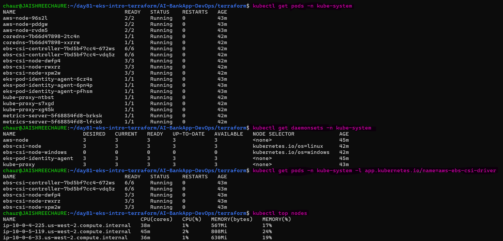 

Verify that ArgoCD is running and exposed through a LoadBalancer service.

```bash
kubectl get pods -n argocd
kubectl get svc -n argocd
```
ArgoCD components are running, and the `argocd-server` service is exposed through an AWS LoadBalancer.

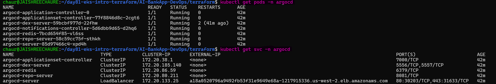

Retrieve the ArgoCD admin credentials and LoadBalancer hostname.

```bash
kubectl -n argocd get secret argocd-initial-admin-secret -o jsonpath="{.data.password}" | base64 -d
```
Get the ArgoCD LoadBalancer URL:
```bash
kubectl get svc -n argocd argocd-server -o jsonpath='{.status.loadBalancer.ingress[0].hostname}'
```
The ArgoCD admin password and external LoadBalancer endpoint are available for browser access.

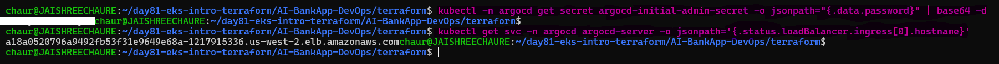

Open the ArgoCD LoadBalancer hostname returned by the command above in the browser.

```text
http://<ARGOCD-LOADBALANCER-HOSTNAME>
```
Sign in using:

```text
Username: admin
Password: <password retrieved above>
```
The ArgoCD login page is accessible and authentication is working successfully.

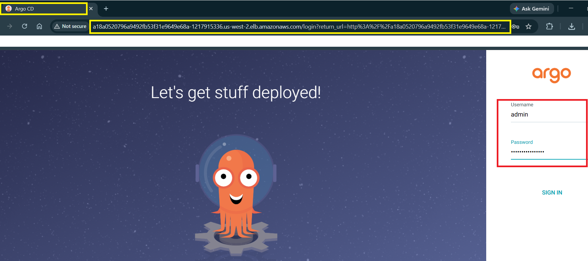 

After signing in, verify the ArgoCD Applications dashboard.

The ArgoCD dashboard is `accessible` and `ready` for the GitOps deployment workflow in Days 84–86.

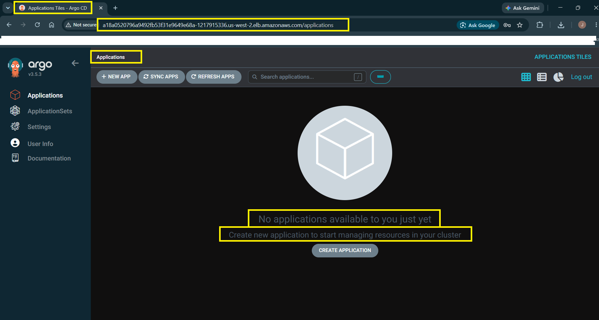

---

## Task 5: Deploy the AI-BankApp Manually (Before ArgoCD)

Before setting up GitOps, deploy the application manually to validate the EKS cluster and application stack.

Apply the namespace and storage resources from the `k8s/` directory:

```bash
cd ../  # Back to the repo root

kubectl apply -f k8s/namespace.yml
kubectl apply -f k8s/pv.yml
kubectl apply -f k8s/pvc.yml
```
The `bankapp` namespace and EBS-backed storage resources were created successfully.

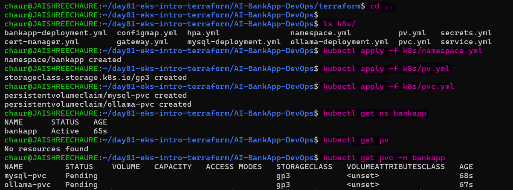 

Deploy the application configuration, database, services, Ollama, BankApp, and HPA.

```bash
kubectl apply -f k8s/configmap.yml
kubectl apply -f k8s/secrets.yml
kubectl apply -f k8s/mysql-deployment.yml
kubectl apply -f k8s/service.yml
kubectl apply -f k8s/ollama-deployment.yml
kubectl apply -f k8s/bankapp-deployment.yml
kubectl apply -f k8s/hpa.yml
```
All required Kubernetes resources for the AI-BankApp stack were created successfully.

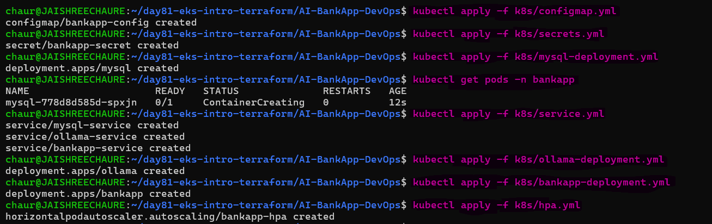

Verify that the PVCs are provisioned and bound to EBS-backed persistent volumes.

```bash
kubectl get pvc -n bankapp
kubectl get pv
kubectl get storageclass
```
Both PVCs are `Bound`, with 5Gi for MySQL and 10Gi for Ollama using the `gp3` StorageClass.

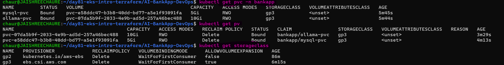

Watch the application pods start and become ready.

```bash
kubectl get pods -n bankapp -w
```
MySQL, Ollama, and all BankApp replicas reached `Running` and `Ready` status.

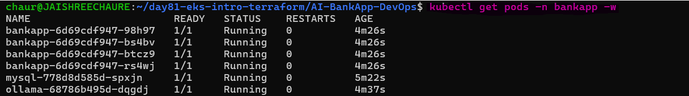 

The startup order is:
1. MySQL starts and becomes healthy (15-30 seconds)
2. Ollama starts and pulls the TinyLlama model (2-5 minutes)
3. BankApp init containers wait for both, then the app starts (30-60 seconds after dependencies)

Verify the application services and Horizontal Pod Autoscaler.

```bash
kubectl get svc -n bankapp
kubectl get hpa -n bankapp
```
The BankApp services are available internally, and the HPA is configured with 2–4 replicas.

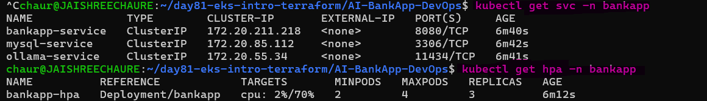

Expose the BankApp locally using port forwarding.

```bash
kubectl port-forward svc/bankapp-service -n bankapp 8080:8080
```
Port forwarding successfully connected the local port `8080` to the BankApp service.

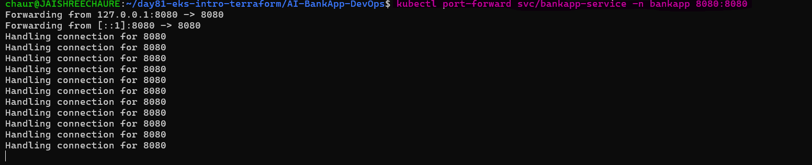

Open the application in the browser:

```bash
http://localhost:8080 # you should see the AI-BankApp login page
```
Register an account and sign in to validate the application and try the AI chatbot.

In the BankApp browser, click **Create one** and register a new user.

Example test account:
```text
Username: Jaishree Chaure
Password: Test@1234
```
After registration, sign in with the newly created account and verify that the dashboard loads successfully.

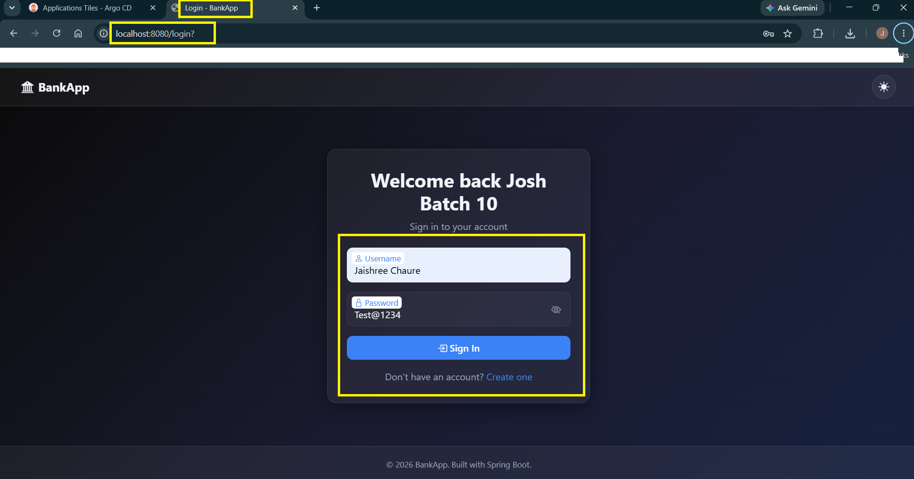 

Log in and test the application dashboard and AI Assistant.

The new user can successfully access the BankApp dashboard and AI Assistant.

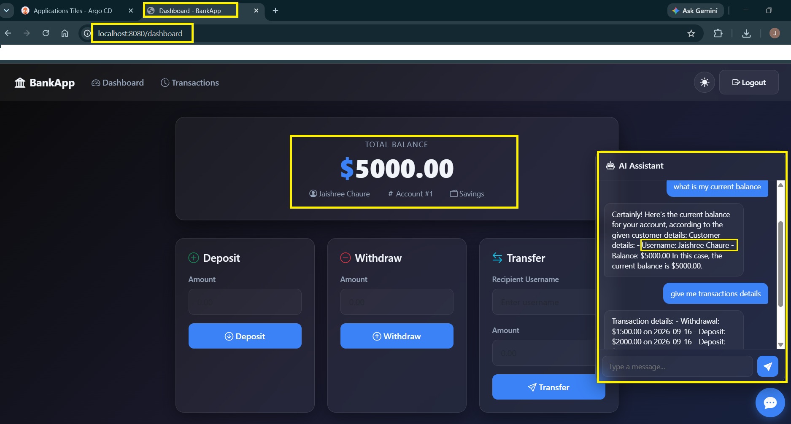

Verify the Horizontal Pod Autoscaler from a second terminal while the port-forward terminal continues running.

```bash
kubectl get hpa -n bankapp
kubectl get pods -n bankapp
```
The HPA is active and the BankApp pods are running successfully.

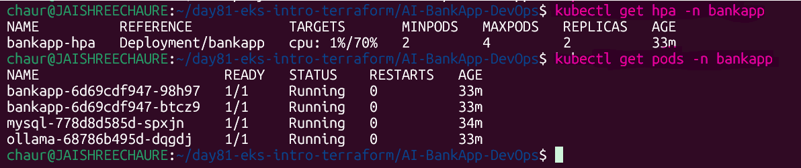

---

## Task 6: Understand EKS Costs and Clean Up Strategy

Understand the main cost components of the AI-BankApp EKS environment.

| Component | Cost (approximate) |
|-----------|-------------------|
| EKS Control Plane | $0.10/hr (~$73/month) |
| t3.medium nodes (3x) | ~$0.042/hr each (~$91/month total) |
| NAT Gateway | ~$0.045/hr + data transfer (~$33/month) |
| EBS volumes (15Gi total) | ~$1.50/month |
| LoadBalancer (ArgoCD) | ~$0.025/hr (~$18/month) |
| **Total for this lab** | **~$220/month (~$7/day)** |

**Important:** Do NOT leave the cluster running when you are not using it.

Delete the BankApp workload while keeping the EKS cluster available for Days 82–83.

```bash
kubectl delete -f k8s/hpa.yml
kubectl delete -f k8s/bankapp-deployment.yml
kubectl delete -f k8s/ollama-deployment.yml
kubectl delete -f k8s/mysql-deployment.yml
kubectl delete -f k8s/service.yml
kubectl delete -f k8s/secrets.yml
kubectl delete -f k8s/configmap.yml
kubectl delete -f k8s/pvc.yml
kubectl delete -f k8s/pv.yml
kubectl delete -f k8s/namespace.yml
```
The BankApp namespace, workloads, services, and persistent storage were successfully removed.

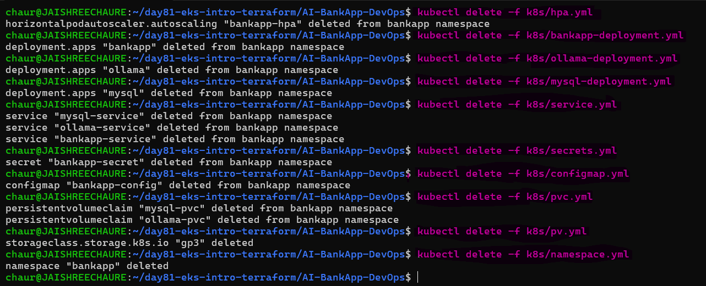 

Destroy the complete Terraform-managed EKS infrastructure when the cluster is no longer required.

```bash
cd terraform
terraform destroy
```
Terraform successfully destroyed all 84 resources created for the Day 81 EKS environment.

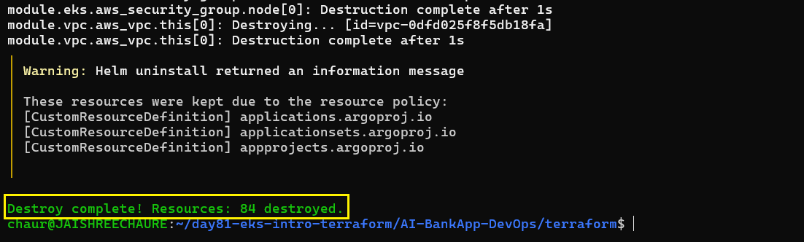

**Document:** What are the cost components of the AI-BankApp EKS setup? Why is the NAT Gateway surprisingly expensive?

- `EKS Control Plane` – Managed Kubernetes control plane charged hourly by AWS
- `EC2 Worker Nodes` – Compute instances where application pods run
- `NAT Gateway` – Enables outbound internet access for private subnet nodes
- `Load Balancer (ELB)` – Exposes services such as ArgoCD
- `EBS Volumes` – Persistent storage for MySQL and application data
- `Data Transfer` – Network usage for internet and inter-AZ communication

---

**Why is the NAT Gateway surprisingly expensive?**

Worker nodes run in private subnets and use the NAT Gateway for outbound internet access.

- It charges **per hour (~$32/month per NAT Gateway)** even if idle
- It also charges **per GB of data processed (~$0.045/GB)**
- Outbound traffic from private nodes can pass through the NAT Gateway
- In production, deploying NAT Gateways across multiple AZs increases the cost

**EKS cost breakdown table**

| **Component** | **Details** | **Cost (Approx)** |
|---|---|---:|
| **EKS Control Plane** | Managed Kubernetes control plane | **~$0.10/hr → ~$72–73/month** |
| **EC2 Worker Nodes** | 3 × `t3.medium` | **~$90–95/month** |
| **NAT Gateway** | Outbound internet for private subnets | **~$32/month + data charges** |
| **EBS Volumes** | ~15 GiB storage | **~$1.5–2/month** |
| **Load Balancer (ELB)** | ArgoCD external access | **~$16–20/month** |
| **Data Transfer** | Network usage | **Variable** |
| **Total Estimated Cost** | | **~$210–225/month + variable data charges** |