# Day 82 -- EKS Networking with Gateway API and Persistent Storage

## Before Starting Day 82 Tasks

Recreate the Day 81 EKS infrastructure before starting the Day 82 tasks.

```bash
cd ~/day82-eks-networking/AI-BankApp-DevOps/terraform

terraform init
terraform apply
```
Update kubeconfig:

```bash
aws eks update-kubeconfig --region us-west-2 --name bankapp-eks
```
Verify the cluster:

```bash
kubectl get nodes
```
---

## Task 1: Understand Gateway API vs Ingress

The AI-BankApp uses the Gateway API instead of the traditional Ingress resource. Research the differences:

| Feature | Ingress | Gateway API |
|---------|---------|-------------|
| API maturity | Stable but limited | GA since Kubernetes 1.26 |
| Traffic splitting | Not supported | Built-in (weighted backends) |
| Header matching | Annotation-dependent | Native HTTPRoute rules |
| Role separation | Single resource | GatewayClass (infra) -> Gateway (ops) -> HTTPRoute (dev) |
| TLS management | Annotation-based | Native TLS config in Gateway listeners |
| Session affinity | Not standardized | BackendTrafficPolicy (with Envoy) |

**The AI-BankApp's Gateway architecture:**

The architecture routes incoming traffic from the Internet through an AWS NLB to Envoy Gateway. The Gateway handles HTTP/HTTPS traffic and TLS termination, while the HTTPRoute forwards requests to the BankApp Service and its application Pods. Session affinity keeps user sessions connected to the appropriate BankApp Pod.

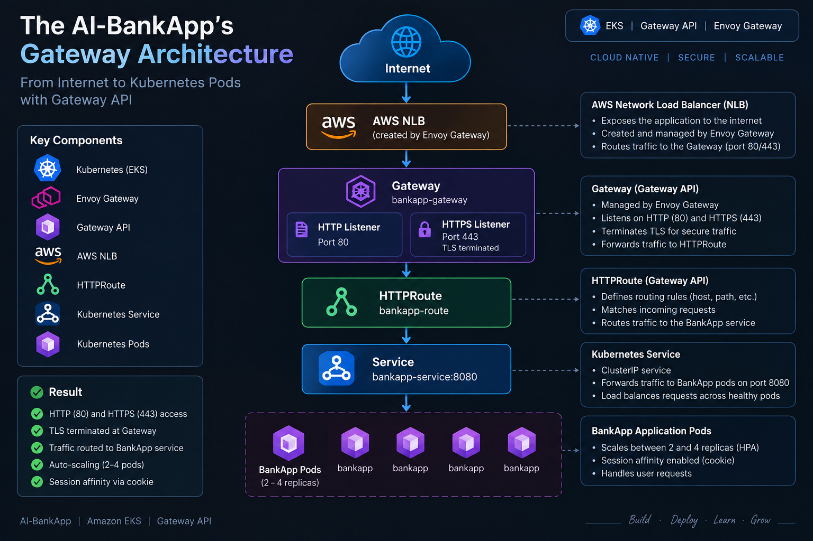

---

## Task 2: Install Envoy Gateway

Envoy Gateway is the Gateway API implementation used by the AI-BankApp. It manages Envoy Proxy and translates Gateway API resources into the required traffic configuration.

Install Envoy Gateway with Helm:

```bash
helm install envoy-gateway oci://docker.io/envoyproxy/gateway-helm \
  --version v1.4.0 \
  -n envoy-gateway-system --create-namespace \
  --wait
```
Envoy Gateway installed successfully and the controller pod is running.

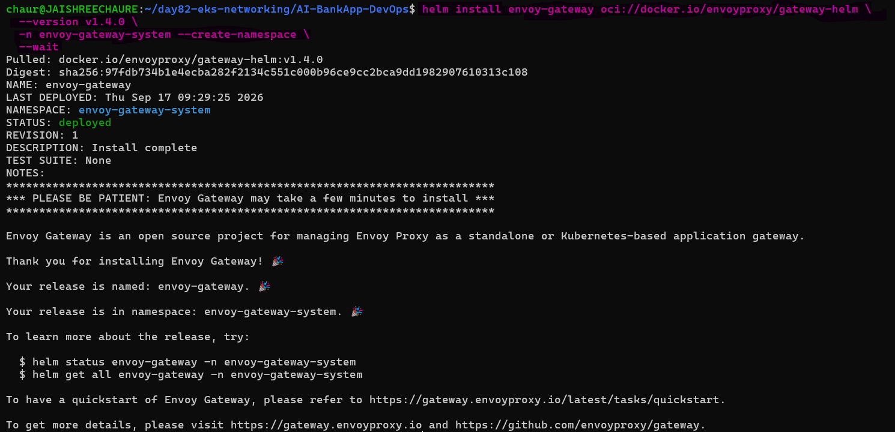

Verify the Envoy Gateway pod and check whether the GatewayClass is registered:

```bash
kubectl get pods -n envoy-gateway-system
kubectl get gatewayclass
```
The GatewayClass check is performed to confirm that Envoy Gateway has registered as a Gateway API implementation.

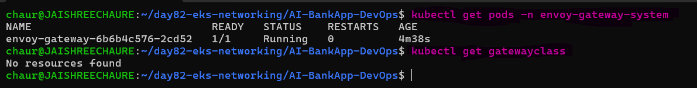 

The Envoy Gateway controller is running. If the GatewayClass is not yet available, install the Gateway API CRDs.

```bash
kubectl get crd gateways.gateway.networking.k8s.io 2>/dev/null || \
  kubectl apply -f https://github.com/kubernetes-sigs/gateway-api/releases/download/v1.2.1/standard-install.yaml
```
The Gateway API CRDs provide the Kubernetes resources, such as Gateway and HTTPRoute, that Envoy Gateway manages.

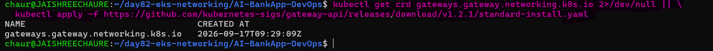

Verify that the Gateway API CRD is installed:

```bash
kubectl get crd gateways.gateway.networking.k8s.io
```
Then verify the GatewayClass:

```bash
kubectl get gatewayclass
```
The `envoy-gateway` GatewayClass should now be available for creating Gateway resources.

---

## Task 3: Deploy the AI-BankApp with Gateway API

First, verify that the AI-BankApp workloads are running. If the Day 81 workloads are not present, redeploy the core Kubernetes manifests.

```bash
kubectl get pods -n bankapp
```
If required, redeploy the application resources:

```bash
cd AI-BankApp-DevOps
kubectl apply -f k8s/namespace.yml
kubectl apply -f k8s/pv.yml
kubectl apply -f k8s/pvc.yml
kubectl apply -f k8s/configmap.yml
kubectl apply -f k8s/secrets.yml
kubectl apply -f k8s/mysql-deployment.yml
kubectl apply -f k8s/service.yml
kubectl apply -f k8s/ollama-deployment.yml
kubectl apply -f k8s/bankapp-deployment.yml
kubectl apply -f k8s/hpa.yml
```
Verify the workloads and services:

```bash
kubectl get pods -n bankapp -w
kubectl get pods -n bankapp
kubectl get svc -n bankapp
```
The BankApp, MySQL, Ollama, and supporting resources are deployed and ready for Gateway API configuration.

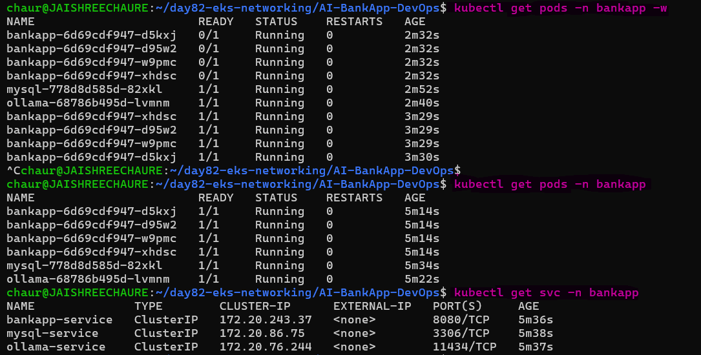

**Now study and apply the Gateway configuration.**

Open `k8s/gateway.yml` and understand each resource:

The `k8s/gateway.yml` file defines the complete traffic flow from the external load balancer to the BankApp service.

It contains four resources:

**1. GatewayClass** -- identifies Envoy Gateway as the controller responsible for managing the Gateway.

```yaml
apiVersion: gateway.networking.k8s.io/v1
kind: GatewayClass
metadata:
  name: envoy-gateway
spec:
  controllerName: gateway.envoyproxy.io/gatewayclass-controller
```

**2. Gateway** -- defines the HTTP/HTTPS listeners. Envoy Gateway uses this configuration to provision an AWS Network Load Balancer.

```yaml
apiVersion: gateway.networking.k8s.io/v1
kind: Gateway
metadata:
  name: bankapp-gateway
  namespace: bankapp
spec:
  gatewayClassName: envoy-gateway
  listeners:
    - name: http
      protocol: HTTP
      port: 80
    - name: https
      protocol: HTTPS
      port: 443
      hostname: 52.24.140.58.nip.io
      tls:
        mode: Terminate
        certificateRefs:
          - name: bankapp-tls
```
When this is applied, Envoy Gateway creates an AWS NLB (Network Load Balancer) automatically.

**3. HTTPRoute** -- matches requests for the BankApp hostname and forwards them to `bankapp-service:8080`.

```yaml
apiVersion: gateway.networking.k8s.io/v1
kind: HTTPRoute
metadata:
  name: bankapp-route
  namespace: bankapp
spec:
  parentRefs:
    - name: bankapp-gateway
      sectionName: https
    - name: bankapp-gateway
      sectionName: http
  rules:
    - matches:
        - path:
            type: PathPrefix
            value: /
      backendRefs:
        - name: bankapp-service
          port: 8080
```
**4. BackendTrafficPolicy** -- enables cookie-based session affinity so requests from the same user remain associated with the same BankApp pod.

```yaml
apiVersion: gateway.envoyproxy.io/v1alpha1
kind: BackendTrafficPolicy
metadata:
  name: bankapp-session
  namespace: bankapp
spec:
  targetRefs:
    - group: gateway.networking.k8s.io
      kind: HTTPRoute
      name: bankapp-route
  loadBalancer:
    type: ConsistentHash
    consistentHash:
      type: Cookie
      cookie:
        name: BANKAPP_AFFINITY
        ttl: 3600s
```
**Cookie-based session** affinity helps maintain Spring Security sessions when requests are distributed across multiple BankApp replicas.

Apply the Gateway configuration:

```bash
kubectl apply -f k8s/gateway.yml
```
All Gateway API resources were created successfully, including the Gateway, HTTPRoute, and session-affinity policy.

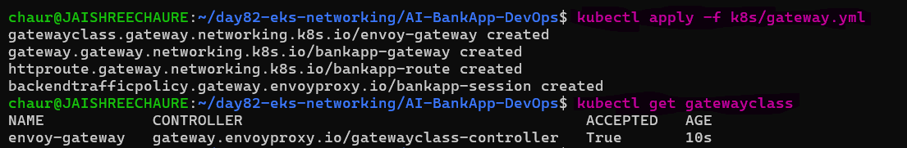 

Wait for the AWS Network Load Balancer to be provisioned:

```bash
kubectl get gateway -n bankapp -w
```
`PROGRAMMED=True` confirms that Envoy Gateway has successfully configured the Gateway and external load balancer.

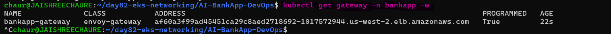 

Get the Gateway address:

```bash
export GATEWAY_IP=$(kubectl get gateway bankapp-gateway -n bankapp -o jsonpath='{.status.addresses[0].value}')

echo "App URL: http://$GATEWAY_IP"
```
The Gateway status provides the AWS NLB hostname used to reach the application externally.

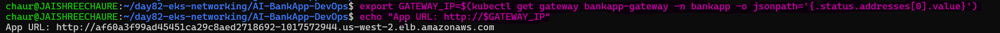 

Resolve the NLB hostname to its public IP addresses:

```bash
getent ahostsv4 $GATEWAY_IP
```
The NLB hostname resolves to public AWS IP addresses. One resolved IP is used with `nip.io` as the temporary application hostname.

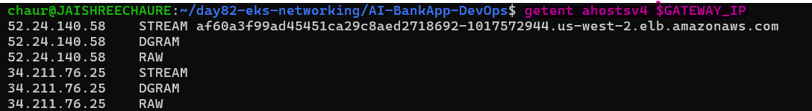

Verify the Gateway and HTTPRoute:

```bash
kubectl apply -f k8s/gateway.yml
kubectl get gateway -n bankapp
kubectl get httproute -n bankapp
```
The Gateway is programmed and the HTTPRoute is attached to it, confirming that traffic can be routed to the BankApp service.

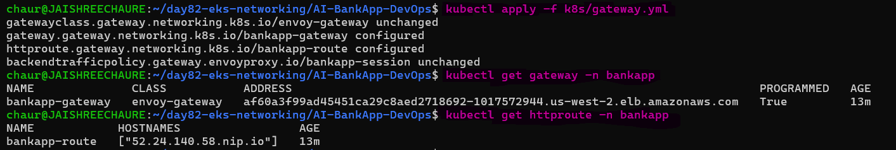 

Test the application through the AWS NLB:

```bash
export APP_HOST="52.24.140.58.nip.io"

curl -v -H "Host: $APP_HOST" http://$GATEWAY_IP
``` 
A `302 Found` response redirecting to `/login` confirms successful routing through the AWS NLB, Envoy Gateway, HTTPRoute, and BankApp service.

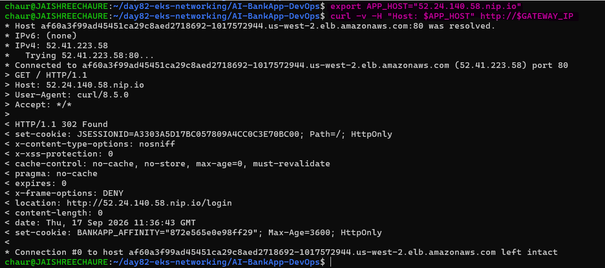 

Open the application in a browser using the NLB's resolved public IP with `nip.io`:

```text
http://<NLB-IP>.nip.io/login
```
For example:
```text
http://52.24.140.58.nip.io/login
```
The `nip.io` hostname maps the NLB's public IP to a temporary DNS name, allowing the BankApp to be accessed without configuring a custom domain.

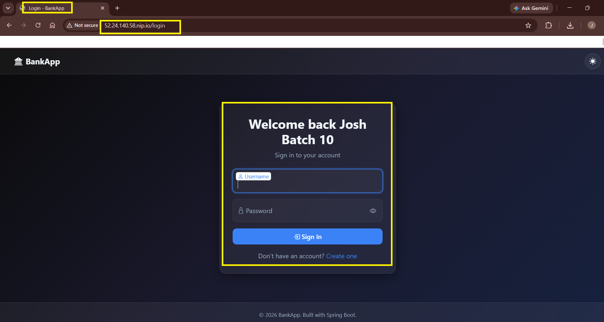

---

## Task 4: Set Up TLS with cert-manager

The AI-BankApp uses cert-manager with Let's Encrypt to automatically provision and manage HTTPS certificates.

Install cert-manager:
```bash
helm repo add jetstack https://charts.jetstack.io
helm repo update

helm install cert-manager jetstack/cert-manager \
  -n cert-manager --create-namespace \
  --set crds.enabled=true \
  --wait
```
cert-manager was installed successfully and provides the components required for certificate management.

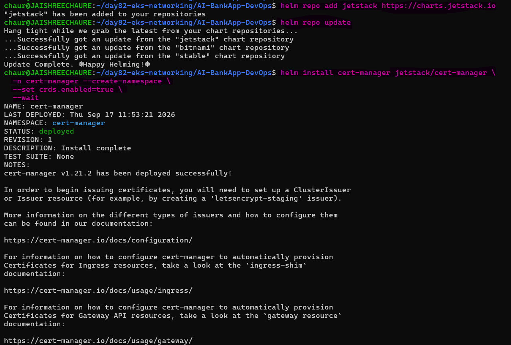 

Verify the cert-manager components:

```bash
kubectl get pods -n cert-manager
```
All cert-manager components are running and ready to process certificate requests.

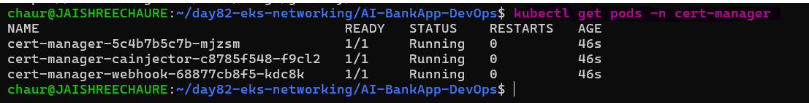 

Enable Gateway API support in cert-manager:

```bash
helm upgrade cert-manager jetstack/cert-manager \
  -n cert-manager \
  --set crds.enabled=true \
  --set config.gatewayAPI.enabled=true \
  --wait
```
Gateway API support allows cert-manager to use HTTP-01 challenges with Gateway and HTTPRoute resources.

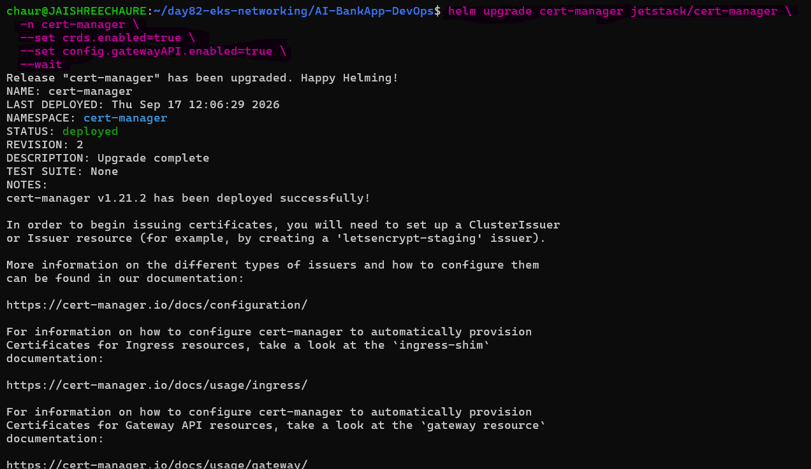

Restart cert-manager to load the updated configuration:

```bash
kubectl rollout restart deployment cert-manager -n cert-manager
kubectl rollout status deployment cert-manager -n cert-manager
kubectl get pods -n cert-manager
```
The cert-manager deployment restarted successfully with Gateway API support enabled.

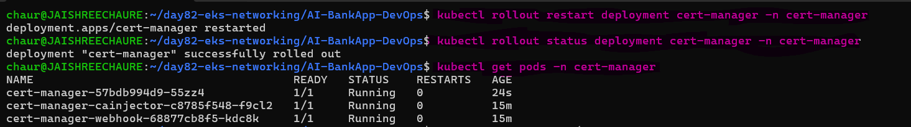

Create the Let's Encrypt `ClusterIssuer` from `k8s/cert-manager.yml`:

```yaml
apiVersion: cert-manager.io/v1
kind: ClusterIssuer
metadata:
  name: letsencrypt-prod
spec:
  acme:
    server: https://acme-v02.api.letsencrypt.org/directory
    email: chaurejaishree@gmail.com
    privateKeySecretRef:
      name: letsencrypt-account-key
    solvers:
      - http01:
          gatewayHTTPRoute:
            parentRefs:
              - group: gateway.networking.k8s.io
                kind: Gateway
                name: bankapp-gateway
                namespace: bankapp
```
**How it works:**
1. cert-manager requests a certificate from Let's Encrypt
2. Let's Encrypt sends an HTTP-01 challenge
3. cert-manager creates a temporary HTTPRoute to respond to the challenge
4. Let's Encrypt verifies and issues the certificate
5. cert-manager stores the certificate in the `bankapp-tls` Secret
6. The Gateway uses this Secret for HTTPS termination

Set the Gateway hostname in `k8s/gateway.yml` using the NLB's resolved public IP with `nip.io`:

```text
<NLB-IP>.nip.io
```
For this lab:

```text
52.24.140.58.nip.io
```
The Gateway hostname and certificate configuration use the same `nip.io` hostname so that the TLS certificate matches the application URL.

Apply the ClusterIssuer:

```bash
kubectl apply -f k8s/cert-manager.yml
kubectl get clusterissuer letsencrypt-prod
kubectl get certificate -n bankapp
kubectl get secret bankapp-tls -n bankapp
kubectl describe certificate bankapp-tls -n bankapp
```
The ClusterIssuer is ready, and cert-manager creates and processes the `bankapp-tls` certificate for the BankApp hostname.

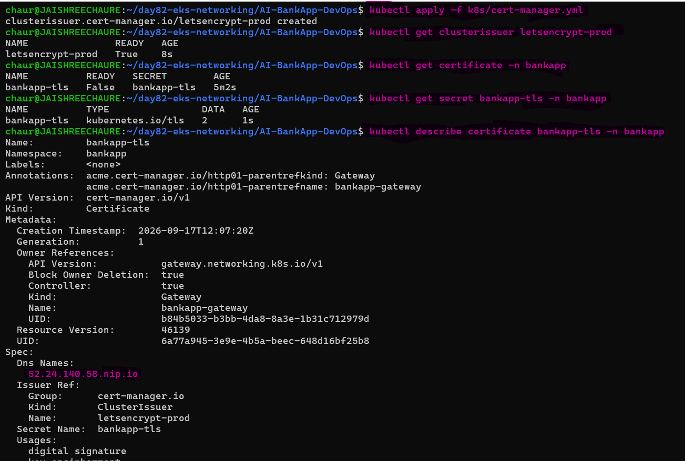

Verify the certificate issuance process:

```bash
kubectl get certificaterequest,order,challenge -n bankapp
kubectl get httproute -n bankapp
kubectl get certificate bankapp-tls -n bankapp -w
```
The CertificateRequest is approved and the ACME order becomes valid after the HTTP-01 challenge succeeds.

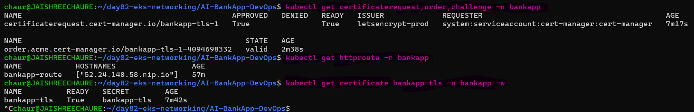 

Test the HTTPS endpoint:

```bash
curl -Iv https://<NLB-IP>.nip.io
```
A successful TLS handshake and trusted Let's Encrypt certificate confirm that HTTPS is configured correctly.

For quick DNS without a custom domain, `nip.io` maps the NLB's public IP to a temporary hostname.

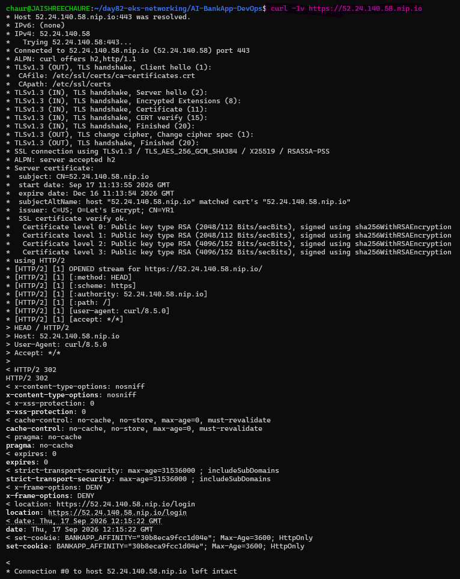 

Open the application in a browser:

```bash
https://<NLB-IP>.nip.io/login
```
For this lab:

```text
https://52.24.140.58.nip.io/login
```
The secure BankApp login page confirms end-to-end HTTPS access through Envoy Gateway.

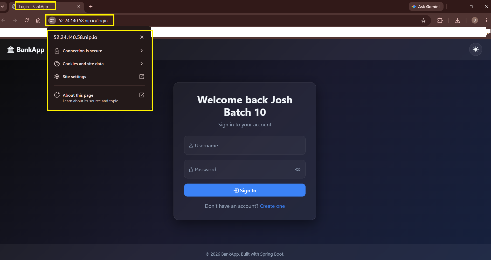

**Verify**

- HTTPS is enabled
- Browser shows **Connection is secure**
- Let's Encrypt certificate is trusted
- BankApp login page loads successfully

---

## Task 5: Understand EBS Persistent Storage in Action

The AI-BankApp uses EBS volumes for MySQL (5Gi) and Ollama (10Gi). These volumes provide persistent storage for stateful workloads running on EKS.

Check the storage setup:

```bash
# StorageClass
kubectl get storageclass gp3

# PVCs
kubectl get pvc -n bankapp

# PVs (dynamically provisioned)
kubectl get pv
```
The PVCs are bound to dynamically provisioned PVs using the `gp3` StorageClass.

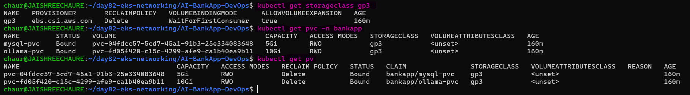

**Find the actual EBS volumes in AWS:**

```bash
aws ec2 describe-volumes \
  --region us-west-2 \
  --filters "Name=tag:kubernetes.io/cluster/bankapp-eks,Values=owned" \
  --query "Volumes[*].{ID:VolumeId,Size:Size,AZ:AvailabilityZone,State:State}" \
  --output table
```
The AWS output shows the EBS volumes dynamically created by the EBS CSI driver for the BankApp PVCs.

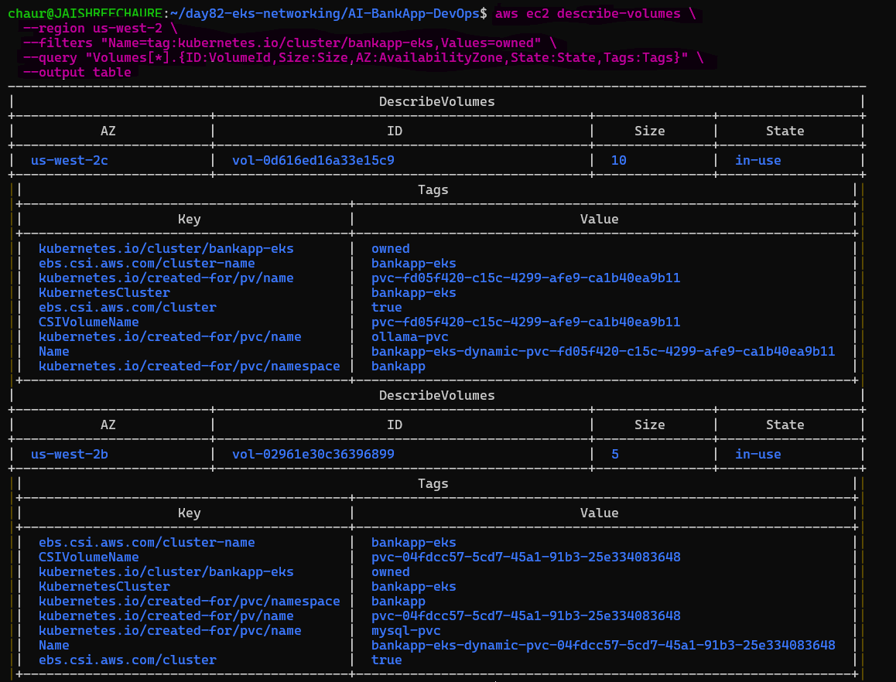 

**Key EBS concepts on EKS:**

- `WaitForFirstConsumer` -- the volume is created in the same AZ as the Pod that claims it
- `ReadWriteOnce` -- EBS can only attach to one node at a time
- `gp3` -- latest generation SSD, 3000 IOPS baseline, cheaper than gp2
- `allowVolumeExpansion: true` -- you can grow volumes without recreating them

**Test persistence**

Delete the MySQL Pod and verify that its data remains available:

```bash
# Check current MySQL data
kubectl exec -n bankapp deploy/mysql -- mysql -uroot -pTest@123 -e "SHOW DATABASES;"

# Delete the MySQL Pod
kubectl delete pod -n bankapp -l app=mysql

# Watch the replacement Pod
kubectl get pods -n bankapp -l app=mysql -w

# Verify the data survived
kubectl exec -n bankapp deploy/mysql -- mysql -uroot -pTest@123 -e "SHOW DATABASES;"
```
The MySQL Pod is recreated, but the bankappdb database remains because the data is stored on the persistent EBS volume rather than inside the Pod.

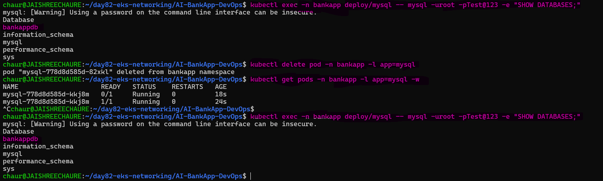

---

## Task 6: Explore HPA and Node Capacity

The AI-BankApp uses a Horizontal Pod Autoscaler (HPA) to maintain between 2 and 4 BankApp Pods based on CPU utilization.

```bash
kubectl get hpa -n bankapp
```
Check resource usage across nodes and application Pods:

```bash
kubectl top nodes
kubectl top pods -n bankapp
```
The HPA is configured with a 70% CPU target and maintains the BankApp between 2 and 4 replicas. The metrics show the current CPU and memory consumption across the EKS cluster.

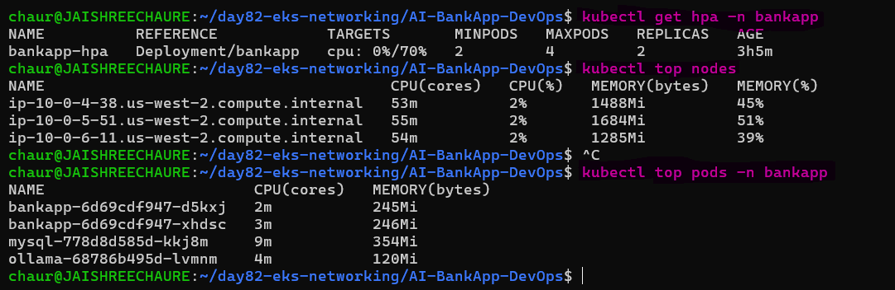 

**Resource budget for the AI-BankApp on 3x t3.medium nodes:**

| Component | CPU Request | Memory Request | Instances |
|-----------|-----------|---------------|-----------|
| BankApp | 250m | 256Mi | 2-4 Pods |
| MySQL | 250m | 256Mi | 1 Pod |
| Ollama | 900m | 2Gi | 1 Pod |
| Init containers | 50m | 32Mi | Temporary |
| System Pods | ~500m | ~500Mi | Per node |
| **Total available** | **6000m (3 nodes)** | **12Gi (3 nodes)** | |

Ollama has the highest resource request. Scaling BankApp from 2 to 4 Pods increases the application's CPU requirements while leaving capacity for system workloads.

**Clean up the Day 82 workload:**

Remove the application resources before destroying the underlying EKS infrastructure:

```bash
kubectl delete -f k8s/gateway.yml 2>/dev/null
kubectl delete -f k8s/hpa.yml
kubectl delete -f k8s/bankapp-deployment.yml
kubectl delete -f k8s/ollama-deployment.yml
kubectl delete -f k8s/mysql-deployment.yml
kubectl delete -f k8s/service.yml
kubectl delete -f k8s/secrets.yml
kubectl delete -f k8s/configmap.yml
kubectl delete -f k8s/pvc.yml
kubectl delete -f k8s/pv.yml
kubectl delete -f k8s/namespace.yml
```
The BankApp workload and its supporting Kubernetes resources are removed from the cluster.

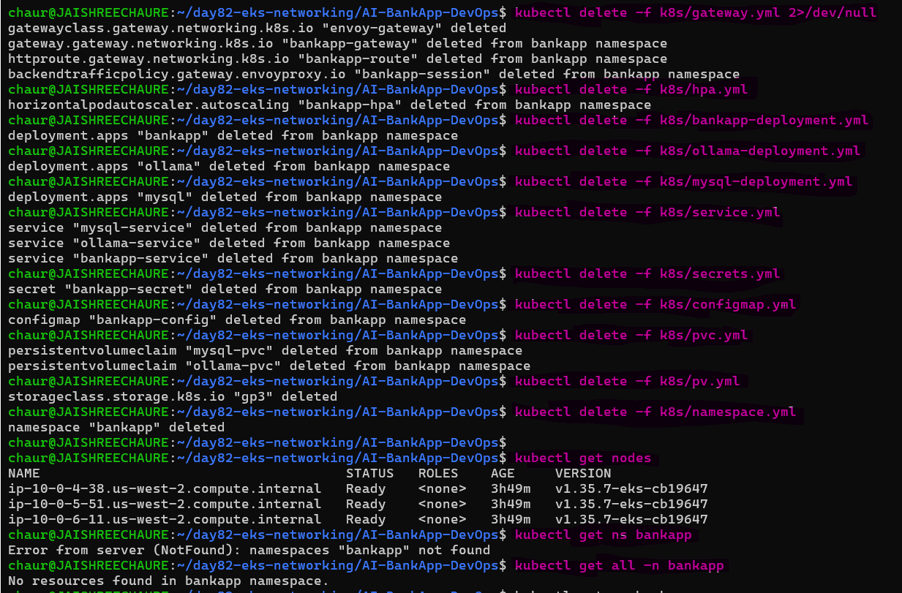 

**Check Terraform State**

Review the remaining Terraform-managed infrastructure before destroying it:

```bash
cd terraform
terraform state list | head
```
The Terraform state lists the AWS and EKS resources managed by the Day 81 infrastructure.

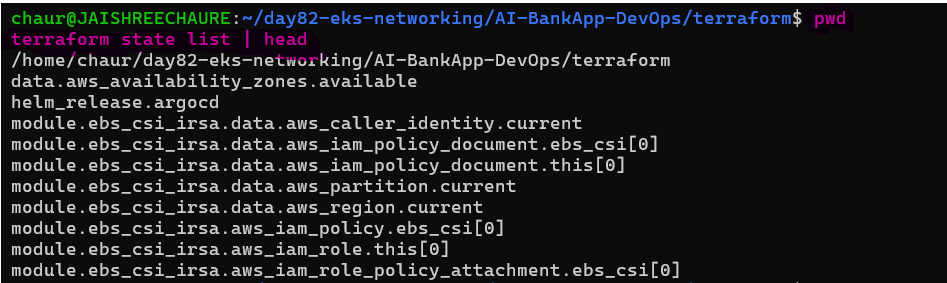 

**Destroy the EKS Infrastructure**

Since the Day 82 lab is complete, destroy the remaining Terraform infrastructure to avoid ongoing AWS charges:

```bash
terraform destroy
```
Terraform successfully removes the EKS infrastructure and its dependent AWS resources.

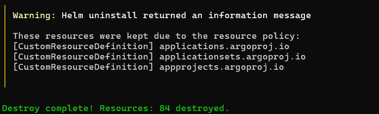

> **Note:** `terraform destroy` removes the EKS cluster and its infrastructure. For a Day 83 lab that depends on this cluster, recreate the infrastructure with `terraform init` and `terraform apply` before starting the next day.

---