# Day 83 -- EKS Project: Production Deployment of AI-BankApp

## Task 1: Deploy the Complete AI-BankApp Stack

### 1. Re-Provision the EKS Infrastructure

Since the previous infrastructure was completely torn down, first recreate the EKS infrastructure using Terraform and update the local kubeconfig.

```bash
cd AI-BankApp-DevOps/terraform
terraform apply
aws eks update-kubeconfig --name bankapp-eks --region us-west-2
```
### 2. Verify the EKS Cluster

Verify that all EKS worker nodes are healthy and in Ready state.

```bash
kubectl get nodes
```
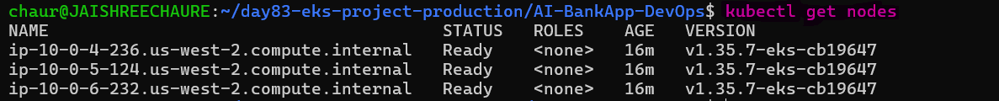

### 3. Create the Application Foundation

Move to the application directory and create the namespace, persistent storage, configuration, secrets, MySQL, services, and Ollama resources.

```bash
cd AI-BankApp-DevOps

# Namespace and storage
kubectl apply -f k8s/namespace.yml
kubectl apply -f k8s/pv.yml
kubectl apply -f k8s/pvc.yml

# Configuration
kubectl apply -f k8s/configmap.yml
kubectl apply -f k8s/secrets.yml

# Database and AI service
kubectl apply -f k8s/mysql-deployment.yml
kubectl apply -f k8s/service.yml
kubectl apply -f k8s/ollama-deployment.yml
```
The application foundation and its supporting Kubernetes resources were created successfully.

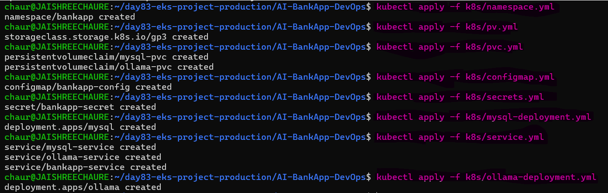 

### 4. Wait for dependencies

Wait for MySQL and Ollama to become ready before deploying BankApp.

```bash
echo "Waiting for MySQL..."
kubectl wait --for=condition=ready pod -l app=mysql -n bankapp --timeout=120s

echo "Waiting for Ollama (this takes 2-5 minutes for model pull)..."
kubectl wait --for=condition=ready pod -l app=ollama -n bankapp --timeout=600s
```
Both `MySQL` and `Ollama` became ready and available for the application.

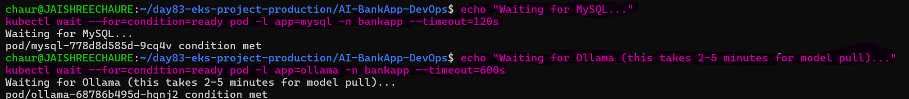

### 5. Deploy BankApp and HPA

Deploy the Spring Boot BankApp and configure Horizontal Pod Autoscaling.

```bash
kubectl apply -f k8s/bankapp-deployment.yml
kubectl apply -f k8s/hpa.yml
```
The BankApp deployment and HPA were created successfully.

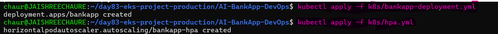 

### 6. Wait for BankApp

Wait until the BankApp pods become ready.

```bash
echo "Waiting for BankApp..."
kubectl wait --for=condition=ready pod -l app=bankapp -n bankapp --timeout=300s
```
All BankApp replicas became ready and started serving the application.

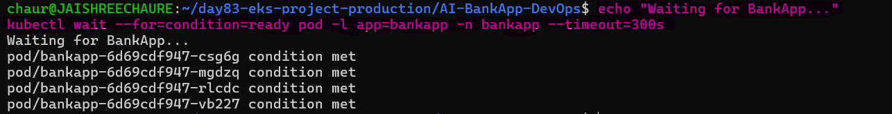

### 7. Verify the Complete Stack

Verify all workloads, services, HPA, and persistent volumes in the `bankapp` namespace.

```bash
kubectl get all -n bankapp
kubectl get pvc -n bankapp
kubectl get hpa -n bankapp
kubectl get pods -n bankapp -o wide
```
The complete AI-BankApp stack was deployed successfully:

- MySQL: 1 pod running with a 5Gi PVC
- Ollama: 1 pod running with a 10Gi PVC
- BankApp: 2 replicas running under HPA
- Services: 3 ClusterIP services
- PVCs: Bound using the `gp3` StorageClass
- BankApp replicas: Running across EKS worker nodes

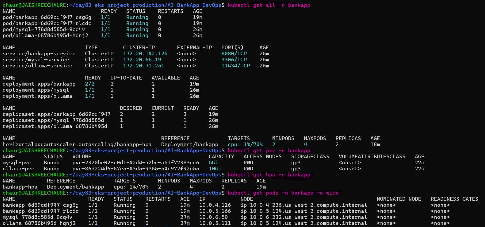

---

## Task 2: Set Up Gateway API and Access the App

### 1. Install Envoy Gateway

Install Envoy Gateway v1.4.0 in the `envoy-gateway-system` namespace.

```bash
helm install envoy-gateway oci://docker.io/envoyproxy/gateway-helm \
  --version v1.4.0 \
  -n envoy-gateway-system --create-namespace \
  --wait 2>/dev/null || echo "Already installed"
```
Envoy Gateway was installed successfully using Helm.

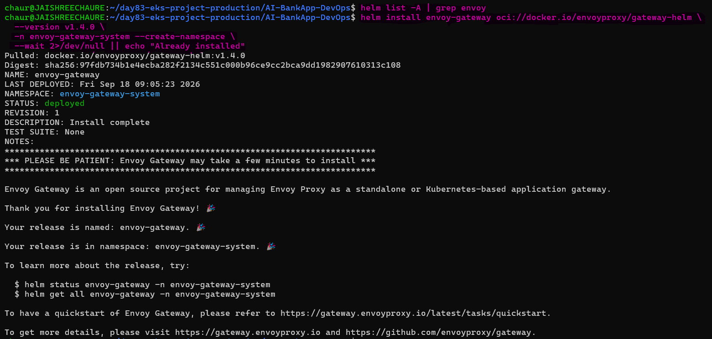

Verify that the Envoy Gateway pod is running.

```bash
kubectl get pods -n envoy-gateway-system
```
The Envoy Gateway controller is running successfully.

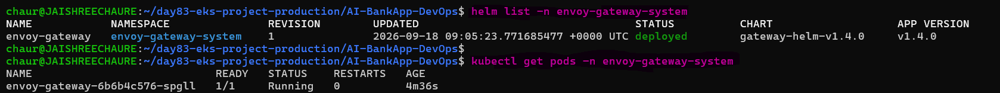 

### 2. Apply the Gateway Configuration

Apply the Gateway API resources for BankApp.

```bash
kubectl apply -f k8s/gateway.yml
```
The `GatewayClass`, `Gateway`, `HTTPRoute`, and `BackendTrafficPolicy` resources were created successfully.

Wait for the AWS Network Load Balancer address and confirm the Gateway is programmed.

```bash
kubectl get gateway -n bankapp -w
```
The Gateway is programmed and an AWS NLB address is assigned.

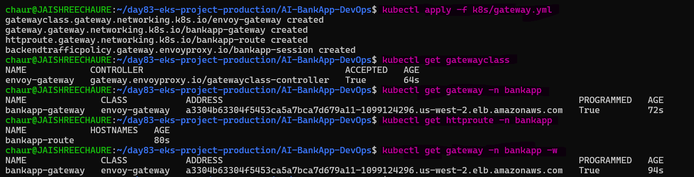

### 3. Get the Application URL

Retrieve the external Gateway address and store it in `APP_URL`.

```bash
export APP_URL=$(kubectl get gateway bankapp-gateway -n bankapp -o jsonpath='{.status.addresses[0].value}')

echo "AI-BankApp URL: http://$APP_URL"
```
The external AWS NLB endpoint is available for accessing the AI-BankApp.

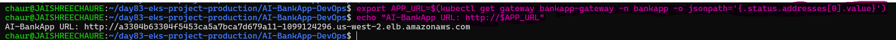

### 4. Validate Application Access

Check the Spring Boot health endpoint and verify the application response.

```bash
# Health check
curl -s http://$APP_URL/actuator/health | python3 -m json.tool

# Verify home page response
curl -s -o /dev/null -w "%{http_code}\n" http://$APP_URL/

# Verify login page
curl -s -o /dev/null -w "%{http_code}\n" http://$APP_URL/login
```
The health endpoint reports `UP`, the application redirects `/` to `/login` with `302`, and the login page returns `200`.

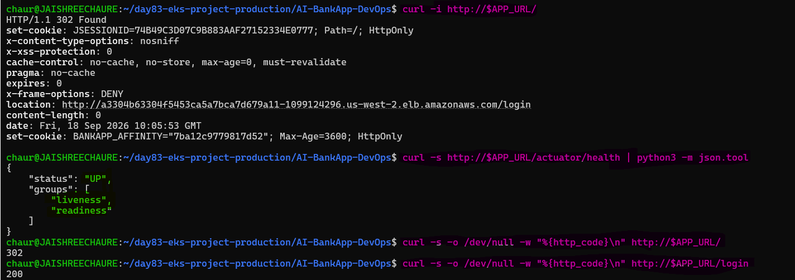 

### 5. Validate the BankApp UI

Open `http://$APP_URL` in a browser and validate the main application workflow:

1. Click "Register" and create an account
2. Log in with the created credentials.
3. Perform deposit, withdrawal, and transfer operations.
4. Try the AI chatbot -- ask a financial question
5. Toggle dark/light mode

- **BankApp Registration** -- Created a new user, **Jaishree Chaure**, and verified the registration and login flow.

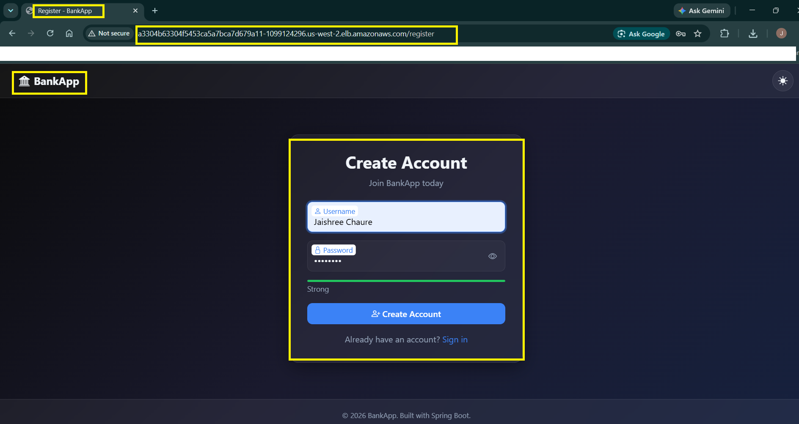

- **Banking Transactions** -- Created a second user for transfer testing and verified deposit, withdrawal, transfer, and transaction history.

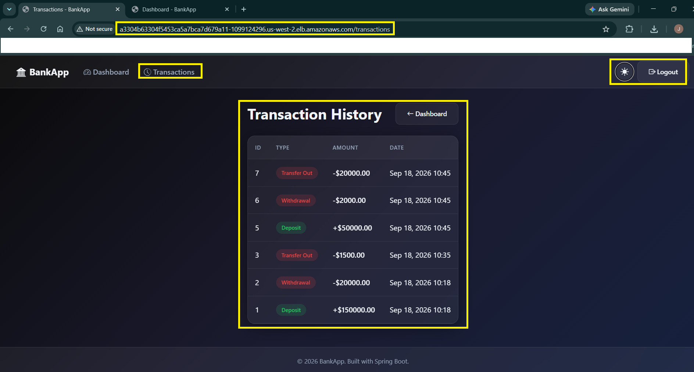 

- **AI Assistant** -- Tested the AI Assistant with a financial query and verified that it could access recent transfer information.

- **Theme Toggle** -- Verified the BankApp dark/light mode toggle from the dashboard.

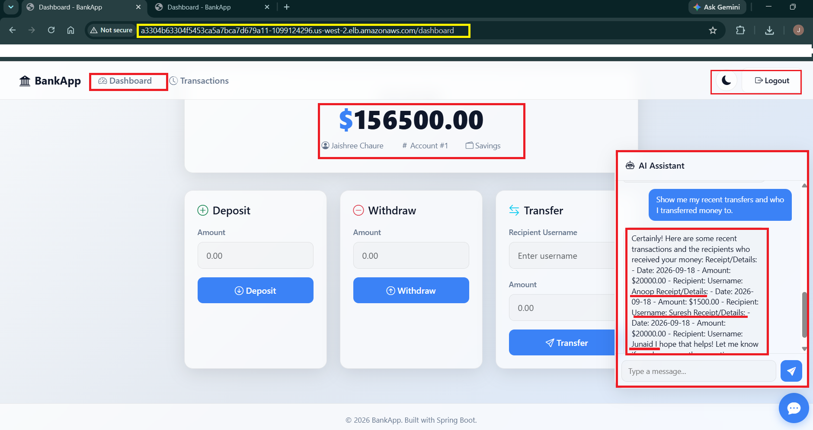

**The complete AI-BankApp stack is accessible through the EKS Gateway, with Spring Boot, MySQL, Ollama, persistent storage, and autoscaling running on Amazon EKS.**

---

## Task 3: Deploy the Monitoring Stack

Deploy Prometheus and Grafana to monitor the AI-BankApp on EKS.

### 1. Install Prometheus and Grafana

Add the Prometheus Community repository and deploy the `kube-prometheus-stack`.

```bash
helm repo add prometheus-community https://prometheus-community.github.io/helm-charts
helm repo update

helm install monitoring prometheus-community/kube-prometheus-stack \
  -n monitoring --create-namespace \
  --set grafana.adminPassword=admin123 \
  --set prometheus.prometheusSpec.retention=3d \
  --set prometheus.prometheusSpec.resources.requests.memory=256Mi \
  --set prometheus.prometheusSpec.resources.requests.cpu=100m \
  --wait --timeout 600s
```
Prometheus, Grafana, Alertmanager, Node Exporter, and kube-state-metrics were deployed successfully.

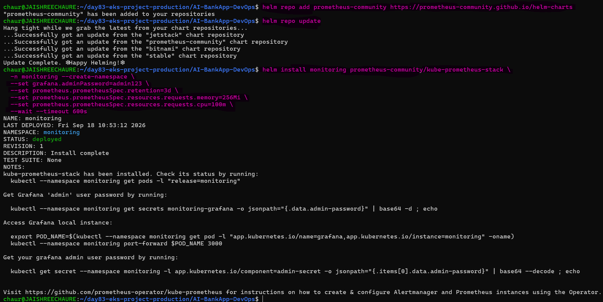

Verify the monitoring components:

```bash
kubectl get pods -n monitoring
```
All monitoring components are running successfully.

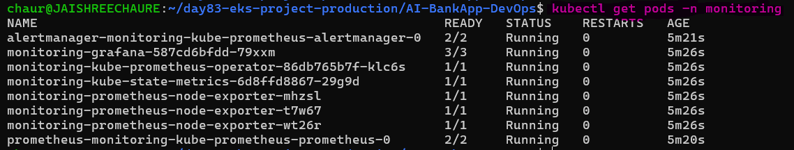

### 2. Access Grafana

Port-forward the Grafana service to access the dashboard locally.

```bash
kubectl port-forward svc/monitoring-grafana -n monitoring 3000:80
```
Open `http://localhost:3000` and log in with:

- **Username:** `admin`
- **Password:** `admin123`

Grafana is accessible and ready to visualize EKS and AI-BankApp metrics.

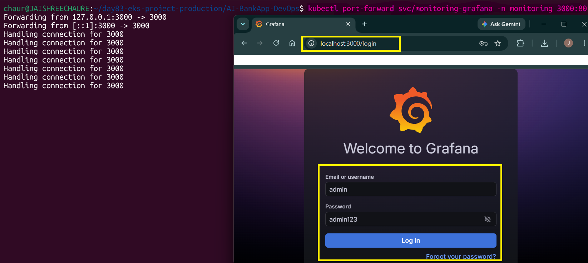 

### 3. Configure BankApp Metrics

- The BankApp exposes Prometheus metrics through the Spring Boot Actuator endpoint: `/actuator/prometheus`

- To enable Prometheus ServiceMonitor discovery, the BankApp service configuration was updated in `k8s/service.yml` with the named port `http`.

- A new ServiceMonitor configuration was also created inside the `k8s/` directory: `k8s/bankapp-servicemonitor.yaml`

**The ServiceMonitor targets the BankApp service in the `bankapp` namespace and scrapes `/actuator/prometheus` every 15 seconds.**

Create a ServiceMonitor to scrape the BankApp:

```yaml
apiVersion: monitoring.coreos.com/v1
kind: ServiceMonitor
metadata:
  name: bankapp-monitor
  namespace: monitoring
  labels:
    release: monitoring
spec:
  namespaceSelector:
    matchNames:
      - bankapp
  selector:
    matchLabels:
      app: bankapp
  endpoints:
    - port: http
      path: /actuator/prometheus
      interval: 15s
```
Apply the updated Service and ServiceMonitor configuration.

```bash
kubectl apply -f k8s/service.yml
kubectl apply -f k8s/bankapp-servicemonitor.yaml
```
The BankApp Service and ServiceMonitor were applied successfully.

Verify the ServiceMonitor:

```bash
kubectl get servicemonitor -n monitoring
```
The `bankapp-monitor` ServiceMonitor is registered with Prometheus.

### 4. Access Prometheus

Port-forward Prometheus to access the Prometheus UI locally.

```bash
kubectl port-forward svc/monitoring-kube-prometheus-prometheus -n monitoring 9090:9090
```
Open `http://localhost:9090` and verify the BankApp target under **Status → Target health**.

The `bankapp-monitor` endpoints were discovered successfully and both BankApp pods are shown as `UP`.

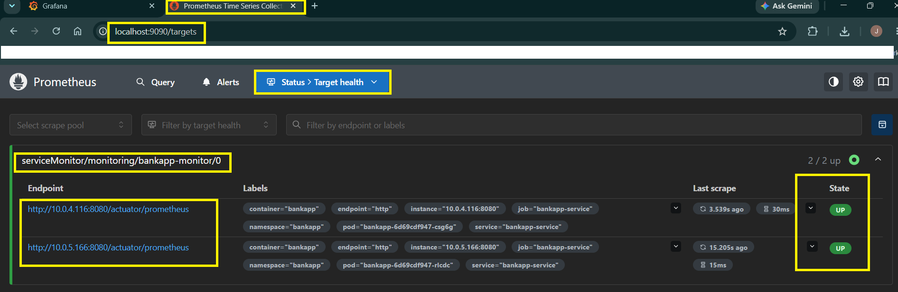

### 5. Query BankApp Metrics

**JVM memory usage** -- Monitor JVM memory consumption across the BankApp pods.

```promql
jvm_memory_used_bytes{namespace="bankapp"}
```
The JVM memory metrics from the BankApp pods are being collected successfully.

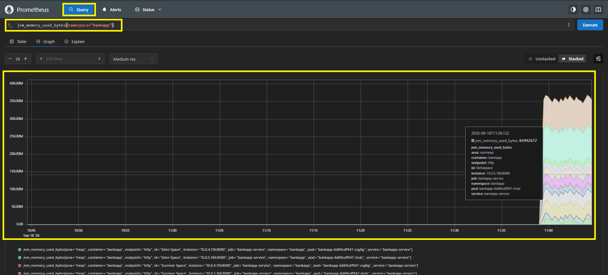 

**HTTP request rate** -- Monitor the rate of HTTP requests handled by BankApp.

```promql
rate(http_server_requests_seconds_count{namespace="bankapp"}[5m])
```
The HTTP request metrics are being collected from the BankApp pods.

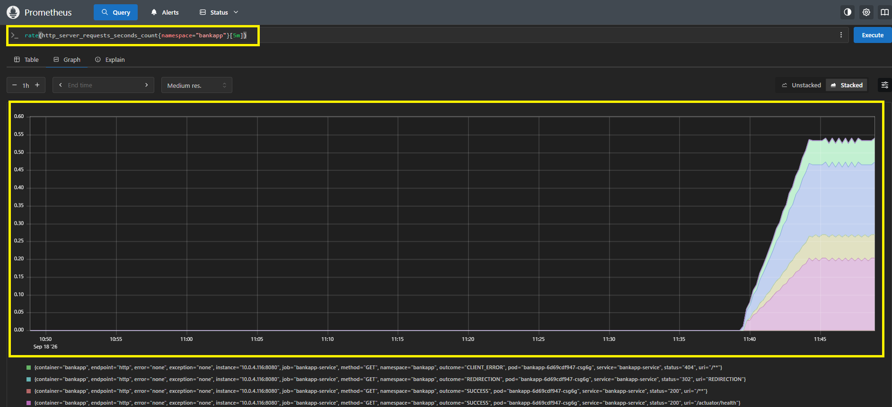

**Average HTTP request latency** -- The 95th-percentile query returned no data because the required histogram metric was unavailable. Average latency was calculated using the available request duration `sum` and `count` metrics.

```promql
histogram_quantile(0.95, rate(http_server_requests_seconds_bucket{namespace="bankapp"}[5m]))
```
The histogram query returned no data because `http_server_requests_seconds_bucket` was not available.

Calculate average request latency using:

```promql
rate(http_server_requests_seconds_sum[5m]) 
/
rate(http_server_requests_seconds_count[5m])
```
The average HTTP request latency was visualized successfully using the available Prometheus metrics.

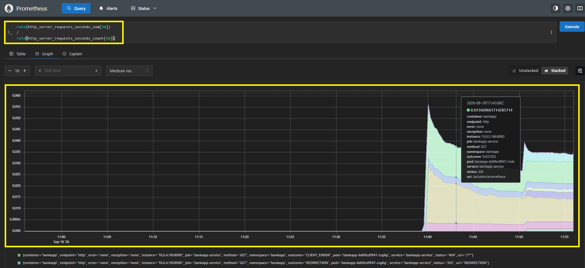 

### 6. Explore Grafana Dashboards

- **Kubernetes / Compute Resources / Namespace (Pods)** -- Monitor CPU and memory utilization across the `bankapp` namespace.

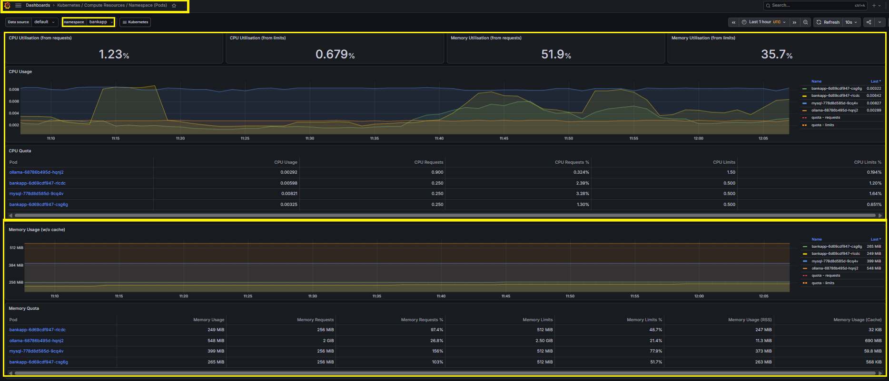 

- **Kubernetes / Compute Resources / Pod** -- Drill down into `individual BankApp` pod resource usage.

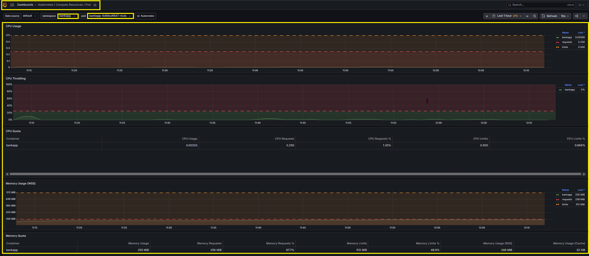

- **Kubernetes / Compute Resources / Pod** -- Monitor `MySQL` resource utilization and CPU/memory usage.

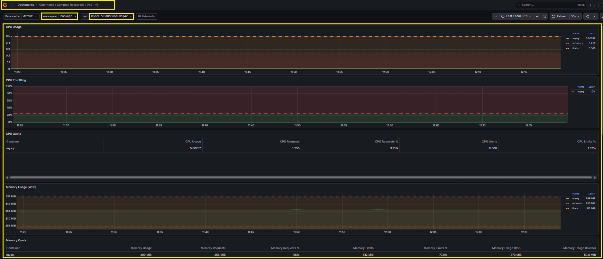

- **Kubernetes / Compute Resources / Pod** -- Monitor `Ollama` resource utilization and CPU/memory usage.

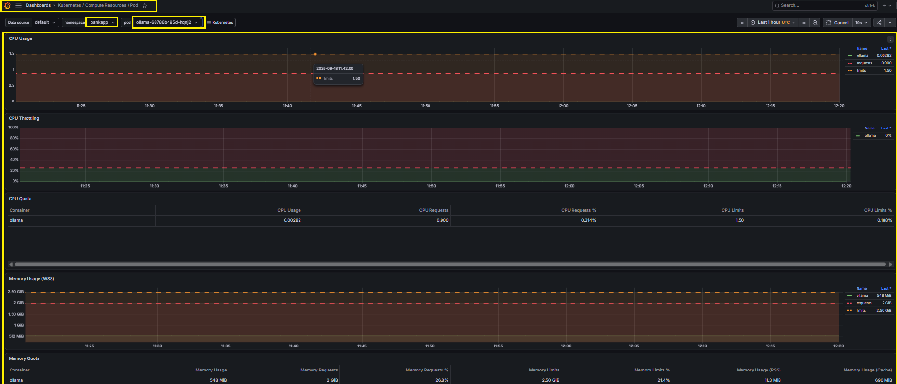 

- **Node Exporter / Nodes** -- Monitor CPU, memory, disk, network, and overall EKS worker node health.
 
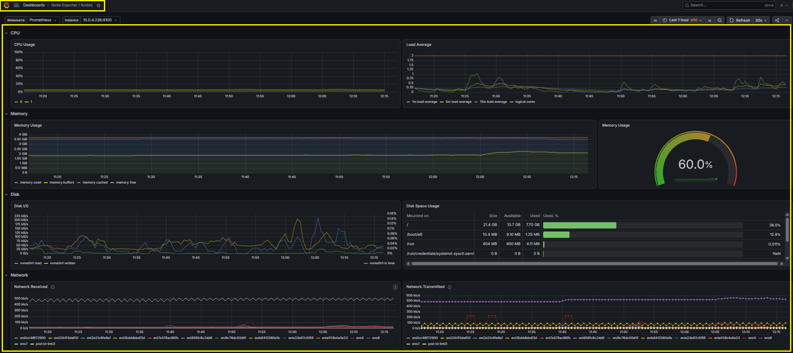

**Monitoring is now integrated with the AI-BankApp, providing application, pod, namespace, and EKS worker node observability through Prometheus and Grafana.**

---

## Task 4: End-to-End Validation Checklist

Validate the complete AI-BankApp stack across the application, data, infrastructure, and security layers.

### 1. Validate the Application Layer

Verify that BankApp pods are running, the application health endpoint is `UP`, HPA is active, and Prometheus metrics are exposed.

```bash
# Verify BankApp pods
kubectl get pods -n bankapp
echo "---"

# Verify application health
curl -s http://$APP_URL/actuator/health
echo "---"

# Verify HPA
kubectl get hpa -n bankapp
echo "---"

# Verify Prometheus metrics
curl -s http://$APP_URL/actuator/prometheus | head -10
```
The BankApp pods are running, the health endpoint reports `UP`, HPA is active, and application metrics are available through the Prometheus endpoint.

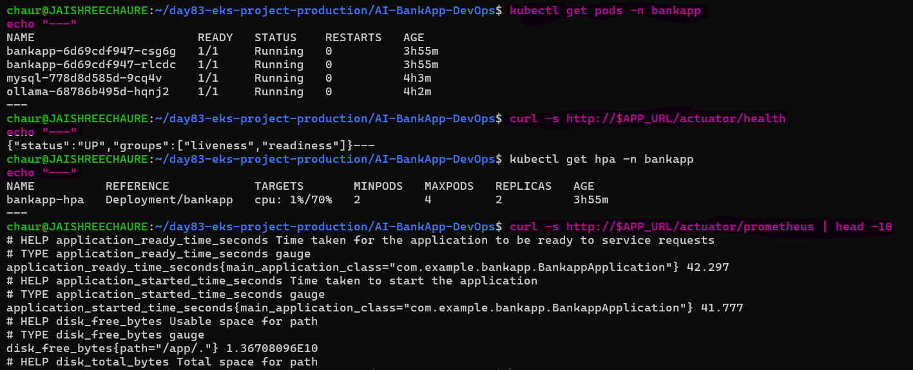 

### 2. Validate the Data Layer

Verify MySQL health, persistent storage, and the Ollama model.

```bash
# Verify MySQL
kubectl exec -n bankapp deploy/mysql -- mysqladmin ping -h localhost -uroot -pTest@123
echo "---"

# Verify persistent volumes
kubectl get pvc -n bankapp
echo "---"

# Verify Ollama model
kubectl exec -n bankapp deploy/ollama -- ollama list
```
MySQL is responding successfully, both PVCs are `Bound`, and the `tinyllama:latest` model is available in Ollama.

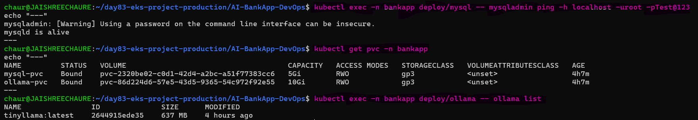

### 3. Validate the Infrastructure Layer

Verify EKS worker nodes, resource utilization, Gateway status, and monitoring components.

```bash
# Verify EKS nodes
kubectl get nodes
kubectl top nodes
echo "---"

# Verify Gateway
kubectl get gateway -n bankapp
echo "---"

# Verify monitoring stack
kubectl get pods -n monitoring | head -5
```
The EKS worker nodes are `Ready`, node resource metrics are available, the BankApp Gateway is programmed, and the monitoring stack is running.

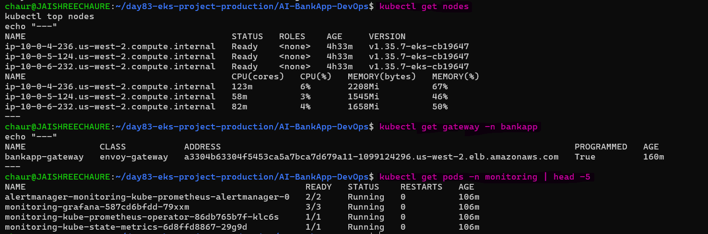 

### 4. Validate the Security Layer

Verify that the BankApp container runs with the expected non-root user and confirm the Kubernetes Secret contains the required database credential key.

```bash
# Verify the BankApp container user
kubectl exec -n bankapp deploy/bankapp -- whoami
echo "---"

# Verify the database password key exists in the Secret
kubectl get secret bankapp-secret -n bankapp -o yaml | grep -c "MYSQL_ROOT_PASSWORD"
```
The BankApp container runs as the `devsecops` user, and the `MYSQL_ROOT_PASSWORD` key is present in the Kubernetes Secret.

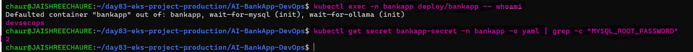

**The complete AI-BankApp deployment has been validated across the application, data, infrastructure, monitoring, and security layers on Amazon EKS.**

---

## Task 5: Reflect on the Full EKS Journey

The AI-BankApp project brought together the Kubernetes and DevOps concepts learned throughout the EKS journey.

### 1. Connect the Learning Journey

| Day | What You Built | AI-BankApp Connection |
|-----|---------------|----------------------|
| 81 | EKS cluster via Terraform, kubectl connection, manual deploy | Used the project's `terraform/` configs to provision infra |
| 82 | Gateway API, Envoy, TLS, EBS storage, session persistence | Used `k8s/gateway.yml`, `k8s/cert-manager.yml`, `k8s/pv.yml` |
| 83 | Full production deployment, monitoring, validation | Complete stack: app + DB + AI + networking + observability |

### 2. What the AI-BankApp EKS Setup Includes

- Terraform-provisioned VPC with 3-AZ networking
- Managed EKS node group with auto-scaling
- 6 EKS add-ons including CoreDNS, VPC CNI, kube-proxy, Pod Identity, EBS CSI, and Metrics Server
- ArgoCD pre-installed for GitOps workflows on Days 84–86
- Gateway API with Envoy for traffic management
- cert-manager for automated HTTPS
- Cookie-based session persistence for the stateful application
- EBS persistent storage for MySQL and Ollama
- HPA with scale-up and scale-down policies
- Spring Boot Actuator metrics for Prometheus
- Init containers for dependency ordering
- PostStart lifecycle hooks for the Ollama model pull

### 3. What I Would Add for a Real Production Environment

- Route 53 with ExternalDNS for DNS automation
- Network Policies for pod-to-pod isolation
- Pod Disruption Budgets for safer node maintenance
- External Secrets Operator with AWS Secrets Manager
- Automated MySQL backups to Amazon S3
- Centralized log aggregation with Loki, which I built on Day 75
- Separate environments such as `dev` and `prod`

**This journey connected infrastructure provisioning, Kubernetes orchestration, networking, storage, security, autoscaling, and observability into one complete EKS project.**

---

## Task 6: Complete Teardown

**The lab environment was fully cleaned up to avoid leaving unnecessary AWS resources running.**

### 1. Delete Monitoring and Application Workloads

Remove the monitoring stack, Gateway resources, BankApp workloads, services, storage, and namespace.

```bash
# Delete monitoring
helm uninstall monitoring -n monitoring

# Delete Gateway resources and release the BankApp NLB
kubectl delete -f k8s/gateway.yml 2>/dev/null

# Delete BankApp workloads
kubectl delete -f k8s/hpa.yml
kubectl delete -f k8s/bankapp-deployment.yml
kubectl delete -f k8s/ollama-deployment.yml
kubectl delete -f k8s/mysql-deployment.yml
kubectl delete -f k8s/service.yml
kubectl delete -f k8s/secrets.yml
kubectl delete -f k8s/configmap.yml
kubectl delete -f k8s/pvc.yml
kubectl delete -f k8s/pv.yml
kubectl delete -f k8s/namespace.yml
```
The BankApp workloads, monitoring stack, Gateway resources, and application storage were removed successfully.

### 2. Remove Supporting Components

Uninstall Envoy Gateway and cert-manager, then remove their namespaces.

```bash
# Delete Envoy Gateway
helm uninstall envoy-gateway -n envoy-gateway-system 2>/dev/null

# Delete cert-manager
helm uninstall cert-manager -n cert-manager 2>/dev/null

# Delete namespaces
kubectl delete namespace monitoring envoy-gateway-system cert-manager 2>/dev/null
```
The monitoring stack and BankApp workloads were removed successfully.

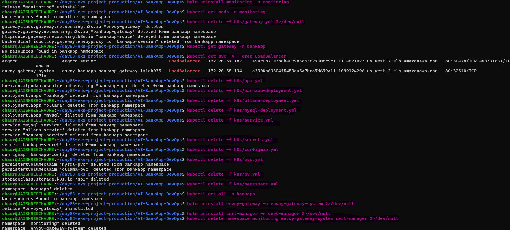 

Verify that no application PVCs remain and check for any remaining LoadBalancer services.

```bash
# Check for remaining LoadBalancers
kubectl get svc -A | grep LoadBalancer

# Check for remaining PVCs
kubectl get pvc -A
```
No PVCs remained after the application cleanup. The remaining ArgoCD LoadBalancer was part of the Terraform-managed infrastructure and was removed during the infrastructure destroy.

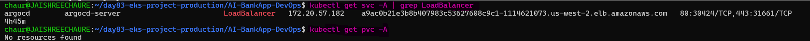 

### 3. Destroy AWS Infrastructure

Destroy the Terraform-managed EKS infrastructure.

```bash
cd terraform
terraform destroy
```
Terraform completed successfully and destroyed `84 resources`, including the EKS cluster, managed node group, networking components, IAM resources, and associated infrastructure.

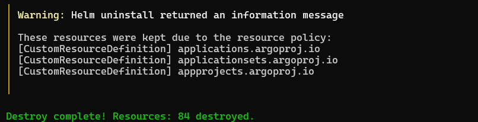 

This takes 10-15 minutes. It deletes:
- EKS cluster and control plane
- All node groups and EC2 instances
- ArgoCD Helm release
- VPC, subnets, NAT gateway, internet gateway
- IAM roles and policies

### 4. Verify AWS Resources

Verify the AWS Console after the Terraform destroy.

- **EKS:** No clusters remain
- **EC2:** BankApp worker instances are terminated
- **Load Balancers:** Application Gateway load balancer was removed
- **VPC:** Terraform-managed project VPC was removed; the default VPC remains
- **Persistent Storage:** Kubernetes PVCs were removed

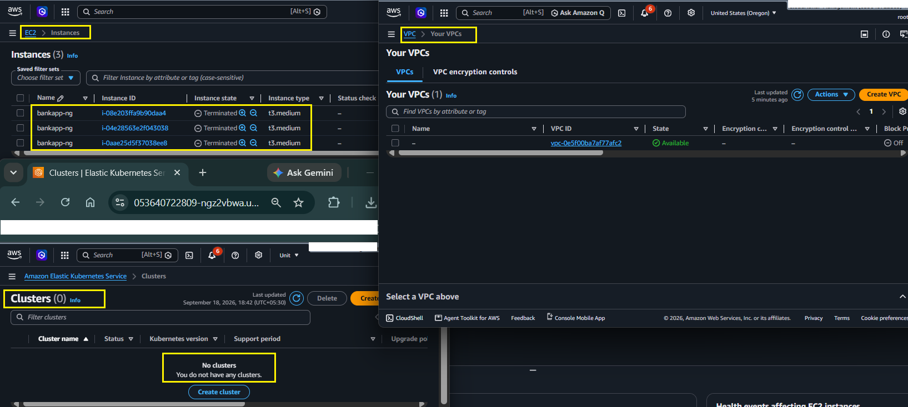

**The EKS lab environment was successfully torn down, leaving no project workloads or Terraform-managed infrastructure running.**

---

## Full Architecture Diagram (VPC → EKS → Nodes → Pods → Gateway → NLB → Internet)

The AI-BankApp is deployed on Amazon EKS inside a Terraform-provisioned VPC. Incoming traffic reaches the AWS Network Load Balancer and is routed through Envoy Gateway to the application workloads running across the EKS worker nodes. The BankApp connects to MySQL and Ollama, with Amazon EBS providing persistent storage and Prometheus/Grafana providing observability.

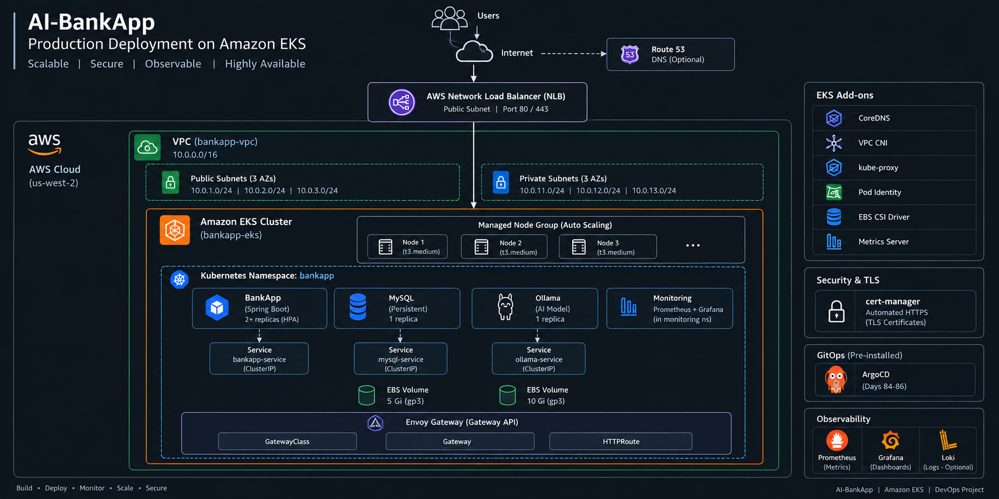

## Key Takeaways from the 3-Day EKS Block

- **Set up a production Kubernetes cluster on Amazon EKS using Terraform**, including networking, managed nodes, and access configuration.
- **Deployed and managed a complete application stack (BankApp + MySQL + Ollama)** with autoscaling and persistent storage using Amazon EBS.
- **Implemented traffic routing and security using Gateway API and Envoy**, including HTTPS and session handling.
- **Monitored and validated the complete system using Prometheus and Grafana**, covering application, pod, namespace, and EKS node-level metrics.