# Day 84 -- Introduction to GitOps and ArgoCD

## Re-Provision the EKS Infrastructure

Since the previous Day 84 infrastructure was destroyed, first recreate the EKS cluster and configure `kubectl` to use it.

```bash
cd ~/day84-gitops-argocd/AI-BankApp-DevOps/terraform
terraform apply -auto-approve
aws eks update-kubeconfig --name bankapp-eks --region us-west-2
kubectl config current-context
kubectl get nodes
```
The EKS cluster should be reachable and all worker nodes should be `Ready`.

## Mandatory Lab Setup

Before starting the Day 84 tasks, install the Kubernetes components required by the BankApp GitOps manifests.

The BankApp manifests use **Gateway API**, **Envoy Gateway**, and **cert-manager** for traffic routing and HTTPS/TLS. These components must be installed first so ArgoCD can successfully create resources such as `Gateway`, `HTTPRoute`, `BackendTrafficPolicy`, and `ClusterIssuer`.

### 1. Install Gateway API

Install the Gateway API Standard CRDs:

```bash
kubectl apply -f https://github.com/kubernetes-sigs/gateway-api/releases/download/v1.2.1/standard-install.yaml
```
Verify that Gateway API resources are available:

```bash
kubectl api-resources | grep gateway
```
**2. Install Envoy Gateway CRDs**

Install only the Envoy Gateway-specific CRDs because the Gateway API CRDs were installed separately:

```bash
helm template eg-crds \
  oci://docker.io/envoyproxy/gateway-crds-helm \
  --version v1.4.0 \
  --set crds.gatewayAPI.enabled=false \
  --set crds.envoyGateway.enabled=true \
  | kubectl apply --server-side -f -
```
**3. Install Envoy Gateway**

Install the Envoy Gateway controller without reinstalling CRDs:

```bash
helm install eg \
  oci://docker.io/envoyproxy/gateway-helm \
  --version v1.4.0 \
  -n envoy-gateway-system \
  --create-namespace \
  --skip-crds
```
Verify:

```bash
kubectl get pods -n envoy-gateway-system
```
The `envoy-gateway` pod should be `Running`.

**4. Install cert-manager**

```bash
helm install cert-manager \
  oci://quay.io/jetstack/charts/cert-manager \
  --version v1.20.4 \
  --namespace cert-manager \
  --create-namespace \
  --set crds.enabled=true \
  --set config.apiVersion="controller.config.cert-manager.io/v1alpha1" \
  --set config.kind="ControllerConfiguration" \
  --set config.enableGatewayAPI=true
```
Verify:
```bash
kubectl get pods -n cert-manager
```
The following pods should be `Running`:

```text
cert-manager
cert-manager-cainjector
cert-manager-webhook
```
**5. Final Setup Verification**

```bash
kubectl get nodes
kubectl get pods -n argocd
kubectl get pods -n envoy-gateway-system
kubectl get pods -n cert-manager
```
Once these components are running, continue with the Day 84 tasks.

> **Note:** Why install these before the Day 84 tasks?

> **The BankApp Kubernetes manifests depend on these components. Gateway API provides Gateway and HTTPRoute, Envoy Gateway provides the Gateway controller and BackendTrafficPolicy, and cert-manager manages the TLS certificate through ClusterIssuer. Installing them first allows ArgoCD to synchronize the complete BankApp application without missing Kubernetes APIs.**

---

## Task 1: Understand GitOps

GitOps is a deployment methodology where Git acts as the source of truth for the desired state of infrastructure and applications.

ArgoCD continuously compares the desired state stored in Git with the actual state running in Kubernetes and reconciles any differences.

Research and write notes on:

1. **What is GitOps?**
   - Git is the single source of truth for infrastructure and application configuration.
   - Kubernetes manifests are stored and versioned in Git.
   - ArgoCD watches the Git repository for changes.
   - ArgoCD continuously compares the desired state with the live cluster state.
   - If managed resources drift from the desired state, ArgoCD can reconcile them.
   - Git provides version history, auditability, and a record of configuration changes.

2. **GitOps vs traditional CI/CD:**

| Aspect | Traditional CI/CD | GitOps |
|---|---|---|
| **Deployment trigger** | CI pipeline runs deployment commands | Git change triggers reconciliation |
| **Source of truth** | Pipeline scripts/config | Git repository |
| **Drift detection** | Requires additional tooling | Continuous reconciliation |
| **Rollback** | Re-run pipeline or manual deployment | Revert Git commit |
| **Audit trail** | Pipeline logs | Git history |
| **Cluster access** | CI pipeline needs cluster access | ArgoCD manages cluster access |
| **Desired state** | Applied by pipeline | Declaratively stored in Git |

3. **The AI-BankApp's GitOps flow:**
```
Developer pushes code to feat/gitops
         |
    [GitHub Actions CI]
    - Build Maven project
    - Run tests
    - Build Docker image
    - Push to DockerHub (tagged with git SHA)
    - Update image tag in k8s/bankapp-deployment.yml
    - Commit the change back to Git
         |
    [ArgoCD watches the repo]
    - Detects the new commit
    - Compares k8s/ manifests with live cluster
    - Syncs the change (rolling update)
    - BankApp pods restart with the new image
         |
    [Zero human intervention after git push]
```

4. **Four GitOps principles** (from OpenGitOps):
   - **Declarative** -- the desired state is expressed declaratively (Kubernetes YAML)
   - **Versioned and immutable** -- The desired configuration is stored in Git, providing version history and auditability.
   - **Pulled automatically** -- ArgoCD pulls the desired state from Git instead of requiring CI to directly push changes into the Kubernetes cluster.
   - **Continuously reconciled** -- ArgoCD continuously compares the desired state in Git with the actual Kubernetes state and reconciles differences.

---

## Task 2: Access ArgoCD on Your EKS Cluster

ArgoCD was installed by Terraform on Day 81 (via `terraform/argocd.tf`). Verify it is running:

First verify the active Kubernetes context, EKS nodes, ArgoCD pods, and ArgoCD service.

```bash
kubectl config current-context
kubectl get nodes
kubectl get pods -n argocd
kubectl get svc -n argocd
```
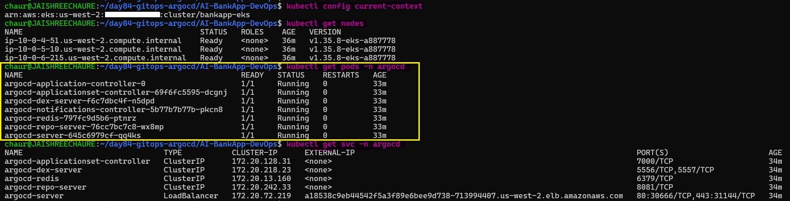 

The active context should point to the `bankapp-eks` EKS cluster, the worker nodes should be `Ready`, and the ArgoCD components should be running.

**Get the ArgoCD admin password:**

Retrieve the initial ArgoCD administrator password:

```bash
kubectl -n argocd get secret argocd-initial-admin-secret \
  -o jsonpath="{.data.password}" | base64 -d && echo
```
This password is required to access the ArgoCD web interface and CLI.

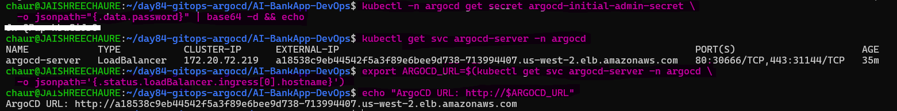 

**Access the ArgoCD UI:**

Since Terraform exposes ArgoCD through an AWS LoadBalancer, retrieve its hostname:

Option A -- via LoadBalancer (if Terraform exposed it):
```bash
export ARGOCD_URL=$(kubectl get svc argocd-server -n argocd \
  -o jsonpath='{.status.loadBalancer.ingress[0].hostname}')

echo "ArgoCD URL: http://$ARGOCD_URL"
```
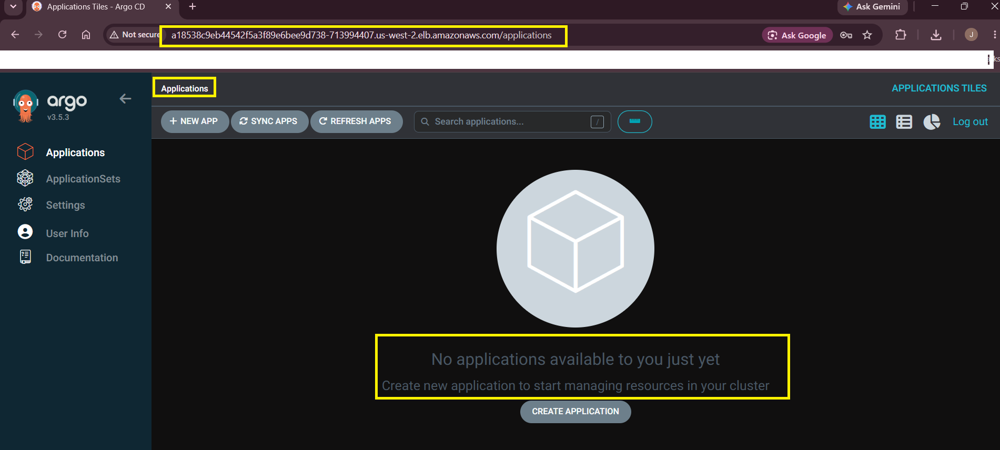 

Open the displayed URL in a browser and log in using:
- Username: admin
- Password: <password retrieved above>

**Install the ArgoCD CLI:**

Install the ArgoCD CLI on Linux:

```bash
# Linux
cd /tmp
curl -sSL -o argocd https://github.com/argoproj/argo-cd/releases/latest/download/argocd-linux-amd64
chmod +x argocd
sudo mv argocd /usr/local/bin/

# Verify the installation:
argocd version --client
```
The CLI version should be displayed successfully.

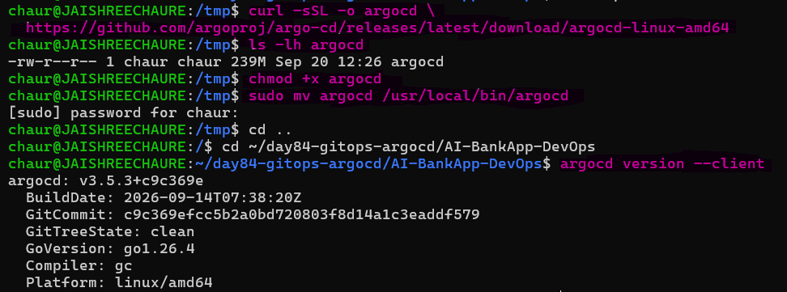

> ***Note:** `/tmp` is used only as a temporary working directory for downloading the ArgoCD binary. After verifying the file, it is moved to `/usr/local/bin`, which is in the system `PATH`, allowing the `argocd` command to be used from any directory.

**Log in via CLI:**

Use the LoadBalancer hostname stored in `$ARGOCD_URL`:

```bash
argocd login $ARGOCD_URL --username admin --password <your-password> --insecure
```
Verify the logged-in account:

```bash
argocd account get-user-info
```
**Check the Connected Kubernetes Cluster**

Verify that ArgoCD can see the EKS cluster:

```bash
argocd cluster list
```
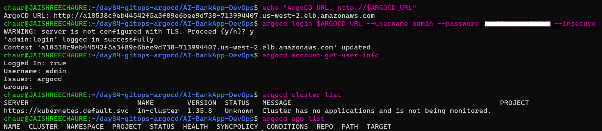

**Explore the ArgoCD UI**

- **Applications** — Shows all applications managed by ArgoCD. It is empty at this stage because the BankApp Application has not been created yet.

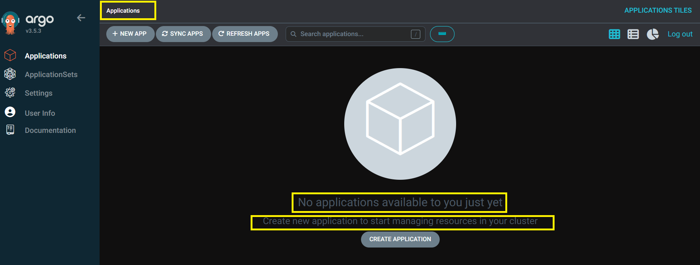

- **Settings → Repositories** — Shows the Git repositories configured or connected to ArgoCD. No repository is connected at this stage.

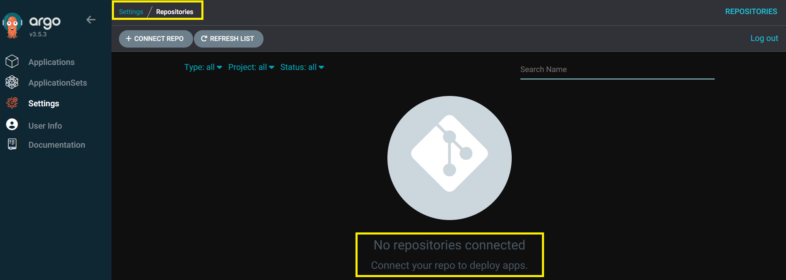

- **Settings → Clusters** — Shows the Kubernetes clusters managed by ArgoCD. The EKS cluster is available as the default `in-cluster` destination.

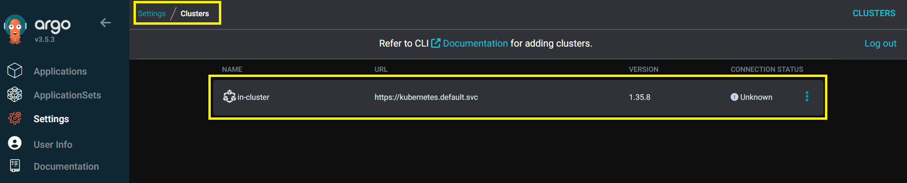

---

## Prepare the GitOps Repository

Before creating the ArgoCD Application, prepare your fork, Kubernetes manifests, Docker image, and Git authentication.

**1. Switch to the GitOps Branch**

```bash
cd ~/day84-gitops-argocd/AI-BankApp-DevOps
git checkout feat/gitops
git branch
```
Expected: `* feat/gitops`

**2. Configure Your GitHub Fork**

Check the current remote:

```bash
git remote -v
```
Set `origin` to your fork:

```bash
git remote set-url origin git@github.com:Jaishree97/AI-BankApp-DevOps.git
git remote -v
```
**3. Verify GitHub SSH Access**

```bash
ssh -T git@github.com
```
A successful authentication confirms that Git can push to your fork using SSH.

**4. Update Kubernetes Manifests**

Before creating the ArgoCD Application, update the required values in `k8s/`.

**BankApp Docker image:**
```yaml
image: jaishreechaure/ai-bankapp-eks:1c7cb0e
```
**Gateway hostname:**
```yaml
hostname: <CURRENT_PUBLIC_IP>.nip.io
```
**HTTPRoute hostname:**
```yaml
hostnames:
  - <CURRENT_PUBLIC_IP>.nip.io
```
**Let's Encrypt email** in `k8s/cert-manager.yml`:
```yaml
email: <your-email>
```
Also review the required Gateway, TLS, service, and application configuration values.

**5. Review Changes**
```bash
git status
git diff
```
**6. Commit and Push**
```bash
git add k8s/
git commit -m "update GitOps configuration and bankapp image"
git push origin feat/gitops
```
**Verify the latest commits:**
```bash
git log --oneline --max-count=3
```
The `feat/gitops` branch in your GitHub fork should now contain the updated Kubernetes manifests.

---

## Task 3: Study the AI-BankApp's ArgoCD Application Manifest

Open `argocd/application.yml` from the AI-BankApp repo:

```yaml
apiVersion: argoproj.io/v1alpha1
kind: Application
metadata:
  name: bankapp
  namespace: argocd
spec:
  project: default
  source:
    repoURL: https://github.com/Jaishree97/AI-BankApp-DevOps.git
    targetRevision: feat/gitops
    path: k8s
    destination:
    server: https://kubernetes.default.svc
    namespace: bankapp
  ignoreDifferences:
    - group: apps
      kind: Deployment
      name: bankapp
      namespace: bankapp
      jsonPointers:
        - /spec/replicas
  syncPolicy:
    automated:
      prune: true
      selfHeal: true
    syncOptions:
      - CreateNamespace=true
      - ServerSideApply=true
      - RespectIgnoreDifferences=true
```

**Break down every field:**

| Field | Value | Purpose |
|-------|-------|---------|
| `source.repoURL` | The AI-BankApp GitHub repo | Where ArgoCD fetches manifests from |
| `source.targetRevision` | `feat/gitops` | Which Git branch to watch |
| `source.path` | `k8s` | The directory containing Kubernetes manifests |
| `destination.server` | `kubernetes.default.svc` | Deploy to the local cluster (in-cluster) |
| `destination.namespace` | `bankapp` | Target namespace for resources |
| `syncPolicy.automated` | enabled | ArgoCD syncs automatically on Git changes |
| `prune: true` | enabled | Delete resources removed from Git |
| `selfHeal: true` | enabled | Revert manual changes made directly to the cluster |
| `CreateNamespace=true` | enabled | Create the `bankapp` namespace if it does not exist |
| `ServerSideApply=true` | enabled | Use server-side apply for better conflict handling |
| `ignoreDifferences` | BankApp Deployment replicas | Prevent ArgoCD from conflicting with HPA-managed replicas |
| `RespectIgnoreDifferences=true` | enabled | Apply the configured ignored differences during sync |

---

## Task 4: Deploy the AI-BankApp via ArgoCD

First, start with a clean `bankapp` namespace:

```bash
kubectl delete namespace bankapp 2>/dev/null
```
**Fork the AI-BankApp repo** -- you need your own copy to push changes later:
1. Go to https://github.com/TrainWithShubham/AI-BankApp-DevOps
2. Click "Fork" and create your fork
3. Note your fork URL: `https://github.com/<your-username>/AI-BankApp-DevOps.git`

**Create the ArgoCD Application** (update the repoURL to your fork):
```bash
cat <<EOF | kubectl apply -f -
apiVersion: argoproj.io/v1alpha1
kind: Application
metadata:
  name: bankapp
  namespace: argocd
spec:
  project: default

  source:
    repoURL: https://github.com/Jaishree97/AI-BankApp-DevOps.git
    targetRevision: feat/gitops
    path: k8s

  destination:
    server: https://kubernetes.default.svc
    namespace: bankapp

  ignoreDifferences:
    - group: apps
      kind: Deployment
      name: bankapp
      namespace: bankapp
      jsonPointers:
        - /spec/replicas

  syncPolicy:
    automated:
      prune: true
      selfHeal: true
    syncOptions:
      - CreateNamespace=true
      - ServerSideApply=true
      - RespectIgnoreDifferences=true
EOF
```
The Application points ArgoCD to the `feat/gitops` branch and the `k8s/` directory containing the BankApp manifests. The replica count is ignored because the HPA manages the BankApp Deployment replicas.

**Watch ArgoCD deploy the app:**
- In the ArgoCD UI, click on the `bankapp` application
- You will see a visual tree of all Kubernetes resources being created
- Each resource shows its sync and health status (green = healthy, yellow = progressing, red = degraded)

**Check the initial deployment status:**

```bash
argocd app get bankapp
```
ArgoCD starts creating and synchronizing the Kubernetes resources defined in Git.

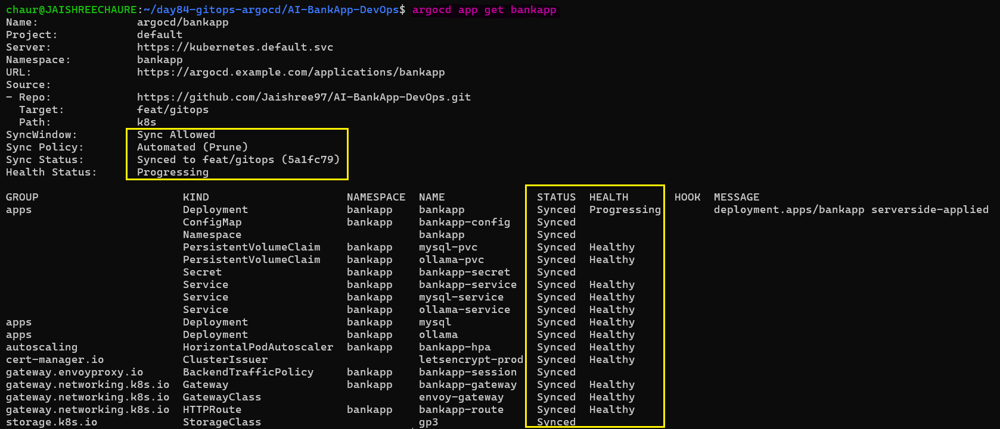 

**Wait for the synchronization to complete:**

```bash
argocd app wait bankapp
```
ArgoCD waits for the application's resources to reach their expected state.

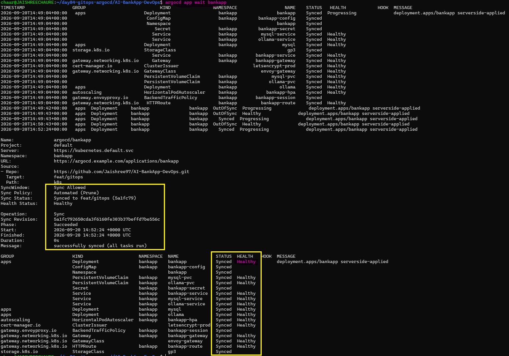 

**Monitor the BankApp pods:**

```bash
kubectl get pods -n bankapp -w
```
The BankApp components are created and managed by ArgoCD from the `k8s/` directory.

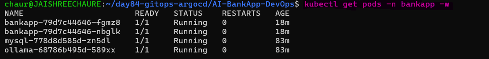

The deployment process is managed automatically by ArgoCD. MySQL, Ollama, and BankApp resources are reconciled from the manifests stored in Git.

**Verify the final application status (5-10 minutes):**

```bash
argocd app get bankapp
```
The application should show: `Health: Healthy`, `Sync: Synced`.

This confirms that the desired state in Git has been successfully synchronized with the EKS cluster.

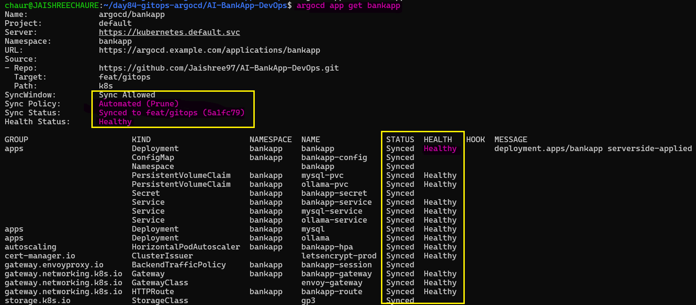 

---

## Task 5: Explore ArgoCD's Live View

Click on the `bankapp` application in the ArgoCD UI to view the complete Kubernetes resource tree managed by ArgoCD.

**The resource tree:**
```
bankapp (Application)
 |
 |-- Namespace: bankapp
 |-- StorageClass: gp3
 |-- PVC: mysql-pvc
 |-- PVC: ollama-pvc
 |-- ConfigMap: bankapp-config
 |-- Secret: bankapp-secret
 |-- Deployment: mysql -> ReplicaSet -> Pod
 |-- Deployment: ollama -> ReplicaSet -> Pod
 |-- Deployment: bankapp -> ReplicaSet -> Pods
 |-- Service: mysql-service
 |-- Service: ollama-service
 |-- Service: bankapp-service
 |-- HPA: bankapp-hpa
 |-- Gateway: bankapp-gateway
 |-- HTTPRoute: bankapp-route

```
The Live View provides a visual representation of the application's Kubernetes resources and their current health and sync status.

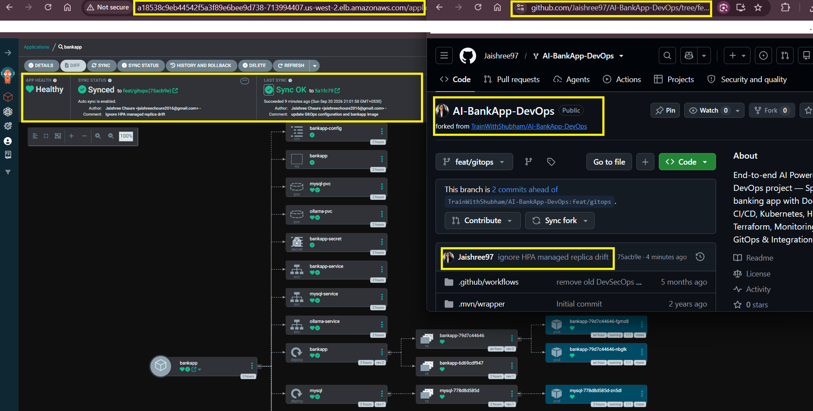

**Click any resource** to inspect its live Kubernetes state, including:
- Logs and events
- YAML manifest
- Resource status (as applied to the cluster)
- Differences between desired and live state (what changed since last sync)

**App Details provides information about:**
- Git repository and manifest path
- Current Git revision (git commit SHA)
- Sync and health status
- Last synchronization
- Application history

**Check the sync history:**
```bash
argocd app history bankapp
```
This displays the revisions synchronized by ArgoCD, including the timestamp and Git commit SHA for each sync.

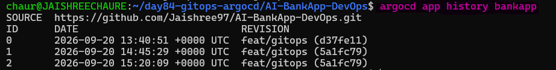

---

## Task 6: Test Self-Healing

ArgoCD uses `selfHeal: true` to automatically reconcile managed resources when their live Kubernetes state differs from the desired state stored in Git.

**Test 1 -- Manually scale the BankApp:**

Manually change the BankApp Deployment replica count:

```bash
kubectl scale deployment bankapp -n bankapp --replicas=1
```
This creates a temporary change directly in the Kubernetes cluster.

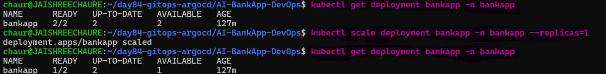

Watch the BankApp pods:
```bash
kubectl get pods -n bankapp -w
```
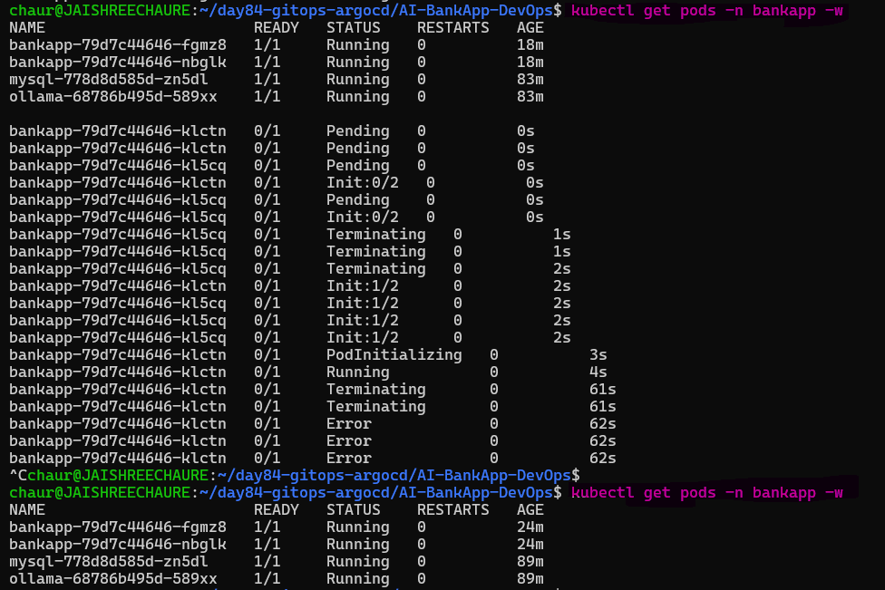

The BankApp replica count is managed by the HPA, while ArgoCD ignores `/spec/replicas` through `ignoreDifferences`. Therefore, ArgoCD does not directly reconcile this field; the HPA controls the final replica count.

**Test 2 -- Manually delete a ConfigMap:**

Delete the ConfigMap managed by ArgoCD:

```bash
kubectl delete configmap bankapp-config -n bankapp
```
The ConfigMap is now missing from the cluster, creating drift from the desired state in Git.

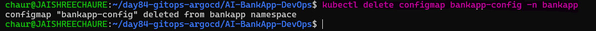 

ArgoCD detects that the managed ConfigMap is missing and recreates it from Git.

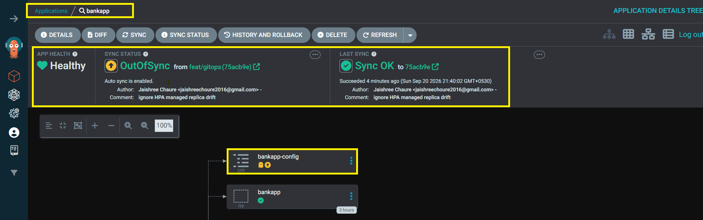 

Verify the ConfigMap was restored:

```bash
kubectl get configmap bankapp-config -n bankapp
```
The resource should be present again and ArgoCD should return to `Synced`.

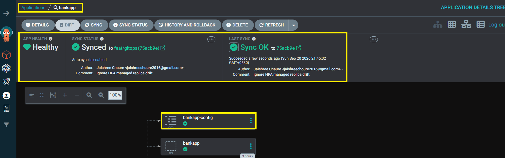 

**Test 3 -- Manually modify the ConfigMap:**

Edit the managed ConfigMap:

```bash
kubectl edit configmap bankapp-config -n bankapp
```
Change `MYSQL_DATABASE` to an incorrect temporary value and save the file.

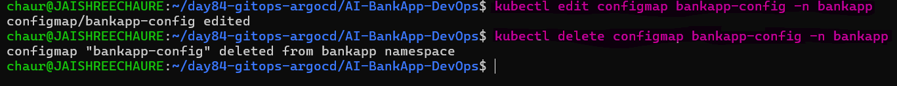

The live ConfigMap now differs from the desired configuration stored in Git. ArgoCD detects this drift.

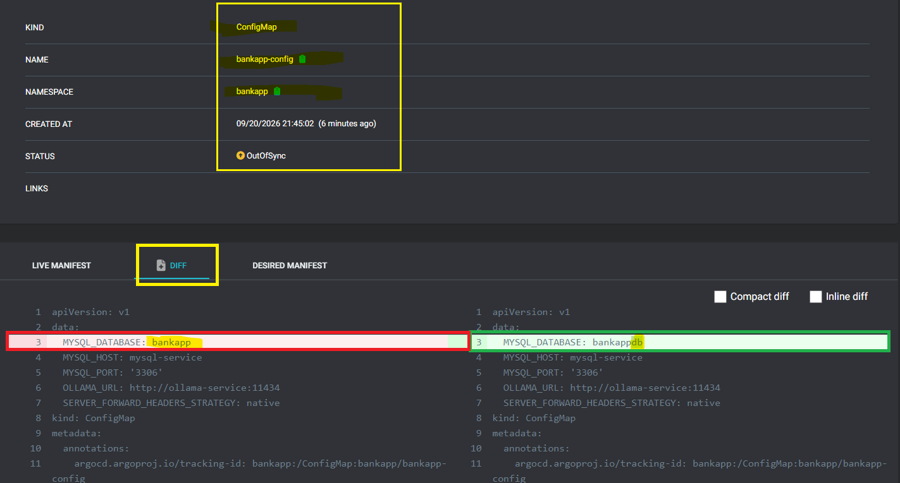 

ArgoCD reconciles the resource and restores the Git-defined value.

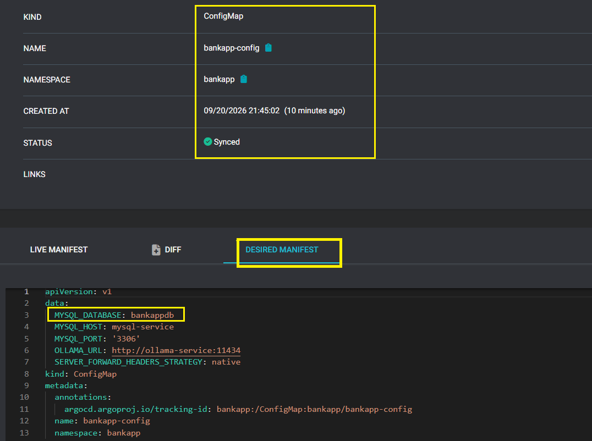 

ArgoCD will overwrite the ConfigMap change with the desired value from Git.

**This is the core GitOps promise:** The cluster continuously reconciles toward the desired state stored in Git. Manual changes to ArgoCD-managed resources do not persist, and application changes should be made through Git.

**Document:** Record what happened during each self-healing test and how quickly the change was reconciled.

- ConfigMap deletion and modification were automatically reconciled by ArgoCD within the observed reconciliation period.
- Deployment replicas are managed by the HPA, while ArgoCD ignores `/spec/replicas` to prevent conflicts with HPA.

---

## GitOps Principles

- **Declarative** — Desired state is defined declaratively using Kubernetes YAML.
- **Versioned and Immutable** — Desired state is stored in Git, providing versioning and auditability.
- **Pulled Automatically** — GitOps agents such as ArgoCD pull the desired state from Git instead of CI pushing changes to the cluster.
- **Continuously Reconciled** — Agents continuously compare desired and actual state and correct drift.

## Traditional CI/CD vs GitOps

| Feature | Traditional CI/CD | GitOps |
|---|---|---|
| **Pipeline Direction** | CI/CD pipelines push changes to the cluster | Cluster pulls changes from Git |
| **Source of Truth** | CI/CD pipeline definitions | Git repository |
| **Security Model** | CI/CD requires cluster credentials | GitOps agent runs in-cluster |
| **Rollback** | Re-run pipeline with an older commit | Revert/checkout a previous Git commit |
| **Drift Detection** | Manual or requires additional tooling | Continuous reconciliation and self-healing |
| **Auditability** | CI/CD server logs | Git history |

---

## AI-BankApps-gitops-flow-diagram

This diagram shows the complete **AI-BankApp GitOps workflow**: a developer pushes code to `feat/gitops`, GitHub Actions builds and tests the application, creates and pushes the Docker image, and updates the Kubernetes manifest. ArgoCD detects the Git change, reconciles the manifests with the EKS cluster, and deploys the updated BankApp automatically.

**Flow:** Developer → GitHub Actions → DockerHub → ArgoCD → Amazon EKS

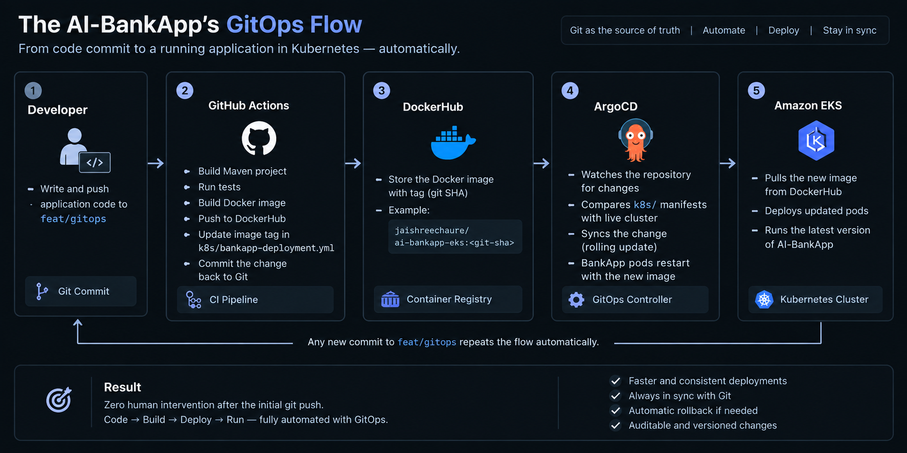

---

### Application manifest with every field explained

```yaml
apiVersion: argoproj.io/v1alpha1              # ArgoCD Application API version
kind: Application                             # Defines an ArgoCD application
metadata:
  name: bankapp                               # Name of the ArgoCD application
  namespace: argocd                           # Namespace where ArgoCD is installed

spec:
  project: default                            # ArgoCD project for the application

  source:
    repoURL: https://github.com/Jaishree97/AI-BankApp-DevOps.git  # Git repository containing the manifests
    targetRevision: feat/gitops                # Git branch ArgoCD watches for changes
    path: k8s                                  # Directory containing the Kubernetes manifests

  destination:
    server: https://kubernetes.default.svc     # Kubernetes API server for the in-cluster destination
    namespace: bankapp                          # Target namespace for the application resources

  ignoreDifferences:                            # Ignore specific live-state differences
    - group: apps                               # Kubernetes API group
      kind: Deployment                          # Resource type to ignore differences for
      name: bankapp                             # BankApp Deployment
      namespace: bankapp                         # Namespace of the Deployment
      jsonPointers:
        - /spec/replicas                        # Ignore replicas because HPA manages this value

  syncPolicy:
    automated:                                  # Enable automatic synchronization
      prune: true                               # Delete resources removed from Git
      selfHeal: true                            # Reconcile manual changes made to the cluster

    syncOptions:
      - CreateNamespace=true                    # Create the target namespace if it does not exist
      - ServerSideApply=true                    # Use Kubernetes server-side apply
      - RespectIgnoreDifferences=true           # Apply the configured ignored differences during sync
```
### What `prune`, `selfHeal`, `ignoreDifferences`, and `ServerSideApply` do

- `prune` — Deletes resources from the cluster when they are removed from Git.
- `selfHeal` — Reconciles manual changes made directly to ArgoCD-managed resources.
- `ignoreDifferences` — Tells ArgoCD to ignore specific differences between Git and the live cluster.
- `/spec/replicas` — Prevents ArgoCD from conflicting with the HPA-managed BankApp replica count.
- `ServerSideApply` — Uses Kubernetes server-side apply for resource management.
- `RespectIgnoreDifferences` — Ensures the configured ignored differences are respected during synchronization.

