# Day 85 -- ArgoCD Deep Dive: Sync Strategies, Rollbacks, and Multi-App Management

## Setup Before Day 85 Tasks

### 1. Re-Provision EKS

```bash
cd ~/day85-argocd-deep-dive/AI-BankApp-DevOps/terraform
terraform apply -auto-approve
aws eks update-kubeconfig --name bankapp-eks --region us-west-2
kubectl get nodes
```
### 2. Install Gateway API

```bash
kubectl apply -f https://github.com/kubernetes-sigs/gateway-api/releases/download/v1.2.1/standard-install.yaml

kubectl api-resources | grep gateway
```
### 3. Install Envoy Gateway CRDs

```bash
helm template eg-crds oci://docker.io/envoyproxy/gateway-crds-helm \
  --version v1.4.0 \
  --set crds.gatewayAPI.enabled=false \
  --set crds.envoyGateway.enabled=true \
  | kubectl apply --server-side -f -
```
### 4. Install Envoy Gateway

```bash
helm install eg oci://docker.io/envoyproxy/gateway-helm \
  --version v1.4.0 \
  -n envoy-gateway-system \
  --create-namespace \
  --skip-crds

kubectl get pods -n envoy-gateway-system
```
### 5. Push GitOps Manifests

```bash
git add argocd/application.yml k8s/gateway.yml k8s/service.yml
git commit -m "day85: configure ArgoCD automated sync"
git push origin feat/gitops
```
### 6. Create ArgoCD Application

```bash
kubectl apply -f argocd/application.yml
kubectl get applications -n argocd
```
### 7. Get ArgoCD Credentials

```bash
kubectl -n argocd get secret argocd-initial-admin-secret \
  -o jsonpath="{.data.password}" | base64 -d && echo

export ARGOCD_URL=$(kubectl get svc argocd-server -n argocd \
  -o jsonpath='{.status.loadBalancer.ingress[0].hostname}')

echo "ArgoCD URL: http://$ARGOCD_URL"
```
### 8. Login and Verify ArgoCD

```bash
argocd login $ARGOCD_URL --username admin --password <your-password> --insecure

argocd account get-user-info
```
### 9. Verify Application

```bash
argocd app get bankapp --refresh
argocd app get bankapp
```
Verify that the Envoy Gateway pod is `Running` and the BankApp application is ready.

> **Note:** Check `k8s/gateway.yml` for the current Gateway configuration. It uses **HTTP only**; the HTTPS/TLS section is commented out. Therefore, **cert-manager and Let's Encrypt are not required** for the current Day 85 setup.

---

## Task 1: Understand Sync Strategies

ArgoCD supports both automated and manual synchronization strategies.

### Automated Sync (what the AI-BankApp uses):

The AI-BankApp normally uses automated sync:
```yaml
syncPolicy:
  automated:
    prune: true      # Delete resources removed from Git
    selfHeal: true   # Revert manual cluster changes
```
- Automatically applies Git changes within 3 minutes.
- `prune` removes resources deleted from Git.
- `selfHeal` corrects manual cluster changes.
- - Commonly used for development and staging, and can also be used in production when continuous reconciliation is desired.

### Manual Sync (for production):

Manual sync disables automatic reconciliation:
```yaml
syncPolicy: {}   # No automated section
```
- ArgoCD detects drift but does NOT auto-correct
- A human must click "Sync" or run `argocd app sync`
- Useful when production changes require a review or approval gate.

### Switch to Manual Sync

Disable automated synchronization:
```bash
argocd app set bankapp --sync-policy none
```
This confirms that the application is now using manual sync.

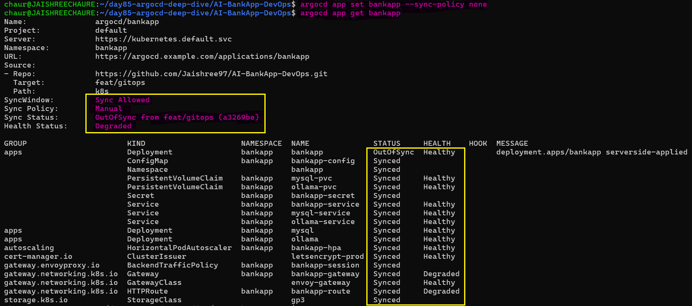

### Make a Git Change

Edit `k8s/configmap.yml` and change `APP_NAME` or add a `new key`, Push the commit.

For Example: `APP_NAME: BankApp-Manual-Sync`

This creates a Git-side change for testing manual synchronization.

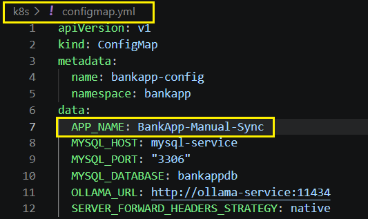

Commit and push the change:

```bash
git add k8s/configmap.yml
git commit -m "day85: test manual sync strategy"
git push origin feat/gitops
```
The change is now available in Git, but manual sync prevents ArgoCD from applying it automatically.

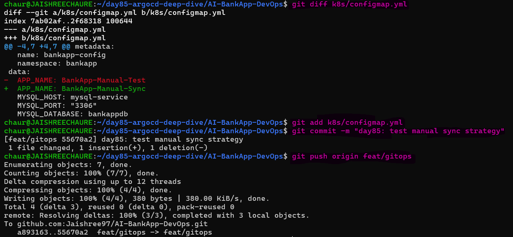

### Wait 3 minutes and Check Sync Status

After the Git change, check the application:
```bash
argocd app get bankapp
```
ArgoCD should report `OutOfSync` while the live cluster remains unchanged.

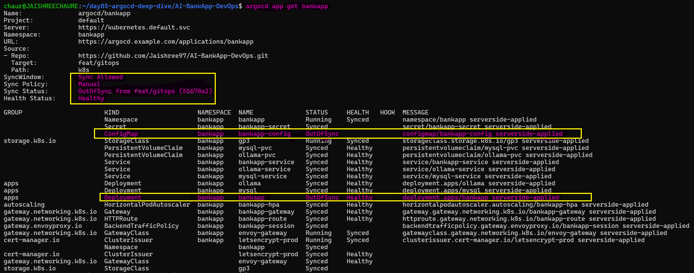

The status will show `OutOfSync` but ArgoCD will NOT apply the change. You can see exactly what differs:

### Review the Difference

Use the ArgoCD diff command to see exactly what differs between Git and the live cluster:
```bash
argocd app diff bankapp
```
The ConfigMap change should appear in the diff.

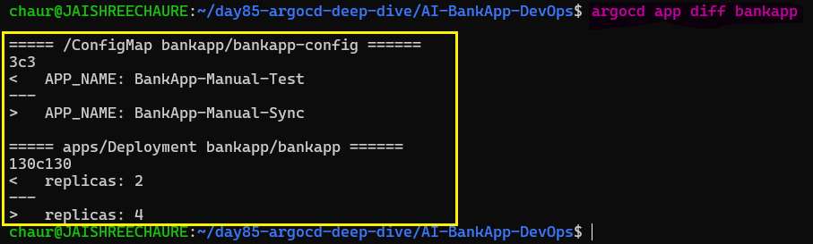 

### Preview the Sync

Use a dry run to preview the synchronization without applying changes:

```bash
argocd app sync bankapp --dry-run
```
This confirms what ArgoCD would synchronize.

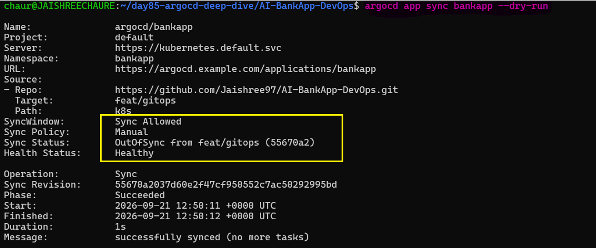 

The manifest diff shows the desired Git state compared with the current live state.

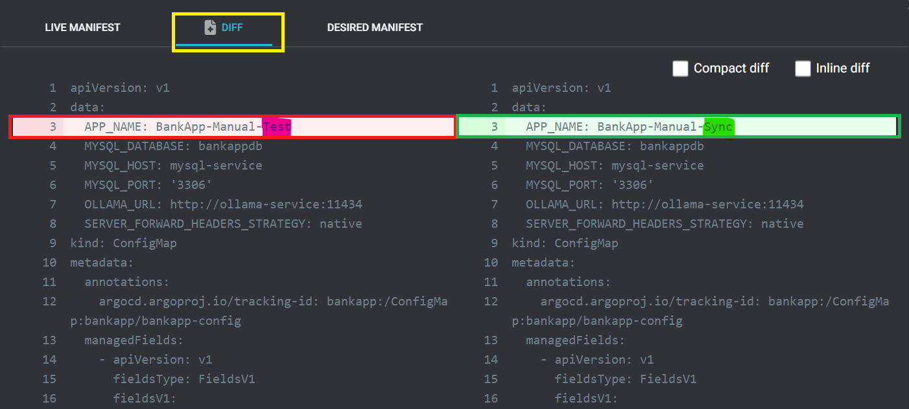 

### Sync Manually

Apply the Git changes:
```bash
argocd app sync bankapp
```
The manual synchronization should complete successfully.

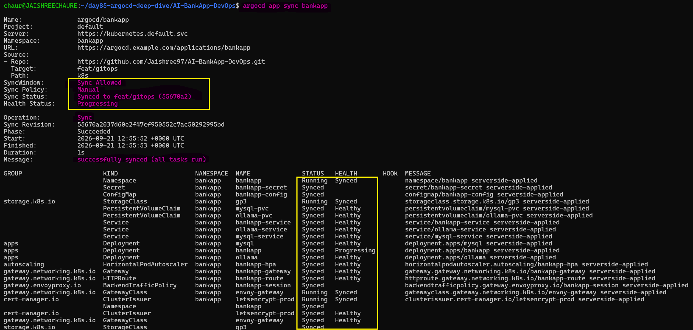 

In the ArgoCD UI, the Sync action also provides a preview of the resources that will be changed before applying them.

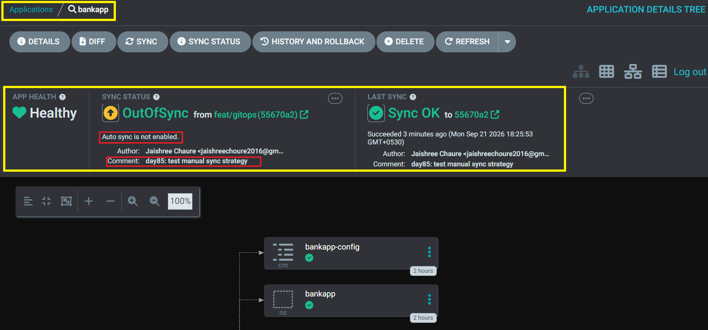

### Switch Back to Automated Sync

Restore automated synchronization with self-healing and pruning:
```bash
argocd app set bankapp --sync-policy automated --self-heal --auto-prune
```
Verify that automated sync is enabled and the application is healthy.

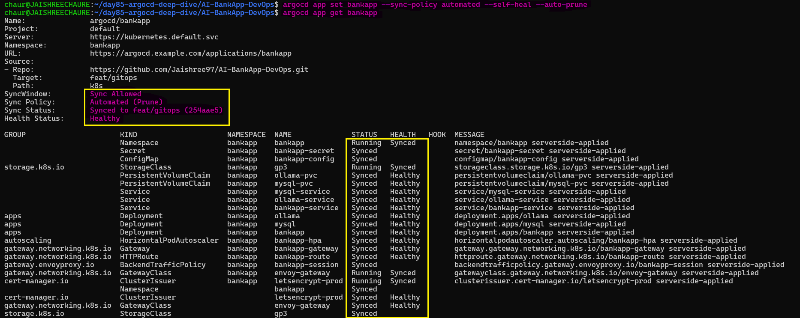 

The ArgoCD UI should show the application as `Healthy` and `Synced`, with auto-sync enabled.

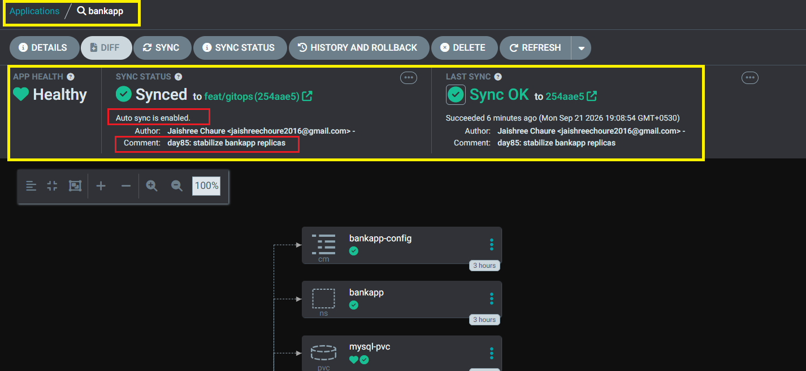

---

## Task 2: Sync Waves and Resource Ordering

The AI-BankApp has dependencies: MySQL must be running before the BankApp starts. ArgoCD handles this with **sync waves** -- annotations that control the order of resource creation.

### Add sync wave annotations to the AI-BankApp manifests in your fork:

Set the following annotations in the corresponding manifests:

Edit `k8s/namespace.yml`:
```yaml
apiVersion: v1
kind: Namespace
metadata:
  name: bankapp
  annotations:
    argocd.argoproj.io/sync-wave: "-2"
```

Edit `k8s/pv.yml` (StorageClass):
```yaml
metadata:
  name: gp3
  annotations:
    argocd.argoproj.io/sync-wave: "-2"
```

Edit `k8s/pvc.yml` (both PVCs):
```yaml
metadata:
  annotations:
    argocd.argoproj.io/sync-wave: "-1"
```

Edit `k8s/configmap.yml` and `k8s/secrets.yml`:
```yaml
metadata:
  annotations:
    argocd.argoproj.io/sync-wave: "-1"
```

Edit `k8s/mysql-deployment.yml`:
```yaml
metadata:
  annotations:
    argocd.argoproj.io/sync-wave: "0"
```

Edit `k8s/ollama-deployment.yml`:
```yaml
metadata:
  annotations:
    argocd.argoproj.io/sync-wave: "0"
```

Edit `k8s/service.yml` (all three services):
```yaml
metadata:
  annotations:
    argocd.argoproj.io/sync-wave: "0"
```

Edit `k8s/bankapp-deployment.yml`:
```yaml
metadata:
  annotations:
    argocd.argoproj.io/sync-wave: "1"
```

Edit `k8s/hpa.yml`:
```yaml
metadata:
  annotations:
    argocd.argoproj.io/sync-wave: "2"
```

**The sync order becomes:**
```
Wave -2: Namespace, StorageClass          (infrastructure)
Wave -1: PVCs, ConfigMap, Secret          (configuration)
Wave  0: MySQL, Ollama, Services          (databases and networking)
Wave  1: BankApp Deployment               (application)
Wave  2: HPA                              (scaling)
```

ArgoCD processes each wave in order. Resources in the same wave sync in parallel. ArgoCD waits for each wave to be healthy before moving to the next.

### Commit and Push

Commit and push these changes. ArgoCD will re-sync and you will see the ordered deployment in the UI.

```bash
git add .
git commit -m "day85: add ArgoCD sync waves"
git push origin feat/gitops
```
ArgoCD will detect the new commit and synchronize the resources according to their assigned waves.

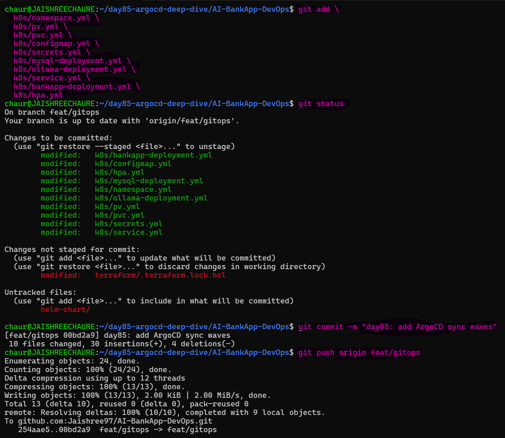 

The ArgoCD resource tree shows the BankApp resources after synchronization.

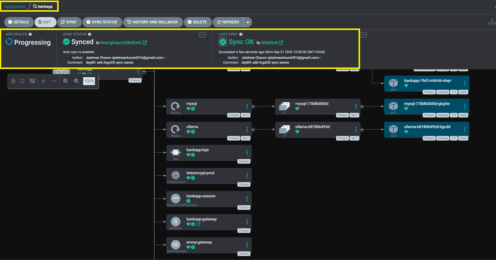 

The manifest shows the `argocd.argoproj.io/sync-wave` annotation applied to the resource.

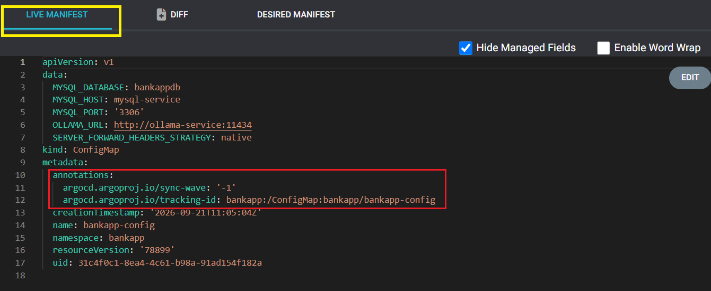

---

## Task 3: ArgoCD Rollbacks

ArgoCD records each synchronization as a revision, allowing you to restore the application to a previous state.

### Check the sync history

View the application's revision history:
```bash
argocd app history bankapp
```
This shows the Git revisions that ArgoCD has synchronized.

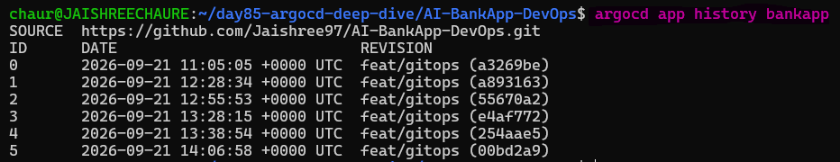 

### Rollback to a Previous Revision

Rollback to the selected revision:

Via CLI:
```bash
argocd app rollback bankapp 4
```
The rollback restores the cluster to that ArgoCD revision.

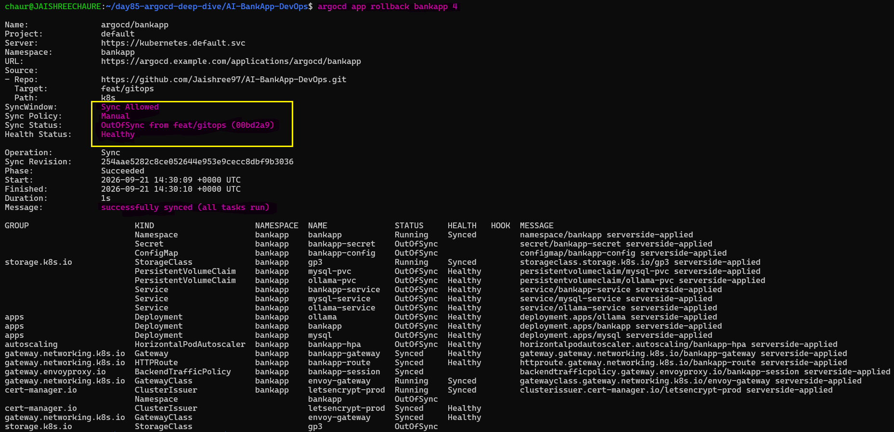

You can also perform the rollback from the UI:

**`Application → History and Rollback → Select revision → Rollback`**

### Verify the Rollback

Check the application status:
```bash
argocd app get bankapp
```
With automated sync disabled, the application can become `OutOfSync` because the cluster is now running an older revision than the latest Git state.

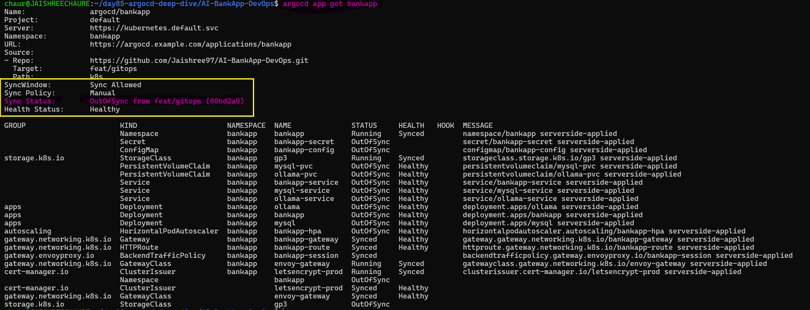

### ArgoCD Rollback vs Git Revert

An ArgoCD rollback changes the live cluster state to a previous application revision. It does not create a new Git commit.

For a GitOps workflow, the desired state should ultimately be represented in Git. A Git revert creates a new commit that reverses a previous change:

```bash
# In your fork
git revert <commit>
git push origin feat/gitops
``` 
ArgoCD then detects the new Git state and synchronizes the cluster.

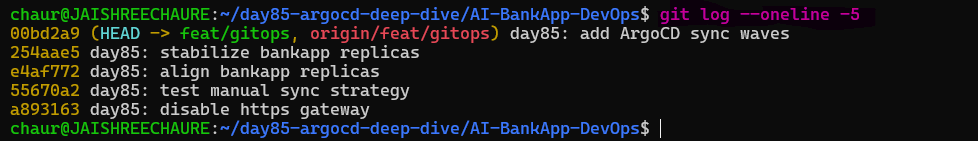

> **Note:** ArgoCD rollback is useful for quickly restoring a previous live state. A Git revert preserves the rollback in Git and provides a clear audit trail.

**Document:** What is the difference between ArgoCD rollback and `git revert`? Which is the GitOps-correct approach?

- `ArgoCD rollback`: Restores the live cluster to a previous ArgoCD revision without changing Git.
- `git revert`: Creates a new Git commit that reverses an earlier change, allowing ArgoCD to reconcile the cluster from Git.

For a GitOps workflow, `git revert` keeps the desired state represented in Git, allowing ArgoCD to reconcile the cluster from Git.

---

## Task 4: App of Apps Pattern

In production, you do not manage one application -- you manage dozens. The **App of Apps** pattern uses one parent ArgoCD Application that creates child Applications.

### Create the App Definitions Directory

```bash
mkdir -p argocd-apps/
```
### Create the BankApp Application

Create `argocd-apps/bankapp.yaml` (the BankApp application):
```yaml
apiVersion: argoproj.io/v1alpha1
kind: Application
metadata:
  name: bankapp
  namespace: argocd
  finalizers:
    - resources-finalizer.argocd.argoproj.io
spec:
  project: default
  source:
    repoURL: https://github.com/Jaishree97/AI-BankApp-DevOps.git
    targetRevision: feat/gitops
    path: k8s
  destination:
    server: https://kubernetes.default.svc
    namespace: bankapp
  syncPolicy:
    automated:
      prune: true
      selfHeal: true
    syncOptions:
      - CreateNamespace=true
      - ServerSideApply=true
```
### Create the Monitoring Application

Create `argocd-apps/monitoring.yaml` (Prometheus + Grafana):
```yaml
apiVersion: argoproj.io/v1alpha1
kind: Application
metadata:
  name: monitoring
  namespace: argocd
  finalizers:
    - resources-finalizer.argocd.argoproj.io
spec:
  project: default
  source:
    repoURL: https://prometheus-community.github.io/helm-charts
    chart: kube-prometheus-stack
    targetRevision: "65.*"
    helm:
      values: |
        grafana:
          adminPassword: admin123
        prometheus:
          prometheusSpec:
            retention: 3d
            resources:
              requests:
                memory: 256Mi
                cpu: 100m
  destination:
    server: https://kubernetes.default.svc
    namespace: monitoring
  syncPolicy:
    automated:
      prune: true
      selfHeal: true
    syncOptions:
      - CreateNamespace=true
      - ServerSideApply=true
```
### Create the Envoy Gateway Application

Create `argocd-apps/envoy-gateway.yaml`:
```yaml
apiVersion: argoproj.io/v1alpha1
kind: Application
metadata:
  name: envoy-gateway
  namespace: argocd
  finalizers:
    - resources-finalizer.argocd.argoproj.io
spec:
  project: default
  source:
    repoURL: docker.io/envoyproxy
    chart: gateway-helm
    targetRevision: "v1.4.*"
  destination:
    server: https://kubernetes.default.svc
    namespace: envoy-gateway-system
  syncPolicy:
    automated:
      prune: true
      selfHeal: true
    syncOptions:
      - CreateNamespace=true
```
### Create the Root Application

**Create the parent Application** that manages all child apps:
```yaml
# argocd-apps/root-app.yaml
apiVersion: argoproj.io/v1alpha1
kind: Application
metadata:
  name: root-app
  namespace: argocd
spec:
  project: default
  source:
    repoURL: https://github.com/Jaishree97/AI-BankApp-DevOps.git
    targetRevision: feat/gitops
    path: argocd-apps
  destination:
    server: https://kubernetes.default.svc
    namespace: argocd
  syncPolicy:
    automated:
      prune: true
      selfHeal: true
```
The `root-app` reads the `argocd-apps/` directory and creates the child Applications.

### Push and Apply

Push the `argocd-apps/` directory to your fork and apply the root app:

```bash
git add argocd-apps/
git commit -m "day85: add ArgoCD app of apps"
git push origin feat/gitops
```
Apply the parent Application:

```bash
kubectl apply -f argocd-apps/root-app.yaml
```
### Reconcile Envoy Gateway

If the existing manually installed Envoy Gateway Deployment conflicts with the ArgoCD-managed Application, delete only the Deployment and let ArgoCD recreate it:

```bash
kubectl delete deployment envoy-gateway -n envoy-gateway-system

argocd app get envoy-gateway --refresh
argocd app sync envoy-gateway
argocd app get envoy-gateway
```
> **Note:** This is only required if ArgoCD reports a Deployment conflict. Do not delete the namespace or CRDs.

> **Note:** Envoy Gateway is initially installed manually, then brought under ArgoCD management through the App of Apps pattern. Avoid managing the same resources with both Helm and ArgoCD at the same time.

The `root-app` is now managing the child Applications defined in `argocd-apps/`.

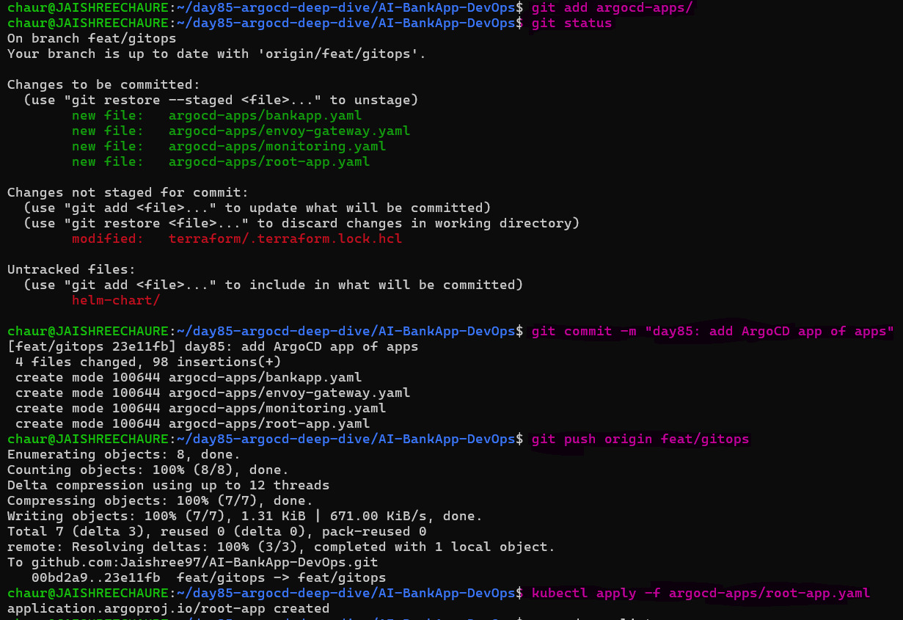 

ArgoCD will:
1. Read the `argocd-apps/` directory from Git
2. Find `bankapp.yaml`, `monitoring.yaml`, and `envoy-gateway.yaml`
3. Create three child Applications
4. Each child Application syncs independently

**In the ArgoCD UI,** you now see 4 applications: `root-app`, `bankapp`, `monitoring`, `envoy-gateway`. Adding a new app to the cluster is as simple as adding a new YAML file to the `argocd-apps/` directory.

### Verify All Applications

```bash
argocd app list
```
Each child Application can sync independently, while `root-app` manages the application definitions.

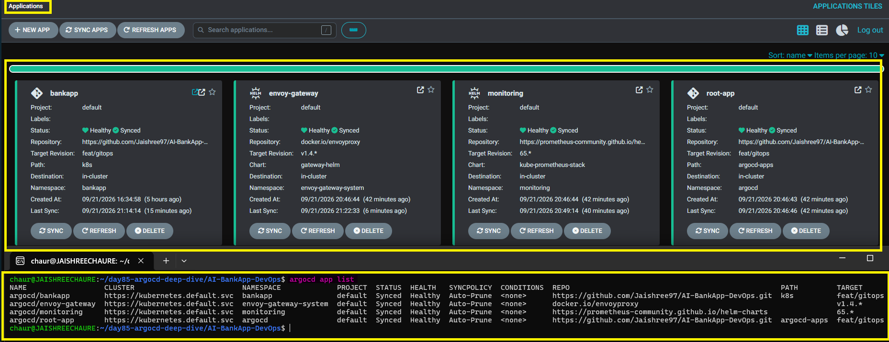

> **Key idea:** To add another application, create another Application manifest inside `argocd-apps/` and push it to Git. The `root-app` then manages it automatically.

---

## Task 5: ArgoCD Notifications

ArgoCD Notifications can trigger messages when an application sync succeeds, fails, or becomes degraded.

ArgoCD Notifications is already available in the installed ArgoCD setup. Verify that the Notifications controller is running:

### Verify Notifications Controller is running
```bash
kubectl get pods -n argocd -l app.kubernetes.io/component=notifications-controller
```
The Notifications controller should be `Running`.

### Configure Notification Triggers

Create `notification/notification.yml`:
```bash
apiVersion: v1
kind: ConfigMap
metadata:
  name: argocd-notifications-cm
  namespace: argocd
data:
  trigger.on-sync-succeeded: |
    - when: app.status.operationState.phase in ['Succeeded']
      send: [app-sync-succeeded]

  trigger.on-sync-failed: |
    - when: app.status.operationState.phase in ['Error', 'Failed']
      send: [app-sync-failed]

  trigger.on-health-degraded: |
    - when: app.status.health.status == 'Degraded'
      send: [app-health-degraded]

  template.app-sync-succeeded: |
    message: "Application {{.app.metadata.name}} sync succeeded. Revision: {{.app.status.sync.revision}}"

  template.app-sync-failed: |
    message: "Application {{.app.metadata.name}} sync FAILED! Check ArgoCD for details."

  template.app-health-degraded: |
    message: "Application {{.app.metadata.name}} health is DEGRADED. Investigate immediately."
```
Apply the configuration:

```bash
kubectl apply -f notification/notification.yml
```
### Subscribe BankApp to Notifications

```bash
kubectl annotate application bankapp -n argocd \
  notifications.argoproj.io/subscribe.on-sync-succeeded.webhook="" \
  notifications.argoproj.io/subscribe.on-sync-failed.webhook="" \
  notifications.argoproj.io/subscribe.on-health-degraded.webhook=""
```
This connects `bankapp` to the configured notification triggers.

> **Note:** A real Slack/webhook destination is not configured in this lab. The task demonstrates the notification controller, triggers, templates, and application subscription.

### Verify the Sync Event

```bash
kubectl get applications bankapp -n argocd -o jsonpath='{.status.operationState.message}'
```
A successful sync should show: `successfully synced (all tasks run)`

The notification configuration and BankApp subscription are now in place.

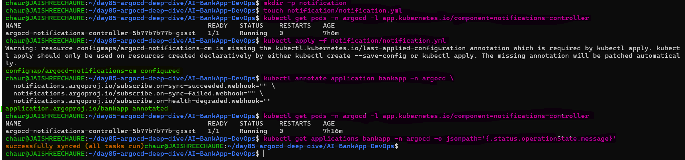

---

## Task 6: ArgoCD Projects and RBAC

In production, teams should not have unrestricted access to every ArgoCD Application. **Projects** provide boundaries for repositories, destinations, and resource types, while **RBAC** controls what actions users can perform.

### Create the BankApp Team Project

Create a dedicated project for the BankApp team:
```bash
argocd proj create bankapp-team \
  --description "AI-BankApp team project" \
  --src "https://github.com/Jaishree97/AI-BankApp-DevOps.git" \
  --dest "https://kubernetes.default.svc,bankapp" \
  --dest "https://kubernetes.default.svc,monitoring"

argocd proj get bankapp-team
```
This project:
- Can only source from the AI-BankApp repo
- Can only deploy to the `bankapp` and `monitoring` namespaces
- Cannot deploy to `kube-system`, `argocd`, or other namespaces

Move the bankapp Application to this project:
```bash
argocd app set bankapp --project bankapp-team
```
The project is restricted to the AI-BankApp repository and the `bankapp` and `monitoring` namespaces.

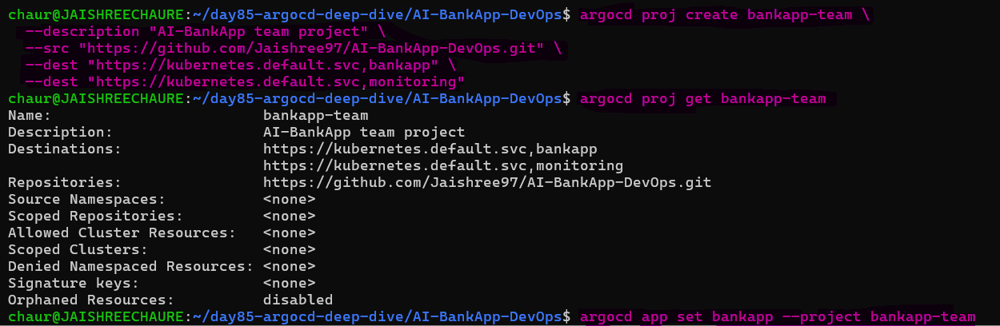 

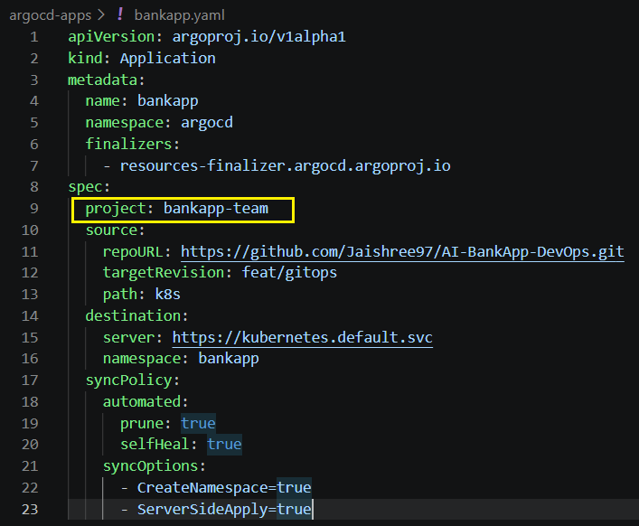

### Move BankApp to the Team Project

Update `argocd-apps/bankapp.yaml`: `project: bankapp-team`

Commit and push the change:

```bash
git add argocd-apps/bankapp.yaml
git commit -m "day85: move bankapp to team project"
git push origin feat/gitops
```
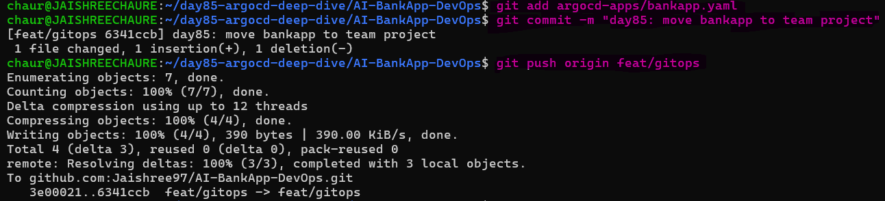 

Refresh and synchronize the parent Application so the Git-managed child Application is updated:

```bash
argocd app get root-app --refresh
argocd app sync root-app
argocd app get bankapp
```
The BankApp Application should now belong to the `bankapp-team` project and remain `Healthy` and `Synced`.

### Allow Required Cluster-Scoped Resources

The BankApp manifests use several cluster-scoped resources, so explicitly allow the required resource kinds in the project:

```bash
argocd proj allow-cluster-resource bankapp-team "" Namespace
argocd proj allow-cluster-resource bankapp-team storage.k8s.io StorageClass
argocd proj allow-cluster-resource bankapp-team gateway.networking.k8s.io GatewayClass
```
> **Optional HTTPS:** If cert-manager is enabled later, allow the `cert-manager.io` `ClusterIssuer` resource in this project.

Verify the project configuration:

```bash
argocd proj get bankapp-team
```
The project should now show the allowed cluster resources.

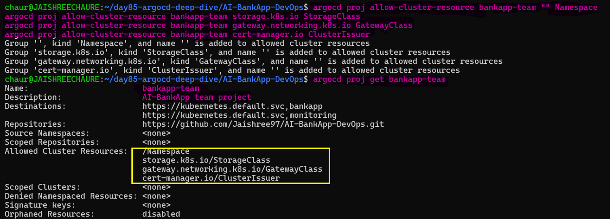

### Sync and Verify BankApp

Synchronize the application and verify its final state:

```bash
argocd app sync bankapp
argocd app get bankapp
```
Expected state:

```text
Project:       bankapp-team
Sync Status:   Synced
Health Status: Healthy
Sync Policy:   Automated (Prune)
```
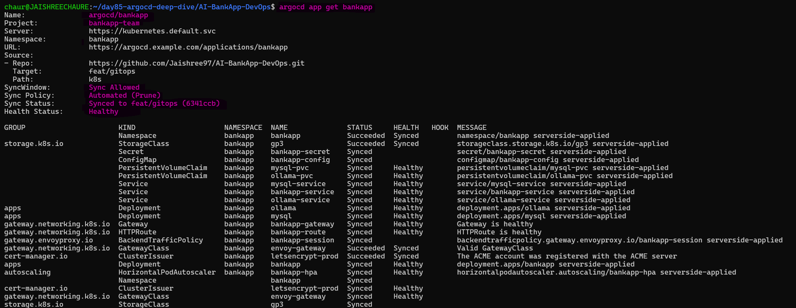 

### Configure RBAC

Inspect the existing ArgoCD RBAC configuration before modifying it:

```bash
kubectl get configmap argocd-rbac-cm -n argocd -o yaml
```

Configure the `bankapp-dev` role:

```bash
kubectl patch configmap argocd-rbac-cm -n argocd --type merge -p '
{
  "data": {
    "policy.csv": "p, role:bankapp-dev, applications, get, bankapp-team/*, allow\np, role:bankapp-dev, applications, sync, bankapp-team/*, allow\np, role:bankapp-dev, applications, rollback, bankapp-team/*, deny\ng, bankapp-developers, role:bankapp-dev"
  }
}'
```
Verify the RBAC configuration:

```bash
kubectl get configmap argocd-rbac-cm -n argocd -o yaml
```
The policy gives the `bankapp-developers` group permission to:

- View applications in `bankapp-team`
- Sync applications in `bankapp-team`
- Not perform rollbacks

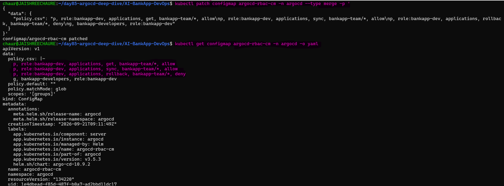

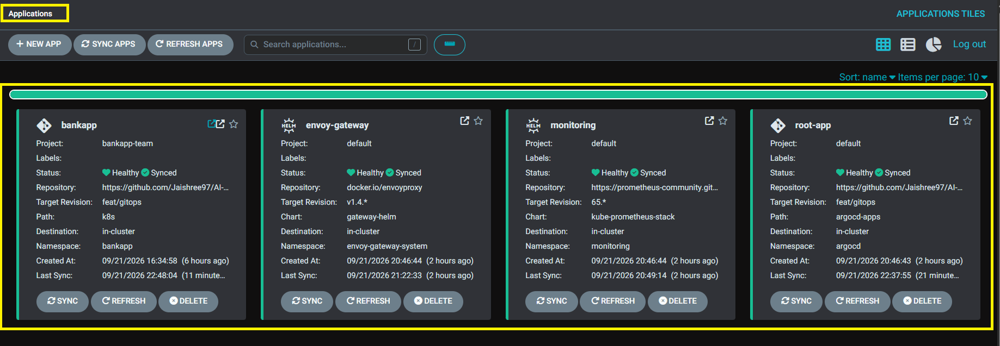

### Project and RBAC Boundaries

Projects and RBAC provide two layers of control:

- **Project:** restricts which repositories, namespaces, and resource types an application can use.
- **RBAC:** restricts which actions a user or group can perform on applications.
- Together, they reduce the risk of one team modifying applications or resources outside its assigned scope.

> **Note:** The `bankapp-developers` group must be mapped to an actual ArgoCD/SSO identity for these RBAC permissions to apply to real users.

**Document:** How do Projects and RBAC prevent one team from accidentally affecting another team's applications?

- `Projects` separate teams' apps, repos, and clusters.
- `RBAC` controls user permissions and allowed actions.
- `Together`, they ensure each team can only access and change its own resources, preventing cross-team impact.

---

## Automated vs Manual Sync

### Automated Sync

- ArgoCD automatically applies Git changes to the cluster.
- Keeps the cluster continuously aligned with Git.
- Useful for stable environments where consistent deployments are preferred.

### Manual Sync

- Sync must be triggered manually.
- Git changes are not applied automatically.
- Useful when approval, testing, or additional checks are required.

### When to Use What

- **Automated sync:** Stable environments such as production.
- **Manual sync:** Staging/testing environments or deployments requiring approval.

---

## Sync Waves

ArgoCD uses sync waves to control the deployment order of resources.

| Wave | Deployment Order | Resources |
|------|------------------|-----------|
| **-2** | Base infrastructure | Namespace, StorageClass |
| **-1** | Configuration layer | PVCs, ConfigMaps, Secrets |
| **0** | Core dependencies | MySQL, Ollama, Services |
| **1** | Main application | BankApp |
| **2** | Scaling | HPA |

> ArgoCD applies resources in order so dependencies are ready before the application starts.

---

## ArgoCD Rollback vs `git revert`

### ArgoCD Rollback

- Changes the **cluster state** back to a previous deployed version.
- Does **not** change the Git repository.

### `git revert`

- Creates a **new Git commit** that reverses previous changes.
- ArgoCD detects the new commit and syncs the reverted state to the cluster.

| Approach | Changes Git? | Changes Cluster? |
|----------|--------------|------------------|
| **ArgoCD Rollback** | No | Yes |
| **`git revert`** | Yes | Yes, after ArgoCD sync |

---

## App of Apps architecture diagram

This architecture shows the **ArgoCD App of Apps pattern**:

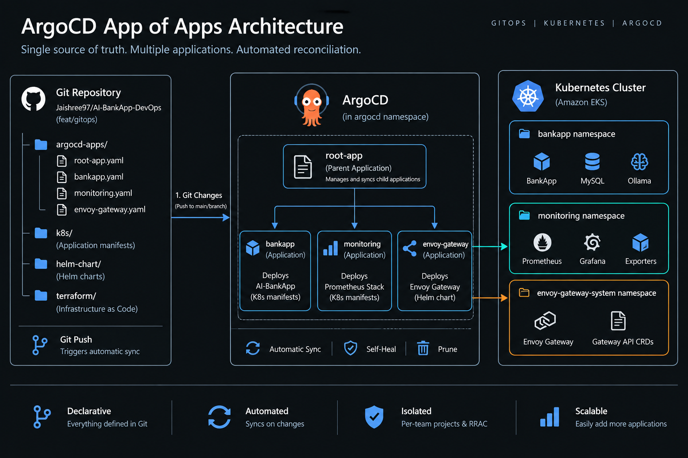

**Git Repository → Root App → Child Applications → Kubernetes Cluster**

- **Git** stores the application definitions and manifests.
- **`root-app`** manages the child applications: BankApp, Monitoring, and Envoy Gateway.
- **ArgoCD** automatically syncs and reconciles the applications.
- **EKS** runs the workloads in separate namespaces.
- **Self-Heal and Prune** keep the cluster aligned with Git.

