# Day 86 -- GitOps Project: End-to-End CI/CD Pipeline with AI-BankApp

## Setup Before Day 86 Tasks

### 1. Re-Provision EKS

```bash
cd ~/day86-gitops-cicd-project/AI-BankApp-DevOps/terraform
terraform apply -auto-approve
aws eks update-kubeconfig --name bankapp-eks --region us-west-2
kubectl get nodes
kubectl get pods -n argocd
kubectl get svc -n argocd
```
### 2. Install Gateway API

```bash
kubectl apply -f https://github.com/kubernetes-sigs/gateway-api/releases/download/v1.2.1/standard-install.yaml

kubectl get crd | grep gateway.networking.k8s.io
```
### 3. Install Envoy Gateway CRDs

```bash
helm template eg-crds oci://docker.io/envoyproxy/gateway-crds-helm \
  --version v1.4.0 \
  --set crds.gatewayAPI.enabled=false \
  --set crds.envoyGateway.enabled=true \
  --include-crds \
  | kubectl apply --server-side --validate=false -f -

kubectl api-resources | grep gateway.envoyproxy.io
```
### 4. Install Envoy Gateway

```bash
helm install eg oci://docker.io/envoyproxy/gateway-helm \
  --version v1.4.0 \
  -n envoy-gateway-system \
  --create-namespace \
  --skip-crds

kubectl get pods -n envoy-gateway-system
helm list -n envoy-gateway-system
```
### 5. Install Cert-Manager

```bash
helm install cert-manager \
  oci://quay.io/jetstack/charts/cert-manager \
  --version v1.20.4 \
  --namespace cert-manager \
  --create-namespace \
  --set crds.enabled=true \
  --set config.apiVersion="controller.config.cert-manager.io/v1alpha1" \
  --set config.kind="ControllerConfiguration" \
  --set config.enableGatewayAPI=true
```
### 6. Create ArgoCD Application

```bash
kubectl apply -f argocd/application.yml
kubectl get applications -n argocd
```
### 7. Get ArgoCD Credentials

```bash
kubectl -n argocd get secret argocd-initial-admin-secret \
  -o jsonpath="{.data.password}" | base64 -d && echo

export ARGOCD_URL=$(kubectl get svc argocd-server -n argocd \
  -o jsonpath='{.status.loadBalancer.ingress[0].hostname}')

echo "ArgoCD URL: http://$ARGOCD_URL"
```
### 8. Login and Verify ArgoCD

```bash
argocd login $ARGOCD_URL --username admin --password <your-password> --insecure

argocd account get-user-info
```
### 9. Verify Application BankApp

```bash
argocd app get bankapp --refresh
argocd app get bankapp
```
Verify:

- ArgoCD application is `Synced`
- Application health is `Healthy`
- Envoy Gateway pod is `Running`
- BankApp, MySQL, and Ollama pods are `Running`

###  10. Verify Gateway and External Access

Get the Gateway NLB hostname:

```bash
kubectl get gateway bankapp-gateway -n bankapp \
  -o jsonpath='{.status.addresses[0].value}{"\n"}'
```
Example output:

```text
<GATEWAY_NLB_HOSTNAME>
```
Resolve the Gateway NLB:

```bash
getent ahostsv4 `<GATEWAY_NLB_HOSTNAME>`
```
Example output:

```text
35.155.38.102
```
Use the resolved IP to construct the nip.io hostname:

```text
https://<GATEWAY_IP>.nip.io
```
Verify the Gateway configuration:

```bash
git diff -- k8s/gateway.yml
```
If the Gateway hostname needs updating:

```bash
git add k8s/gateway.yml
git commit -m "fix: update gateway hostname"
git push origin feat/gitops
```
Refresh ArgoCD:

```bash
argocd app get bankapp --refresh
```

Verify external access:

```text
https://<GATEWAY_IP>.nip.io
```
> **Note:** The Day 86 setup uses Gateway API, Envoy Gateway, and cert-manager for the BankApp Gateway and TLS configuration. Keep the Gateway hostname in `k8s/gateway.yml` synchronized with the current EKS/Envoy Gateway NLB address.

---

## Task 1: Study the AI-BankApp's GitOps CI Pipeline

Open `.github/workflows/gitops-ci.yml` from the AI-BankApp repo. This is a production-grade GitOps CI pipeline.

**The workflow triggers on:**
```yaml
on:
  push:
    branches: [feat/gitops]
    paths:
      - 'src/**'
      - 'pom.xml'
      - 'Dockerfile'
  workflow_dispatch:
```

It only runs when application code changes (`src/`, `pom.xml`, `Dockerfile`) -- not when Kubernetes manifests change. This prevents infinite loops since the pipeline itself updates manifests.

**The pipeline steps:**

| Step | What it does |
|------|-------------|
| Checkout code | Clones the repo |
| Set up JDK 21 | Installs Java 21 with Maven cache |
| Build with Maven | `./mvnw clean package -DskipTests -B` |
| Run tests | `./mvnw test -B` (non-blocking: `continue-on-error: true`) |
| Set image tag | Uses `git rev-parse --short HEAD` as the tag (e.g., `1c7cb0e`) |
| Login to DockerHub | Authenticates with secrets |
| Build and push image | Pushes the configured DockerHub repository with `:latest` and `:sha` tags |
| Update K8s manifest | Uses `sed` to update the image tag in `k8s/bankapp-deployment.yml` |
| Commit updated manifest | Commits the change with `[skip ci]` to avoid re-triggering |

**The critical GitOps step** is the last two:
```yaml
- name: Update Kubernetes deployment manifest
  run: |
    sed -i "s|image: ${{ env.DOCKERHUB_REPO }}:.*|image: ${{ env.DOCKERHUB_REPO }}:${{ steps.tag.outputs.sha_short }}|" k8s/bankapp-deployment.yml

- name: Commit updated manifest
  run: |
    git config user.name "github-actions[bot]"
    git config user.email "github-actions[bot]@users.noreply.github.com"
    git add k8s/bankapp-deployment.yml
    git diff --staged --quiet || git commit -m "ci: update bankapp image to ${{ steps.tag.outputs.sha_short }} [skip ci]"
    git push
```

**Why `[skip ci]`?** Without it, the commit that updates the manifest would trigger the pipeline again, which would update the manifest again -- an infinite loop. `[skip ci]` tells GitHub Actions to ignore this commit.

**The handoff to ArgoCD:**
```
GitHub Actions commits new image tag to k8s/bankapp-deployment.yml
         |
    ArgoCD detects the new commit (within 3 minutes)
         |
    ArgoCD compares: cluster has old image, Git has new image
         |
    ArgoCD syncs: performs a rolling update
         |
    New pods start with the new image, old pods terminate
         |
    Zero downtime deployment complete
```
---

## Task 2: Set Up the Pipeline on Your Fork

Configure `DockerHub` and `GitHub Actions` so your fork can build and publish the `BankApp` image.

### 1. Fork the repo (if not done on Day 84):
```
https://github.com/TrainWithShubham/AI-BankApp-DevOps -> Fork
```
### 2. Create a DockerHub access token:

Create a DockerHub Personal Access Token with **Read & Write** permissions for GitHub Actions.

- Go to https://hub.docker.com → Account Settings → Personal access tokens
- Create a new access token with `Read/Write` permissions
- Note and Save the token securely

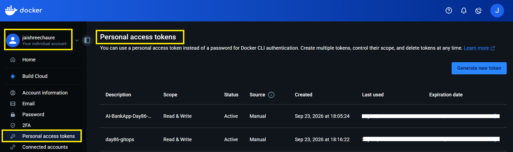

### 3. Add GitHub Secrets to your fork:

- Add these secrets:
  - `DOCKERHUB_USERNAME` -- your DockerHub username
  - `DOCKERHUB_TOKEN` -- your DockerHub Personal Access Token from step 2

Added the DockerHub credentials to your fork under `Settings → Secrets and variables → Actions`

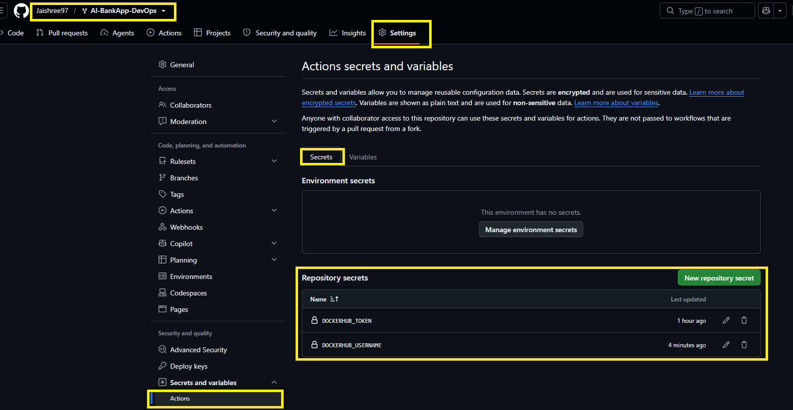 

### 4. Update the workflow to push to your DockerHub repo:

Update the workflow to use your DockerHub repository:

Edit `.github/workflows/gitops-ci.yml` in your fork:

```yaml
env:
  DOCKERHUB_REPO: jaishreechaure/ai-bankapp-eks
```
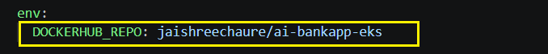

### 5. Configure the Kubernetes Image

Update `k8s/bankapp-deployment.yml` so BankApp pulls from your DockerHub repository:

Edit `k8s/bankapp-deployment.yml`:
```yaml
image: jaishreechaure/ai-bankapp-eks:latest
```
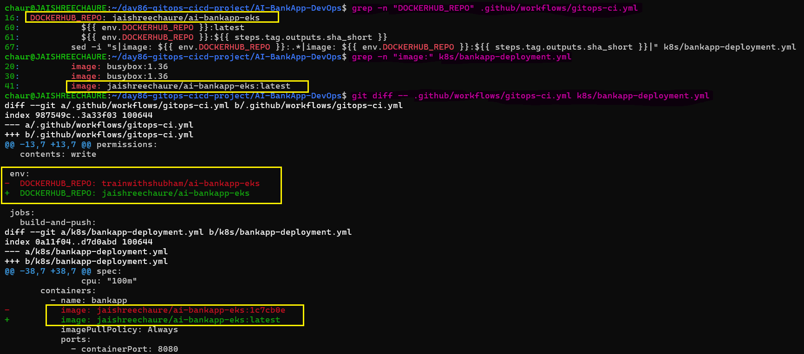 

### 6. Verify the ArgoCD Application

The ArgoCD `bankapp` Application is already configured to track the fork and `feat/gitops` branch.

```bash
argocd app set bankapp --repo https://github.com/<your-username>/AI-BankApp-DevOps.git # already set in befor tasks.
```
Verify the configured repository, branch, and path:

```bash
argocd app get bankapp --refresh | grep -E "Repo:|Target:|Path:"
```
You can see the configured `Repo`, `Target`, and `Path` in the output.

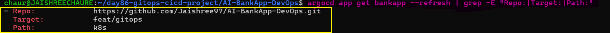

### 7. Commit and Push the Configuration

Commit the pipeline and Kubernetes configuration changes and push them to `feat/gitops`.

```bash
git add .github/workflows/gitops-ci.yml k8s/bankapp-deployment.yml
git commit -m "chore: configure personal DockerHub repository"
git push origin feat/gitops
```
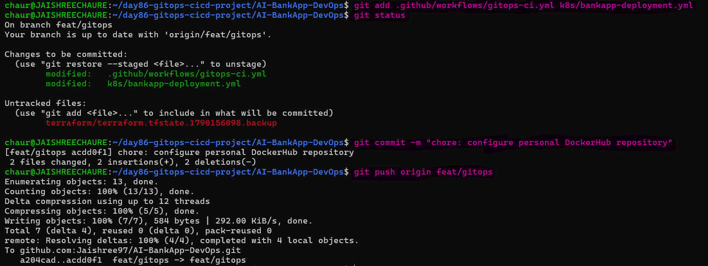

### 8. Verify an Initial Application Change

Update the BankApp welcome message to demonstrate the GitOps deployment flow:

```bash
sed -i 's/Welcome back Josh Batch 10/Welcome back Udaan Batch 11/' src/main/resources/templates/login.html

grep -n "Welcome back" src/main/resources/templates/login.html
```
Commit and push the change:

```bash
git add src/main/resources/templates/login.html
git commit -m "feat: update login welcome message"
git push origin feat/gitops
```
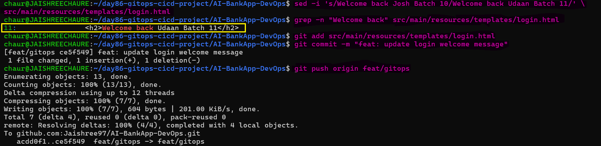

### 9. Verify ArgoCD Sync

After the change is pushed, verify that ArgoCD detects and syncs the new Git revision:

```bash
argocd app get bankapp --refresh | grep -E "Sync Status|Health Status"
```
Expected:

```text
Sync Status:        Synced to feat/gitops
Health Status:      Healthy
```
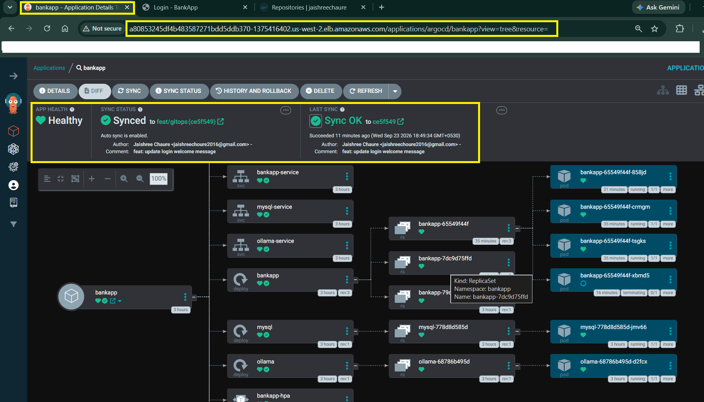

### 10. Verify the Application

Open the BankApp through the Gateway and confirm the updated welcome message is visible.

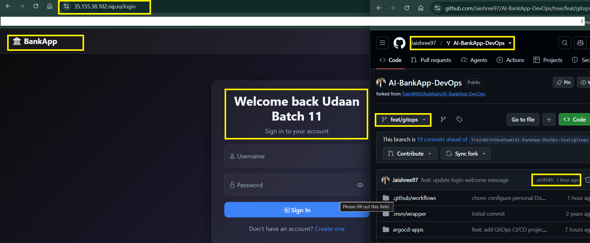

> **Result:** DockerHub credentials, GitHub Actions, Kubernetes, and ArgoCD are configured and ready for the full GitOps CI/CD pipeline.

---

## Task 3: Trigger the Full Pipeline

Make a visible application change and use it to trigger the complete GitOps `CI/CD` flow.

For example, edit `src/main/resources/templates/fragments/layout.html` -- change the page title or footer text to include your name:

### 1. Make a Visible Application Change

Update the BankApp footer to include your name:

```html
<footer th:fragment="footer" class="footer-app">
    <p class="mb-0">
        &copy; 2026 BankApp &middot; Built with Spring Boot &middot;
        <strong>Crafted by Jaishree Chaure.</strong>
    </p>
</footer>
```
```bash
git diff -- src/main/resources/templates/fragments/layout.html
```
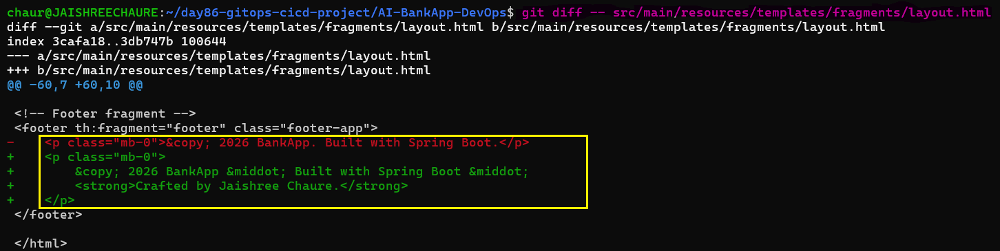

### 2. Commit and Push the Change

Commit the source change and push it to `feat/gitops`:

```bash
git add src/
git commit -m "feat: customize app footer"
git push origin feat/gitops
```
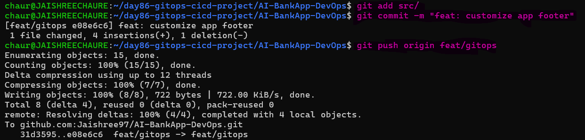

### 3. Watch the GitHub Actions Pipeline

1. Go to your fork > Actions tab
2. The push automatically triggers `GitOps CI - Build & Push to DockerHub`.
3. The pipeline performs: `build -> test -> push -> update manifest -> commit`

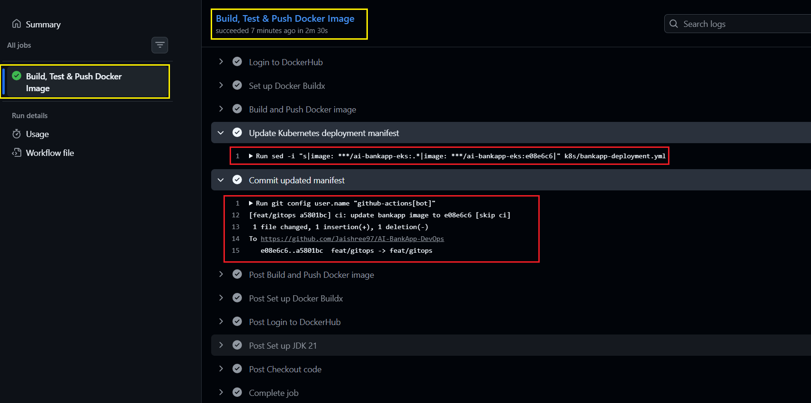 

### 4. Verify the Image Tag Update

- Check the last commit on your `feat/gitops` branch -- you should see a commit from `github-actions[bot]` with the message `ci: update bankapp image to <sha> [skip ci]`
- The `k8s/bankapp-deployment.yml` file now has the new image tag

```bash
git pull origin feat/gitops
git log --oneline -5
grep "image:" k8s/bankapp-deployment.yml
```
GitHub Actions updates k8s/bankapp-deployment.yml with the commit SHA image tag and creates a [skip ci] commit.

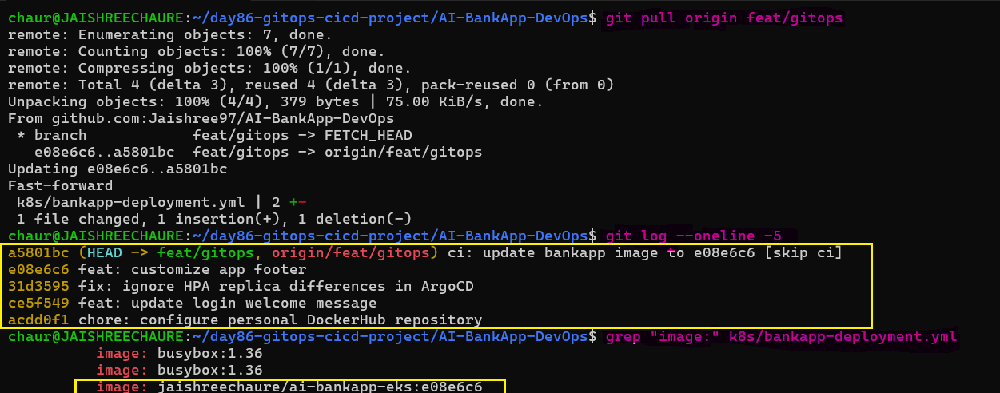

### 5. Verify ArgoCD Sync

ArgoCD detects the new Git revision and automatically deploys the updated manifest.

```bash
argocd app get bankapp --refresh | grep -E "Sync Status|Health Status"
argocd app wait bankapp
```
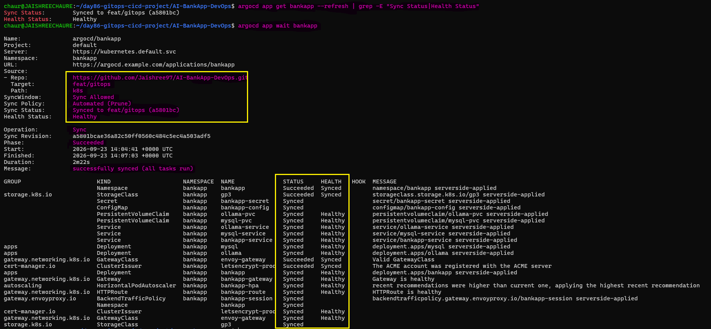 

### 6. Verify the Rolling Update

Monitor the BankApp pods during the deployment:

Check the pods:
```bash
kubectl get pods -n bankapp -w
kubectl get deployment bankapp -n bankapp -o jsonpath='{.spec.template.spec.containers[0].image}{"\n"}'
```
New pods start with the updated image while the previous pods are terminated.

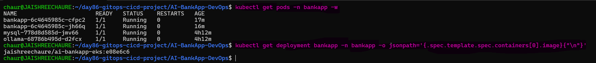 

The Deployment performs a rolling update, replacing the previous pods with pods using the new image.

### 7. Verify the Change in the Application

Open the BankApp through the Gateway and confirm the updated footer is visible:

```text
https://35.155.38.102.nip.io
```
The footer should display:

```text
© 2026 BankApp · Built with Spring Boot · Crafted by Jaishree Chaure.
```
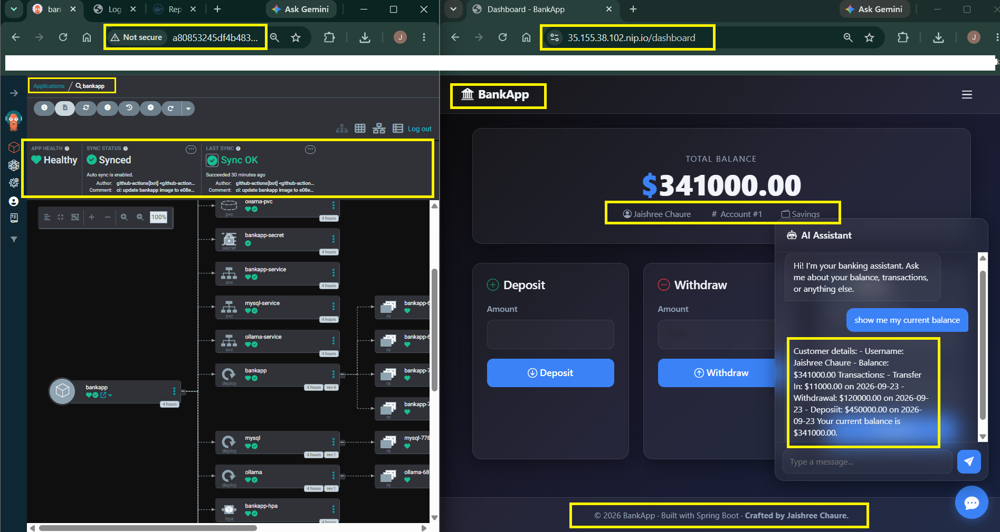

**You just completed a full GitOps cycle:** code change -> CI builds image -> updates manifest -> ArgoCD deploys to production. Zero manual intervention.

> **Result:** The complete GitOps CI/CD pipeline was successfully executed with zero manual deployment intervention.

---

## Task 4: Test Drift Detection and Recovery

GitOps means the cluster must always match Git. Test how ArgoCD detects and automatically repairs unauthorized changes made directly to the Kubernetes cluster.

### Scenario 1 -- Scale Down the Application:

First, manually scale the BankApp Deployment to 1 replica:

```bash
kubectl scale deployment bankapp -n bankapp --replicas=1
kubectl get deployment bankapp -n bankapp
kubectl get pods -n bankapp -l app=bankapp
```
Check the ArgoCD status:

```bash
argocd app get bankapp --refresh | grep -E "Sync Status|Health Status"
kubectl get hpa bankapp-hpa -n bankapp
```
Because BankApp has an HPA, the replica count can also be changed by the HPA. This makes scaling a less direct ArgoCD drift test.

Monitor the result:

```bash
kubectl get pods -n bankapp -w
kubectl get hpa bankapp-hpa -n bankapp
```
ArgoCD continuously reconciles the application, while the HPA maintains its configured replica range.

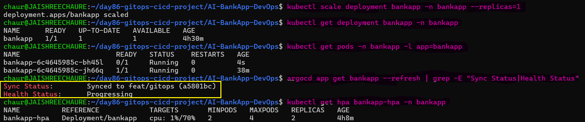 

### Scenario 2 -- Change the Image Directly:

Manually replace the BankApp image with `nginx:latest`:

```bash
kubectl set image deployment/bankapp bankapp=nginx:latest -n bankapp
kubectl get pods -n bankapp -l app=bankapp -w
```
Verify the image after ArgoCD reconciliation:

```bash
kubectl get deployment bankapp -n bankapp \
  -o jsonpath='{.spec.template.spec.containers[0].image}{"\n"}'

argocd app get bankapp --refresh | grep -E "Sync Status|Health Status"
```
ArgoCD restores the image tag defined in Git:

```bash
kubectl get deployment bankapp -n bankapp \
  -o jsonpath='{.spec.template.spec.containers[0].image}{"\n"}'
```
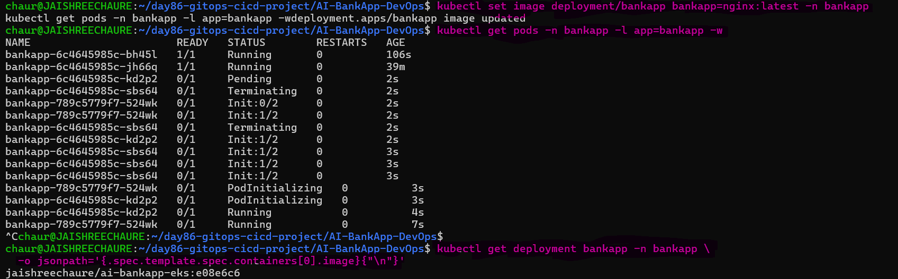 

The next screenshot shows ArgoCD's status after reconciliation, confirming that the Git-defined image has been restored.

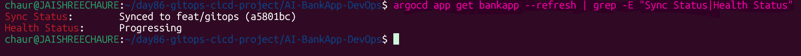

### Scenario 3 -- Delete a Critical Resource:

Delete the BankApp Service directly:

```bash
kubectl delete service bankapp-service -n bankapp
```
Verify that ArgoCD recreates it:

```bash
kubectl get service bankapp-service -n bankapp
argocd app get bankapp --refresh | grep -E "Sync Status|Health Status"
kubectl get service bankapp-service -n bankapp
```
The Service is recreated from the Git-managed configuration.

### View ArgoCD Application History:

Review the application's synchronization history:

```bash
argocd app history bankapp
``` 
In the ArgoCD UI, click the application and look at the "Events" tab. Every self-heal action is logged with the before/after state.

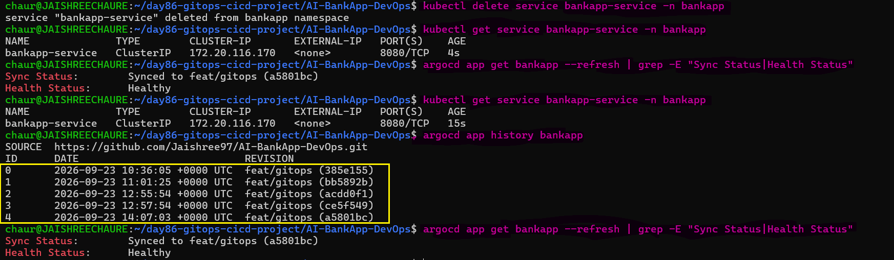

### Document: In each scenario, how long did ArgoCD take to detect and fix the drift? What would happen if `selfHeal` was disabled?

### **Drift Detection and Recovery**

- **Scenario 1:** Direct replica scaling was performed; HPA maintained the configured replica range.
- **Scenario 2:** The image was manually changed to `nginx:latest`; ArgoCD restored the Git-defined BankApp image.
- **Scenario 3:** `bankapp-service` was deleted; ArgoCD recreated it from Git.
- **Final State:** ArgoCD reported `Synced` and `Healthy`.

### **If `selfHeal` Is Disabled**

- ArgoCD can still **detect and report drift**.
- ArgoCD will **not automatically reconcile** unauthorized changes.
- A manual sync is required to restore the Git-defined state.

---

## Task 5: Reflect on the Complete DevOps Pipeline

Step back and look at everything you have built across the entire 90-day challenge that connects to this GitOps pipeline:

The following flow connects the major DevOps tools and practices covered throughout the 90-day challenge:

```
[Developer writes code]
    |
[Git push to GitHub]  ........... Day 22-28: Git & GitHub
    |
[GitHub Actions CI]   ........... Day 40-49: GitHub Actions
    |-- Build with Maven
    |-- Run tests
    |-- Build Docker image  ..... Day 29-37: Docker
    |-- Push to DockerHub
    |-- Update K8s manifest
    |-- Commit back to Git
    |
[ArgoCD detects change] ........ Day 84-86: GitOps
    |
[ArgoCD syncs to EKS]  ........ Day 81-83: EKS
    |-- Rolling update
    |-- Health checks pass
    |-- HPA scales as needed ... Day 78-80: Helm (HPA, values)
    |
[Prometheus scrapes metrics] ... Day 73-77: Observability
    |-- Grafana dashboards
    |-- Alerts if something breaks
    |
[App is live with zero downtime]
```

Every block in this challenge connects to the next. This is what a DevOps pipeline looks like in production.

---

## Task 6: Complete Teardown

Delete all EKS, ArgoCD, and application resources created during the Day 84–86 GitOps work.

### 1. Delete ArgoCD Applications

First, check the existing ArgoCD applications:

```bash
argocd app list
```
Delete the applications with cascading enabled:

```bash
argocd app delete bankapp --cascade -y
argocd app delete monitoring --cascade -y 2>/dev/null
argocd app delete envoy-gateway --cascade -y 2>/dev/null
argocd app delete root-app --cascade -y 2>/dev/null
```
The `--cascade` flag removes the Kubernetes resources managed by each ArgoCD application.

### 2. Verify Kubernetes Cleanup

Confirm that the application resources have been removed:

```bash
kubectl get all -n bankapp 2>/dev/null
kubectl get all -n monitoring 2>/dev/null
kubectl get pvc -n bankapp 2>/dev/null
```
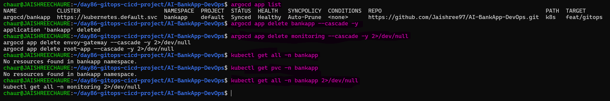 

### 3. Destroy the EKS Infrastructure

Move to the Terraform directory and destroy the infrastructure:

```bash
cd ~/day86-gitops-cicd-project/AI-BankApp-DevOps/terraform
terraform destroy
```
Review the resources and type `yes` to confirm the destruction. This takes 10-15 minutes.

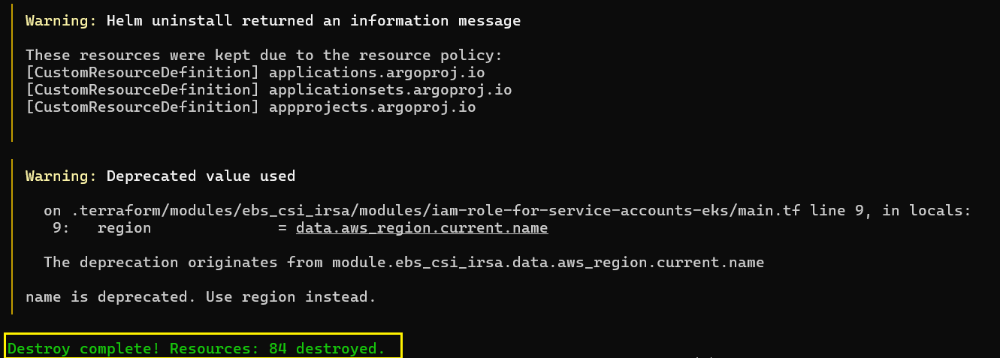 

### 4. Verify AWS Cleanup

Verify the AWS resources from the EKS deployment:

- **EKS:** No `bankapp-eks` cluster remains.
- **EC2:** No BankApp worker nodes are running.
- **Load Balancers:** EKS/Envoy Gateway load balancers are removed.
- **EBS:** EKS-related volumes are removed.
- **VPC:** Terraform-created `bankapp-eks` VPC and networking resources are removed.
- **IAM:** No `bankapp-eks` or EKS-related roles remain.

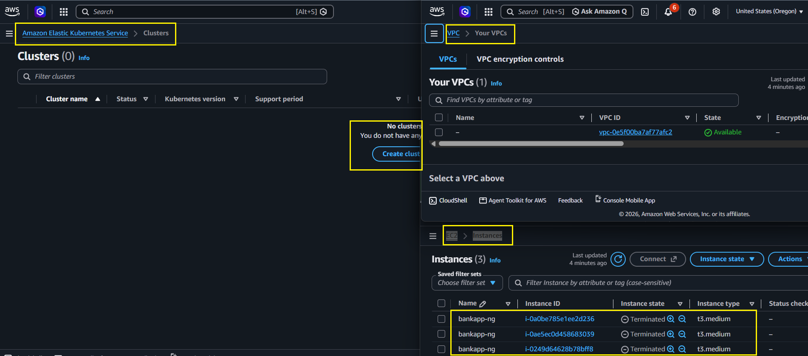

### 5. Final Cost Check

Review the AWS Billing Dashboard and confirm that no new EKS-related resources remain.

> **Note:** AWS billing data can take some time to reflect resource deletion.

### Day 84–86 GitOps Journey

| Day | What You Built |
|-----|---------------|
| 84 | ArgoCD setup, first GitOps deploy, self-healing |
| 85 | Sync waves, rollbacks, App of Apps, notifications, RBAC |
| 86 | Full CI/CD pipeline, code-to-production, drift detection, teardown |

---

## The complete GitOps pipeline diagram (code -> CI -> Git -> ArgoCD -> EKS)

This diagram shows the complete **end-to-end GitOps CI/CD flow** — from a code change and GitHub Actions CI to DockerHub, Git as the source of truth, ArgoCD continuous deployment, and the final BankApp running on Amazon EKS.

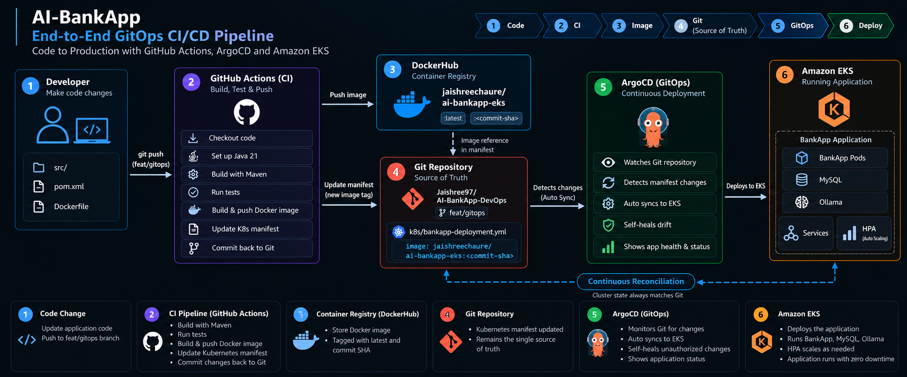

## GitHub Actions Workflow Explained Step by Step

1. `Workflow Name`

```yaml
name: GitOps CI - Build & Push to DockerHub
```
- This is just the label shown in GitHub Actions UI.

2. `When Does It Run?`

```yaml
on:
  push:
    branches: [feat/gitops]
    paths:
      - 'src/**'
      - 'pom.xml'
      - 'Dockerfile'
  workflow_dispatch:
```
**Trigger Conditions**

- Runs automatically when code is pushed to `feat/gitops`.
- Runs when changes are made to:
  - `src/`
  - `pom.xml`
  - `Dockerfile`
- `workflow_dispatch` allows a manual run from the GitHub Actions UI.
- Kubernetes-only changes do not trigger a new image build, preventing unnecessary builds and CI loops.

3. `Permissions`

```yaml
permissions:
  contents: write
```
Allows GitHub Actions to:

- Commit changes.
- Push the updated Kubernetes manifest back to the repository.
- Required because the workflow updates `k8s/bankapp-deployment.yml`.

4. `Environment Variables`

```yaml
env:
  DOCKERHUB_REPO: jaishreechaure/ai-bankapp-eks
```
- Defines the DockerHub repository as a reusable environment variable.
- The same variable is used when building, tagging, pushing, and updating the Kubernetes manifest.

5. Job Definition

```yaml
jobs:
  build-and-push:
    runs-on: ubuntu-latest
```
- Creates the `build-and-push` job.
- Runs the job on a fresh Ubuntu GitHub-hosted runner.

6. `Step-by-Step Pipeline`

`Step 1:` Checkout Code

```yaml
- name: Checkout code
  uses: actions/checkout@v4
```
- Downloads the repository source code into the GitHub Actions runner.

`Step 2:` Set Up Java 21

```yaml
- name: Set up JDK 21
  uses: actions/setup-java@v4
  with:
    java-version: '21'
    distribution: 'temurin'
    cache: 'maven'
```
- Installs Java 21.
- Uses the Temurin JDK distribution.
- Enables Maven dependency caching for faster builds.

`Step 3:` Build the Application

```yaml
- name: Build with Maven
  run: ./mvnw clean package -DskipTests -B
```
- Cleans previous build artifacts.
- Compiles the application.
- Packages the application into a JAR.
- Skips tests during this build step.

`Step 4:` Run Tests

```yaml
- name: Run tests
  run: ./mvnw test -B
  continue-on-error: true
```
- Executes the application's tests.
- `continue-on-error`: true allows the workflow to continue even if tests fail.
- Therefore, test failure does not stop the remaining pipeline steps.

`Step 5:` Generate the Image Tag

```yaml
- name: Set image tag
  id: tag
  run: echo "sha_short=$(git rev-parse --short HEAD)" >> "$GITHUB_OUTPUT"
```
- Gets the short Git commit SHA.
- Example:

```text
e08e6c6
```
- Saves it as a workflow output.
- The SHA is used as a versioned Docker image tag.

`Step 6:` Login to DockerHub

```yaml
- name: Login to DockerHub
  uses: docker/login-action@v3
  with:
    username: ${{ secrets.DOCKERHUB_USERNAME }}
    password: ${{ secrets.DOCKERHUB_TOKEN }}
```
- Authenticates GitHub Actions with DockerHub.
- Uses encrypted GitHub repository secrets.
- Keeps the DockerHub credentials out of the workflow code.

`Step 7:` Set Up Docker Buildx

```yaml
- name: Set up Docker Buildx
  uses: docker/setup-buildx-action@v3
```
- Enables Docker Buildx for advanced image builds.
- Supports the GitHub Actions build cache used by the pipeline.

`Step 8:` Build and Push the Docker Image

```yaml
- name: Build and Push Docker image
  uses: docker/build-push-action@v6
  with:
    context: .
    push: true
    tags: |
      ${{ env.DOCKERHUB_REPO }}:latest
      ${{ env.DOCKERHUB_REPO }}:${{ steps.tag.outputs.sha_short }}
    cache-from: type=gha
    cache-to: type=gha,mode=max
```
- Builds the Docker image from the repository's Dockerfile.
- Pushes the image to DockerHub.
- Creates two tags:- 
   - latest
   - Git commit SHA
- Uses GitHub Actions cache to speed up future builds.

Example:

```text
jaishreechaure/ai-bankapp-eks:latest
jaishreechaure/ai-bankapp-eks:e08e6c6
```
`Step 9:` Update the Kubernetes Manifest

```yaml
- name: Update Kubernetes deployment manifest
  run: |
    sed -i "s|image: ${{ env.DOCKERHUB_REPO }}:.*|image: ${{ env.DOCKERHUB_REPO }}:${{ steps.tag.outputs.sha_short }}|" k8s/bankapp-deployment.yml
```
- Finds the existing BankApp image in the Kubernetes Deployment.
- Replaces the old image tag with the new Git SHA.
- Updates `k8s/bankapp-deployment.yml`.
- This is the key GitOps handoff from CI to CD.

Example:

```text
image: jaishreechaure/ai-bankapp-eks:e08e6c6
```
`Step 10:` Commit and Push the Updated Manifest

```yaml
- name: Commit updated manifest
  run: |
    git config user.name "github-actions[bot]"
    git config user.email "github-actions[bot]@users.noreply.github.com"
    git add k8s/bankapp-deployment.yml
    git diff --staged --quiet || git commit -m "ci: update bankapp image to ${{ steps.tag.outputs.sha_short }} [skip ci]"
    git push
```
- Configures the GitHub Actions bot identity.
- Stages the updated Kubernetes manifest.
- Creates a commit only when the manifest changed.
- Pushes the commit back to `feat/gitops`.
- `[skip ci]` prevents the manifest-update commit from triggering the pipeline again.

---

## GitHub Actions → ArgoCD Handoff

```text
Code change
     |
     v
Git push to feat/gitops
     |
     v
GitHub Actions
     |
     +-- Build application
     +-- Run tests
     +-- Build Docker image
     +-- Push image to DockerHub
     +-- Update Kubernetes manifest
     +-- Commit new image tag
     |
     v
Git repository contains new image tag
     |
     v
ArgoCD detects Git change
     |
     v
ArgoCD syncs the application
     |
     v
Kubernetes rolling update
     |
     v
New BankApp pods start
```
---

### Full DevOps Pipeline Map

The following flow connects the major tools and practices covered throughout the 90-day challenge:

```text
[Developer writes code]
        |
        v
[Git push to GitHub] ........... Day 22-28: Git & GitHub
        |
        v
[GitHub Actions CI] ............ Day 40-49: GitHub Actions
        |
        +-- Build with Maven
        +-- Run tests
        +-- Build Docker image .... Day 29-37: Docker
        +-- Push to DockerHub
        +-- Update Kubernetes manifest
        +-- Commit back to Git
        |
        v
[ArgoCD detects change] ........ Day 84-86: GitOps
        |
        v
[ArgoCD syncs to EKS] .......... Day 81-83: EKS
        |
        +-- Rolling update
        +-- Health checks
        +-- HPA scales as needed .. Day 78-80: Helm
        |
        v
[Prometheus scrapes metrics] ... Day 73-77: Observability
        |
        +-- Grafana dashboards
        +-- Alerts if something breaks
        |
        v
[Application is live]
```
---

## **Key Takeaways from the 3-Day GitOps Block**

- **Git is the source of truth** for the desired application state.
- ArgoCD continuously compares the **Git desired state** with the **Kubernetes actual state**.
- Application changes are made in Git rather than directly in the cluster.
- GitHub Actions handles **CI**: build, test, containerize, and push.
- ArgoCD handles **CD**: synchronize the desired state to Kubernetes.
- Docker images are versioned using the **Git commit SHA**.
- Kubernetes manifests are updated automatically by the CI pipeline.
- `[skip ci]` prevents automated manifest commits from creating an infinite CI loop.
- ArgoCD can automatically reconcile unauthorized cluster changes when `selfHeal` is enabled.
- Git history provides a clear record of application and deployment changes.
- Rollbacks can be performed by reverting the corresponding Git change.
- GitOps can manage multiple applications through ArgoCD.
- RBAC and repository access controls help protect deployment workflows.
- Small changes in Git can affect production, so Git changes should be reviewed carefully.
- When troubleshooting, compare the **Git manifest**, **ArgoCD state**, and **running Kubernetes resources**.
- The overall flow is:

**Developer → Git → GitHub Actions (CI) → Docker Hub → Git Manifest Update → ArgoCD (CD) → Kubernetes → Running Application**

```text
CI = Build, Test & Publish
        +
CD = Sync & Deploy
        =
GitOps CI/CD
```