# Day 87 -- Introduction to Agentic AI for DevOps

## Task 1: Understand Agentic AI for DevOps

Research and write notes on:

1. **What is an AI agent?**
   - An LLM (Large Language Model) that can use **tools** to interact with the real world
   - Unlike a chatbot that only generates text, an agent can run commands, read files, call APIs
   - The LLM decides which tool to use, with what arguments, based on the user's question

2. **Why agents for DevOps?**
   - DevOps is tool-heavy: `docker`, `kubectl`, `terraform`, `gh`, `ansible` -- all CLI-based
   - An agent wraps these CLIs as tools and lets the LLM reason about their output
   - Example: "Why is my pod crashing?" -> agent calls `kubectl get pods`, sees `CrashLoopBackOff`, calls `kubectl describe pod`, reads the events, explains the root cause

3. **The ReAct pattern** (Reason + Act):
   ```
   User: "Why is broken-app crashing?"

   Agent THINKS: I should check which containers are running
   Agent ACTS:   calls list_containers()
   Agent OBSERVES: broken-app is in "Exited (1)" state

   Agent THINKS: I should check the logs
   Agent ACTS:   calls get_logs("broken-app")
   Agent OBSERVES: "exit code 1" after "app starting..."

   Agent THINKS: The container exits immediately after starting
   Agent ANSWERS: "The container crashes because the entrypoint
                   command exits with code 1 after 2 seconds..."
   ```

4. **Key components:**
   - **LLM** -- the brain (Ollama/Gemma 4 locally, or Claude/GPT for production)
   - **Tools** -- Python functions that wrap CLI commands (the hands)
   - **Agent framework** -- LangChain's `create_react_agent` orchestrates the reasoning loop
   - **MCP (Model Context Protocol)** -- a standard for exposing tools to any AI client (Day 88)

---

## Task 2: Set Up the Environment

### Clone the reference repository:

First, clone the lab repository and enter the project directory. This gives us all the modules and files required for the hands-on tasks.

```bash
git clone https://github.com/TrainWithShubham/agentic-ai-for-devops.git
cd agentic-ai-for-devops
```
### Install Ollama (local LLM runtime -- free, no API keys):

Install Ollama as the local LLM runtime. It allows us to run Gemma 4 locally without API keys.

```bash
# Linux
curl -fsSL https://ollama.com/install.sh | sh
```
Ollama was installed successfully and its local API became available.

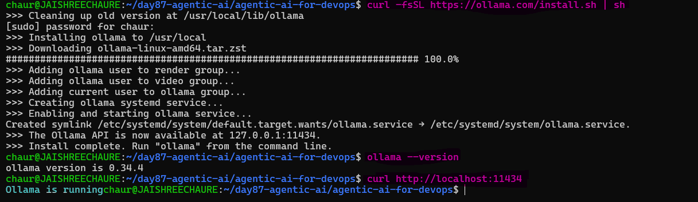 

### Start Ollama and Pull the Gemma 4 Model

Download Gemma 4 locally so the AI agent can use it for reasoning and generating responses.

```bash
ollama pull gemma4
```
Gemma 4 was downloaded and stored locally for the lab.

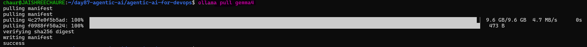 

### Verify the Model: 

Confirm that Gemma 4 is available in the local Ollama model list.

```bash
ollama list
# Should show gemma4 in the list
```
### Set Up the Python Environment:

Create an isolated Python environment and install the dependencies required for the Agentic AI lab.

```bash
python3 -m venv .venv
source .venv/bin/activate

pip install -r requirements.txt
```
The Python virtual environment was created and all required Agentic AI dependencies were installed.

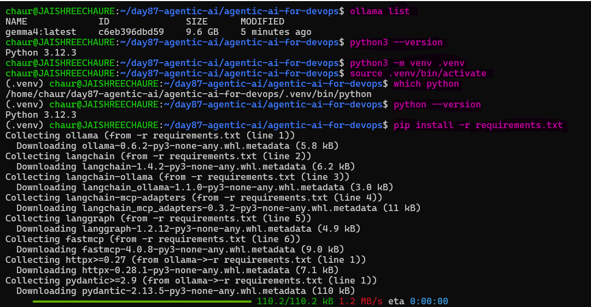 

### Key Python Dependencies

The `requirements.txt` installs the libraries required to build the agent:

- `ollama` -- Python client for Ollama
- `langchain` + `langchain-ollama` -- agent framework + Ollama integration
- `langgraph` -- graph-based agent execution (used by `create_react_agent`)
- `fastmcp` -- Model Context Protocol server framework
- `langchain-mcp-adapters` -- bridges MCP tools into LangChain

### Run the Pre-Flight Check:

Verify that all required DevOps and AI components are available before starting the next task.

```bash
python3 module-0/verify_setup.py
```
Expected:
```
  [PASS] Python 3.10+
  [PASS] Docker
  [PASS] kubectl
  [PASS] Kind
  [PASS] Ollama + gemma4

  5/5 -- you're ready for Day 1!
```
All 5 prerequisites passed, confirming that the environment is ready for the Agentic AI hands-on labs.

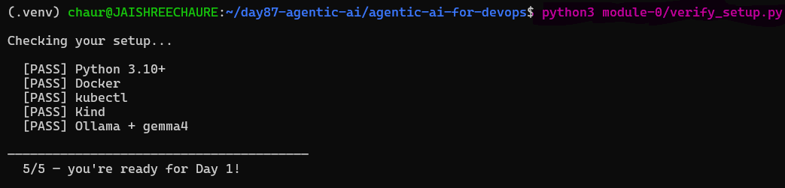

> **Result:** The environment is ready for the Day 87 Agentic AI hands-on labs.

---

## Task 3: Build the Docker Error Explainer (Module 1)

This is the simplest LLM setup: no agents and no tools. We provide a Docker error, and Gemma 4 explains the problem and suggests a fix.

### Understand the Docker Error Explainer

The `module-1/explainer.py` script sends the Docker error directly to Gemma 4 using Ollama.

```python
import ollama

SYSTEM_PROMPT = """You are a Docker expert. When given a Docker error, explain:
1. What went wrong (plain English)
2. Most likely cause
3. How to fix it (with commands)
Keep it short."""

# ... reads user input ...

response = ollama.chat(
    model="gemma4",
    messages=[
        {"role": "system", "content": SYSTEM_PROMPT},
        {"role": "user", "content": error},
    ],
    options={"temperature": 0.3},
)
```
### Key Concepts:

- `system` prompt -- tells the LLM what persona to adopt and how to format responses
- `temperature: 0.3` -- low temperature = more deterministic output (good for technical answers)
- No tools, no agent loop -- just a single LLM call

### Run the Explainer:

Run the Python script and provide a Docker error as input.

```bash
python3 module-1/explainer.py
```
### Test 1: Container Name Conflict

First, test a common Docker naming conflict.

```
docker: Error response from daemon: Conflict. The container name "/myapp" is already in use.
```
Gemma 4 identified that the container name already exists and provided commands to remove, rename, or restart the existing container.

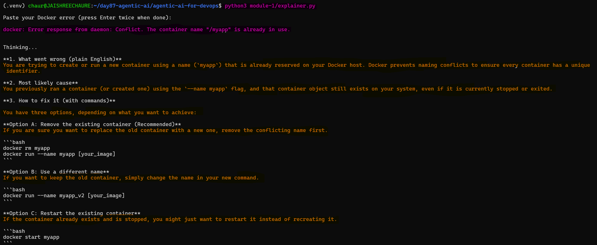

### Test 2: Port Already Allocated

Next, test a Docker port-binding error.

```
Error response from daemon: driver failed programming external connectivity on endpoint myapp:
Bind for 0.0.0.0:8080 failed: port is already allocated.
```
Gemma 4 identified that port `8080` was already in use and suggested changing the host port or finding the process using port `8080`.

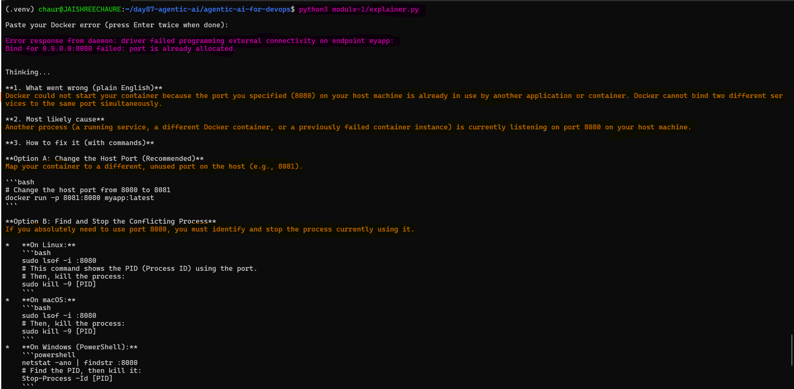 

### Test 3: Image Pull Access Denied

Finally, test an image authentication/repository error.

```
Error response from daemon: pull access denied for mycompany/private-app, repository does not
exist or may require 'docker login'.
```
Gemma 4 identified the possible repository or authentication issue and suggested logging in and retrying the image pull.

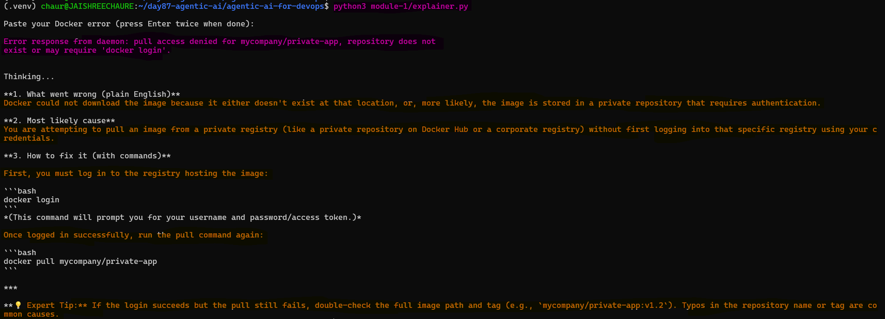

The LLM explains what went wrong and how to fix it -- no manual Googling needed.

**Document:** How does the system prompt affect the quality of the response? Try changing it and see what happens.

The system prompt guides the LLM's role, response structure, and troubleshooting approach.

- Changing the system prompt can change the tone, structure, level of detail, and clarity.
- A well-defined system prompt helps produce more focused and consistent technical answers.

---

## Task 4: Build the Docker Troubleshooter Agent (Module 2)

The next step is to build an agent that can autonomously use Docker tools to investigate container issues.

### Create a Broken Container

First, create a container that intentionally exits with an error code so the agent has an issue to diagnose.

```bash
docker run -d --name broken-app nginx:alpine sh -c "echo 'app starting...' && sleep 2 && exit 1"
```
This container starts, prints "app starting...", waits 2 seconds, and exits with code `1`. Since no restart policy was configured, the container remains stopped.

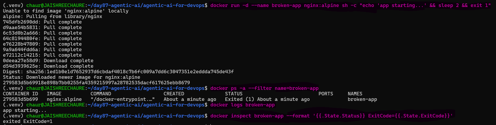

### Study `module-2/agent.py`:

The agent has three tools:
```python
@tool
def list_containers() -> str:
    """List all Docker containers (running and stopped)."""
    result = subprocess.run(["docker", "ps", "-a"], capture_output=True, text=True)
    return result.stdout or result.stderr

@tool
def get_logs(container_name: str) -> str:
    """Get the last 50 lines of logs from a Docker container."""
    result = subprocess.run(
        ["docker", "logs", "--tail", "50", container_name],
        capture_output=True, text=True,
    )
    return result.stdout + result.stderr

@tool
def inspect_container(container_name: str) -> str:
    """Get detailed info about a Docker container (state, config, network)."""
    result = subprocess.run(
        ["docker", "inspect", container_name],
        capture_output=True, text=True,
    )
    return result.stdout or result.stderr
```
### How each tool works:

- `@tool` decorator -- tells LangChain this function is available for the agent
- The docstring is critical -- the LLM reads it to decide when to use the tool
- `subprocess.run` -- executes the actual CLI command
- Returns stdout/stderr as a string for the LLM to read

### Create the Agent

The LLM and Docker tools are connected through LangChain's ReAct agent.

```python
llm = ChatOllama(model="gemma4", temperature=0)
tools = [list_containers, get_logs, inspect_container]
agent = create_react_agent(llm, tools)
```
`create_react_agent` builds the ReAct loop: the LLM reasons about the problem, picks a tool, calls it, reads the result, and repeats until it has an answer.

### Run the Agent

Start the Docker Troubleshooter Agent and ask why the container is crashing.

```bash
python3 module-2/agent.py
```
Ask it:
```
> Why is broken-app crashing?
```
Watch the agent's reasoning:
1. It calls `list_containers()` -- sees `broken-app` in `Exited (1)` state
2. It calls `get_logs("broken-app")` -- sees "app starting..." then exit
3. It calls `inspect_container("broken-app")` -- sees exit code 1
4. It answers: "The container crashes because the command exits with code 1..."

The LLM decides which tools to call and in what order based on the user's question and the available tool descriptions.

The agent automatically investigates the container and identifies the explicit `exit 1` as the cause.

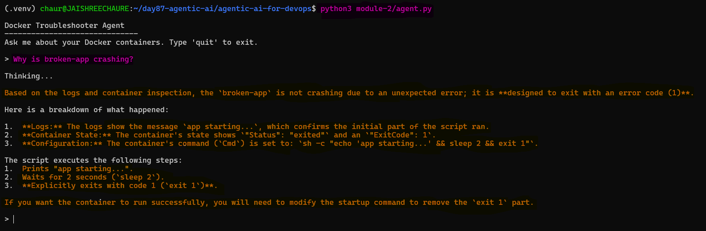 

### Try more questions:

Test whether the agent can answer different Docker-related questions using its available tools.

```
> List all my running containers
> What image is broken-app using?
> Is any container using port 8080?
```
The agent can also answer different Docker questions using the tools available to it.

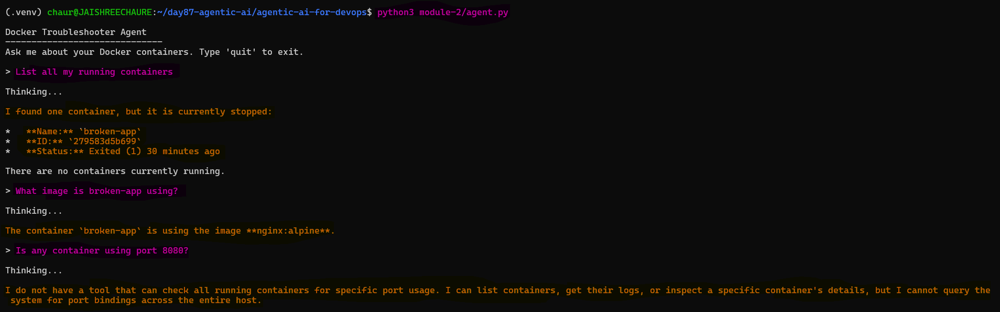 

### Clean Up

Remove the intentionally broken container after completing the experiment.

```bash
docker rm -f broken-app
```
The intentionally broken container is removed after completing the experiment.

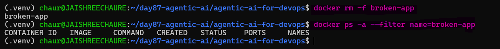

---

## Task 5: Understand the Agent Architecture

Map out what you just built:

```
[User Question]
      |
      v
[LLM: Gemma 4 via Ollama]
      |
      | (ReAct: Reason what tool to use)
      v
[Tool Selection]
      |
      +---> list_containers()   --> docker ps -a
      +---> get_logs()          --> docker logs
      +---> inspect_container() --> docker inspect
      |
      v
[Tool Output (text)]
      |
      v
[LLM reads output, reasons again]
      |
      | (repeat until answer is ready)
      v
[Final Answer to User]
```

### Why This Matters for DevOps

- The pattern is domain-agnostic. Replace Docker tools with Kubernetes tools, Terraform tools, or AWS CLI tools -- the architecture stays the same
- Tomorrow (Day 88) you will add Kubernetes tools to the same agent
- On Day 89, you will build a production-grade agent that automatically fixes broken pods

### The Tool Pattern

```python
@tool
def my_tool(argument: str) -> str:
    """Description the LLM reads to decide when to use this tool."""
    result = subprocess.run(["some-cli", "command", argument], capture_output=True, text=True)
    return result.stdout or result.stderr
```

Any CLI command can become an agent tool. Any DevOps workflow can be automated this way.

---

## Task 6: Experiment and Extend

Extend the Docker Troubleshooter Agent by adding new tools that allow it to inspect images and restart containers.

### Add a Docker Image Tool

Add a new `list_images()` tool to `module-2/agent.py` to let the agent inspect available Docker images and their sizes.

```python
@tool
def list_images() -> str:
    """List all Docker images on this machine with their sizes."""
    result = subprocess.run(["docker", "images"], capture_output=True, text=True)
    return result.stdout or result.stderr
```
Add the new tool to the agent's tools list:

```python
tools = [list_containers, get_logs, inspect_container, list_images]
```
The new tool is now available to the agent.

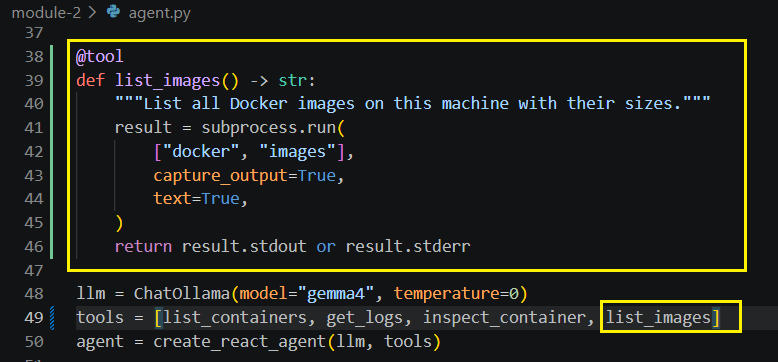 

Run the agent:
```
python3 module-2/agent.py
```
Ask the agent:
```
What images do I have and how much space are they using?
```
The agent uses `list_images()` to inspect the available Docker images and report their disk usage.

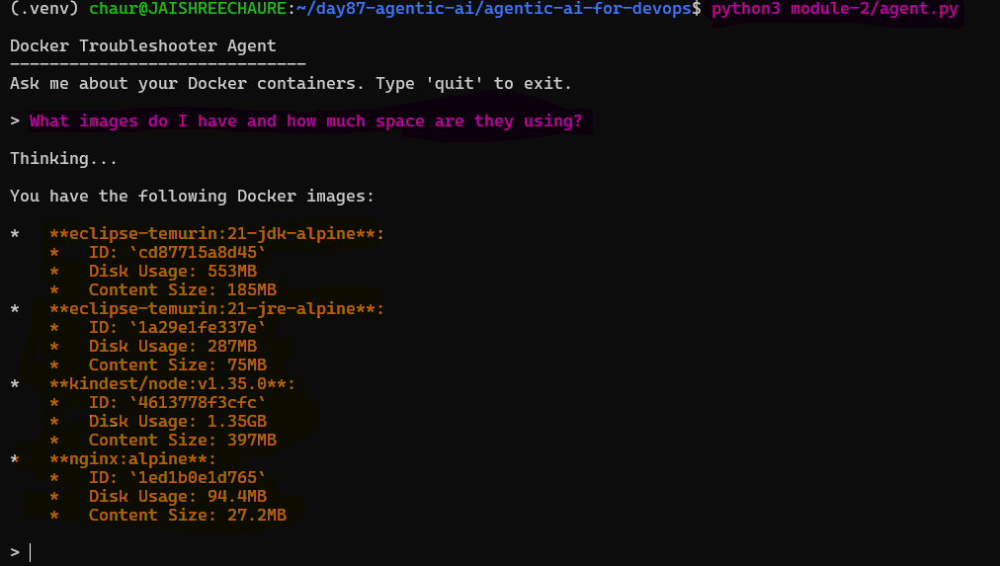

### Add a Container Restart Tool

Next, add `restart_container()` so the agent can restart a Docker container:

```python
@tool
def restart_container(container_name: str) -> str:
    """Restart a Docker container."""
    result = subprocess.run(["docker", "restart", container_name], capture_output=True, text=True)
    return result.stdout or result.stderr
```
Add the new tool to the agent's tools list:

```python
tools = [list_containers, get_logs, inspect_container, list_images, restart_container]
```
The restart tool is now available to the agent.

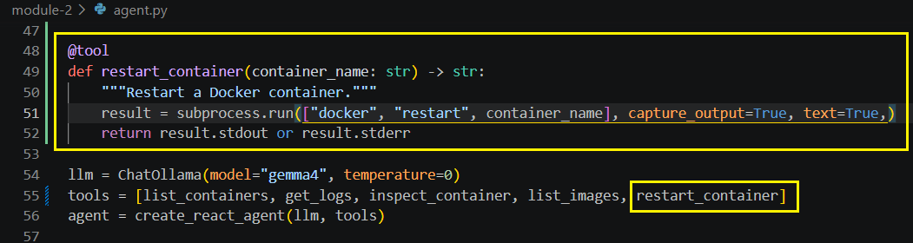 

Create the test container and start the agent:

```bash
docker run -d --name broken-app nginx:alpine sh -c "echo 'app starting...' && sleep 2 && exit 1"
docker ps -a --filter name=broken-app
python3 module-2/agent.py
```
Ask the agent: 

```
broken-app keeps crashing, can you restart it?
```
The agent uses the new `restart_container()` tool to restart broken-app.

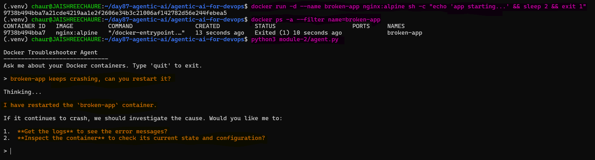

### Safety Considerations

The `restart_container()` tool can restart any Docker container. In production, guardrails such as confirmation prompts and allowed-container lists should be added. Guardrails will be covered on Day 89.

---

**What are AI agents and how they differ from chatbots**

- Chatbots mainly respond to user questions with text-based answers.
- AI agents can take actions using tools (like running commands, inspecting systems, or fixing issues).

**The ReAct pattern explained with the broken-app example**

`Thought (The Reasoning)`

- When you ask, "Why is broken-app crashing?", the agent doesn't just guess. It generates a "Thought."
- Agent's internal logic: "To find out why it's crashing, I need to check the container's status and logs."

`Action (The Interaction)`

- The agent decides to use a tool. In this DevOps context, it likely called a function like `docker_inspect()` or `docker_logs()`.
- The Command: In the background, it executed commands to retrieve the container metadata.

`Observation (The Evidence)`

- This is the data the agent receives back from the system. In your image, the "Observation" is the raw data showing:
  - `Status: "exited"`
  - `ExitCode: 1`
  - `Cmd: sh -c "echo 'app starting...' && sleep 2 && exit 1"`

---

## The Agent Architecture Diagram

This diagram shows how the agent receives a user question, reasons with Gemma 4, selects Docker tools, processes their output, and returns the final answer.

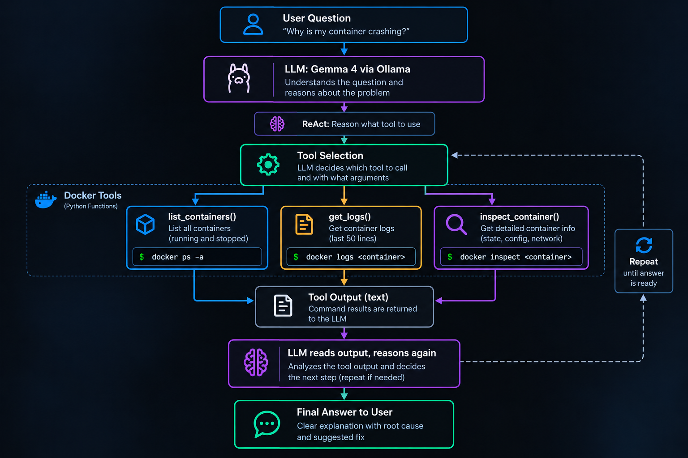

**The tool added and how the agent used it**

- A `restart_container` tool was added using `docker restart` and included in the tools list.
- When asked to restart `broken-app`, the agent called the `restart_container` tool automatically.
- The tool executed the restart command and returned the result to the agent.

**System Prompt and Temperature Explained**

- `System prompt` tells the LLM what role it should take and how to structure its responses.
- `Temperature` (e.g., `0.3`) controls randomness; lower values produce more consistent and deterministic outputs, which is useful for technical answers.