# Day 88 -- Multi-Tool Agents, MCP, and CI/CD Analyzer

## Task 1: Build the Multi-Tool DevOps Agent (Module 3)

The Docker agent had 3 tools. Now add 3 Kubernetes tools to the same agent.

**Set up a Kind cluster with a broken pod:**

```bash
kind create cluster --name devops-demo
kubectl apply -f module-3/broken_pod.yaml
```
The Kind cluster was created successfully and the Kubernetes node is ready.

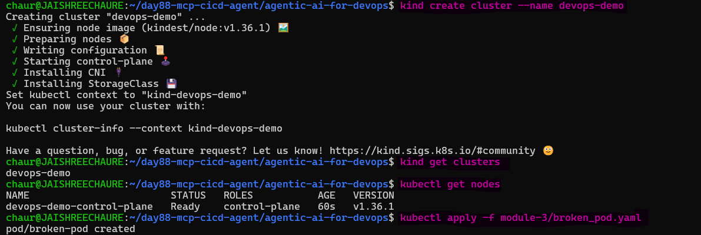 

The `broken_pod.yaml` deploys a pod that intentionally crashes:

```yaml
apiVersion: v1
kind: Pod
metadata:
  name: broken-pod
  namespace: default
spec:
  containers:
  - name: app
    image: nginx:alpine
    command: ["sh", "-c", "echo 'app starting...' && sleep 2 && exit 1"]
```
Also create a broken Docker container:

```bash
docker run -d --name broken-container nginx:alpine sh -c "echo 'container starting...' && sleep 2 && exit 1"
```
The container exits with code `1`, creating a controlled failure for the agent to diagnose.

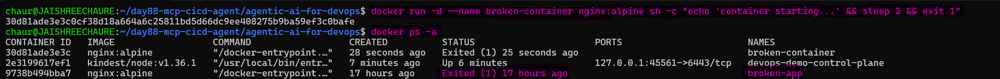

**Study `module-3/agent.py`** -- it has 6 tools now:

Docker tools (from Day 87):
- `list_containers()` -- `docker ps -a`
- `get_logs(container_name)` -- `docker logs`
- `inspect_container(container_name)` -- `docker inspect`

**Kubernetes tools (new):**

```python
@tool
def list_pods(namespace: str = "default") -> str:
    """List all pods in a Kubernetes namespace with their status."""
    result = subprocess.run(
        ["kubectl", "get", "pods", "-n", namespace],
        capture_output=True, text=True,
    )
    return result.stdout or result.stderr

@tool
def describe_pod(pod_name: str, namespace: str = "default") -> str:
    """Get detailed info about a Kubernetes pod including events and conditions."""
    result = subprocess.run(
        ["kubectl", "describe", "pod", pod_name, "-n", namespace],
        capture_output=True, text=True,
    )
    return result.stdout or result.stderr

@tool
def get_events(namespace: str = "default") -> str:
    """Get recent Kubernetes events in a namespace (useful for troubleshooting)."""
    result = subprocess.run(
        ["kubectl", "get", "events", "-n", namespace, "--sort-by=.lastTimestamp"],
        capture_output=True, text=True,
    )
    return result.stdout or result.stderr
```
Set up the Python environment and install the required dependencies:

```bash
python3 -m venv .venv
source .venv/bin/activate

pip install -r requirements.txt
```
The Python virtual environment was activated and the required dependencies were installed successfully.

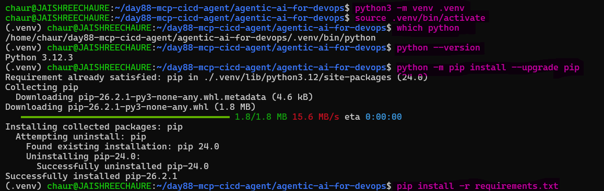

**Run the multi-tool DevOps agent:**

```bash
python3 module-3/agent.py
```
The agent started successfully and was ready to troubleshoot Docker and Kubernetes.

**Ask the agent to check both Docker and Kubernetes:**

```
> What's broken across Docker and Kubernetes?
```
The agent requested more context because the question was broad. A more specific diagnostic question was then used:

```
> Check Docker and Kubernetes for anything unhealthy and tell me what is broken.
```
The agent identified unhealthy Docker containers and the `broken-pod` in Kubernetes.

The agent provided a detailed breakdown of the unhealthy Docker containers and Kubernetes pod, along with the next diagnostic steps.

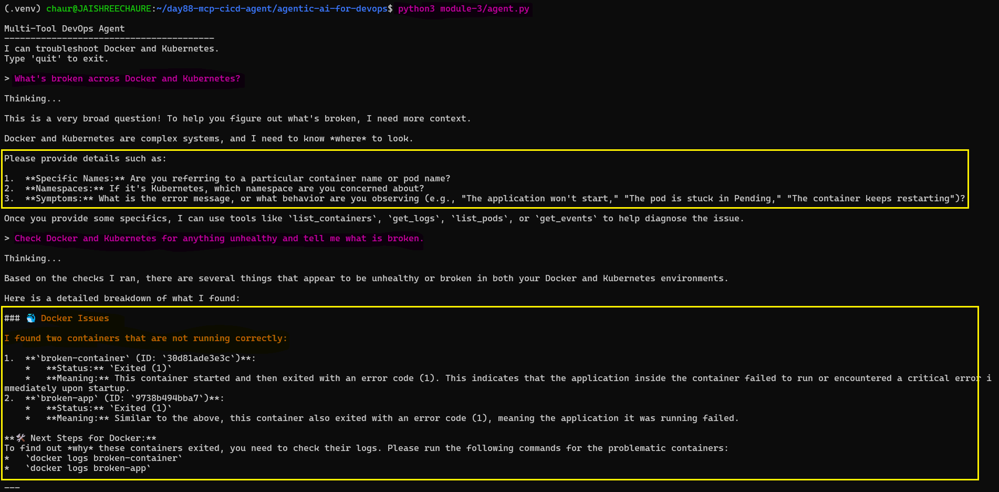
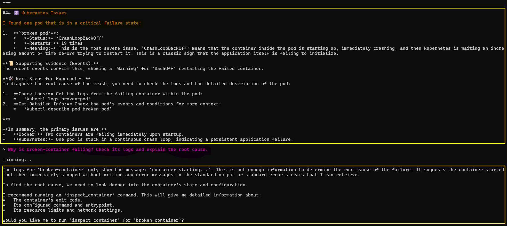 

**Check the Kubernetes pod root cause:**

```
> Why is broken-pod crashing?

```
The agent used `describe_pod` and identified the intentional `exit 1` command as the root cause.

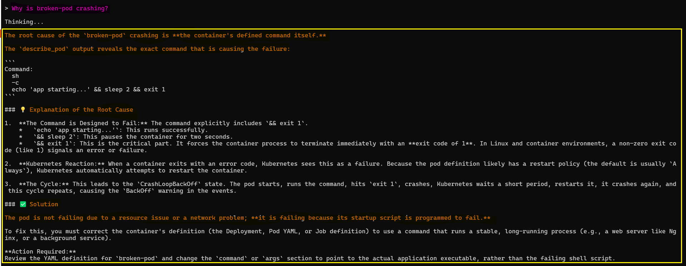 

**Check Docker container health:**

```text
> Are there any unhealthy containers on Docker?
```
The agent identified the containers with `Exited (1)` status and suggested checking their logs and configuration.

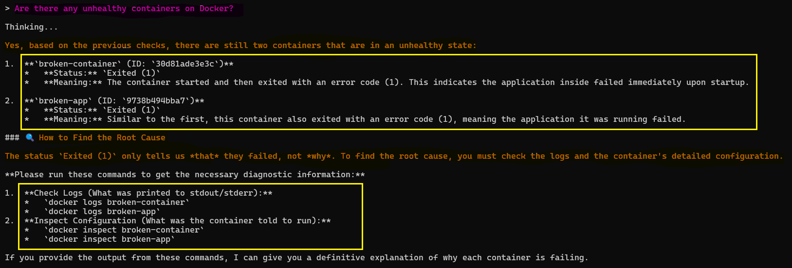

**Check Kubernetes events:**

```text
> Describe the events in the default namespace
```
The agent used `get_events` and identified the `BackOff` warning caused by the repeatedly failing `broken-pod`.

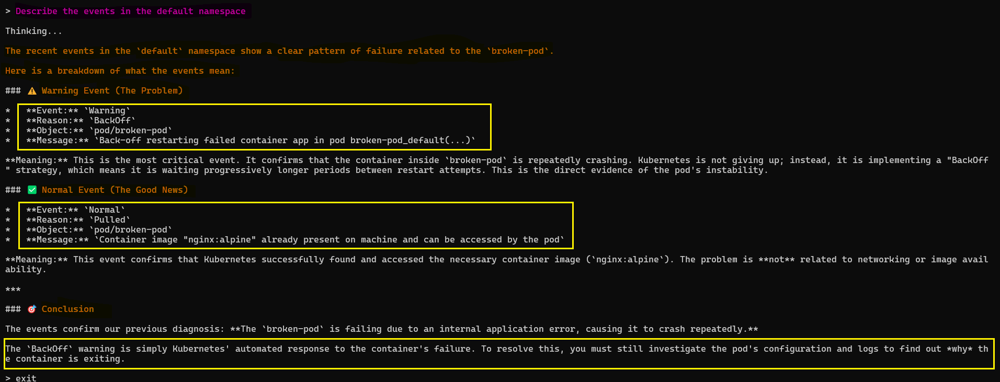 

**Final cross-domain verification:**

```bash
docker ps -a
kubectl get pods
kubectl get nodes
```
The Docker and Kubernetes resources were verified from a separate terminal, confirming the unhealthy container and `CrashLoopBackOff` pod.

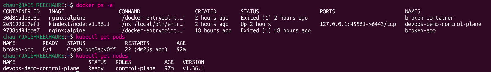

The agent decides which tools to use based on the question. Ask about Docker -- it uses Docker tools. Ask about pods -- it switches to Kubernetes tools. Ask about both -- it can use tools from both domains.

**This is the power of the ReAct pattern:** One agent, many tools, one brain that decides what to use.

---

## Task 2: Understand the Model Context Protocol (MCP)

MCP is an open standard (created by Anthropic) for connecting AI models to external tools and data sources. Instead of writing tools inside your agent code, you expose them via MCP and any compatible client can use them.

**Why MCP matters for DevOps:**

| Without MCP | With MCP |
|------------|---------|
| Tools are locked to one framework (LangChain) | Tools work with any MCP client |
| Every AI client re-implements Docker/K8s tools | Write once, use everywhere |
| Tool access tied to the agent code | Tools exposed as a discoverable service |

**MCP-compatible clients:**
- Claude Desktop
- VS Code (GitHub Copilot)
- Cursor
- Claude Code (the CLI you might already be using)
- Any LangChain agent via `langchain-mcp-adapters`

**The architecture:**
```
[MCP Server]                    [MCP Clients]
  |                                  |
  |-- list_pods()                    |-- Claude Desktop
  |-- describe_pod()      <--->      |-- VS Code Copilot
  |-- get_events()                   |-- Your Python agent
  |                                  |-- Any MCP client
  |
  (exposes tools via stdio/HTTP)
```

---

## Task 3: Build and Use the MCP Server (Module 3)

Study `module-3/mcp_server.py`:

```python
from fastmcp import FastMCP

mcp = FastMCP("Kubernetes Tools")

@mcp.tool
def list_pods(namespace: str = "default") -> str:
    """List all pods in a Kubernetes namespace with their status."""
    result = subprocess.run(
        ["kubectl", "get", "pods", "-n", namespace],
        capture_output=True, text=True,
    )
    return result.stdout or result.stderr

@mcp.tool
def describe_pod(pod_name: str, namespace: str = "default") -> str:
    """Get detailed info about a Kubernetes pod including events and conditions."""
    # ...

@mcp.tool
def get_events(namespace: str = "default") -> str:
    """Get recent Kubernetes events in a namespace."""
    # ...

if __name__ == "__main__":
    mcp.run()
```
**Key difference from LangChain tools:**

- `@mcp.tool` instead of `@tool` -- registered with the MCP server
- `FastMCP("Kubernetes Tools")` -- creates a named MCP server
- `mcp.run()` -- starts the server (stdio transport by default)
- Any MCP client can discover and call these tools

**Now study `module-3/agent_with_mcp.py`** -- the MCP client:

```python
from langchain_mcp_adapters.client import MultiServerMCPClient

async def main():
    client = MultiServerMCPClient({
        "docker-mcp": {
            "transport": "stdio",
            "command": "python",
            "args": ["mcp_server.py"]
        }
    })

    tools = await client.get_tools()    # Dynamically discovers tools from MCP
    llm = ChatOllama(model="gemma4", temperature=0.8)
    agent = create_agent(llm, tools)    # Same ReAct agent, but tools come from MCP
```
The agent does not define the Kubernetes tools locally. It connects to the MCP server and discovers the available tools at runtime.

**Run the MCP agent:**

```bash
cd module-3
python3 agent_with_mcp.py
```
The FastMCP server started successfully and exposed the Kubernetes tools through stdio.

**Check the Kubernetes pods through MCP:**

```text
> List the pods in my cluster
```
The MCP agent discovered the `list_pods` tool and returned the current pod status.

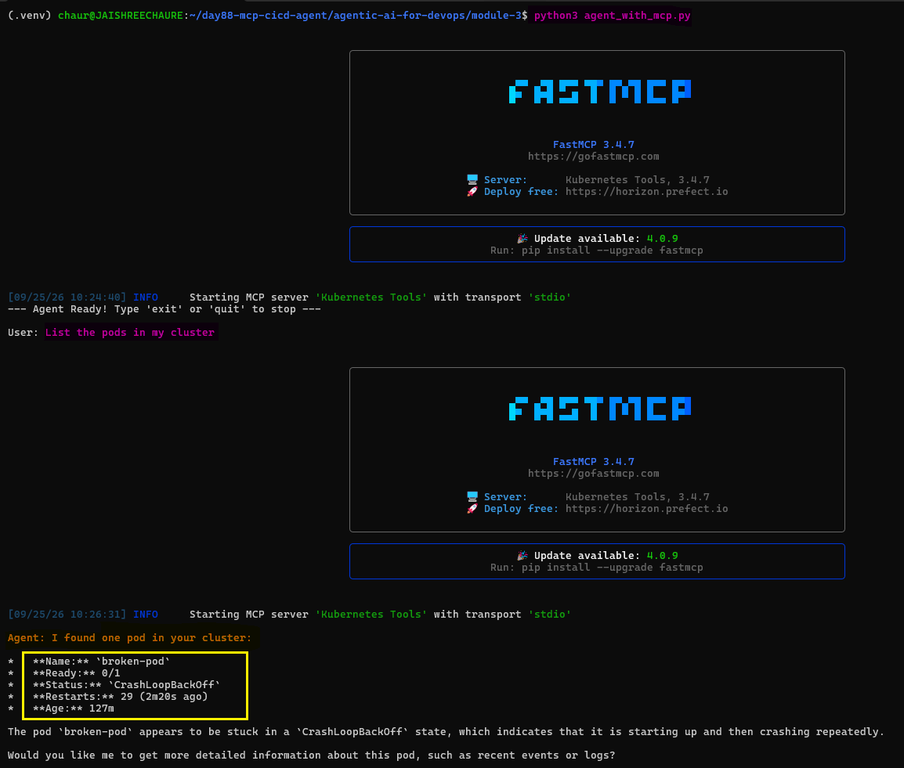 

**Investigate the broken pod:**

```text
> Why is broken-pod crashing?
```
The agent requested the namespace, so `default` was provided. It then used the MCP `describe_pod` tool to identify the `exit 1` command as the cause of the crash.

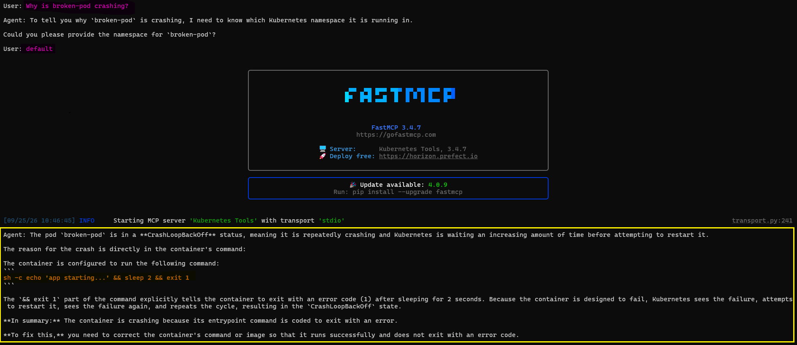 

**Check recent Kubernetes events:**

```text
> What events happened recently?
```
The MCP agent used the `get_events` tool and identified the `BackOff` event associated with broken-pod.

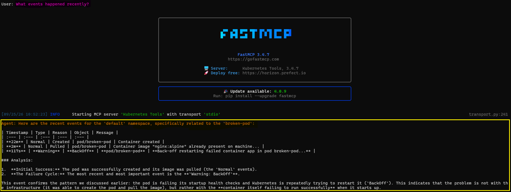

The troubleshooting result is similar to Task 1, but the Kubernetes tools are now served through MCP instead of being defined directly inside the agent.

**MCP architecture:**

```text
User
  ↓
LangChain Agent
  ↓
MCP Client
  ↓
MCP Server
  ↓
Kubernetes Tools
  ↓
kubectl
  ↓
Kubernetes Cluster
```
> **Key takeaway:** MCP separates the agent from the tools, allowing tools to be discovered and reused by different MCP-compatible clients.

---

## Task 4: Build the CI/CD Failure Analyzer (Module 6)

The same agent pattern can be applied to CI/CD. This analyzer uses the `gh` CLI to inspect GitHub Actions runs, logs, and workflow files.

**Authenticate GitHub CLI:**

```bash
# Authenticate GitHub CLI
gh auth login
gh auth status
find ~ -maxdepth 4 -type d -name "AI-BankApp-DevOps" 2>/dev/null
```
GitHub CLI authentication was completed successfully, and the `AI-BankApp-DevOps` repository was located.

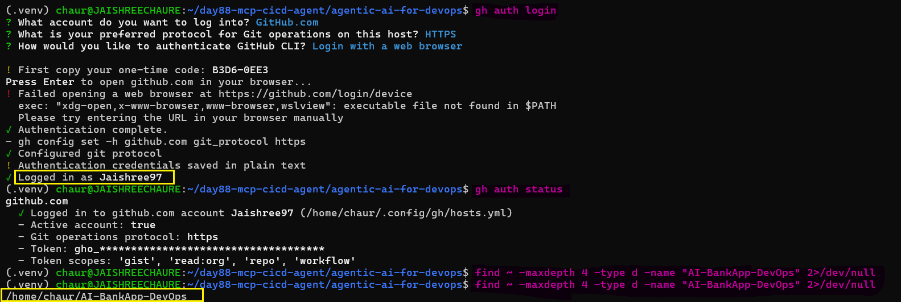 

**Study `module-6/ci_analyzer.py`:**

The analyzer uses three tools:

```python
@tool
def list_workflow_runs(status: str = "") -> str:
    """List recent GitHub Actions workflow runs."""
    command = ["gh", "run", "list", "--limit", "5"]

    if status:
        command.extend(["--status", status])
    return result.stdout or result.stderr

@tool
def get_failed_logs(run_id: str) -> str:
    """Get the failed step logs from a GitHub Actions run. Pass the run ID."""
    result = subprocess.run(
        ["gh", "run", "view", run_id, "--log-failed"],
        capture_output=True, text=True,
    )
    output = result.stdout + result.stderr
    if len(output) > 5000:
        output = output[:5000] + "\n\n[...truncated, showing first 5000 chars]"
    return output

@tool
def get_workflow_file(workflow_name: str) -> str:
    """Read a GitHub Actions workflow YAML file. Pass the filename like 'ci.yml'."""
    import pathlib
    path = pathlib.Path(f".github/workflows/{workflow_name}")
    if path.exists():
        return path.read_text()
    return f"File not found: {path}"
```

The `get_failed_logs()` tool truncates large CI logs to 5000 characters so the relevant failure information can be passed to the LLM efficiently.

**Run the analyzer inside the AI-BankApp-DevOps repository:** (which has GitHub Actions):

```bash
cd AI-BankApp-DevOps
python3 ../day88-mcp-cicd-agent/agentic-ai-for-devops/module-6/ci_analyzer.py
```
The CI/CD analyzer started successfully and detected the GitHub Actions workflow.

**Check recent workflow runs:**

```text
> Show me the recent workflow runs
> Read the gitops-ci.yml workflow file and explain what it does
```
The agent used the GitHub CLI to retrieve the recent workflow run and identified a successful `GitOps CI - Build & Push to DockerHub` run.

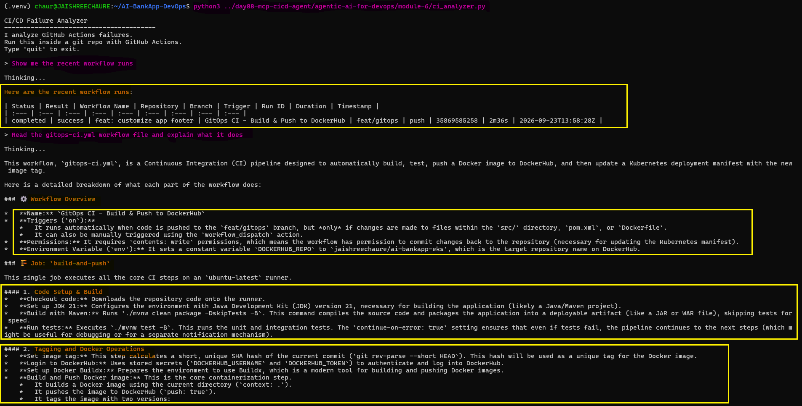 

**Analyze the GitOps workflow:**

The agent read the workflow file and explained its CI/CD flow, including application build, testing, Docker image creation and push, and GitOps manifest update.

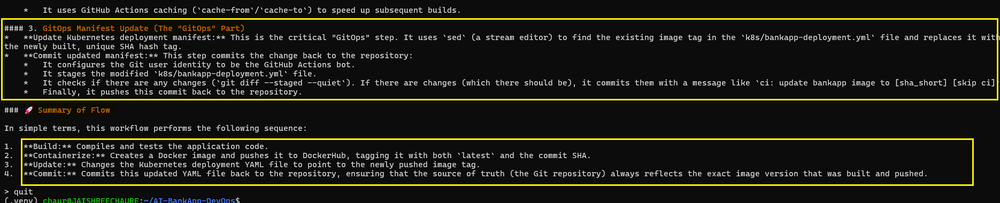 

The analyzer can list workflow runs, fetch failed logs, read workflow files, and explain CI/CD failures.

**Create a deliberately broken workflow for testing:**

Create `.github/workflows/broken-ci.yml` in a test repo:

```yaml
name: Broken CI
on: [push]
jobs:
  build:
    runs-on: ubuntu-latest
    steps:
      - uses: actions/checkout@v4
      - run: npm test    # Will fail -- no package.json!
```
The `npm test` command intentionally fails because the test repository does not contain a `package.json` file.

Create the test repository:

```bash
cd ~
mkdir test-repo && cd test-repo
git init
mkdir -p .github/workflows
vi .github/workflows/broken-ci.yml
```
Create the GitHub repository: `day88-ci-test`

Configure and push the repository:

```bash
git remote add origin https://github.com/Jaishree97/day88-ci-test.git
git remote -v

git add .github/workflows/broken-ci.yml
git commit -m "test: add broken CI workflow"

git branch -M main
git push -u origin main

gh repo set-default Jaishree97/day88-ci-test

gh run list --limit 5
gh run list --status failure --limit 5
```
The GitHub Actions workflow failed as expected, providing a real CI failure for the analyzer to investigate.

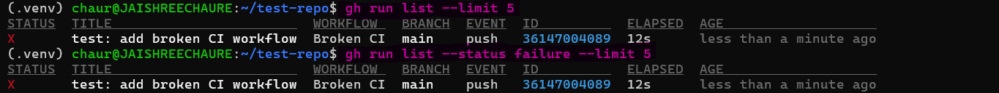

**Run the CI/CD analyzer against the failed workflow:**

```bash
python3 ~/day88-mcp-cicd-agent/agentic-ai-for-devops/module-6/ci_analyzer.py
```
Ask:

```text
> Why did broken-ci fail?
```
The agent inspected the failed GitHub Actions logs and identified that `npm test` could not find `package.json`.

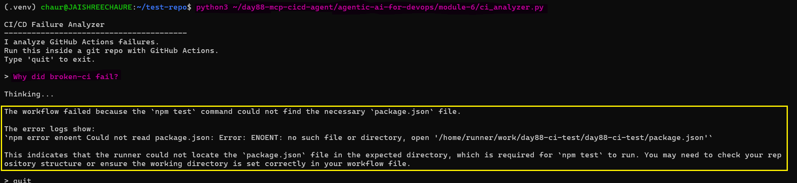

The GitHub Actions run confirms that the `Run npm test` step failed while checkout and job setup completed successfully.

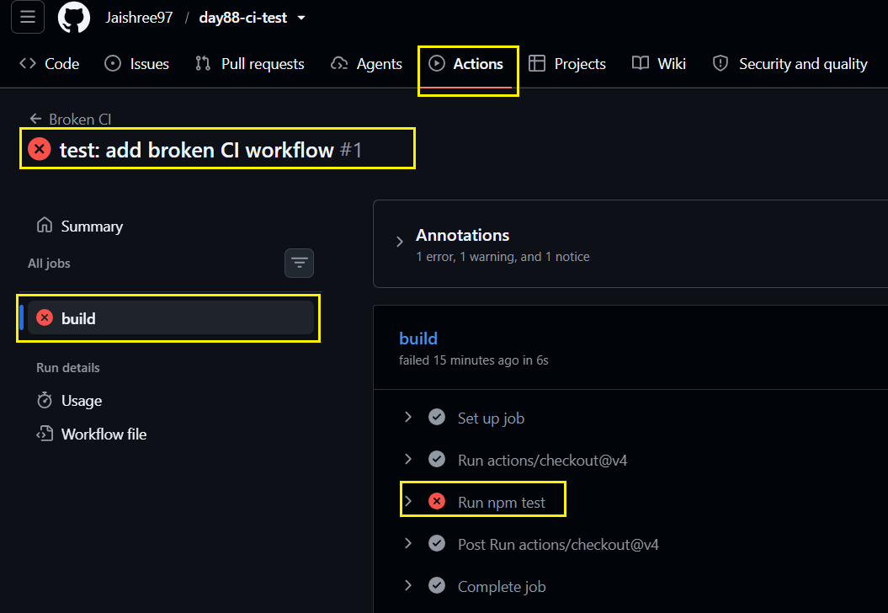

**CI/CD troubleshooting flow:**

```text
GitHub Actions Run
        ↓
List Workflow Runs
        ↓
Identify Failure
        ↓
Fetch Failed Logs
        ↓
Read Workflow File
        ↓
LLM Analyzes Error
        ↓
Root Cause
```
> **Key takeaway:** The same ReAct pattern can troubleshoot CI/CD by combining the LLM with real GitHub CLI tools to inspect workflow runs, logs, and configuration.

---

## Task 5: Build Your Own Tool

The pattern is now clear: CLI commands can be wrapped as tools and used by an agent. I implemented all three options.

Add your tool to any agent, run it, and ask a question that triggers it.

**Option A -- Terraform Plan Analyzer:**

```python
@tool
def terraform_plan() -> str:
    """Run terraform plan and return the output showing what would change."""
    result = subprocess.run(
        ["terraform", "plan", "-no-color"],
        capture_output=True, text=True,
        cwd="/home/chaur/AI-BankApp-DevOps/terraform"
    )
    output = result.stdout + result.stderr
    if len(output) > 5000:
        output = output[:5000] + "\n[...truncated]"
    return output
```
Set up and validate the Terraform project:

```bash
cd ~/day88-mcp-cicd-agent/agentic-ai-for-devops

mkdir -p terraform-agent
vi terraform-agent/terraform_agent.py

cd ~/AI-BankApp-DevOps/terraform

terraform init
terraform validate
aws sts get-caller-identity

cd ~/day88-mcp-cicd-agent/agentic-ai-for-devops
```
Run the Terraform analyzer:

```bash
python3 terraform-agent/terraform_agent.py
```
Ask:

```text
> Run terraform plan and summarize the resource changes
```
The agent ran `terraform plan` and summarized the planned resource changes, including **`84 resources to be added, 0 changed, and 0 destroyed.`**

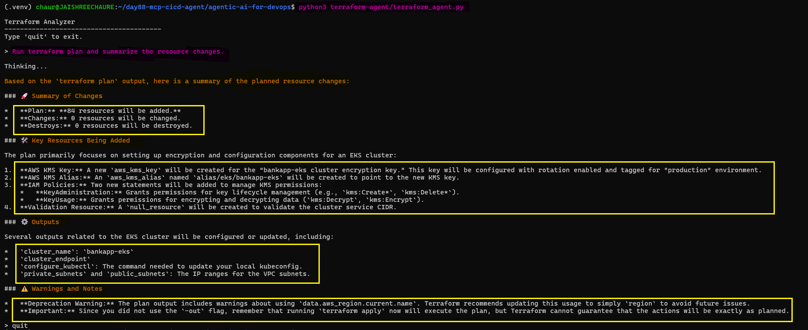 

**Option B -- AWS Resource Checker:**

```python
@tool
def list_ec2_instances() -> str:
    """List all EC2 instances with their state, type, and name."""
    result = subprocess.run(
        ["aws", "ec2", "describe-instances",
         "--query", "Reservations[*].Instances[*].[InstanceId,State.Name,InstanceType,Tags[?Key=='Name'].Value|[0]]",
         "--output", "table"],
        capture_output=True, text=True,
    )
    return result.stdout or result.stderr
```
Create the AWS resource checker:

```bash
mkdir -p aws-resource-checker
vi aws-resource-checker/aws_agent.py
```
Two temporary EC2 instances were created manually in `us-east-1` for testing the tool.

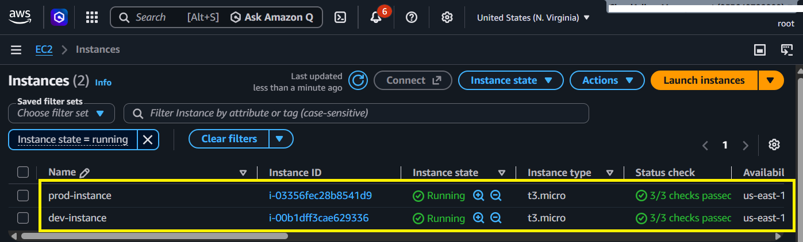

Run the AWS resource checker:

```bash
python3 aws-resource-checker/aws_agent.py
```
Ask:

```text
> List all EC2 instances with their state, type, and name.
```
The agent listed the EC2 instances with their instance ID, state, type, and Name tag.

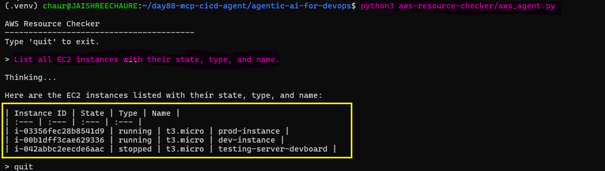 

> **Note:** The two EC2 instances created specifically for this lab were terminated after testing.

**Option C -- Log Searcher:**

```python
@tool
def search_logs(keyword: str, namespace: str = "default") -> str:
    """Search for a keyword in the logs of all pods in a namespace."""
    pods = subprocess.run(
        ["kubectl", "get", "pods", "-n", namespace, "-o", "name"],
        capture_output=True, text=True,
    )
    results = []
    for pod in pods.stdout.strip().split("\n"):
        if not pod:
            continue
        logs = subprocess.run(
            ["kubectl", "logs", pod, "-n", namespace, "--tail=100"],
            capture_output=True, text=True,
        )
        if keyword.lower() in logs.stdout.lower():
            results.append(f"{pod}: found '{keyword}'")
    return "\n".join(results) if results else f"No pods contain '{keyword}' in their logs"
```
Verify the Kubernetes pod and logs:

```bash
mkdir -p log-searcher
vi log-searcher/log_searcher.py

kubectl get pods -n default
kubectl get pods -n default -o name
kubectl logs broken-pod -n default --tail=100
```
The `broken-pod` logs returned `app starting...`, providing test data for the log search tool.

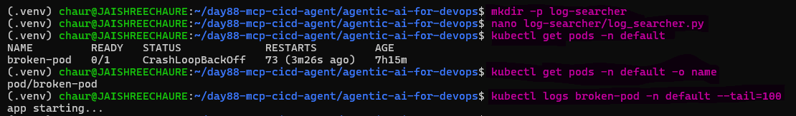 

Run the Kubernetes Log Searcher:

```bash
python3 log-searcher/log_searcher.py
```
Ask: 

```text
> Search the logs of all pods in the default namespace for "starting".

> Search Kubernetes logs for the keyword "database" in the default namespace.
```
The agent found `starting` in `broken-pod` logs and correctly reported that no pod contained the keyword `database`.

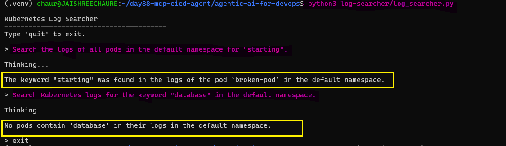

**Document:** Which tool did you build? How did the agent decide when to use it?

**Terraform Plan Analyzer**

`Tool`: Runs `terraform plan` and summarizes infrastructure changes.  
`Decision`: Triggered by questions about Terraform plans or infrastructure changes.

**AWS Resource Checker**

`Tool`: Lists EC2 instances with status, type, and name.  
`Decision`: Triggered by questions about AWS or EC2 resources.

**Kubernetes Log Searcher**

`Tool`: Searches pod logs for a specified keyword.  
`Decision`: Triggered by questions about Kubernetes logs or specific log keywords.

---

## Task 6: Clean Up

Run the cleanup commands to remove the temporary lab resources and deactivate the Python virtual environment.

```bash
# Delete Kind cluster
kind delete cluster --name devops-demo
kind get clusters

# Remove broken container
docker rm -f broken-container 2>/dev/null
docker ps -a

# Deactivate Python venv (if needed later)
deactivate
```
The Kind cluster and temporary broken Docker container were removed successfully, and the Python virtual environment was deactivated.

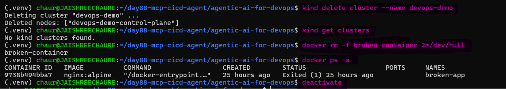

**Map what you built today:**

| Module | What | Tools | Pattern |
|--------|------|-------|---------|
| 3 (agent.py) | Multi-tool agent | 3 Docker + 3 K8s | LangChain ReAct |
| 3 (mcp_server.py) | MCP server | 3 K8s tools via MCP | FastMCP |
| 3 (agent_with_mcp.py) | MCP client agent | Tools from MCP server | LangChain + MCP adapter |
| 6 | CI/CD analyzer | 3 GitHub Actions tools | LangChain ReAct |

**The pattern is always the same:**
1. Define tools that wrap CLI commands
2. Create an LLM instance
3. Create a ReAct agent
4. The agent reasons about the question, calls tools, reads output, answers

---

## The multi-tool agent architecture (6 tools across 2 domains)

This architecture shows how one ReAct agent uses six tools across Docker and Kubernetes, selecting the appropriate tools based on the user's question.

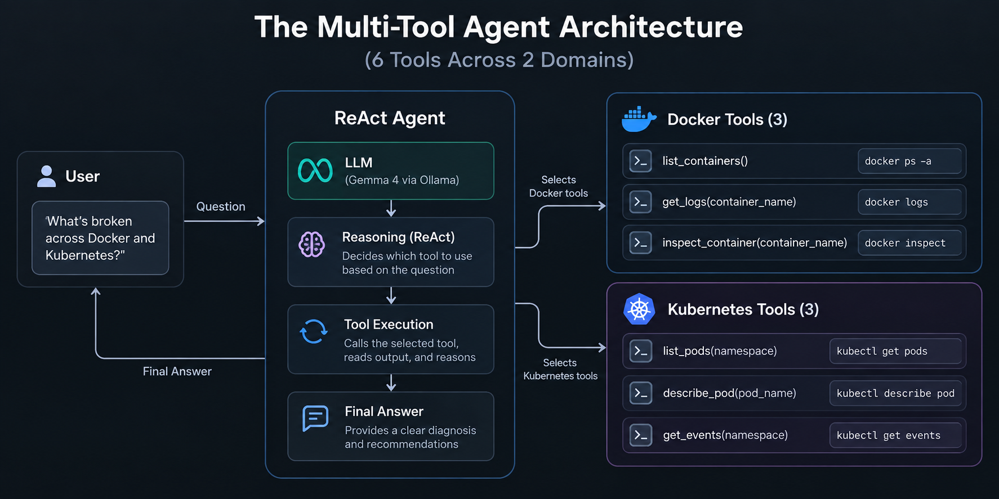

**MCP (Model Context Protocol)**

- **Server:** Hosts and exposes tools such as Kubernetes or Docker commands.
- **Client:** AI application that connects to the MCP server and uses its tools.
- **Protocol:** Defines how tools are discovered, shared, and called.

**Why it matters:**

- Connects AI agents to external tools.
- Makes tools reusable across different AI applications.
- Avoids rewriting the same tools for every project.
- Supports modular and scalable AI systems.

**LangChain Tools vs MCP**

- `LangChain`: Tools are defined directly inside the agent project.
- `MCP`: Tools are hosted separately and can be discovered and reused by multiple clients.

**Custom Tools Built**

- `Terraform Plan Analyzer` — Runs `terraform plan` and summarizes infrastructure changes.
- `AWS Resource Checker` — Lists EC2 instances with their state, type, and name.
- `Kubernetes Log Searcher` — Searches pod logs for a specified keyword.