# Day 89 -- Production AI Agents: KubeHealer and AIOps

## Task 1: Understand AIOps and Production Guardrails (Module 4)

Before building production agents, understand the rules:

1. **What is AIOps?**
   - Using AI to automate IT operations: monitoring, diagnosis, remediation
   - Not replacing humans -- augmenting them with intelligent automation
   - The agent handles routine issues (image typos, resource limits) while escalating complex ones

2. **Production guardrails every AI agent needs:**

| Guardrail | Why | Example |
|-----------|-----|---------|
| **Human approval** | Agents should not make destructive changes without permission | "I found 3 broken pods. Here are the fixes. Approve?" |
| **Scope limits** | Agents should only operate in allowed namespaces/clusters | Cannot touch `kube-system` or production databases |
| **Audit trail** | Every action must be recorded | Temporal workflow history: every tool call, every decision |
| **Rollback capability** | Every fix must be reversible | Agent creates patches, not replacements |
| **Timeout and retry limits** | Agents must not loop forever | Max 3 retries per pod, timeout after 5 minutes |
| **Escalation path** | When the agent cannot fix it, alert a human | "config-app needs a ConfigMap I cannot create. Escalating." |

3. **Why durable execution (Temporal) matters:**
   - Without durability: if the agent crashes mid-diagnosis, you lose all progress and state
   - With Temporal: every step is recorded. If the worker crashes and restarts, Temporal replays completed steps from history and resumes
   - This is critical for agents that modify infrastructure -- you cannot afford partial fixes

4. **When to use AI agents vs traditional automation:**

| Use AI Agents When | Use Traditional Automation When |
|--------------------|---------------------------------|
| Problem requires reasoning (diagnose unknown errors) | Problem has a known, fixed solution |
| Multiple possible causes and fixes | One cause, one fix (if X then Y) |
| Natural language output helps humans | No human in the loop |
| Examples: troubleshooting, root cause analysis | Examples: scaling, restarts, deploys |

---

## Task 2: Set Up KubeHealer

KubeHealer is the project used for the Kubernetes AIOps demo. Clone the repository and enter the project directory.

```bash
git clone https://github.com/TrainWithShubham/kubehealer.git
cd kubehealer
```
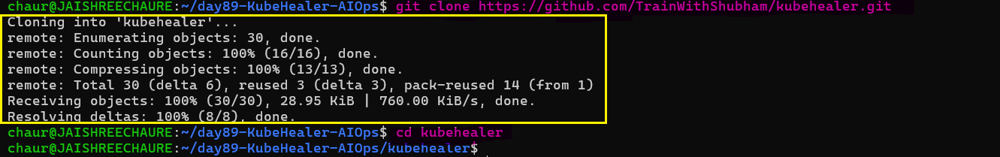

**Prerequisites:**

KubeHealer requires:

- Docker — container runtime
- Kind — local Kubernetes cluster
- kubectl — Kubernetes CLI
- Python 3.10+
- Temporal CLI — workflow management
- Anthropic API key — Claude API access (sign up at https://console.anthropic.com)

**Install Temporal CLI**

Temporal CLI is installed from the official Temporal CLI archive, then moved into `/usr/local/bin` so the `temporal` command is available system-wide.

   - wget "https://temporal.download/cli/archive/latest?platform=linux&arch=amd64" -O temporal-cli.tar.gz
   - tar -xzf temporal-cli.tar.gz
   - ls -l temporal
   - sudo mv temporal /usr/local/bin/
   - sudo chmod +x /usr/local/bin/temporal
   - temporal --version

Verify the required tools:

```bash
docker --version
kind --version
kubectl version --client
python3 --version
temporal --version
```
This confirms that the local environment is ready before starting the infrastructure.

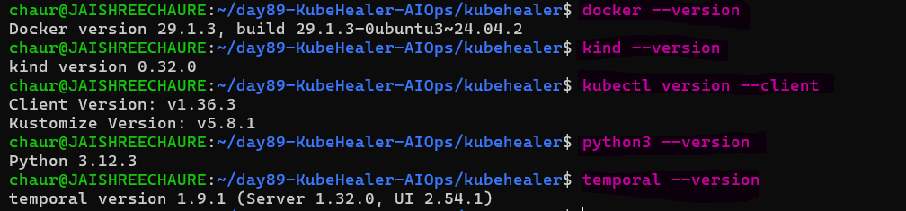 

### Start the Kubernetes Environment

Instead of creating the Kind cluster separately, use the project's setup script. It creates the cluster and deploys the intentionally broken applications used for the AIOps demonstration.

**Terminal 1 — Kubernetes / Setup**

```bash
# kind create cluster --name kubehealer-demo # insted of this create kind cluster by ./setup.sh
./setup.sh
```
The setup script creates the Kind cluster and deploys the broken workloads.

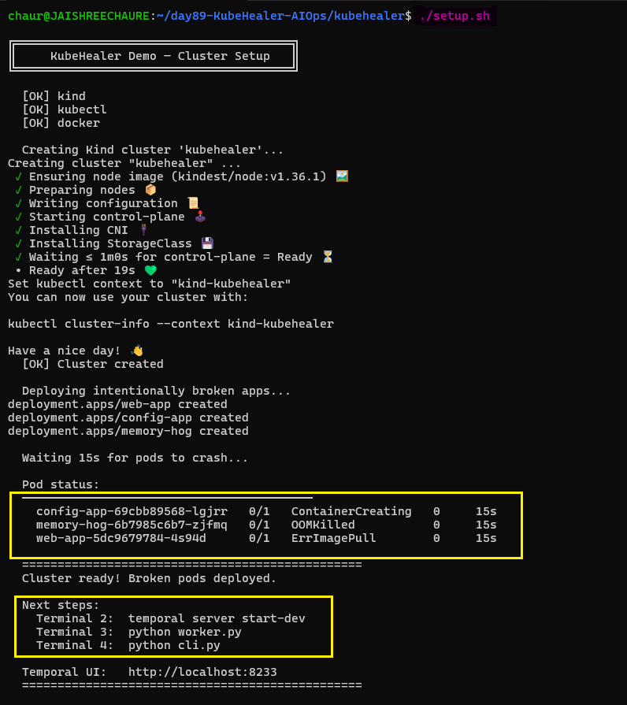

Check the pod status:

```bash
kubectl get pods
```
Expected problems include:

- `config-app` → `CreateContainerConfigError`
- `memory-hog` → `OOMKilled`
- `web-app` → `ErrImagePull`

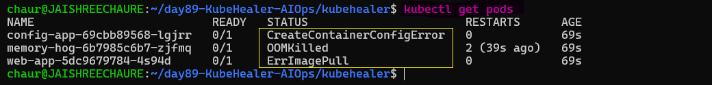

### Run the Infrastructure in Separate Terminals

Keep the services in separate terminals because they are long-running processes that must stay active while we interact with the system from another terminal.

| Terminal | Process                | Purpose                               |
| -------- | ---------------------- | ------------------------------------- |
| 1        | Kubernetes / `kubectl` | Cluster and pod management            |
| 2        | Temporal Server        | Workflow orchestration and durability |
| 3        | KubeHealer Worker      | Executes Temporal activities          |
| 4        | KubeHealer CLI         | User interaction with the AI agent    |

**Terminal 2 — Temporal Server**

Start the Temporal development server:

```bash
temporal server start-dev
```
Keep this terminal running. Temporal stores and orchestrates the workflow execution.

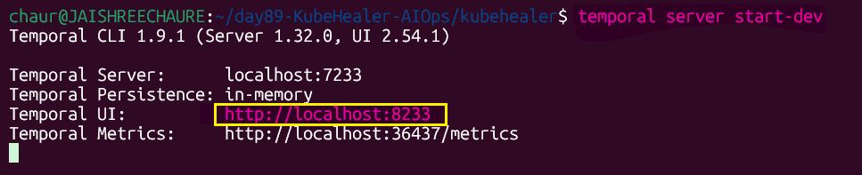 

The Temporal Web UI runs at:

```text
http://localhost:8233
```
Open it in a browser to inspect workflows and execution history.

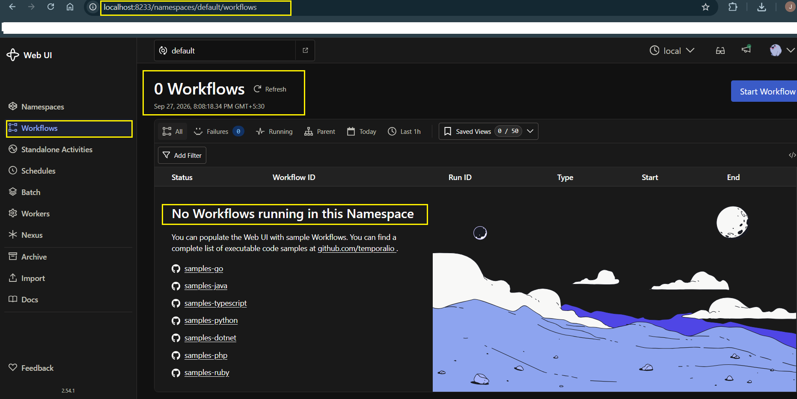 

**Terminal 3 — KubeHealer Worker**

Create and activate the Python virtual environment, then install the project dependencies.

```bash
python3 -m venv .venv
source .venv/bin/activate
pip install -r requirements.txt
```
The virtual environment keeps KubeHealer's Python dependencies isolated from the system Python installation.

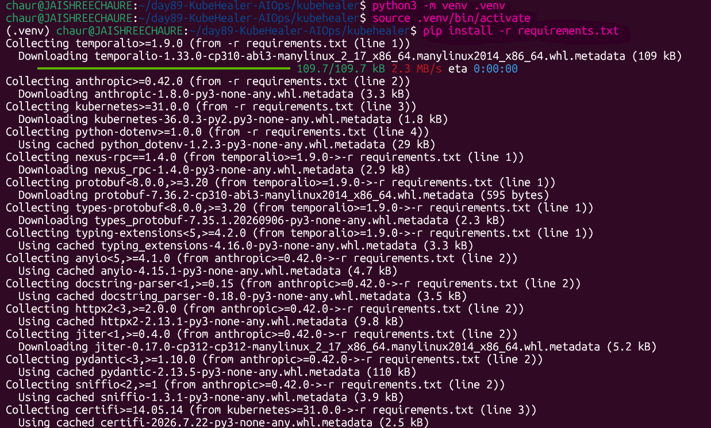

### Update the Claude Model

The original project references:

```text
claude-sonnet-4-20250514
```
**This model was retired by Anthropic on `June 15, 2026`. Its recommended replacement is `claude-sonnet-4-6`, so we update the project before running the worker. Otherwise, API requests using the old model can fail.**

Update both activity files:

```bash
sed -i 's/claude-sonnet-4-20250514/claude-sonnet-4-6/g' activities/llm_activities.py activities/chat_activities.py
```
Verify the updated model:

```bash
grep -R "model=" -n activities/llm_activities.py activities/chat_activities.py
```
Expected model:

```bash
model="claude-sonnet-4-6"
```
### Create and Configure the Anthropic API

KubeHealer uses Claude to analyze Kubernetes problems and generate the reasoning/actions needed for the healing workflow. Therefore, **`an Anthropic API key`** is required for the AI part of the project.

Create an account on the Anthropic Console and add **`$5 of API credits`** for this hands-on project. Then create an API key from the API settings.

> **Why is this important?**  
> The API key authenticates KubeHealer with Anthropic's API. Without a valid key and available API credits, Claude cannot analyze the Kubernetes issues and the AI healing workflow cannot run.

Store the key in the project's `.env` file so the Python application can load it when the worker starts.

```bash
cp .env.example .env
nano .env
```
Add:

```text
ANTHROPIC_API_KEY=your-api-key-here
```
Verify that the key is configured without displaying the secret:

```bash
grep -q '^ANTHROPIC_API_KEY=.' .env \
  && echo "API key is configured" \
  || echo "API key is missing"
```
Expected:

```text
API key is configured
```
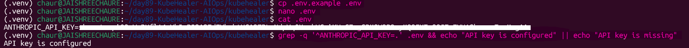

**Optional — environment variable method**

You can also export the API key directly in the current terminal session:

```bash
export ANTHROPIC_API_KEY="your-api-key-here"
```
Verify without printing the secret:

```bash
test -n "$ANTHROPIC_API_KEY" && echo "API key is set" || echo "API key is NOT set"
```
> **Note:** The `export` method is optional. The `.env` configuration is the project-level configuration used for the worker. An `export` applies only to the current shell/session unless configured otherwise.

> **Security:** Never commit `.env`, expose the API key in screenshots, or share the key publicly. Use a placeholder such as `your-api-key-here` in documentation.

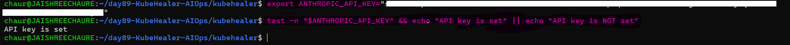 

---

## Task 3: Deploy Broken Applications

KubeHealer needs unhealthy workloads to diagnose and heal. The project setup script already creates three intentionally broken applications, so **no additional deployment is required in this task**.

The three applications are:

| Application | Failure | Agent Action |
|---|---|---|
| `web-app` | Image typo → `ImagePullBackOff` | Fix image |
| `memory-hog` | Low memory limit → `OOMKilled` | Patch memory limit |
| `config-app` | Missing ConfigMap → `CreateContainerConfigError` | Diagnose and escalate |

Check the current cluster state:

```bash
kubectl get pods
```
The expected broken state is:

```text
config-app   0/1   CreateContainerConfigError
memory-hog   0/1   OOMKilled
web-app      0/1   ImagePullBackOff
```
These failures are intentional and provide the input for KubeHealer's AI diagnosis and healing workflow.

> **Note:** The applications are created by `./setup.sh` in **Task 2**, so they are already available when Task 3 begins.

---

## Task 4: Run KubeHealer

Start the KubeHealer worker. The worker connects to Temporal and waits for workflow tasks.

```bash
python3 worker.py
```
**Terminal 3 — KubeHealer Worker**

Keep this terminal running while using the CLI.

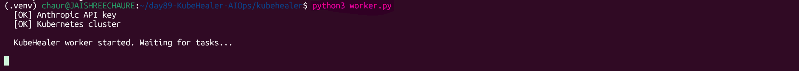

**Trigger the Healing Workflow**

Use **Terminal 4** to start a complete healing workflow with the intentionally broken cluster.

```bash
python3 starter.py
```
`starter.py` is used to demonstrate the automated healing workflow from start to finish.

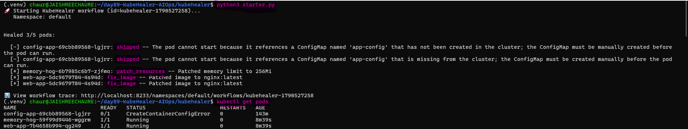

The agent diagnoses the broken workloads and applies the fixes it can safely automate.

```text
memory-hog → Memory limit patched → 256Mi
web-app    → Image fixed → nginx:latest
config-app → Skipped → manual intervention required
```
**What KubeHealer Does**

The workflow follows this process:

1. **Scan** — discovers the Kubernetes pods and their current status.
2. **Diagnose** — inspects broken workloads, logs, events, and configuration.
3. **Analyze with Claude** — uses the Anthropic API to reason about the detected problems.
4. **Heal** — applies safe automated fixes.
5. **Escalate** — skips issues that require human decisions.

In this lab:

- `web-app` → image typo fixed to `nginx:latest`
- `memory-hog` → memory limit patched to `256Mi`
- `config-app` → skipped because `app-config` must be created manually

Verify the results:

```bash
kubectl get pods
```
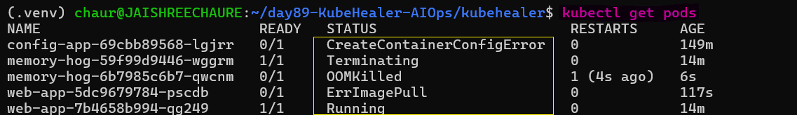

### Recreate a Broken State for the AI Assistant Demo

After completing the `starter.py` healing run, intentionally break the workloads again. This gives us a fresh unhealthy cluster to interact with through the conversational AI assistant.

```bash
kubectl set image deployment/web-app nginx=nginx:latestt
kubectl get pods

kubectl get deployment memory-hog -o jsonpath='{.spec.template.spec.containers[*].name}{" | "}{.spec.template.spec.containers[*].image}{"\n"}'

kubectl patch deployment memory-hog --type='strategic' -p '{"spec":{"template":{"spec":{"containers":[{"name":"stress","resources":{"limits":{"memory":"10Mi"}}}]}}}}'
```
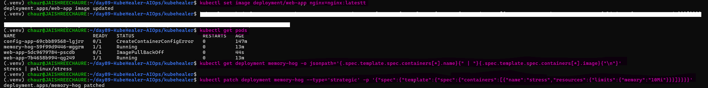

> **Why?**
> `starter.py` demonstrates the automated healing workflow, while `cli.py` demonstrates interactive AI-assisted Kubernetes troubleshooting. Recreating the broken state lets us experience the second workflow separately.

### Interact with the AI Assistant

Start the conversational KubeHealer CLI in **Terminal 4**:

```bash
python3 cli.py
```
Ask the assistant questions about the cluster:

```text
> how many pods are running?
> show me the logs for memory-hog
> what's wrong with web-app?
> heal my cluster
```
The assistant can inspect the cluster, explain failures, and trigger healing actions based on the conversation.

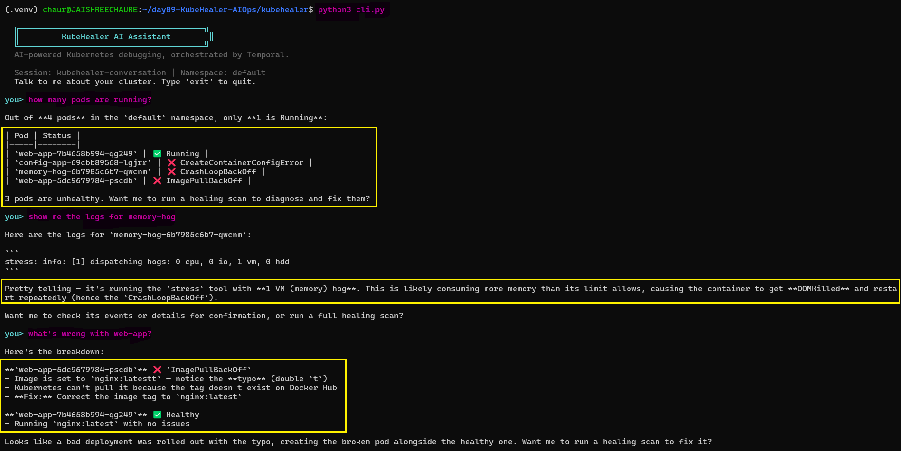 
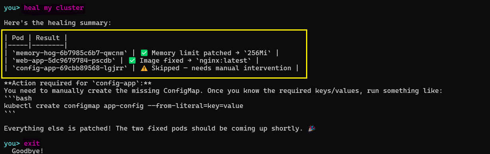

### Handle the Manual Fix

`config-app` cannot be automatically healed because the required ConfigMap values require human input.

Create the ConfigMap manually:

```bash
kubectl create configmap app-config \
  --from-literal=APP_ENV=production \
  --from-literal=APP_DEBUG=false
```
Restart the deployment:

```bash
kubectl rollout restart deployment config-app
```
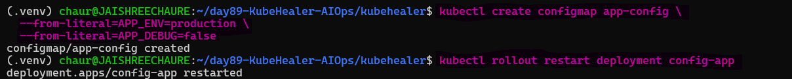 

Verify the final cluster state:

```bash
kubectl get pods
```
All three applications should now be `Running` and `1/1` ready.

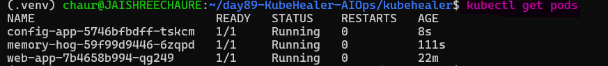 

### Inspect the Temporal Workflow

Open the workflow in the Temporal Web UI:

```text
http://localhost:8233
```
The workflow history shows the workflow tasks and completed activities, providing an execution trail of the KubeHealer run.

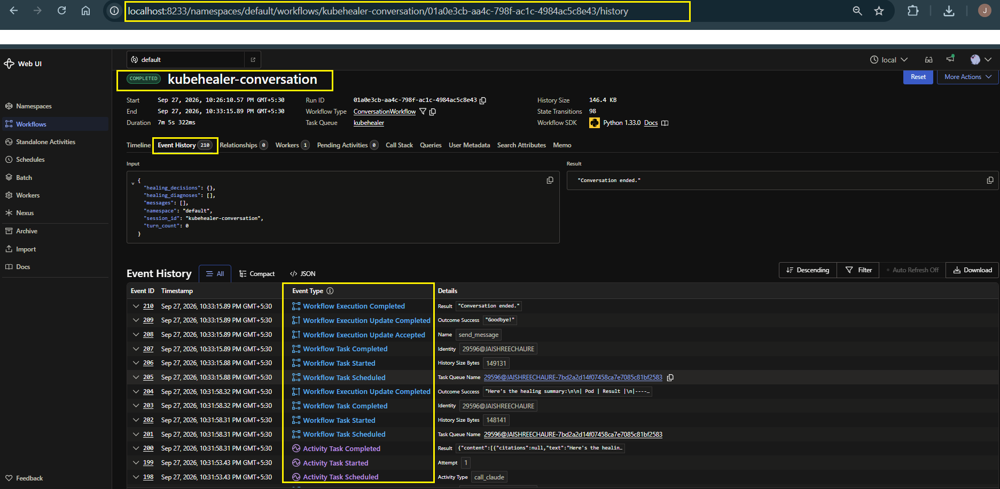

> **Why did we do this?**
> This task demonstrates the complete AIOps loop: `detect → diagnose → analyze with AI → automatically heal → escalate when human input is required → verify`.

> Using both `starter.py` and `cli.py` demonstrates two sides of KubeHealer: automated workflow execution and interactive `AI-assisted troubleshooting`. Temporal records the workflow execution and makes the automation observable.

---

## Task 5: Test Crash Recovery — Temporal Durability

This task demonstrates **Temporal's durable execution**. If the KubeHealer worker stops during a workflow, Temporal preserves the workflow history so the workflow can continue when the worker reconnects.

### Recreate the Broken Cluster

Recreate the Kind cluster and intentionally broken applications:

```bash
./setup.sh
```
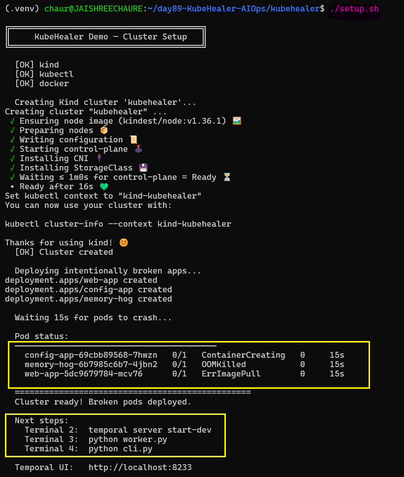

Verify the broken workloads:

```bash
kubectl get pods
```
Expected failures:

```text
config-app   0/1   CreateContainerConfigError
memory-hog   0/1   OOMKilled
web-app      0/1   ImagePullBackOff
```
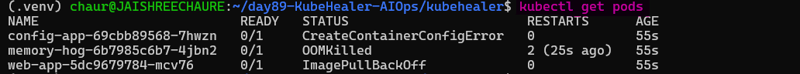 

### Start the Worker and Begin Healing

Start the worker in `Terminal 3` and use `Terminal 4` for the KubeHealer CLI.

```bash
python3 worker.py

python3 cli.py
```
### Simulate a Worker Crash

While the workflow is in progress, stop the worker with `Ctrl+C`.

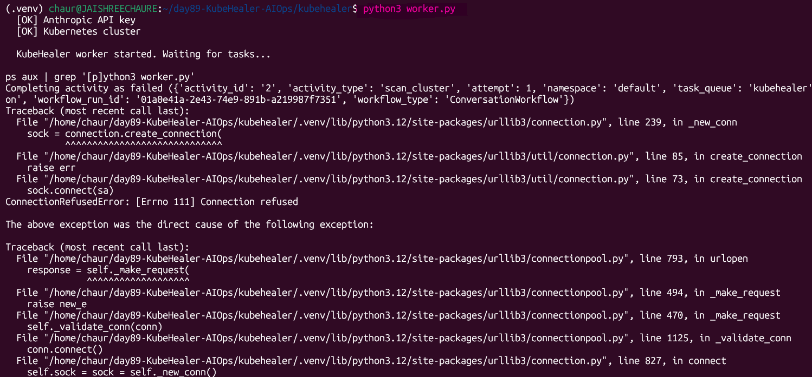

This intentionally simulates a worker failure while the workflow is still active.

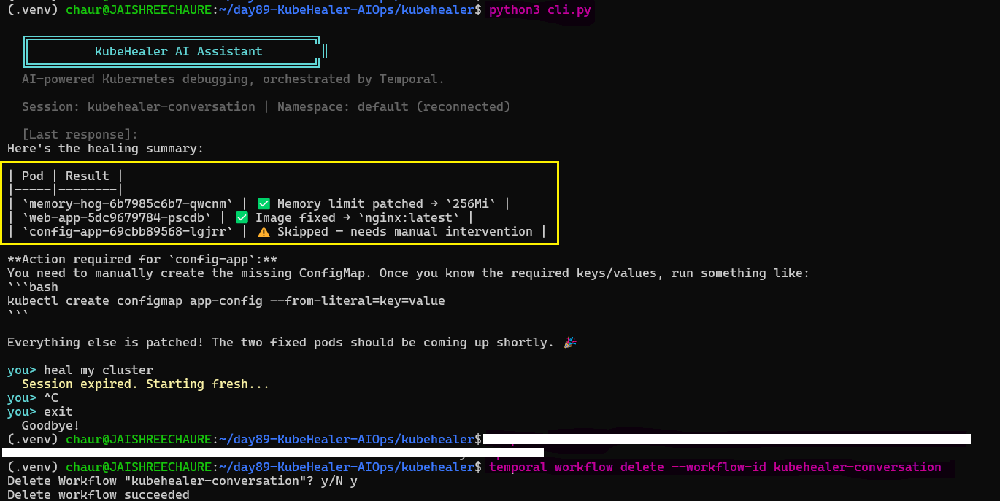 

### Restart the Worker

Start the worker again:

```bash
python3 worker.py
```
**Terminal 3 — KubeHealer Worker**

Temporal retains the workflow event history, allowing the workflow to continue from its persisted state.

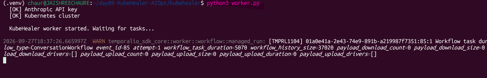 

> **Important:** Temporal preserves completed activity results in the workflow history, so the workflow can resume without losing its previous progress.

### Continue the Healing Workflow

Reconnect to the KubeHealer CLI in `Terminal 4`:

```bash
python3 cli.py
```
Start the healing conversation:

```text
heal my cluster
```
The workflow begins scanning and diagnosing the broken workloads.

If the workflow has pending healing decisions, approve the safe fixes:

```bash
approve all
```
The agent fixes the automatically healable workloads and skips `config-app` because the missing ConfigMap requires manual intervention.

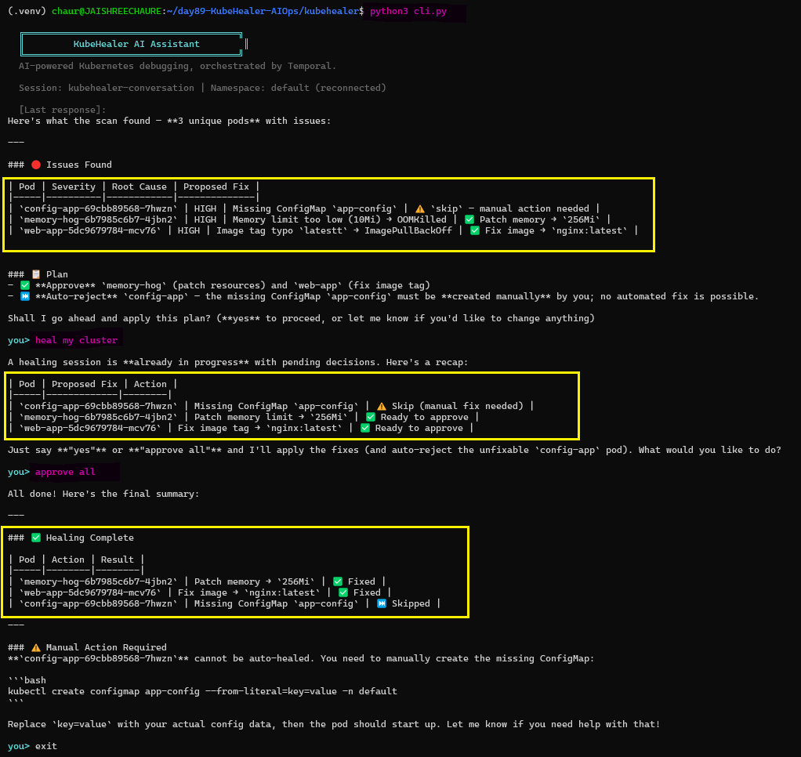 

### Inspect Temporal Workflow History

Open the Temporal Web UI:

```text
http://localhost:8233
```
Open the KubeHealer workflow and inspect `Event History`.

The history records workflow tasks and activity execution, providing an audit trail of the workflow's progress and recovery.

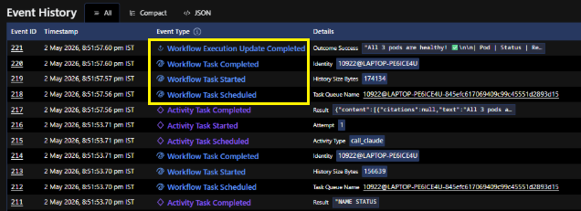

The event history records each step of the workflow, including:

- `WorkflowExecutionStarted`
- `ActivityTaskScheduled` — `call_claude`
- `ActivityTaskCompleted` — Claude response
- `ActivityTaskScheduled` — `list_pods`
- `ActivityTaskCompleted` — pod information returned
- `ActivityTaskScheduled` — `call_claude` with tool results
- `ActivityTaskCompleted` — Claude's final response
- And subsequent workflow and activity events

> **Why is this important?**
> The Temporal workflow history acts as an **audit trail**. It records Claude calls, tool invocations, and workflow actions without requiring separate custom logging for each step.

### Complete the Manual Fix

The `config-app` still requires manual intervention. Create the missing ConfigMap:

```bash
kubectl create configmap app-config \
  --from-literal=APP_ENV=production \
  --from-literal=APP_DEBUG=false
```
Restart the deployment:

```bash
kubectl rollout restart deployment config-app
```
Verify the cluster:

```bash
kubectl get pods
```
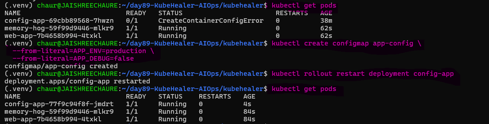

### Verify the Healing Result

Reconnect to the CLI:

```bash
python3 cli.py
```
The previous workflow response can be recovered from the Temporal-backed conversation.

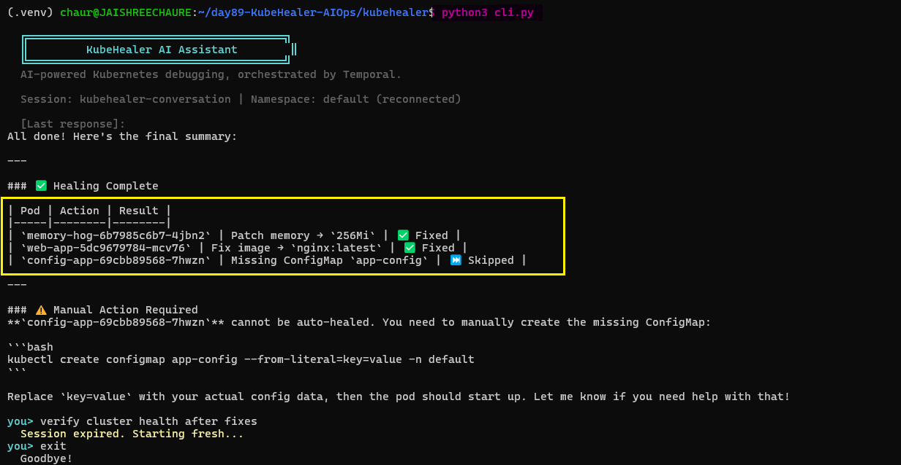

Because the conversation workflow is now completed, delete the old fixed workflow ID before starting a fresh CLI session:

```bash
temporal workflow delete --workflow-id kubehealer-conversation
```
Then start the CLI again:

```bash
python3 cli.py
```
Run the final health check:

```text
verify cluster health after fixes
```
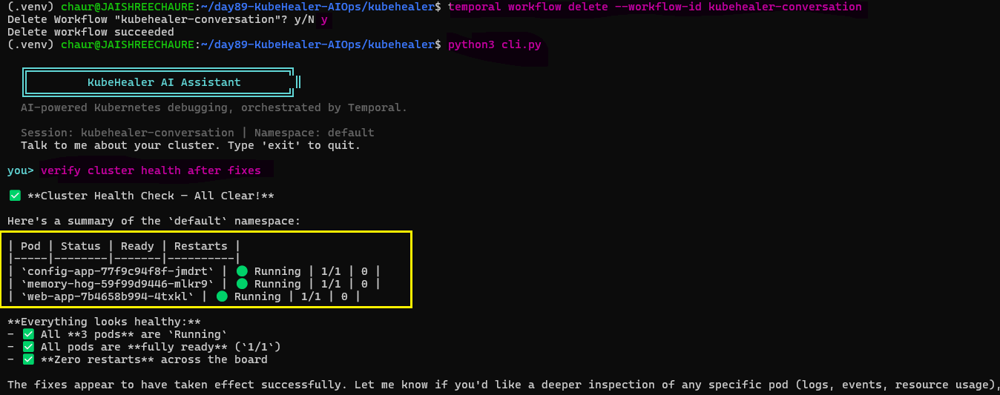 

> **Why did we do this?**
> This demonstrates Temporal durable execution: the worker can fail without losing the workflow's persisted state. Temporal maintains the event history, allowing a restarted worker to continue the workflow and providing an audit trail of the execution.

---

## Task 6: Reflect on the Agentic AI Journey

The three-day progression shows how the project evolved from simple LLM-based assistance to production-oriented AI agents.

### 3-Day Progression

| Day | Module | What You Built | Pattern |
|---|---|---|---|
| 87 | 0–2 | Docker Error Explainer + Docker Agent | Basic LLM → ReAct Agent |
| 88 | 3, 6 | Multi-tool Agent + MCP Server + CI/CD Analyzer | Multi-domain tools + MCP |
| 89 | 4–5 | KubeHealer — production self-healing agent | Temporal durability + human approval + guardrails |

### The Evolution

```text
Day 87: LLM explains errors
        ↓
        Passive assistance

Day 88: Agent investigates across Docker/K8s/CI
        ↓
        Autonomous investigation

Day 89: Agent diagnoses and fixes with approval
        ↓
        Autonomous action with guardrails
```

### Key Principles for Production AI Agents

1. **Tools are just CLI wrappers** — commands can be exposed as agent tools.
2. **The ReAct pattern is universal** — the pattern can be applied across domains.
3. **MCP standardizes tool access** — write tools once and reuse them.
4. **Guardrails are not optional** — approval, scope limits, and audit trails control agent actions.
5. **Durability matters** — Temporal preserves workflow state during failures.
6. **Know when NOT to use AI** — simple known problems are often better handled with deterministic automation.

### Connection to the Rest of the Challenge

| Day | Connection to Agentic AI |
|-----|-------------------------|
| 29-37 (Docker) | Docker tools in Module 2 wrap the same commands you learned |
| 40-49 (GitHub Actions) | CI/CD Analyzer in Module 6 diagnoses the pipelines you built |
| 50-67 (Kubernetes) | Kubernetes tools in Module 3 and KubeHealer use kubectl |
| 73-77 (Observability) | Agents could query Prometheus/Loki for metric-based diagnosis |
| 84-86 (ArgoCD) | An agent could trigger ArgoCD syncs or rollbacks |

### Clean Up

After completing the hands-on work, remove the Kind cluster and stop the local services.

```bash
kind delete cluster --name kubehealer-demo
```
Stop the Temporal server with `Ctrl+C`, then deactivate the Python virtual environment:

```bash
deactivate
```
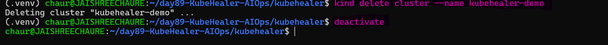

> **Why did we do this?**
> The cleanup removes the temporary Kubernetes environment and exits the Python virtual environment after completing the KubeHealer lab.

---

## Production Takeaways

The KubeHealer lab demonstrated that production AIOps combines AI reasoning with controlled execution, human oversight, auditability, and durable workflows.

Key takeaways:

- **Tools** provide deterministic access to external systems.
- **AI reasoning** helps diagnose unknown or multi-cause problems.
- **Guardrails** control what an agent can change.
- **Human approval** is important for potentially risky actions.
- **Temporal** provides durable execution and workflow history.
- **Deterministic automation** is preferred for simple, well-defined problems.

### Production Guardrails

| **Guardrail** | **Purpose** | **Example** |
|---|---|---|
| **Human approval** | Prevent unsafe actions | Confirm production changes |
| **Scope limits** | Restrict blast radius | Allow specific namespaces only |
| **Audit trail** | Provide traceability | Record tool calls and decisions |
| **Safe rollback** | Enable recovery | Versioned configs |
| **Retry limits** | Prevent runaway loops | Limit retries per pod |
| **Escalation** | Handle unknown cases | Alert a human with context |

> **Key takeaway:** Production AIOps is not just about giving an AI agent access to tools. It is about combining **reasoning, controlled actions, human oversight, observability, and durable execution** so the agent can operate safely in real environments.

---

### KubeHealer Architecture

KubeHealer connects a thin CLI, Temporal, Claude, and Kubernetes to create a durable AI-powered troubleshooting workflow.

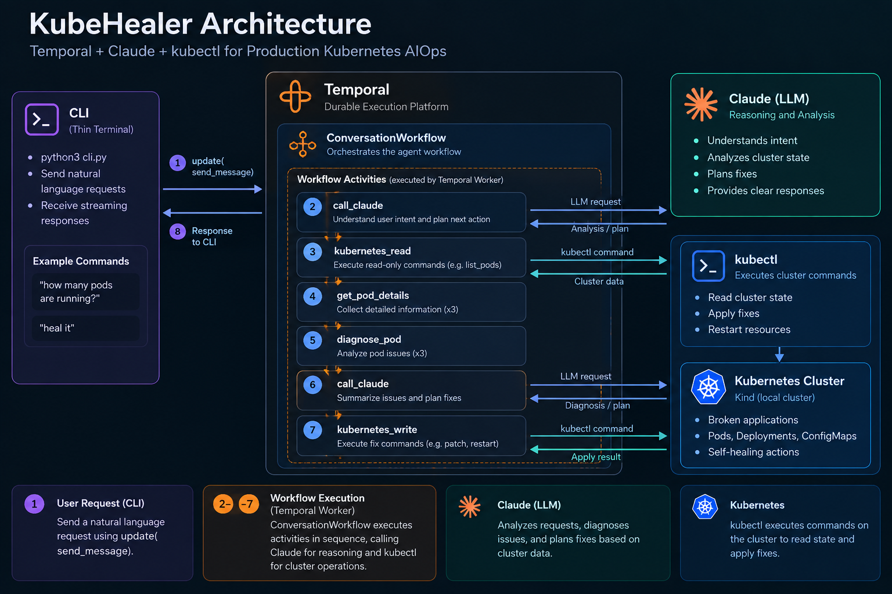

- **CLI** — Sends natural-language requests through `update(send_message)`.
- **Temporal** — Runs the `ConversationWorkflow` and manages durable workflow execution.
- **Claude** — Understands intent, analyzes cluster data, diagnoses issues, and plans fixes.
- **kubectl** — Executes read/write Kubernetes operations through workflow activities.
- **Kubernetes** — Provides the cluster state and receives the required healing actions.

The workflow keeps reasoning and cluster operations inside Temporal activities, allowing the agent to diagnose issues, apply safe fixes, and return the result to the CLI.

---

## KubeHealer Summary

### The 3 Broken Apps and What the Agent Diagnosed

| **Broken App** | **Problem** | **AI Diagnosis** | **Auto-Fix** |
|---|---|---|---|
| `web-app` | Image `nginx:latestt` (typo) | Detects image typo | Patches to `nginx:latest` |
| `memory-hog` | `10Mi` memory limit + stress workload | Detects `OOMKilled` | Patches to `256Mi` |
| `config-app` | Missing ConfigMap | Diagnoses but cannot safely auto-fix | Skips and requests manual action |

### How Crash Recovery Works

> When the worker crashes, Temporal preserves the workflow's event history. After the worker restarts, the workflow can resume from its persisted state. Completed activities are not unnecessarily re-executed, while unfinished work can be retried. The CLI can continue the conversation because the workflow state is stored in Temporal rather than only in the worker process.

### When to Use AI Agents vs Traditional Automation

| **Use AI Agents When** | **Use Traditional Automation When** |
|---|---|
| Problem requires reasoning or diagnosis | Problem has a known, fixed solution |
| Multiple possible causes and fixes exist | One cause → one predictable fix |
| Natural-language interaction helps humans | No reasoning or human interaction is required |
| Examples: troubleshooting, root-cause analysis | Examples: scaling, restarts, deployments |

### How Agentic AI Connects to the 90-Day Challenge

| **Days** | **Connection to Agentic AI** |
|---|---|
| 29–37 — Docker | Docker tools wrap commands learned earlier |
| 40–49 — GitHub Actions | CI/CD Analyzer diagnoses pipelines built earlier |
| 50–67 — Kubernetes | Kubernetes tools and KubeHealer use `kubectl` |
| 73–77 — Observability | Agents could query Prometheus/Loki for metric-based diagnosis |
| 84–86 — ArgoCD | Agents could trigger ArgoCD syncs or rollbacks |