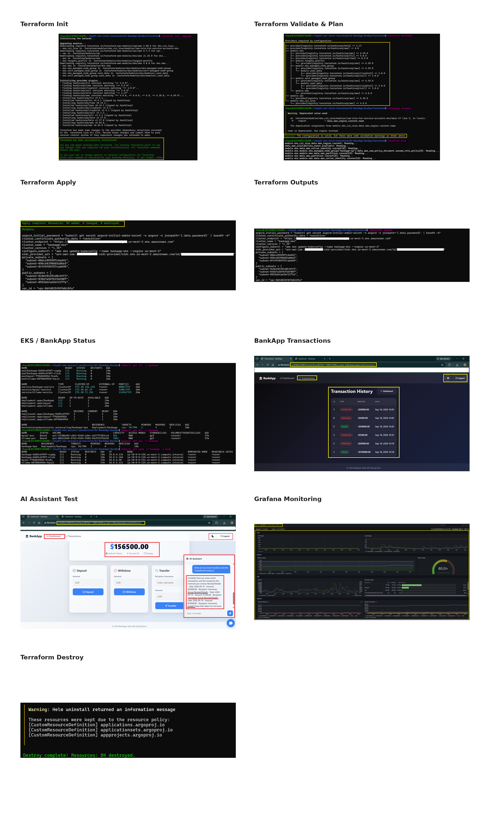
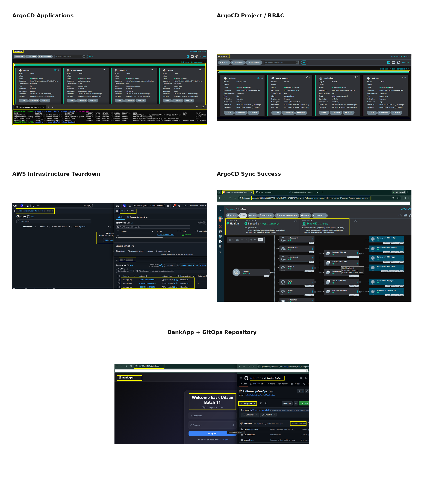

# Day 90 -- Grand Finale: The Complete DevOps Journey

## The Full 90-Day Map

```
LINUX FUNDAMENTALS (Days 1-13)
  Commands, processes, files, permissions, LVM
  "The foundation. Every DevOps tool runs on Linux."
         |
NETWORKING (Days 14-15)
  DNS, IP, subnets, ports
  "How machines talk to each other."
         |
SHELL SCRIPTING (Days 16-21)
  Bash basics, functions, projects
  "Automating what you'd otherwise type by hand."
         |
GIT & GITHUB (Days 22-28)
  Branching, advanced git, GitHub CLI
  "Version control. The backbone of everything that follows."
         |
DOCKER (Days 29-37)
  Images, Dockerfile, volumes, networking, Compose, multi-stage builds
  "Packaging applications so they run the same everywhere."
         |
CI/CD & GITHUB ACTIONS (Days 38-49)
  YAML, workflows, triggers, runners, secrets, DevSecOps
  "Automating build, test, and deploy on every push."
         |
KUBERNETES (Days 50-58)
  Pods, Deployments, Services, Namespaces, RBAC
  "Orchestrating containers at scale."
         |
TERRAWEEK (Days 59-67)
  Terraform, providers, state, modules, workspaces
  "Infrastructure as Code. Provision cloud resources declaratively."
         |
ANSIBLE (Days 68-72)
  Inventory, playbooks, roles, templates, Vault
  "Configuration management. Keep servers in the desired state."
         |
OBSERVABILITY (Days 73-77)
  Prometheus, Grafana, Loki, Promtail, OpenTelemetry, alerting
  "The three pillars: metrics, logs, traces. Know WHY things break."
         |
HELM (Days 78-80)
  Charts, templates, values, subcharts, multi-env deployment
  "Package manager for Kubernetes. One chart, many environments."
         |
AMAZON EKS (Days 81-83)
  Terraform for EKS, Gateway API, EBS storage, IRSA, HPA
  "Production-grade managed Kubernetes on AWS."
         |
ARGOCD & GITOPS (Days 84-86)
  GitOps principles, ArgoCD, sync strategies, App of Apps, CI/CD pipeline
  "Git is the single source of truth. The cluster always matches the repo."
         |
AGENTIC AI FOR DEVOPS (Days 87-89)
  LLM agents, ReAct pattern, MCP, KubeHealer, Temporal
  "AI that diagnoses and fixes infrastructure autonomously."
         |
        YOU ARE HERE (Day 90)
```

---

## Task 1: The End-to-End Pipeline

Trace a single code change through every tool you learned:

```
1. A developer writes code on a Linux machine (Days 1-13)
   using shell scripts (Days 16-21) and Git (Days 22-28)

2. They push to GitHub, which triggers GitHub Actions (Days 40-49)

3. The CI pipeline builds a Docker image (Days 29-37)
   and pushes it to DockerHub

4. The pipeline updates the Kubernetes manifest in Git
   with the new image tag

5. ArgoCD (Days 84-86) detects the change and syncs
   to an EKS cluster (Days 81-83)

6. The EKS cluster, provisioned by Terraform (Days 59-67)
   and configured by Ansible (Days 68-72), runs the app

7. Helm (Days 78-80) manages the deployment with
   environment-specific values

8. Prometheus, Grafana, and Loki (Days 73-77) monitor
   metrics, logs, and traces

9. If something breaks, an AI agent (Days 87-89)
   diagnoses the issue and proposes a fix

10. The fix goes through Git, ArgoCD syncs it,
    and the cycle continues
```

Every single block connects to the next. Nothing was learned in isolation.

---

## Task 2: What You Built with the AI-BankApp

The AI-BankApp (https://github.com/TrainWithShubham/AI-BankApp-DevOps) tied together the last 13 days:

| Day | What You Did with the AI-BankApp |
|-----|--------------------------------|
| 78 | Deployed its MySQL dependency via Helm chart |
| 79 | Converted its 12 raw K8s manifests into a Helm chart |
| 80 | Created dev/staging/prod values, hooks, CI/CD integration |
| 81 | Provisioned EKS using its `terraform/` configs |
| 82 | Set up Gateway API, EBS storage, session persistence from its `k8s/` manifests |
| 83 | Full production deployment with monitoring |
| 84 | Deployed via ArgoCD using its `argocd/application.yml` |
| 85 | Added sync waves, App of Apps, RBAC |
| 86 | Wired its GitHub Actions pipeline for end-to-end GitOps |

One real-world project. Every tool applied to it.

---

## Task 3: Skills Inventory

Rate yourself on each skill. Be honest -- this is for you, not anyone else.

| Skill | Days | Confidence (1-5) |
|-------|------|------------------|
| Linux command line | 1-13 | |
| Shell scripting | 16-21 | |
| Git & GitHub | 22-28 | |
| Docker | 29-37 | |
| CI/CD (GitHub Actions) | 38-49 | |
| Kubernetes | 50-58 | |
| Terraform | 59-67 | |
| Ansible | 68-72 | |
| Observability (Prometheus, Grafana, Loki) | 73-77 | |
| Helm | 78-80 | |
| Amazon EKS | 81-83 | |
| ArgoCD / GitOps | 84-86 | |
| Agentic AI for DevOps | 87-89 | |

For anything below 3, go back and redo that block. The day folders are still there. The tasks have not changed.

---

## Task 4: What Comes Next

DevOps does not stop at day 90. Here is what to explore next:

**Deepen what you learned:**
- Multi-cluster Kubernetes (federation, fleet management)
- Advanced Terraform (custom providers, Terragrunt, drift detection)
- Service mesh (Istio, Linkerd)
- Secrets management (HashiCorp Vault, AWS Secrets Manager, External Secrets Operator)
- Database operations (backups, migrations, blue-green database deployments)
- Chaos engineering (Litmus, Chaos Monkey)
- FinOps (cloud cost optimization)

**Certifications to pursue:**
- AWS Certified Solutions Architect
- Certified Kubernetes Administrator (CKA)
- Certified Kubernetes Application Developer (CKAD)
- HashiCorp Terraform Associate
- GitHub Actions Certification

**Build a portfolio project:**
Take everything from days 78-89 and build it from scratch for your own application:
1. Write an app (any language)
2. Dockerize it
3. Create a Helm chart
4. Provision EKS with Terraform
5. Deploy with ArgoCD
6. Monitor with Prometheus + Grafana
7. Set up the full GitOps CI/CD pipeline
8. Add an AI agent for troubleshooting

Put it on GitHub. Write a blog post about it. Share it on LinkedIn.

---

## Task 5: Graduation Post

### 90-Day Timeline

| **Days** | **Topic** | **Learned** | **Key Lesson** |
|---|---|---|---|
| 1–13 | Linux | Commands, permissions, processes, LVM, packages, SSH | Linux is the foundation of DevOps |
| 14–21 | Networking + Shell | DNS, ports, subnetting, routing, Bash, automation | Automate repetitive work |
| 22–28 | Git & GitHub | Branching, merging, rebasing, cherry-picking, workflows | Version control enables collaboration |
| 29–37 | Docker | Images, containers, Dockerfiles, Compose, networking, volumes | Package apps to run consistently |
| 38–49 | CI/CD | GitHub Actions, YAML, secrets, runners, DevSecOps | Automate build, test, and deployment |
| 50–58 | Kubernetes | Pods, deployments, services, RBAC, scaling, troubleshooting | Orchestrate applications at scale |
| 59–67 | Terraform | Providers, resources, state, modules, variables, workspaces | Manage infrastructure as code |
| 68–72 | Ansible | Inventory, playbooks, roles, templates, Vault | Automate consistent server configuration |
| 73–77 | Observability | Prometheus, Grafana, Loki, OpenTelemetry, alerting | Monitor systems and troubleshoot faster |
| 78–80 | Helm | Charts, templates, values, hooks, multi-env deployments | Simplify Kubernetes deployments |
| 81–83 | Amazon EKS | EKS, Gateway API, storage, autoscaling, IAM | Run scalable workloads on AWS |
| 84–86 | ArgoCD / GitOps | Sync waves, App of Apps, declarative deployments | Git becomes the source of truth |
| 87–89 | Agentic AI for DevOps | ReAct, MCP, KubeHealer, AI troubleshooting, automated fixes | Use AI to accelerate troubleshooting |

---

### Top 5 "Aha" Moments

- **Git & GitHub** — Git was completely new to me. I was amazed by how it tracks every change, keeps history traceable, and makes collaboration possible without creating a separate folder for every version.

- **CI/CD with GitHub Actions** — Compared with traditional Jenkins setups, GitHub Actions felt much simpler. GitHub-hosted runners and reusable actions made building, testing, and deploying feel almost effortless.

- **Kubernetes** — Kubernetes completely changed how I think about container management. With declarative manifests, deployments, self-healing, and scaling can happen without constant manual intervention.

- **Helm** — Helm showed me how to make Kubernetes deployments reusable and manageable. One chart can support multiple environments simply by changing values instead of rewriting manifests.

- **Agentic AI for DevOps** — This was the biggest eye-opener. AI agents can reason about infrastructure problems, diagnose issues, propose fixes, and, with approval, even apply remediation. It feels like having an intelligent DevOps teammate.

---

### The Hardest Days & How I Pushed Through

The challenge was not one single day — several parts of the journey pushed me outside my comfort zone.

- **Helm (Days 78–80)** — Creating templates and managing values was confusing at first. Small changes could break deployments.  
  **How I pushed through:** Started with simple charts, tested incrementally, and learned how values flow into templates.

- **GitOps with ArgoCD (Days 84–86)** — Understanding App of Apps, sync issues, and why the cluster did not match Git took time.  
  **How I pushed through:** Checked sync status and logs, then debugged one issue at a time until the GitOps flow made sense.

- **Observability (Days 73–77)** — Getting the right labels and making metrics and logs appear correctly was frustrating.  
  **How I pushed through:** Checked configurations, logs, and documentation repeatedly until I understood where the problem was.

- **Agentic AI (Days 87–89)** — My laptop configuration could not properly support the AI models I wanted to run.  
  **How I pushed through:** Explored alternatives, worked within the available setup, and focused on understanding the concepts rather than giving up.

- **End-to-End Project Deployment** — Bringing everything together was probably the biggest challenge. At first, something was always failing somewhere in the pipeline.  
  **How I pushed through:** I stopped trying to fix everything at once and followed a simple rule: **one task, one issue, one fix at a time.**

### What Helped Me Keep Going

- **Consistency** — Kept working on problems until I understood and fixed them.
- **Collaboration** — Asked for help, shared screens, and learned by troubleshooting together.
- **Documentation & Videos** — Used official documentation, tutorials, and videos whenever I was stuck.
- **Step-by-Step Debugging** — Read logs, checked configurations, and avoided guessing.
- **Patience** — Some problems took hours to solve, but every failure became part of the learning.

> **It wasn't always easy, but every broken deployment, failed pipeline, and confusing error taught me something. I learned that DevOps is not about avoiding failures — it's about learning how to troubleshoot them.**

---

### Screenshot Collage: Terminal Outputs, Grafana, ArgoCD & AI-BankApp

These screenshots capture key milestones from the journey — Terraform infrastructure, EKS workloads, the AI-BankApp running on Kubernetes, GitOps deployments with ArgoCD, Grafana monitoring, and AI-assisted troubleshooting.




---

### What I Plan to Learn Next

- **Amazon Web Services (AWS) in depth** — Prepare for the **AWS Certified Solutions Architect – Associate (SAA-C03)** certification.

---

### Advice for Someone Starting Day 1 Tomorrow

- **`Consistency is key:`** Show up every day, even if you study for only a short time. Regular practice matters more than long, irregular sessions. Small daily progress builds strong understanding over time.

- **`Don't just copy-paste:`** Type the commands yourself. Experiment, change things, break setups intentionally, and learn from the errors. This helps you understand how things actually work instead of simply following steps.

- **`Ask for help & learn together:`** Don't stay stuck for hours. Ask questions, join study groups, share ideas, and learn from others. Getting help early can save time and make difficult problems easier to solve.

- **`Post your progress daily on LinkedIn:`** Share what you learn, even if it seems small. It keeps you accountable, builds your professional presence, and documents your journey.

- **`Work on your GitHub profile regularly:`** Keep your repositories, README files, and projects organized and updated. Treat GitHub as your portfolio and let your work speak for itself.

- **`Optimize your LinkedIn profile:`** Keep your skills, projects, certifications, and learning progress updated. Make it easy for others to understand what you are learning and building.

---
